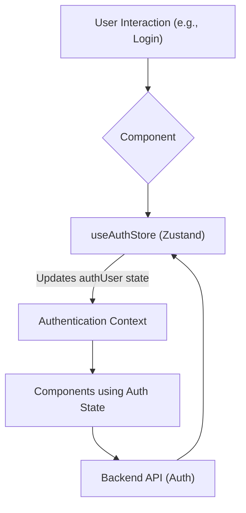
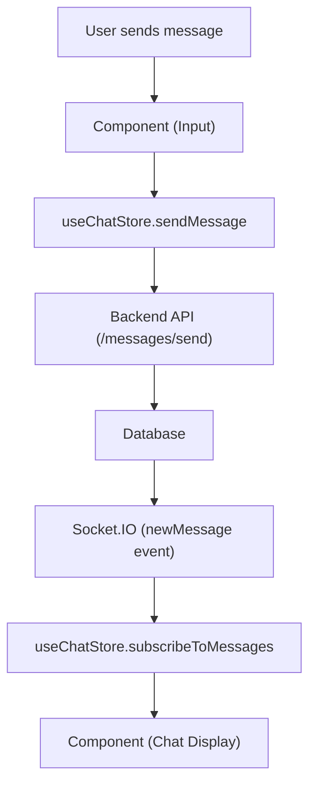

# State Management

This document outlines how the application state is managed and shared across components in the Chat-App-MERN project. We utilize Zustand, a small, fast, and scalable bearbones state-management solution. Zustand provides a straightforward way to manage global application state using stores. The application employs three main stores: `useAuthStore`, `useChatStore`, and `useThemeStore`.

## Zustand Stores

### `useAuthStore`

The `useAuthStore` manages the authentication state of the application. It handles user signup, login, logout, profile updates, and checking authentication status. It also manages socket connections for real-time communication.

*   **Features:**

    *   Manages user authentication status.
    *   Handles user signup, login, and logout.
    *   Allows profile updates.
    *   Manages socket connections for real-time updates.
    *   Tracks online users.

```javascript title="frontend/src/store/useAuthStore.js"
import { create } from "zustand";
import { axiosInstance } from "../lib/axios";
import toast from "react-hot-toast";
import { io } from "socket.io-client";

const BASE_URL = import.meta.env.MODE == "development" ? "http://localhost:5001": "/";

export const useAuthStore = create((set, get) => ({
    authUser: null,
    isSigningUp: false,
    isLoggingIn: false,
    isUpdatingProfile: false,
    isCheckingAuth: true,
    onlineUsers: [],
    socket: null,

    checkAuth: async () => {
        try {
            const res = await axiosInstance.get("/auth/check");
            set({ authUser: res.data });
            get().connectSocket();
        } catch (error) {
            set({ authUser: null });
            console.log("Error in checkAuth: ", error);
        } finally {
            set({ isCheckingAuth: false });
        }
    },

    signup: async (data) => {
        set({ isSigningUp: true });
        try {
            const res = await axiosInstance.post("/auth/signup", data);
            set({ authUser: res.data });
            toast.success("Account created successfully");
            get().connectSocket();
        } catch (error) {
            toast.error(error.response.data.message);
        } finally {
            set({ isSigningUp: false });
        }
    },

    logout: async () => {
        try {
            axiosInstance.post("/auth/logout");
            set({ authUser: null });
            toast.success("Logged out successfully");
            get().disconnectSocket();
        } catch (error) {
            toast.error(error.response.data.message);
        }
    },

    login: async (data) => {
        set({ isLoggingIn: true });
        try {
            const res = await axiosInstance.post("/auth/login", data);
            set({ authUser: res.data });
            get().connectSocket();
            toast.success("Logged in successfully");

        } catch (error) {
            toast.error(error.response.data.message);
        } finally {
            set({ isLoggingIn: false });
        }
    },
    updateProfile: async (data) => {
        set({ isUpdatingProfile: true });

        try {
            const res = await axiosInstance.put("/auth/update-profile", data);
            set({ authUser: res.data });
            toast.success("Profile updated successfully");
        } catch (error) {
            console.log("error in update profile: ", error);
            toast.error(error.response.data.message);
        } finally {
            set({ isUpdatingProfile: false });
        }
    },

    connectSocket: () => {
        const { authUser } = get();
        if(!authUser || get().socket?.connected) return;

        const socket = io(BASE_URL, {
            query: {
                userId : authUser._id,
            },
        });
        socket.connect();
        set({socket: socket});

        socket.on("getOnlineUsers", (userIds) => {
            set({onlineUsers: userIds})
        }); 

    },

    disconnectSocket : () => {
        if(get().socket?.connected) get().socket.disconnect();
    }
}));
```

[View on GitHub](https://github.com/shinymack/Chat-App-MERN/blob/main/frontend/src/store/useAuthStore.js)

This code snippet shows the `useAuthStore` using Zustand. It manages authentication-related states and functions, such as `authUser`, `signup`, `login`, `logout`, and `connectSocket`. The `connectSocket` function establishes a WebSocket connection using Socket.IO, allowing real-time communication. The `checkAuth` function verifies if the user is authenticated upon loading the app.

```javascript title="frontend/src/store/useAuthStore.js"
    signup: async (data) => {
        set({ isSigningUp: true });
        try {
            const res = await axiosInstance.post("/auth/signup", data);
            set({ authUser: res.data });
            toast.success("Account created successfully");

            get().connectSocket();
        } catch (error) {
            toast.error(error.response.data.message);
            5;
        } finally {
            set({ isSigningUp: false });
        }
    },
```

[View on GitHub](https://github.com/shinymack/Chat-App-MERN/blob/main/frontend/src/store/useAuthStore.js)

The `signup` function handles user registration. It sends a POST request to the `/auth/signup` endpoint with the user data. Upon successful registration, it updates the `authUser` state with the response data and connects the socket. Error handling is included to display error messages using `react-hot-toast`.

### `useChatStore`

The `useChatStore` manages the chat-related state, including messages, users, friend requests, and selected user for chatting.  It also handles fetching and sending messages, managing friend requests (sending, accepting, rejecting, and removing friends), and subscribing to new messages via Socket.IO.

*   **Features:**

    *   Manages the list of messages.
    *   Manages the list of users (friends).
    *   Handles friend requests (pending and sent).
    *   Manages the selected user for the chat.
    *   Fetches and sends messages.
    *   Subscribes to new messages via Socket.IO.
```javascript title="frontend/src/store/useChatStore.js"
import toast from "react-hot-toast";
import { create } from "zustand";
import { axiosInstance } from "../lib/axios";
import { useAuthStore } from "./useAuthStore";


export const useChatStore = create((set, get) => ({
    messages:[],
    users: [],
    pendingRequests: [],
    sentRequests: [],
    selectedUser: null,
    isUsersLoading: false,
    isMessagesLoading: false,

    isFriendBoxOpen: false,

    toggleFriendsBox: () => set(state => ({ isFriendsBoxOpen: !state.isFriendsBoxOpen })),


    getFriends: async () => {
        set({isUsersLoading: true});
        try {
            const res = await axiosInstance.get("/friends/list");
            set({ users: res.data});
        } catch (error) {
            toast.error(error.response?.data?.message || "Failed to fetch friends");
        } finally {
            set({ isUsersLoading: false});
        }
    },
    getPendingRequests: async () => {
        try {
            const res = await axiosInstance.get("/friends/requests/pending");
            set({ pendingRequests: res.data });
        } catch (error) {
            toast.error(error.response?.data?.message || "Failed to fetch pending requests");
        }
    },

    getSentRequests: async () => {
        try {
            const res = await axiosInstance.get("/friends/requests/sent");
            set({ sentRequests: res.data });
        } catch (error) {
            toast.error(error.response?.data?.message || "Failed to fetch sent requests");
        }
    },

    sendFriendRequest: async (identifier) => {
        try {
            const res = await axiosInstance.post("/friends/request/send", { identifier });
            toast.success(res.data.message);
            // Refresh sent requests list
            get().getSentRequests();
        } catch (error) {
            toast.error(error.response?.data?.message || "Failed to send request");
        }
    },
    acceptFriendRequest: async (senderId) => {
        try {
            const res = await axiosInstance.post(`/friends/request/accept/${senderId}`);
            toast.success(res.data.message);
            // Refresh both friends and pending requests lists
            get().getFriends();
            get().getPendingRequests();
        } catch (error) {
            toast.error(error.response?.data?.message || "Failed to accept request");
        }
    },

    rejectFriendRequest: async (senderId) => {
        try {
            const res = await axiosInstance.post(`/friends/request/reject/${senderId}`);
            toast.success(res.data.message);
            // Refresh pending requests list
            get().getPendingRequests();
        } catch (error) {
            toast.error(error.response?.data?.message || "Failed to reject request");
        }
    },
    removeFriend: async (friendId) => {
        try {
            const res = await axiosInstance.delete(`/friends/remove/${friendId}`);
            toast.success(res.data.message);
            // Refresh friends list
            get().getFriends();
            // Also deselect user if they were the one being chatted with
            if (get().selectedUser?._id === friendId) {
                set({ selectedUser: null });
            }
        } catch (error) {
            toast.error(error.response?.data?.message || "Failed to remove friend");
        }
    },

    getMessages: async (userId) => {
        set({isMessagesLoading: true});
        try {
            const res = await axiosInstance.get(`/messages/${userId}`);
            set({messages: res.data});
        } catch (error) {
            toast.error(error.response.data.message);
        } finally {
            set({isMessagesLoading: false});
        }
    },
    sendMessage: async (messageData) => {
        const {selectedUser, messages} = get();
        try {
            const res = await axiosInstance.post(`/messages/send/${selectedUser._id}`, messageData);
            set({messages : [...messages, res.data]});
        } catch (error){
            toast.error(error.response.data.message);
        }

    },


    subscribeToMessages: () => {
        const { selectedUser } = get();
        if(!selectedUser) return;
        
        const socket = useAuthStore.getState().socket;
        socket.on("newMessage", (newMessage) => {
            if(newMessage.senderId !== selectedUser._id) return
            set({
                messages: [...get().messages, newMessage]
            })
        })
    },

    unsubscribeFromMessages: () => {
        const socket = useAuthStore.getState().socket;
        socket.off("newMessage");
    },
    
    setSelectedUser: (selectedUser) => set({selectedUser})

}))
```

[View on GitHub](https://github.com/shinymack/Chat-App-MERN/blob/main/frontend/src/store/useChatStore.js)

This code snippet showcases the `useChatStore` which manages chat functionalities.  It includes states like `messages`, `users`, `pendingRequests`, and `selectedUser`. The `getMessages` function fetches messages for a specific user, while `sendMessage` sends a new message.  It also demonstrates how to subscribe to and unsubscribe from new messages using Socket.IO.
```javascript title="frontend/src/store/useChatStore.js"
    sendMessage: async (messageData) => {
        const {selectedUser, messages} = get();
        try {
            const res = await axiosInstance.post(`/messages/send/${selectedUser._id}`, messageData);
            set({messages : [...messages, res.data]});
        } catch (error){
            toast.error(error.response.data.message);
        }

    },
```

[View on GitHub](https://github.com/shinymack/Chat-App-MERN/blob/main/frontend/src/store/useChatStore.js)

The `sendMessage` function sends a new message to the selected user. It makes a POST request to the `/messages/send/:userId` endpoint with the message data.  Upon successful sending, the new message is added to the `messages` state. Error handling is also included to display any error messages.

```javascript title="frontend/src/store/useChatStore.js"
    subscribeToMessages: () => {
        const { selectedUser } = get();
        if(!selectedUser) return;
        
        const socket = useAuthStore.getState().socket;
        socket.on("newMessage", (newMessage) => {
            if(newMessage.senderId !== selectedUser._id) return
            set({
                messages: [...get().messages, newMessage]
            })
        })
    },

    unsubscribeFromMessages: () => {
        const socket = useAuthStore.getState().socket;
        socket.off("newMessage");
    },
```

[View on GitHub](https://github.com/shinymack/Chat-App-MERN/blob/main/frontend/src/store/useChatStore.js)

The `subscribeToMessages` function subscribes to the `newMessage` event from the Socket.IO server. When a new message is received, it checks if the sender is the selected user and then adds the new message to the `messages` state. The `unsubscribeFromMessages` function removes the listener when it's no longer needed.

### `useThemeStore`

The `useThemeStore` manages the application's theme. It allows users to switch between light and dark themes and stores the selected theme in local storage.

*   **Features:**

    *   Manages the application's theme (light or dark).
    *   Persists the selected theme in local storage.
    *   Provides a function to set the theme.

```javascript title="frontend/src/store/useThemeStore.js"
import { create } from "zustand";

export const useThemeStore = create((set) => ({
    theme: localStorage.getItem("chat-theme") || "dark",
    setTheme: (theme) => {
        localStorage.setItem("chat-theme", theme);
        set({theme});
    }
}))
```

[View on GitHub](https://github.com/shinymack/Chat-App-MERN/blob/main/frontend/src/store/useThemeStore.js)

This code snippet illustrates the `useThemeStore`, which manages the theme of the application. It initializes the `theme` state from local storage or defaults to "dark". The `setTheme` function updates the theme in local storage and the Zustand store.

```javascript title="frontend/src/store/useThemeStore.js"
export const useThemeStore = create((set) => ({
    theme: localStorage.getItem("chat-theme") || "dark",
    setTheme: (theme) => {
        localStorage.setItem("chat-theme", theme);
        set({theme});
    }
}))
```

[View on GitHub](https://github.com/shinymack/Chat-App-MERN/blob/main/frontend/src/store/useThemeStore.js)

The `useThemeStore` is created using Zustand. It contains the `theme` state, which is initialized from local storage or set to "dark" by default. The `setTheme` function allows updating the theme and saving it to local storage for persistence across sessions.

## State Management Flow





This diagram illustrates the general flow of authentication state management. User interactions trigger components to update the state in `useAuthStore`, which then updates the authentication context and subsequently, the components using the authentication state.

## Key Integration Points

### Authentication Flow

1.  **User Interaction:** The user interacts with the login or signup form.
2.  **Component Update:** The component calls the `signup` or `login` function from `useAuthStore`.
3.  **State Update:** `useAuthStore` updates the authentication state and makes an API call to the backend.
4.  **Context Update:** The authentication context is updated, making the authentication state available to other components.
5.  **Component Render:** Components that depend on the authentication state re-render based on the updated state.

### Chat Flow





This diagram shows the flow of sending and receiving messages. When a user sends a message, the component dispatches an action to update the state via the `useChatStore`, triggering an API call to the backend. The backend then emits a Socket.IO event, which updates the state of all relevant clients in real-time.

### Theme Management Flow

1.  **User Interaction:** The user selects a theme (light or dark).
2.  **Component Update:** The component calls the `setTheme` function from `useThemeStore`.
3.  **State Update:** `useThemeStore` updates the theme state and stores it in local storage.
4.  **Component Render:** Components that depend on the theme re-render based on the updated theme.

## Best Practices

*   **Centralized State Management:** Use Zustand stores to manage global application state, ensuring a single source of truth.
*   **Asynchronous Actions:** Handle asynchronous operations (API calls) within the Zustand store using `async/await` for better readability and error handling.
*   **Selectors:** Utilize selectors within Zustand to derive state and optimize component re-renders.
*   **Socket.IO Integration:** Integrate Socket.IO within the `useAuthStore` and `useChatStore` to handle real-time updates and communication.
*   **Local Storage Persistence:** Use local storage to persist user preferences, such as the selected theme, across sessions.
*   **Error Handling:** Implement proper error handling within Zustand actions and display user-friendly error messages using libraries like `react-hot-toast`.

By following these best practices and leveraging Zustand stores effectively, the application can maintain a clean, scalable, and maintainable state management solution.
```