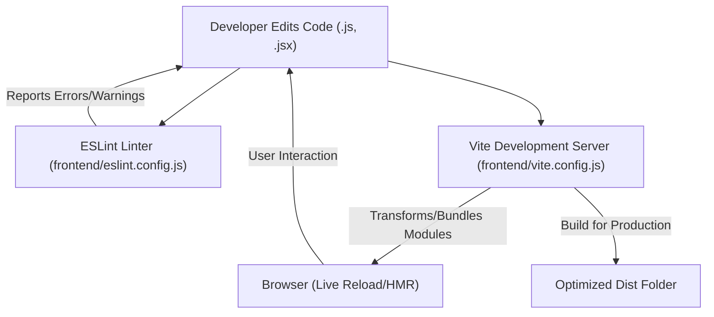
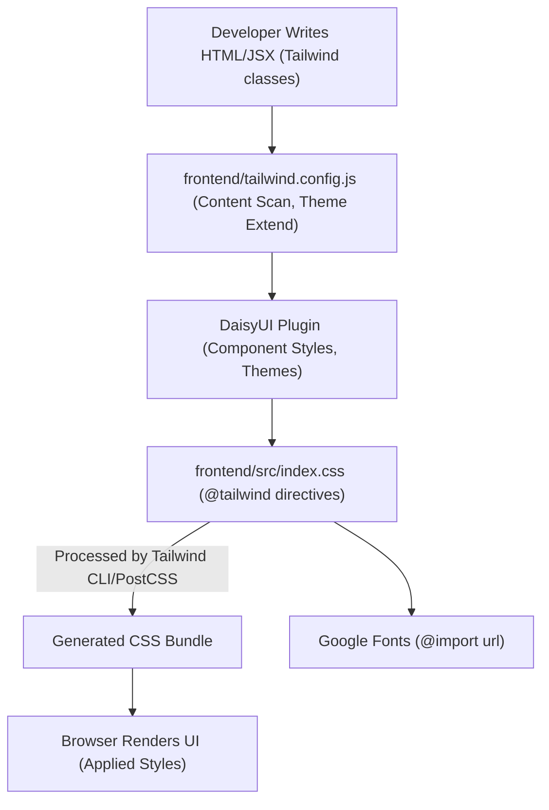

 # Frontend Configuration and Styling

This section details the essential configurations for the frontend application, focusing on development setup, build processes, and styling methodologies. The frontend leverages modern tools like Vite for rapid development, ESLint for code quality, and Tailwind CSS with DaisyUI for a robust and themeable styling system.

The core files involved in this setup are:
*   `frontend/vite.config.js`: Manages the development server and build process.
*   `frontend/eslint.config.js`: Defines code quality rules and linting.
*   `frontend/tailwind.config.js`: Configures Tailwind CSS, themes, and plugins.
*   `frontend/src/index.css`: The primary CSS entry point for importing Tailwind and custom styles.

## Frontend Development and Build Process

The frontend application utilizes **Vite** as its build tool, offering a fast and efficient development experience. **ESLint** is integrated to maintain code quality and ensure adherence to best practices, particularly for React applications.

### Vite Configuration (`frontend/vite.config.js`)

Vite serves as the backbone for the frontend development server and build process. The configuration is straightforward, primarily enabling React support.

```js
import { defineConfig } from 'vite'
import react from '@vitejs/plugin-react'

// https://vitejs.dev/config/
export default defineConfig({
  plugins: [react()],
})
```
This minimal configuration in `vite.config.js` activates the official `@vitejs/plugin-react` plugin, which provides Fast Refresh and optimized build performance for React components.

*   **Key Aspect**: Integration of `@vitejs/plugin-react` enables seamless React development features.
*   **File Location**: `frontend/vite.config.js`
*   **View on GitHub**: [frontend/vite.config.js](https://github.com/shinymack/Chat-App-MERN/blob/main/frontend/vite.config.js)

### ESLint Configuration (`frontend/eslint.config.js`)

Code quality and consistency are enforced using ESLint. The configuration is set up to lint JavaScript and JSX files, leveraging recommended rules for React and React Hooks, while also integrating with `react-refresh` for Vite's Fast Refresh.

```js
import js from '@eslint/js'
import globals from 'globals'
import react from 'eslint-plugin-react'
import reactHooks from 'eslint-plugin-react-hooks'
import reactRefresh from 'eslint-plugin-react-refresh'

export default [
  { ignores: ['dist'] },
  {
    files: ['**/*.{js,jsx}'],
    languageOptions: {
      ecmaVersion: 2020,
      globals: globals.browser,
      parserOptions: {
        ecmaVersion: 'latest',
        ecmaFeatures: { jsx: true },
        sourceType: 'module',
      },
    },
    settings: { react: { version: '18.3' } },
    plugins: {
      react,
      'react-hooks': reactHooks,
      'react-refresh': reactRefresh,
    },
    rules: {
      ...js.configs.recommended.rules,
      ...react.configs.recommended.rules,
      ...react.configs['jsx-runtime'].rules,
      ...reactHooks.configs.recommended.rules,
      'react/jsx-no-target-blank': 'off',
      'react-refresh/only-export-components': [
        'warn',
        { allowConstantExport: true },
      ],
      "react/prop-types" : "off",
    },
  },
]
```
The `eslint.config.js` defines an array of configurations. It ignores the `dist` directory, specifies `browser` globals, and sets up parsing for modern JavaScript with JSX. Several plugins are included: `eslint-plugin-react`, `eslint-plugin-react-hooks`, and `eslint-plugin-react-refresh`. Custom rules like `'react/prop-types': 'off'` disable specific linting warnings that might not align with the project's development philosophy (e.g., using TypeScript for type checking instead of PropTypes).

*   **Key Aspect**: Comprehensive linting for React applications, including `jsx-runtime` and `react-hooks` rules.
*   **Disabled Rules**: `react/jsx-no-target-blank` and `react/prop-types` are intentionally turned off.
*   **File Location**: `frontend/eslint.config.js`
*   **View on GitHub**: [frontend/eslint.config.js](https://github.com/shinymack/Chat-App-MERN/blob/main/frontend/eslint.config.js)

### Frontend Development Workflow
The following diagram illustrates the flow from code editing to the running application, highlighting the roles of Vite and ESLint.





## Styling with Tailwind CSS and DaisyUI

The frontend's visual design is powered by **Tailwind CSS**, a utility-first framework, augmented by **DaisyUI**, a Tailwind CSS component library. This combination allows for rapid UI development and easy theming.

### Tailwind CSS Configuration (`frontend/tailwind.config.js`)

The `tailwind.config.js` file is crucial for defining how Tailwind CSS processes the application's styles. It configures content scanning, theme extensions, and plugin integrations, notably DaisyUI.

```js
import daisyui from "daisyui"

/** @type {import('tailwindcss').Config} */
export default {
  content: [
    "./index.html",
    "./src/**/*.{js,ts,jsx,tsx}",
  ],
  theme: {
    extend: {
      fontFamily : {
        chivo : ['Chivo', 'sans-serif'],
      }
    },
  },
  plugins: [daisyui],
  daisyui : {
 themes: [
      "light",
      "dark",
      "cupcake",
      "bumblebee",
      "emerald",
      "corporate",
      "synthwave",
      "retro",
      "cyberpunk",
      "valentine",
      "halloween",
      "garden",
      "forest",
      "aqua",
      "lofi",
      "pastel",
      "fantasy",
      "wireframe",
      "black",
      "luxury",
      "dracula",
      "cmyk",
      "autumn",
      "business",
      "acid",
      "lemonade",
      "night",
      "coffee",
      "winter",
      "dim",
      "nord",
      "sunset",
    ],
  }
}
```
This configuration specifies the `content` paths for Tailwind to scan, ensuring that only used utility classes are included in the final CSS bundle. It extends the default Tailwind `theme` to include a custom `chivo` font family. The `daisyui` plugin is added, and a comprehensive list of DaisyUI themes is enabled, providing a wide range of aesthetic options for the application.

*   **Key Aspect**: Defines content paths for Tailwind's JIT compiler and extends the default theme.
*   **Plugin Integration**: Integrates DaisyUI and enables its extensive theme collection.
*   **Font Configuration**: Adds 'Chivo' to the available font families.
*   **File Location**: `frontend/tailwind.config.js`
*   **View on GitHub**: [frontend/tailwind.config.js](https://github.com/shinymack/Chat-App-MERN/blob/main/frontend/tailwind.config.js)

### Global Styles (`frontend/src/index.css`)

The `index.css` file acts as the primary stylesheet, responsible for importing Tailwind's base, components, and utilities layers, as well as applying global custom styles like the default font.

```css
@import url('https://fonts.googleapis.com/css2?family=Chivo:ital,wght@0,100..900;1,100..900&display=swap');
@tailwind base;
@tailwind components;
@tailwind utilities;

@layer base {
    body {
        @apply font-chivo;
    }
}
```
This file first imports the `Chivo` font from Google Fonts. It then includes Tailwind's directives for `base`, `components`, and `utilities`, which Tailwind CSS uses to inject its styles. Finally, an `@layer base` block applies the custom `font-chivo` to the entire `body`, establishing a consistent typography throughout the application.

*   **Key Aspect**: Imports Tailwind CSS layers and Google Fonts.
*   **Global Styling**: Sets the default font for the entire application.
*   **File Location**: `frontend/src/index.css`
*   **View on GitHub**: [frontend/src/index.css](https://github.com/shinymack/Chat-App-MERN/blob/main/frontend/src/index.css)

### Frontend Styling Pipeline
The styling pipeline depicts how Tailwind CSS and DaisyUI are integrated into the frontend for comprehensive theming and utility-first styling.





## Key Integration Points

*   **Vite and ESLint**: These two tools form the core of the development environment. Vite ensures fast reload times and optimized builds, while ESLint maintains code quality and consistency across the project. The configuration in `eslint.config.js` is tailored for React development within a Vite environment, integrating `react-refresh` rules.
*   **Tailwind CSS and DaisyUI**: This powerful combination allows developers to build responsive and aesthetically pleasing UIs rapidly. Tailwind's utility-first approach offers fine-grained control, while DaisyUI provides ready-made, customizable components that seamlessly integrate with Tailwind's theming system. The `tailwind.config.js` centralizes all styling configurations, including custom fonts and DaisyUI themes, ensuring a consistent design language.
*   **Global CSS (`index.css`)**: This file is the entry point for all frontend styles. It orchestrates the inclusion of Tailwind's core styles and applies global directives, such as the custom font family, which then cascades through the entire application. This setup ensures that the base styles are correctly applied before any component-specific styles take effect.
*   **Theme Management**: The extensive list of DaisyUI themes configured in `tailwind.config.js` provides flexibility for future theme switching or user-selectable themes, enhancing the application's user experience and adaptability without significant code changes.