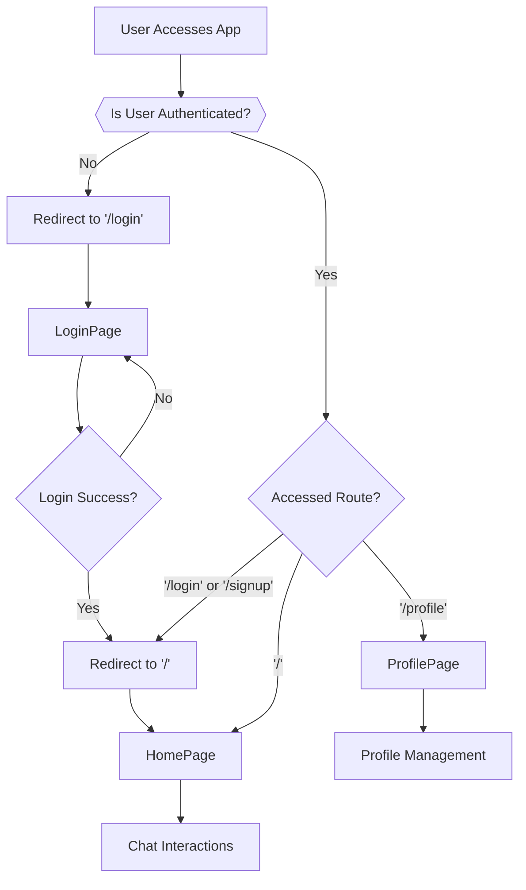
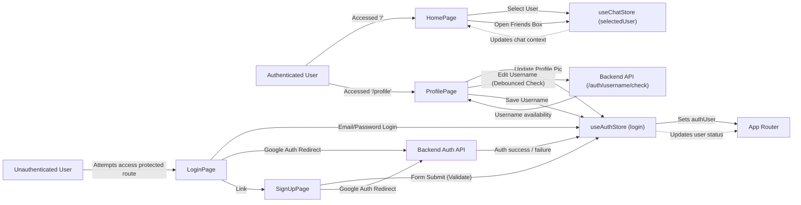

 ```md
---
title: "Frontend Pages and Routing"
description: "Describes the main application pages and how navigation is handled, focusing on key components and user flows."
---

# Frontend Pages and Routing

This document outlines the primary pages within the frontend application, detailing their responsibilities, key components, and how user navigation is managed. The frontend is built using React, utilizing `react-router-dom` for client-side routing and Zustand for state management, specifically for authentication and chat-related data.

## Core Application Pages

The application is structured around several distinct pages, each serving a specific user interaction or flow.

### 1. Home Page

The `HomePage` is the central hub for authenticated users, where real-time chat interactions occur. It dynamically renders different components based on the user's chat selection status.

#### Key Components:
-   **Sidebar**: Displays a list of available chats and contacts.
-   **ChatContainer**: Renders the active chat window, displaying messages and an input for sending new ones.
-   **NoChatSelected**: A placeholder component shown when no specific chat is active.
-   **FriendsBox**: A modal or collapsible component to manage friends, potentially for adding new contacts or viewing friend requests.

#### Structure and Logic:
The `HomePage` leverages the `useChatStore` Zustand hook to manage the `selectedUser` and `isFriendsBoxOpen` states. This allows for dynamic rendering of either the `ChatContainer` (if a user is selected) or `NoChatSelected` (if no user is selected), and conditionally displays the `FriendsBox`.

```jsx
import ChatContainer from "../components/ChatContainer";
import FriendsBox from "../components/FriendsBox";
import NoChatSelected from "../components/NoChatSelected";
import Sidebar from "../components/Sidebar";
import { useChatStore } from "../store/useChatStore"

const HomePage = () => {
  const { selectedUser } = useChatStore();
  const { isFriendsBoxOpen } = useChatStore();
  return (
      <div className="h-screen bg-base-200">
      <div className="flex items-center justify-center pt-20 px-4 w-full">
        <div className="bg-base-100 rounded-lg shadow-xl w-full max-w-6xl h-[calc(100vh-8rem)]">
          <div className="flex h-full rounded-lg overflow-hidden w-full">
            <Sidebar />
            {!selectedUser ? <NoChatSelected /> : <ChatContainer />}
            {isFriendsBoxOpen && <FriendsBox />}

          </div>

        </div>
      </div>
    </div>
  )
}

export default HomePage
```
[View on GitHub](https://github.com/shinymack/Chat-App-MERN/blob/main/frontend/src/pages/HomePage.jsx)

### 2. Login Page

The `LoginPage` provides the interface for users to authenticate into the application. It supports both traditional email/password login and Google OAuth.

#### Key Functionalities:
-   **Email/Password Login**: Users can submit their credentials via a form.
-   **Google OAuth Integration**: A button redirects users to Google's authentication flow.
-   **Password Visibility Toggle**: Allows users to show/hide their password input.
-   **Navigation to Sign Up**: A link is provided to facilitate new user registration.

#### Authentication Flow:
The page utilizes the `useAuthStore` Zustand hook to handle the `login` action and track the `isLoggingIn` state. The form submission triggers the `login` function, sending `formData` (email, password) to the backend. Google authentication initiates a redirect to the backend's Google OAuth endpoint.

```jsx
import { useState } from "react"
import { useAuthStore } from "../store/useAuthStore";
// ... other imports ...

const LoginPage = () => {
  const [showPassword, setShowPassword] = useState(false);
  const [formData, setFormData] = useState({
    email: "",
    password: "",
  })
  const { login, isLoggingIn } = useAuthStore();

  const handleSubmit = async (e) => {
    e.preventDefault();
    login(formData);
  }
  const backendDomain = import.meta.env.VITE_BACKEND_URL;
  const googleAuthUrl = `${backendDomain}/api/auth/google`;
  return (
    // ... JSX structure ...
    <form onSubmit={handleSubmit} className="space-y-6">
        {/* ... form fields ... */}
        <button type="submit" className="btn btn-primary w-full" disabled={isLoggingIn}>
            {isLoggingIn ? (
                <>
                    <Loader2 className="h-5 w-5 animate-spin" />
                    Loading...
                </>
            ) : (
                "Sign in"
            )}
        </button>
    </form>
    // ... Google sign-in and link to signup ...
  )
}

export default LoginPage
```
[View on GitHub](https://github.com/shinymack/Chat-App-MERN/blob/main/frontend/src/pages/LoginPage.jsx)

### 3. Sign Up Page

The `SignUpPage` facilitates new user registration, allowing users to create an account with a username, email, and password. It also offers Google OAuth for streamlined registration.

#### Key Functionalities:
-   **User Registration Form**: Collects username, email, and password.
-   **Form Validation**: Ensures input fields meet basic requirements (e.g., email format, password length).
-   **Google OAuth Integration**: Provides an alternative registration method via Google.
-   **Navigation to Login**: A link is available for users who already have an account.

#### Registration Flow:
Similar to login, the `SignUpPage` uses `useAuthStore` for the `signup` action and `IsSigningUp` state. Before submitting, `validateForm` performs client-side checks. Upon successful validation, the `signup` function is called with `formData`.

```jsx
import { useState } from "react";
import { useAuthStore } from "../store/useAuthStore";
// ... other imports ...

const SignUpPage = () => {
  const [showPassword, setShowPassword] = useState(false);
  const [formData, setFormData] = useState({
    username: "",
    email: "",
    password: "",
  });

  const { signup, IsSigningUp } = useAuthStore();

  const validateForm = () => {
    if(!formData.username.trim()) return toast.error("Username is required");
    if(!formData.email.trim()) return toast.error("Email is required");
    if (!/\S+@\S+\.\S+/.test(formData.email)) return toast.error("Invalid email format");
    if (!formData.password) return toast.error("Password is required");
    if (formData.password.length < 6) return toast.error("Password must be at least 6 characters");

    return true;
  };

  const handleSubmit = (e) => {
    e.preventDefault();

    const success = validateForm();
    if(success===true) signup(formData);
  };
  
  const backendDomain = import.meta.env.VITE_BACKEND_URL;
  const googleAuthUrl = `${backendDomain}/api/auth/google`;
  return (
    // ... JSX structure ...
    <form onSubmit={handleSubmit} className="space-y-6">
        {/* ... form fields ... */}
        <button type="submit" className="btn btn-primary w-full" disabled={IsSigningUp}>
            {IsSigningUp ? (
                <>
                    <Loader2 className="size-5 animate-spin" />
                    Loading...
                </>
            ) : (
                "Create Account"
            )}
        </button>
    </form>
    // ... Google sign-up and link to login ...
  );
};
export default SignUpPage;
```
[View on GitHub](https://github.com/shinymack/Chat-App-MERN/blob/main/frontend/src/pages/SignUpPage.jsx)

### 4. Profile Page

The `ProfilePage` allows authenticated users to view and update their profile information, specifically their profile picture and username.

#### Key Functionalities:
-   **Display User Information**: Shows the authenticated user's profile picture, username, email, and account creation date.
-   **Profile Picture Upload**: Users can upload a new profile picture. The image is converted to a base64 string and sent to the backend.
-   **Username Editing**: Users can edit their username, with a debounced check against the backend to ensure uniqueness.
-   **Account Status**: Displays the account status (e.g., "Active").

#### Profile Update Logic:
The `ProfilePage` utilizes `useAuthStore` to access `authUser`, `isUpdatingProfile`, and the `updateProfile` function.

```jsx
import { useState, useEffect, useRef } from "react";
import { useAuthStore } from "../store/useAuthStore";
import { Camera, Mail, User, Edit, Save, X, Loader2 } from "lucide-react";
import toast from "react-hot-toast";
import { axiosInstance } from "../lib/axios";

const ProfilePage = () => {
    const { authUser, isUpdatingProfile, updateProfile } = useAuthStore();
    const [selectedImg, setSelectedImg] = useState(null);
    const [isEditingUsername, setIsEditingUsername] = useState(false);
    const [newUsername, setNewUsername] = useState(authUser?.username || "");
    const [usernameStatus, setUsernameStatus] = useState({
        checking: false,
        available: true,
        message: "",
    });
    const debounceTimeout = useRef(null);

    const handleImageUpload = async (e) => {
        const file = e.target.files[0];
        if (!file) return;

        const reader = new FileReader();
        reader.readAsDataURL(file);

        reader.onload = async () => {
            const base64Image = reader.result;
            setSelectedImg(base64Image);
            await updateProfile({ profilePic: base64Image });
        };
    };

    useEffect(() => {
        clearTimeout(debounceTimeout.current);

        if (!newUsername.trim() || newUsername.trim().length < 3) {
            setUsernameStatus({ checking: false, available: false, message: "Must be 3+ characters." });
            return;
        }

        if (newUsername === authUser.username) {
            setUsernameStatus({ checking: false, available: true, message: "" });
            return;
        }

        setUsernameStatus((prev) => ({ ...prev, checking: true, message: "Checking..." }));

        debounceTimeout.current = setTimeout(async () => {
            try {
                const res = await axiosInstance.get(`/auth/username/check/${newUsername}`);
                setUsernameStatus({
                    checking: false,
                    available: res.data.available,
                    message: res.data.message,
                });
            } catch (error) {
                const message = error.response?.data?.message || "Error checking username.";
                setUsernameStatus({ checking: false, available: false, message });
            }
        }, 500);

        return () => clearTimeout(debounceTimeout.current);
    }, [newUsername, authUser.username]);

    const handleSaveUsername = async () => {
        if (!usernameStatus.available || newUsername === authUser.username) {
            toast.error("Cannot save. Username is either unavailable or unchanged.");
            return;
        }
        await updateProfile({ username: newUsername });
        setIsEditingUsername(false);
    };

    const handleCancelEdit = () => {
        setIsEditingUsername(false);
        setNewUsername(authUser.username);
        setUsernameStatus({ checking: false, available: true, message: "" });
    };

    return (
        <div className="h-screen pt-20">
            <div className="max-w-2xl mx-auto p-4 py-8">
                <div className="bg-base-300 rounded-xl p-6 space-y-8">
                    <div className="text-center">
                        <h1 className="text-2xl font-semibold">Profile</h1>
                        <p className="mt-2 ">Your profile information</p>
                    </div>

                    {/* profilePic section */}
                    <div className="flex flex-col items-center gap-4">
                        <div className="relative">
                            
                            <label
                                htmlFor="avatar-upload"
                                className={`
                                    absolute bottom-0 right-0
                                    bg-base-content hover:scale-105
                                    p-2 rounded-full cursor-pointer
                                    transition-all duration-200
                                    ${isUpdatingProfile ? "animate-pulse pointer-events-none" : ""}
                                `}
                            >
                                <Camera className="w-5 h-5 text-base-200" />
                                <input
                                    type="file"
                                    id="avatar-upload"
                                    className="hidden"
                                    accept="image/*"
                                    onChange={handleImageUpload}
                                    disabled={isUpdatingProfile}
                                />
                            </label>
                        </div>
                        <p className="text-sm text-zinc-400">
                            {isUpdatingProfile ? "Updating profile..." : "Click the camera icon to update your photo"}
                        </p>
                    </div>

                    {/* User Info section  */}
                    <div className="space-y-6">
                        <div className="space-y-1.5">
                            <div className="text-sm text-zinc-400 flex items-center gap-2">
                                <User className="w-4 h-4" />
                                Username
                            </div>
                            {!isEditingUsername ? (
                                <div className="flex items-center gap-2">
                                    <p className="px-4 py-2.5 bg-base-200 rounded-lg border flex-grow">
                                        {authUser?.username}
                                    </p>
                                    <button onClick={() => setIsEditingUsername(true)} className="btn btn-ghost btn-sm">
                                        <Edit className="w-4 h-4" />
                                    </button>
                                </div>
                            ) : (
                                <div className="space-y-2">
                                    <div className="flex items-center gap-2">
                                        <input
                                            type="text"
                                            value={newUsername}
                                            onChange={(e) => setNewUsername(e.target.value.toLowerCase())}
                                            className="input input-bordered w-full"
                                        />
                                        <button onClick={handleSaveUsername} className="btn btn-success btn-sm" disabled={!usernameStatus.available || usernameStatus.checking || isUpdatingProfile}>
                                            {isUpdatingProfile ? <Loader2 className="w-4 h-4 animate-spin" /> : <Save className="w-4 h-4" />}
                                        </button>
                                        <button onClick={handleCancelEdit} className="btn btn-error btn-sm">
                                            <X className="w-4 h-4" />
                                        </button>
                                    </div>
                                    <div className={`text-xs h-4 ${usernameStatus.available ? 'text-green-500' : 'text-error'}`}>
                                        {usernameStatus.checking ? <Loader2 className="w-3 h-3 animate-spin inline-block mr-1" /> : null}
                                        {usernameStatus.message}
                                    </div>
                                </div>
                            )}
                        </div>

                        <div className="space-y-1.5">
                            <div className="text-sm text-zinc-400 flex items-center gap-2">
                                <Mail className="w-4 h-4" />
                                Email Address
                            </div>
                            <p className="px-4 py-2.5 bg-base-200 rounded-lg border">{authUser?.email}</p>
                        </div>
                    </div>

                    {/* Account Info Section */}
                    <div className="mt-6 bg-base-300 rounded-xl p-6">
                        <h2 className="text-lg font-medium  mb-4">Account Information</h2>
                        <div className="space-y-3 text-sm">
                            <div className="flex items-center justify-between py-2 border-b border-zinc-700">
                                <span>Member Since</span>
                                <span>{authUser.createdAt?.split("T")[0]}</span>
                            </div>
                            <div className="flex items-center justify-between py-2">
                                <span>Account Status</span>
                                <span className="text-green-500">Active</span>
                            </div>
                        </div>
                    </div>
                </div>
            </div>
        </div>
    );
};

export default ProfilePage;
```
[View on GitHub](https://github.com/shinymack/Chat-App-MERN/blob/main/frontend/src/pages/ProfilePage.jsx)

## Routing Architecture

The frontend routing is managed by `react-router-dom`, defining public and protected routes to ensure proper access control.

### Public Routes:
-   `/login`: Accessible to all users, used for authentication.
-   `/signup`: Accessible to all users, used for new account creation.

### Protected Routes:
-   `/`: The main `HomePage`, accessible only to authenticated users.
-   `/profile`: The `ProfilePage`, accessible only to authenticated users.

The authentication status (`authUser`) from `useAuthStore` determines whether a user can access protected routes. Unauthenticated users attempting to access protected routes are redirected to the login page.

### Frontend Routing Flow





## Key Integration Points

### State Management with Zustand
Zustand is critical for managing global application state, particularly authentication (`useAuthStore`) and chat-specific data (`useChatStore`). This ensures that user sessions, selected chats, and profile information are consistently available across different components and pages.

For example, `useAuthStore` maintains the `authUser` object, enabling protected route logic and displaying user-specific data on the `ProfilePage`.

### Backend API Interactions
All pages interact with the backend API for various operations:
-   **Authentication**: `LoginPage` and `SignUpPage` send user credentials to `/api/auth/login` and `/api/auth/signup` respectively.
-   **Profile Updates**: `ProfilePage` sends requests to update user details, including profile pictures (`/api/users/profile`) and username availability (`/api/auth/username/check/:username`).
-   **Chat Data**: `HomePage` components (e.g., `Sidebar`, `ChatContainer`) would interact with backend endpoints for fetching chats, messages, and user lists.

### Environment Variables
Sensitive or environment-specific configurations, such as the `VITE_BACKEND_URL`, are managed through environment variables (`import.meta.env.VITE_BACKEND_URL`). This ensures that the frontend can correctly locate and communicate with the backend API in different deployment environments.

```javascript
// Example from LoginPage.jsx or SignUpPage.jsx
const backendDomain = import.meta.env.VITE_BACKEND_URL;
const googleAuthUrl = `${backendDomain}/api/auth/google`;
```
[View LoginPage on GitHub](https://github.com/shinymack/Chat-App-MERN/blob/main/frontend/src/pages/LoginPage.jsx#L20-L21)
[View SignUpPage on GitHub](https://github.com/shinymack/Chat-App-MERN/blob/main/frontend/src/pages/SignUpPage.jsx#L43-L44)

### Component Reusability
Components like `AuthImagePattern` (used in both `LoginPage` and `SignUpPage`) promote reusability and maintain a consistent UI across similar pages.

```jsx
// From LoginPage.jsx or SignUpPage.jsx
import AuthImagePattern from "../components/AuthImagePattern";

// ... inside the component's JSX ...
<AuthImagePattern
    title={"Welcome back!"}
    subtitle={"Sign in to continue your conversations and catch up with your messages."}
/>
```

### User Experience Enhancements
Features such as password visibility toggles, loading indicators (e.g., `Loader2` icon), and client-side form validation contribute to a smoother and more user-friendly experience. The debounced username check on the `ProfilePage` is another example of a UX enhancement, providing real-time feedback without excessive API calls.

### Page Interactions and Data Flow





```