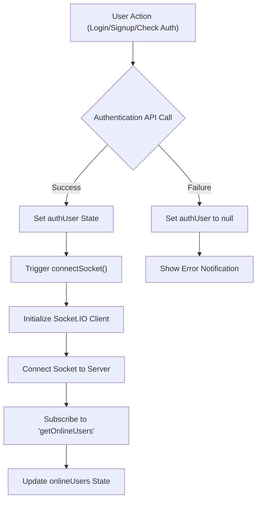
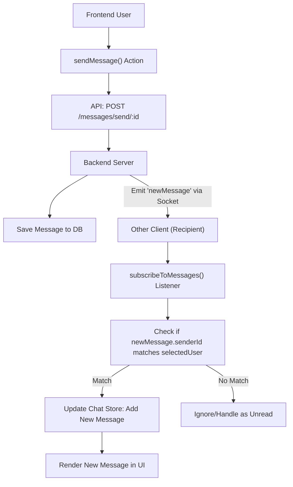

 # Frontend State Management and Utilities

This document details the frontend's approach to state management using Zustand for authentication and chat features, along with essential client-side utility functions. These components collectively ensure a responsive and interactive user experience by efficiently managing application data and interactions with the backend API.

## Authentication State Management

The `useAuthStore` is a Zustand store responsible for managing the authentication state of the user. It handles user authentication status, sign-up, login, logout, profile updates, and real-time online user tracking via WebSockets.

**Relevant File:** `frontend/src/store/useAuthStore.js`

### Core State Variables

The `useAuthStore` maintains several key pieces of state:

*   `authUser`: Stores the currently authenticated user object.
*   `isSigningUp`, `isLoggingIn`, `isUpdatingProfile`, `isCheckingAuth`: Boolean flags to indicate the loading status of various authentication operations.
*   `onlineUsers`: An array of user IDs currently online, received via WebSocket.
*   `socket`: The WebSocket client instance for real-time communication.

### Key Authentication Actions

The store provides actions to interact with the authentication API:

*   **`checkAuth()`**: Verifies the user's authentication status on application load.
*   **`signup(data)`**: Registers a new user.
*   **`login(data)`**: Authenticates an existing user.
*   **`logout()`**: Clears the authenticated user session.
*   **`updateProfile(data)`**: Updates the `authUser`'s profile information.

Upon successful authentication (login, signup, or checkAuth), the `connectSocket()` action is triggered to establish a WebSocket connection.

```javascript
// frontend/src/store/useAuthStore.js
// Simplified checkAuth action
checkAuth: async () => {
    try {
        const res = await axiosInstance.get("/auth/check");
        set({ authUser: res.data });
        get().connectSocket(); // Connect WebSocket upon successful authentication
    } catch (error) {
        set({ authUser: null });
        console.log("Error in checkAuth: ", error);
    } finally {
        set({ isCheckingAuth: false });
    }
},
```

[View on GitHub](https://github.com/shinymack/Chat-App-MERN/blob/main/frontend/src/store/useAuthStore.js#L25-L37)

### WebSocket Integration

The store integrates Socket.IO for real-time features like displaying online users:

*   **`connectSocket()`**: Initializes and connects the Socket.IO client, passing the `authUser._id` as a query parameter. It subscribes to the `"getOnlineUsers"` event to update the `onlineUsers` state.
*   **`disconnectSocket()`**: Disconnects the Socket.IO client when the user logs out.

```javascript
// frontend/src/store/useAuthStore.js
// Simplified connectSocket action
connectSocket: () => {
    const { authUser } = get();
    if(!authUser || get().socket?.connected) return;

    const socket = io(BASE_URL, {
        query: {
            userId : authUser._id,
        },
    });
    socket.connect();
    set({socket: socket});

    socket.on("getOnlineUsers", (userIds) => {
        set({onlineUsers: userIds})
    });
},
```

[View on GitHub](https://github.com/shinymack/Chat-App-MERN/blob/main/frontend/src/store/useAuthStore.js#L112-L127)

### Authentication Flow Diagram

This diagram illustrates the general authentication and socket connection flow.





## Chat State Management

The `useChatStore` manages all chat-related data and interactions, including messages, user lists, friend requests, and selected chat partners. It also integrates with the `useAuthStore`'s socket for real-time message updates.

**Relevant File:** `frontend/src/store/useChatStore.js`

### Core State Variables

Key state managed by `useChatStore`:

*   `messages`: An array of messages in the currently selected chat.
*   `users`: A list of friends of the `authUser`.
*   `pendingRequests`: An array of incoming friend requests.
*   `sentRequests`: An array of outgoing friend requests.
*   `selectedUser`: The user object of the currently active chat partner.
*   `isUsersLoading`, `isMessagesLoading`: Flags for loading states.
*   `isFriendBoxOpen`: Boolean to control the visibility of the friend management UI.

### Friend Management Actions

The store provides comprehensive actions for managing friend relationships:

*   **`getFriends()`**: Fetches the list of friends.
*   **`getPendingRequests()`**: Fetches incoming friend requests.
*   **`getSentRequests()`**: Fetches outgoing friend requests.
*   **`sendFriendRequest(identifier)`**: Sends a new friend request.
*   **`acceptFriendRequest(senderId)`**: Accepts an incoming friend request.
*   **`rejectFriendRequest(senderId)`**: Rejects an incoming friend request.
*   **`removeFriend(friendId)`**: Removes an existing friend.

```javascript
// frontend/src/store/useChatStore.js
// Simplified sendFriendRequest action
sendFriendRequest: async (identifier) => {
    try {
        const res = await axiosInstance.post("/friends/request/send", { identifier });
        toast.success(res.data.message);
        get().getSentRequests(); // Refresh sent requests list
    } catch (error) {
        toast.error(error.response?.data?.message || "Failed to send request");
    }
},
```

[View on GitHub](https://github.com/shinymack/Chat-App-MERN/blob/main/frontend/src/store/useChatStore.js#L68-L76)

### Message Management Actions

Actions for handling chat messages:

*   **`getMessages(userId)`**: Fetches the message history with a specific user.
*   **`sendMessage(messageData)`**: Sends a new message to the `selectedUser`. The new message is immediately added to the `messages` state.

```javascript
// frontend/src/store/useChatStore.js
// Simplified sendMessage action
sendMessage: async (messageData) => {
    const {selectedUser, messages} = get();
    try {
        const res = await axiosInstance.post(`/messages/send/${selectedUser._id}`, messageData);
        set({messages : [...messages, res.data]});
    } catch (error){
        toast.error(error.response.data.message);
    }
},
```

[View on GitHub](https://github.com/shinymack/Chat-App-MERN/blob/main/frontend/src/store/useChatStore.js#L143-L151)

### Real-time Message Subscription

`useChatStore` leverages the socket from `useAuthStore` for real-time message reception:

*   **`subscribeToMessages()`**: Attaches a listener to the `socket` for the `"newMessage"` event. When a new message arrives for the currently `selectedUser`, it updates the `messages` state.
*   **`unsubscribeFromMessages()`**: Removes the `"newMessage"` listener, typically on component unmount to prevent memory leaks.

```javascript
// frontend/src/store/useChatStore.js
// Simplified subscribeToMessages action
subscribeToMessages: () => {
    const { selectedUser } = get();
    if(!selectedUser) return;

    const socket = useAuthStore.getState().socket;
    socket.on("newMessage", (newMessage) => {
        if(newMessage.senderId !== selectedUser._id) return
        set({
            messages: [...get().messages, newMessage]
        })
    })
},
```

[View on GitHub](https://github.com/shinymack/Chat-App-MERN/blob/main/frontend/src/store/useChatStore.js#L154-L166)

### Chat Message Flow Diagram

This diagram illustrates how messages are sent and received in real-time.





## API Client Configuration

The `axios.js` file configures a pre-set Axios instance for making API requests to the backend. This centralizes API call settings and ensures consistency across the application.

**Relevant File:** `frontend/src/lib/axios.js`

### `axiosInstance`

The `axiosInstance` is created with a `baseURL` that adapts based on the environment (development or production) and `withCredentials: true` to handle cookies for session management.

```javascript
// frontend/src/lib/axios.js
import axios from "axios";

export const axiosInstance = axios.create({
    baseURL: import.meta.env.MODE == "development" ? "http://localhost:5001/api": "/api",
    withCredentials: true,
});
```

[View on GitHub](https://github.com/shinymack/Chat-App-MERN/blob/main/frontend/src/lib/axios.js)

## Client-Side Utility Functions

The `utils.js` file contains general utility functions that are reusable across the frontend.

**Relevant File:** `frontend/src/lib/utils.js`

### `formatMessageTime()`

This function takes a date string or `Date` object and formats it into a human-readable time string, including year, month, day, hour, and minute, suitable for displaying message timestamps.

```javascript
// frontend/src/lib/utils.js
export function formatMessageTime(date) {
    return new Date(date).toLocaleTimeString("en-US", {
        year: "numeric",
        month: "short",
        day:"2-digit",
        hour: "2-digit",
        minute: "2-digit",
        hour12: true,
    });
}
```

[View on GitHub](https://github.com/shinymack/Chat-App-MERN/blob/main/frontend/src/lib/utils.js)

## Key Integration Points

*   **Zustand for State Management**: Both `useAuthStore` and `useChatStore` leverage Zustand's minimalistic approach, providing a global state that is easily accessible and modifiable throughout the React application without prop drilling.
*   **Axios for API Calls**: `axiosInstance` acts as the single point for all HTTP requests, ensuring consistent `baseURL` and credential handling for authentication and data fetching.
*   **Socket.IO for Real-time**: The `useAuthStore` initializes and manages the primary WebSocket connection. The `useChatStore` then *accesses* this established socket to subscribe to chat-specific events like `"newMessage"`, demonstrating effective inter-store communication and resource sharing.
*   **Utility Functions**: Simple, pure functions like `formatMessageTime` abstract common tasks, keeping components clean and focused on rendering logic.

These modules work in concert to manage authentication, provide real-time chat capabilities, and simplify interactions with the backend, forming the backbone of the application's frontend logic.