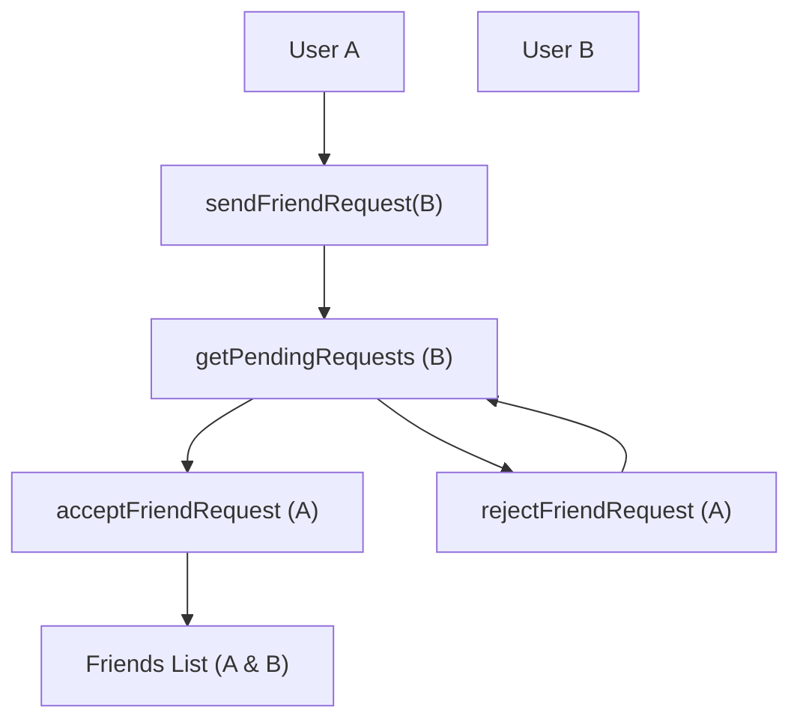

 # Frontend State Management and Utilities

This document outlines the core global state management solutions and client-side utility functions employed in the frontend of the application. The project leverages [Zustand](https://zustand-bear.github.io/zustand/) for a lightweight and flexible approach to state management, alongside a dedicated utilities file for common client-side operations. This architecture ensures a clear separation of concerns, maintainable code, and efficient data flow across the application.

## State Management with Zustand

Zustand is a small, fast, and scalable state-management solution that uses a hook-based API. It's particularly well-suited for React applications due to its simplicity and performance. Unlike other libraries, Zustand doesn't require providers and offers a more direct way to manage global state. The application utilizes three distinct Zustand stores: `useAuthStore` for user authentication and real-time connectivity, `useChatStore` for managing chat-related data (messages, users, friend requests), and `useThemeStore` for user interface theme preferences.

### `frontend/src/store/useAuthStore.js`

The `useAuthStore` is the central hub for all authentication-related state and actions. It manages the currently authenticated user, tracks various authentication-related loading states, and handles the WebSocket connection for real-time features. This store integrates with `axiosInstance` for API calls and `socket.io-client` for real-time communication.

**Key Responsibilities:**
*   **User Authentication**: Manages `authUser` state, enabling user login, signup, and logout functionalities.
*   **Profile Management**: Facilitates updating user profile information.
*   **Authentication Status Tracking**: Provides loading states (`isSigningUp`, `isLoggingIn`, `isUpdatingProfile`, `isCheckingAuth`) for a better user experience.
*   **Real-time Connectivity**: Manages the lifecycle of the WebSocket connection (`socket`) and tracks `onlineUsers`.

Here's an overview of how the `useAuthStore` is created using Zustand's `create` function:

```javascript
// frontend/src/store/useAuthStore.js
import { create } from "zustand";
import { axiosInstance } from "../lib/axios";
import toast from "react-hot-toast";
import { io } from "socket.io-client";

const BASE_URL = import.meta.env.MODE == "development" ? "http://localhost:5001": "/";

export const useAuthStore = create((set, get) => ({
    authUser: null,
    isSigningUp: false,
    isLoggingIn: false,
    isUpdatingProfile: false,
    isCheckingAuth: true,
    onlineUsers: [],
    socket: null,
    // ... actions ...
}));
```
[View on GitHub](https://github.com/shinymack/Chat-App-MERN/blob/main/frontend/src/store/useAuthStore.js#L1-L24)

This snippet demonstrates the initial state definition for the `useAuthStore`, including the `authUser` object, various boolean flags for loading indicators, and the `socket` instance. The `BASE_URL` is dynamically set based on the environment.

**Core Actions:**
The store provides several asynchronous actions to interact with the backend API and manage the socket connection:

*   `checkAuth`: Verifies the user's authentication status upon application load. If authenticated, it attempts to connect the WebSocket.
*   `signup(data)`: Registers a new user.
*   `login(data)`: Authenticates an existing user.
*   `logout()`: Logs out the current user and disconnects the WebSocket.
*   `updateProfile(data)`: Updates the authenticated user's profile.
*   `connectSocket()`: Establishes a WebSocket connection, passing the `userId` as a query parameter. It also sets up a listener for `getOnlineUsers` events.
*   `disconnectSocket()`: Closes the active WebSocket connection.

The `connectSocket` action is crucial for real-time features, linking the user's presence to the backend.

```javascript
// frontend/src/store/useAuthStore.js
// ... (previous code) ...
    connectSocket: () => {
        const { authUser } = get();
        if(!authUser || get().socket?.connected) return;

        const socket = io(BASE_URL, {
            query: {
                userId : authUser._id,
            },
        });
        socket.connect();
        set({socket: socket});

        socket.on("getOnlineUsers", (userIds) => {
            set({onlineUsers: userIds})
        }); 
    },

    disconnectSocket : () => {
        if(get().socket?.connected) get().socket.disconnect();
    }
}));
```
[View on GitHub](https://github.com/shinymack/Chat-App-MERN/blob/main/frontend/src/store/useAuthStore.js#L125-L141)

This snippet highlights the logic for establishing and tearing down the WebSocket connection, ensuring that online user statuses are updated dynamically.

### `frontend/src/store/useChatStore.js`

The `useChatStore` is dedicated to managing all chat-specific data and interactions. This includes user lists (friends), messages, and the friend request lifecycle. It also interacts with `useAuthStore` to leverage the established WebSocket connection for real-time message updates.

**Key Responsibilities:**
*   **Chat Data**: Stores `messages` for the currently selected chat.
*   **User Management**: Holds `users` (friends list), `pendingRequests`, and `sentRequests`.
*   **Active Chat**: Tracks the `selectedUser` to determine the active conversation.
*   **Loading States**: Manages `isUsersLoading` and `isMessagesLoading` to provide feedback during data fetching.
*   **Friend Box UI**: Controls the visibility of the friend management UI via `isFriendBoxOpen`.

Initial state and the toggle for the friend box:

```javascript
// frontend/src/store/useChatStore.js
import toast from "react-hot-toast";
import { create } from "zustand";
import { axiosInstance } from "../lib/axios";
import { useAuthStore } from "./useAuthStore";


export const useChatStore = create((set, get) => ({
    messages:[],
    users: [],
    pendingRequests: [],
    sentRequests: [],
    selectedUser: null,
    isUsersLoading: false,
    isMessagesLoading: false,

    isFriendBoxOpen: false,

    toggleFriendsBox: () => set(state => ({ isFriendsBoxOpen: !state.isFriendBoxOpen })),
    // ... actions ...
}));
```
[View on GitHub](https://github.com/shinymack/Chat-App-MERN/blob/main/frontend/src/store/useChatStore.js#L1-L22)

**Core Actions:**
This store provides comprehensive actions for managing friend relationships and messaging:

*   `getFriends()`: Fetches the list of friends for the authenticated user.
*   `getPendingRequests()`: Retrieves friend requests sent to the user.
*   `getSentRequests()`: Retrieves friend requests sent by the user.
*   `sendFriendRequest(identifier)`: Sends a friend request to another user.
*   `acceptFriendRequest(senderId)`: Accepts a pending friend request.
*   `rejectFriendRequest(senderId)`: Rejects a pending friend request.
*   `removeFriend(friendId)`: Removes an existing friend.
*   `getMessages(userId)`: Fetches chat messages with a specific user.
*   `sendMessage(messageData)`: Sends a new message to the `selectedUser`.
*   `subscribeToMessages()`: Sets up a WebSocket listener (`newMessage`) to receive real-time messages for the `selectedUser`.
*   `unsubscribeFromMessages()`: Cleans up the WebSocket listener.
*   `setSelectedUser(selectedUser)`: Sets the currently active chat partner.

The real-time message subscription is vital for the chat functionality:

```javascript
// frontend/src/store/useChatStore.js
// ... (previous code) ...
    subscribeToMessages: () => {
        const { selectedUser } = get();
        if(!selectedUser) return;
        
        const socket = useAuthStore.getState().socket; // Access socket from AuthStore
        if (!socket) {
            console.warn("Socket not connected, cannot subscribe to messages.");
            return;
        }
        socket.on("newMessage", (newMessage) => {
            if(newMessage.senderId !== selectedUser._id) return // Ensure message is for the current chat
            set({
                messages: [...get().messages, newMessage]
            })
        })
    },

    unsubscribeFromMessages: () => {
        const socket = useAuthStore.getState().socket;
        if (socket) {
            socket.off("newMessage");
        }
    },
    
    setSelectedUser: (selectedUser) => set({selectedUser})

}))
```
[View on GitHub](https://github.com/shinymack/Chat-App-MERN/blob/main/frontend/src/store/useChatStore.js#L162-L180)

This code demonstrates how `useChatStore` reaches into `useAuthStore` to get the WebSocket instance, showcasing inter-store communication without direct dependency injection, a common pattern with Zustand's `getState()` method.

Here is a simplified flowchart illustrating the friend request lifecycle within the `useChatStore`:





### `frontend/src/store/useThemeStore.js`

The `useThemeStore` is a simple Zustand store responsible for managing the application's UI theme preference. It uses `localStorage` to persist the selected theme across sessions.

**Key Responsibilities:**
*   **Theme Storage**: Holds the current `theme` (e.g., "dark", "light").
*   **Theme Persistence**: Saves the chosen theme to `localStorage`.

```javascript
// frontend/src/store/useThemeStore.js
import { create } from "zustand";

export const useThemeStore = create((set) => ({
    theme: localStorage.getItem("chat-theme") || "dark", // Default to dark theme
    setTheme: (theme) => {
        localStorage.setItem("chat-theme", theme);
        set({theme});
    }
}))
```
[View on GitHub](https://github.com/shinymack/Chat-App-MERN/blob/main/frontend/src/store/useThemeStore.js#L1-L8)

This store is straightforward, providing a single state variable `theme` and an action `setTheme` to update it and persist it in local storage.

## Client-Side Utilities

### `frontend/src/lib/utils.js`

The `utils.js` file houses common utility functions that don't directly relate to state management but provide useful client-side functionalities. These functions are typically pure, reusable, and help keep components and stores clean by abstracting common logic.

**Key Responsibilities:**
*   **Date/Time Formatting**: Provides functions for formatting dates and times for display.

Currently, it includes `formatMessageTime`, which is used to display timestamps for chat messages in a user-friendly format.

```javascript
// frontend/src/lib/utils.js
export function formatMessageTime(date) {
    return new Date(date).toLocaleTimeString("en-US", {
        year: "numeric",
        month: "short",
        day:"2-digit",
        hour: "2-digit",
        minute: "2-digit",
        hour12: true,
    });
}
```
[View on GitHub](https://github.com/shinymack/Chat-App-MERN/blob/main/frontend/src/lib/utils.js#L1-L9)

This function takes a `date` object or string and returns a formatted string including year, month, day, hour, and minute, with AM/PM indication. This ensures consistent and localized time display across the application.

## Key Integration Points

The state management and utilities are designed to work cohesively to power the application's frontend.

1.  **Authentication to Real-time**: The `useAuthStore` plays a pivotal role in bridging user authentication with real-time communication. After successful login or initial authentication check, it automatically calls `connectSocket()`. This ensures that the user is immediately connected to the WebSocket server, allowing them to receive real-time updates like online user statuses and new messages.

    


```mermaid
    graph TD
        A["User Login/Signup"] --> B["AuthStore.login/signup()"]
        B --> C{"Auth Success?"}
        C -- Yes --> D["AuthStore.connectSocket()"]
        D --> E["Socket.io Connection"]
        E --> F["Socket.on('getOnlineUsers')"]
        F --> G["AuthStore.onlineUsers Update"]
        C -- No --> H["Display Error"]
    ```


2.  **Chat Real-time Messaging**: The `useChatStore` subscribes to the `newMessage` event on the socket managed by `useAuthStore`. This demonstrates how different Zustand stores can interact: `useChatStore` uses `useAuthStore.getState().socket` to access the shared socket instance. This pattern centralizes socket management in `useAuthStore` while allowing `useChatStore` to listen to specific chat-related events.

3.  **UI Feedback and User Experience**: All state management stores extensively use boolean flags (`isSigningUp`, `isMessagesLoading`, etc.) to indicate ongoing asynchronous operations. This allows UI components to display loading indicators, disable inputs, or provide other visual feedback, significantly improving the user experience. Toast notifications (from `react-hot-toast`) are used consistently across stores to provide immediate feedback on the success or failure of operations.

4.  **Data Consistency**: Actions within `useChatStore` (e.g., `acceptFriendRequest`, `removeFriend`) often trigger refreshes of related lists (`getFriends`, `getPendingRequests`). This ensures that the UI reflects the most up-to-date data after any modification, preventing stale data issues.

5.  **Modularity and Reusability**: Separating concerns into distinct Zustand stores (auth, chat, theme) promotes modularity. Each store focuses on a specific domain, making it easier to understand, test, and maintain. The `utils.js` file provides reusable helper functions, preventing code duplication across components and stores.

By adhering to this structured approach, the frontend maintains a robust and scalable architecture, capable of handling complex user interactions and real-time data efficiently.