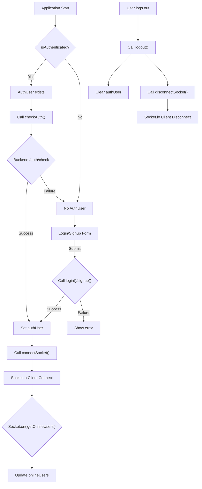

 # Frontend State Management

This section details the architecture and implementation of frontend state management using Zustand. Zustand is a small, fast, and scalable state management solution for React, leveraging a hook-based API similar to `useState` but with global scope. It simplifies the process of managing complex application state by providing a straightforward API for creating stores, updating state, and reacting to state changes.

Our application utilizes three distinct Zustand stores, each responsible for a specific domain of application state: `useAuthStore` for authentication and user sessions, `useChatStore` for managing chat-related data and friend interactions, and `useThemeStore` for handling UI theme preferences.

## Zustand Stores Overview

### `useAuthStore`

The `useAuthStore` is the central hub for managing all authentication-related state and user session information. It handles user login, signup, logout, profile updates, and maintains the current authenticated user's data. Crucially, it also manages the WebSocket connection for real-time features, including tracking online users.

**Relevant File:** `frontend/src/store/useAuthStore.js`
[View on GitHub](https://github.com/shinymack/Chat-App-MERN/blob/main/frontend/src/store/useAuthStore.js)

#### State Variables

*   `authUser`: Holds the currently authenticated user object. `null` if not authenticated.
*   `isSigningUp`: Boolean flag indicating if a signup process is ongoing.
*   `isLoggingIn`: Boolean flag indicating if a login process is ongoing.
*   `isUpdatingProfile`: Boolean flag indicating if a profile update is ongoing.
*   `isCheckingAuth`: Boolean flag indicating if the initial authentication check is running.
*   `onlineUsers`: An array of user IDs currently online, received via WebSocket.
*   `socket`: The WebSocket client instance (`socket.io-client`).

#### Actions

The store provides several asynchronous actions to interact with the backend API and manage the WebSocket connection:

*   **`checkAuth()`**: Verifies the user's authentication status with the backend. If authenticated, it sets `authUser` and initiates the WebSocket connection.

    ```javascript
    // frontend/src/store/useAuthStore.js
    // Lines 19-30
    checkAuth: async () => {
        try {
            const res = await axiosInstance.get("/auth/check");
            set({ authUser: res.data });
            get().connectSocket(); // Connect socket if authenticated
        } catch (error) {
            set({ authUser: null });
            console.log("Error in checkAuth: ", error);
        } finally {
            set({ isCheckingAuth: false });
        }
    },
    ```
    This snippet demonstrates the `checkAuth` action, which queries the backend to determine if a user session exists. If successful, `authUser` is populated, and a `connectSocket` action is immediately invoked, leveraging the `get()` function to access other actions within the same store. [View on GitHub](https://github.com/shinymack/Chat-App-MERN/blob/main/frontend/src/store/useAuthStore.js#L19-L30)

*   **`signup(data)`**: Registers a new user. On success, `authUser` is set, and a socket connection is established.
*   **`login(data)`**: Authenticates an existing user. On success, `authUser` is set, and a socket connection is established.
*   **`logout()`**: Clears the user session on the backend and locally. Disconnects the WebSocket.
*   **`updateProfile(data)`**: Updates the authenticated user's profile information.
*   **`connectSocket()`**: Initializes and connects the WebSocket client if an `authUser` is present and a socket is not already connected. It passes the `userId` as a query parameter for server-side identification. It also sets up a listener for the `"getOnlineUsers"` event.

    ```javascript
    // frontend/src/store/useAuthStore.js
    // Lines 103-117
    connectSocket: () => {
        const { authUser } = get();
        if(!authUser || get().socket?.connected) return;

        const socket = io(BASE_URL, {
            query: {
                userId : authUser._id,
            },
        });
        socket.connect();
        set({socket: socket});

        socket.on("getOnlineUsers", (userIds) => {
            set({onlineUsers: userIds})
        }); 
    },
    ```
    This `connectSocket` action is vital for real-time features. It ensures a socket connection is established only when a user is authenticated and not already connected. The `userId` is passed for identification, and a listener for `getOnlineUsers` is set up to update the `onlineUsers` state. [View on GitHub](https://github.com/shinymack/Chat-App-MERN/blob/main/frontend/src/store/useAuthStore.js#L103-L117)

*   **`disconnectSocket()`**: Disconnects the active WebSocket client.

#### Authentication and Socket Flow





### `useChatStore`

The `useChatStore` manages all state related to messaging and friend interactions within the application. This includes the list of friends, pending and sent friend requests, message history for a selected conversation, and the currently selected chat partner.

**Relevant File:** `frontend/src/store/useChatStore.js`
[View on GitHub](https://github.com/shinymack/Chat-App-MERN/blob/main/frontend/src/store/useChatStore.js)

#### State Variables

*   `messages`: An array of message objects for the currently selected conversation.
*   `users`: An array of friend user objects.
*   `pendingRequests`: An array of user objects who have sent friend requests to the current user.
*   `sentRequests`: An array of user objects to whom the current user has sent friend requests.
*   `selectedUser`: The user object of the currently selected chat partner. `null` if no user is selected.
*   `isUsersLoading`: Boolean flag for loading status of friend list.
*   `isMessagesLoading`: Boolean flag for loading status of messages.
*   `isFriendBoxOpen`: Boolean flag for the visibility of the friend management UI.

#### Actions

The store provides actions for fetching chat data, managing friend requests, sending messages, and subscribing to real-time message updates.

*   **`toggleFriendsBox()`**: Toggles the `isFriendBoxOpen` state.
*   **`getFriends()`**: Fetches the current user's friend list from the backend.
*   **`getPendingRequests()`**: Fetches friend requests sent *to* the current user.
*   **`getSentRequests()`**: Fetches friend requests sent *by* the current user.
*   **`sendFriendRequest(identifier)`**: Sends a friend request to a user.
*   **`acceptFriendRequest(senderId)`**: Accepts a pending friend request.
*   **`rejectFriendRequest(senderId)`**: Rejects a pending friend request.
*   **`removeFriend(friendId)`**: Removes an existing friend.
*   **`getMessages(userId)`**: Fetches the message history with a specific user.

    ```javascript
    // frontend/src/store/useChatStore.js
    // Lines 107-116
    getMessages: async (userId) => {
        set({isMessagesLoading: true});
        try {
            const res = await axiosInstance.get(`/messages/${userId}`);
            set({messages: res.data});
        } catch (error) {
            toast.error(error.response.data.message);
        } finally {
            set({isMessagesLoading: false});
        }
    },
    ```
    This `getMessages` action fetches the conversation history between the authenticated user and a specified `userId`. It updates the `messages` state and handles loading indicators. [View on GitHub](https://github.com/shinymack/Chat-App-MERN/blob/main/frontend/src/store/useChatStore.js#L107-L116)

*   **`sendMessage(messageData)`**: Sends a new message to the `selectedUser`. Appends the new message to the `messages` state.
*   **`subscribeToMessages()`**: Sets up a WebSocket listener for `"newMessage"` events. If a new message is received from the `selectedUser`, it's added to the `messages` array. This action directly accesses the `socket` instance from `useAuthStore`.

    ```javascript
    // frontend/src/store/useChatStore.js
    // Lines 137-147
    subscribeToMessages: () => {
        const { selectedUser } = get();
        if(!selectedUser) return;
        
        const socket = useAuthStore.getState().socket; // Accessing socket from auth store
        socket.on("newMessage", (newMessage) => {
            if(newMessage.senderId !== selectedUser._id) return
            set({
                messages: [...get().messages, newMessage]
            })
        })
    },
    ```
    The `subscribeToMessages` action demonstrates cross-store communication. It retrieves the `socket` instance from `useAuthStore` using `useAuthStore.getState().socket` to listen for real-time incoming messages. This allows `useChatStore` to update its `messages` state dynamically without being directly coupled to `useAuthStore`'s internal structure. [View on GitHub](https://github.com/shinymack/Chat-App-MERN/blob/main/frontend/src/store/useChatStore.js#L137-L147)

*   **`unsubscribeFromMessages()`**: Removes the `"newMessage"` WebSocket listener.
*   **`setSelectedUser(selectedUser)`**: Sets the user currently being chatted with.

### `useThemeStore`

The `useThemeStore` is a simple Zustand store dedicated to managing the application's UI theme. It stores the currently selected theme preference and persists it to `localStorage` for continuity across sessions.

**Relevant File:** `frontend/src/store/useThemeStore.js`
[View on GitHub](https://github.com/shinymack/Chat-App-MERN/blob/main/frontend/src/store/useThemeStore.js)

#### State Variables

*   `theme`: A string representing the current theme, defaulting to `"dark"` or the value retrieved from `localStorage`.

#### Actions

*   **`setTheme(theme)`**: Updates the `theme` state and saves the new theme preference to `localStorage`.

    ```javascript
    // frontend/src/store/useThemeStore.js
    // Lines 4-8
    setTheme: (theme) => {
        localStorage.setItem("chat-theme", theme);
        set({theme});
    }
    ```
    This snippet shows the straightforward `setTheme` action. It updates the internal Zustand state and ensures that the selected theme is persisted in the browser's `localStorage` for future visits. [View on GitHub](https://github.com/shinymack/Chat-App-MERN/blob/main/frontend/src/store/useThemeStore.js#L4-L8)

## Key Integration Points

*   **Cross-Store Communication:** `useChatStore` relies on `useAuthStore` to get the active `socket` instance. This is achieved using `useAuthStore.getState().socket`, a pattern that allows accessing state from other Zustand stores outside of React components or the store's `create` call. This is crucial for enabling `useChatStore` to subscribe to real-time chat messages without tightly coupling the two stores during their creation.
*   **Socket Lifecycle Management:** The `connectSocket` and `disconnectSocket` actions in `useAuthStore` are strategically called after successful login/signup and on logout, respectively. This ensures the WebSocket connection is active only when a user is authenticated, conserving resources and ensuring secure communication.
*   **Persistent State:** `useThemeStore` demonstrates how Zustand can be combined with browser storage (`localStorage`) to persist user preferences, providing a consistent user experience.
*   **Loading States and Error Handling:** Each asynchronous action across the stores includes `is...Loading` flags to provide UI feedback during network requests and uses `react-hot-toast` for user-friendly error and success notifications. This improves the perceived performance and robustness of the application.
*   **Modular Design:** The separation of concerns into distinct stores (`Auth`, `Chat`, `Theme`) makes the codebase more organized, easier to understand, and maintain. Each store manages its own domain-specific state and logic, promoting reusability and testability.