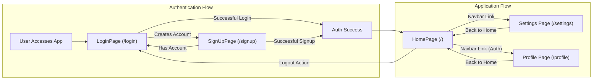
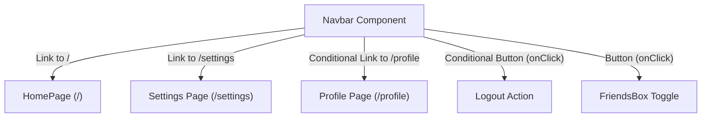

 # Page Structure and Routing

The ShinyChat frontend is organized into distinct pages and components, facilitating a clear user journey and efficient navigation. This document details the primary page components, their roles, and how `react-router-dom` is utilized to manage routing and user flow across the application.

## Core Application Pages

The application is structured around several key pages, each serving a specific purpose in the user's interaction with the chat platform.

### Home Page (`HomePage.jsx`)

The `HomePage` serves as the central hub for authenticated users. It integrates various chat-related components to provide a complete messaging experience. Users land here after successful authentication, where they can view conversations, manage friends, and interact with the chat interface.

The page dynamically renders either the `ChatContainer` when a user or group is selected, or a `NoChatSelected` component otherwise. It also conditionally displays the `FriendsBox` based on user interaction.

```jsx
// frontend/src/pages/HomePage.jsx
// ... imports ...
const HomePage = () => {
  const { selectedUser } = useChatStore();
  const { isFriendsBoxOpen } = useChatStore();
  return (
      <div className="h-screen bg-base-200">
      <div className="flex items-center justify-center pt-20 px-4 w-full">
        <div className="bg-base-100 rounded-lg shadow-xl w-full max-w-6xl h-[calc(100vh-8rem)]">
          <div className="flex h-full rounded-lg overflow-hidden w-full">
            <Sidebar />
            {!selectedUser ? <NoChatSelected /> : <ChatContainer />}
            {isFriendsBoxOpen && <FriendsBox />}

          </div>

        </div>
      </div>
    </div>
  )
}
export default HomePage
```

[View on GitHub](https://github.com/shinymack/Chat-App-MERN/blob/main/frontend/src/pages/HomePage.jsx)

### Login Page (`LoginPage.jsx`)

The `LoginPage` is the gateway for existing users to access their accounts. It provides fields for email and password, along with a "Sign in with Google" option for OAuth authentication. It also includes a clear link for new users to navigate to the `SignUpPage`.

```jsx
// frontend/src/pages/LoginPage.jsx
// ... imports ...
const LoginPage = () => {
  // ... state and handlers ...
  return (
    <div className="h-screen grid lg:grid-cols-2">
      {/* Left Side - Form */}
      <div className="flex flex-col justify-center items-center p-6 sm:p-12">
        <div className="w-full max-w-md space-y-8">
          {/* Logo and Welcome message */}
          {/* Form */}
          <form onSubmit={handleSubmit} className="space-y-6">
            {/* Email and Password fields */}
            <button type="submit" className="btn btn-primary w-full" disabled={isLoggingIn}>
              {/* ... button content ... */}
            </button>
          </form>
          <div className="divider text-base-content/60 my-4">OR</div>

          <a
            href={googleAuthUrl} // Link to your backend Google auth route
            className="btn btn-primary btn-outline w-full"
          >
            <FcGoogle className="size-5 mr-2" />
            Sign in with Google
          </a>

          <div className="text-center">
            <p className="text-base-content/60">
              Don&apos;t have an account?{" "}
              <Link to="/signup" className="link link-primary">
                Create account
              </Link>
            </p>
          </div>
        </div>
      </div>

      {/* Right Side - Image/Pattern */}
      <AuthImagePattern
        title={"Welcome back!"}
        subtitle={"Sign in to continue your conversations and catch up with your messages."}
      />
    </div>
  )
}
export default LoginPage
```

[View on GitHub](https://github.com/shinymack/Chat-App-MERN/blob/main/frontend/src/pages/LoginPage.jsx)

### Sign Up Page (`SignUpPage.jsx`)

The `SignUpPage` facilitates the creation of new user accounts. It collects necessary details like username, email, and password. Similar to the login page, it offers a "Sign up with Google" option and provides a link back to the `LoginPage` for users who already have an account.

```jsx
// frontend/src/pages/SignUpPage.jsx
// ... imports ...
const SignUpPage = () => {
  // ... state and handlers ...
  return (
    <div className="min-h-screen grid lg:grid-cols-2">
      {/* left side */}
      <div className="flex flex-col justify-center items-center p-6 sm:p-12">
        <div className="w-full max-w-md space-y-8">
          {/* LOGO and Create Account message */}
          <form onSubmit={handleSubmit} className="space-y-6">
            {/* Username, Email, and Password fields */}
            <button type="submit" className="btn btn-primary w-full" disabled={IsSigningUp}>
              {/* ... button content ... */}
            </button>
          </form>
          <div className="divider text-base-content/60 my-4">OR</div>

          <a
            href={googleAuthUrl} // Link to your backend Google auth route
            className="btn btn-primary btn-outline w-full"
          >
            <FcGoogle className="size-5 mr-2" />
            Sign up with Google
          </a>

          <div className="text-center">
            <p className="text-base-content/60">
              Already have an account?{" "}
              <Link to="/login" className="link link-primary">
                Sign in
              </Link>
            </p>
          </div>
        </div>
      </div>

      {/* right side */}
      <AuthImagePattern
        title="Join our community"
        subtitle="Connect with friends, share moments, and stay in touch with your loved ones."
      />
    </div>
  );
};
export default SignUpPage;
```

[View on GitHub](https://github.com/shinymack/Chat-App-MERN/blob/main/frontend/src/pages/SignUpPage.jsx)

## Navigation Component (`Navbar.jsx`)

The `Navbar` component is a persistent element at the top of the application, responsible for global navigation and essential user actions. It uses `react-router-dom`'s `Link` component to facilitate client-side routing without full page reloads.

It provides links to the home page, settings, and conditionally renders profile and logout options based on the user's authentication status. It also includes a button to toggle the `FriendsBox` visibility.

```jsx
// frontend/src/components/Navbar.jsx
// ... imports ...
const Navbar = () => {
  const { logout, authUser } = useAuthStore();
  const { toggleFriendsBox } = useChatStore();

  return (
    <header className="bg-base-100 border-b border-base-300 fixed w-full top-0 z-40 backdrop-blur-lg bg-base-100/80">
      <div className="container mx-auto px-4 h-16">
        <div className="flex items-center justify-between h-full">
          <div className="flex items-center gap-8">
            <Link to="/" className="flex items-center gap-2.5 hover:opacity-80 transition-all">
              {/* ... app logo and title ... */}
            </Link>
          </div>
          <div className="flex items-center gap-4">
            <button className="btn btn-sm gap-2" onClick={toggleFriendsBox}>
              {/* ... Friends button content ... */}
            </button>
            <Link to={"/settings"} className={`btn btn-sm gap-2 transition-colors`}>
              {/* ... Settings button content ... */}
            </Link>
            {authUser && (
              <>
                <Link to={"/profile"} className={`btn btn-sm gap-2`}>
                  {/* ... Profile button content ... */}
                </Link>

                <button className="btn btn-sm flex gap-2 items-center" onClick={logout}>
                  {/* ... Logout button content ... */}
                </button>
              </>
            )}
          </div>
        </div>
      </div>
    </header>
  );
};
export default Navbar;
```

[View on GitHub](https://github.com/shinymack/Chat-App-MERN/blob/main/frontend/src/components/Navbar.jsx)

The `Navbar` conditionally renders profile and logout links based on the `authUser` state from `useAuthStore`. This ensures that these options are only visible to authenticated users.

```jsx
// frontend/src/components/Navbar.jsx (excerpt)
// ...
            {authUser && (
              <>
                <Link to={"/profile"} className={`btn btn-sm gap-2`}>
                  <User className="size-5" />
                  <span className="hidden sm:inline">Profile</span>
                </Link>

                <button className="btn btn-sm flex gap-2 items-center" onClick={logout}>
                  <LogOut className="size-5" />
                  <span className="hidden sm:inline">Logout</span>
                </button>
              </>
            )}
// ...
```

[View on GitHub](https://github.com/shinymack/Chat-App-MERN/blob/main/frontend/src/components/Navbar.jsx#L38-L51)

## Application Routing Flow

The routing within the application orchestrates the user's journey, from authentication to core functionalities. This diagram illustrates the high-level flow.





## Navbar Navigation Paths

The `Navbar` component centralizes access to key areas of the application, ensuring consistent navigation regardless of the current page.





## Key Integration Points

### `react-router-dom` for Navigation

The `Link` component from `react-router-dom` is fundamental to navigating between pages. It prevents full page reloads, providing a smooth single-page application experience. This is evident in the `Navbar` and the authentication pages, where links connect `LoginPage` to `SignUpPage` and vice versa.

### State Management for Conditional Rendering

Authentication state (`authUser` from `useAuthStore`) is crucial for conditionally rendering navigation links such as "Profile" and "Logout" in the `Navbar`. This ensures that users only see options relevant to their current authentication status. Similarly, `HomePage` uses chat-specific state (`selectedUser`, `isFriendsBoxOpen` from `useChatStore`) to dynamically render the appropriate chat components.

### Google OAuth Integration

Both `LoginPage` and `SignUpPage` integrate with Google OAuth for authentication. This is managed by directing the user to a backend endpoint (`/api/auth/google`), which handles the OAuth flow and redirects the user back to the frontend upon completion.

```jsx
// frontend/src/pages/LoginPage.jsx (excerpt)
// ...
const backendDomain = import.meta.env.VITE_BACKEND_URL;
const googleAuthUrl = `${backendDomain}/api/auth/google`;
// ...
<a
  href={googleAuthUrl} // Link to your backend Google auth route
  className="btn btn-primary btn-outline w-full"
>
  <FcGoogle className="size-5 mr-2" />
  Sign in with Google
</a>
// ...
```

[View on GitHub](https://github.com/shinymack/Chat-App-MERN/blob/main/frontend/src/pages/LoginPage.jsx#L90-L96)

This approach centralizes authentication logic on the backend, simplifying frontend implementation and enhancing security.