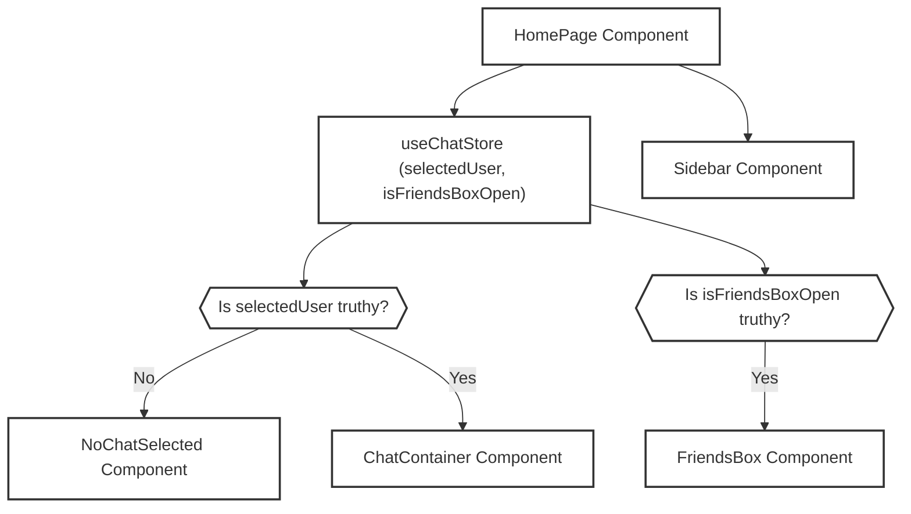
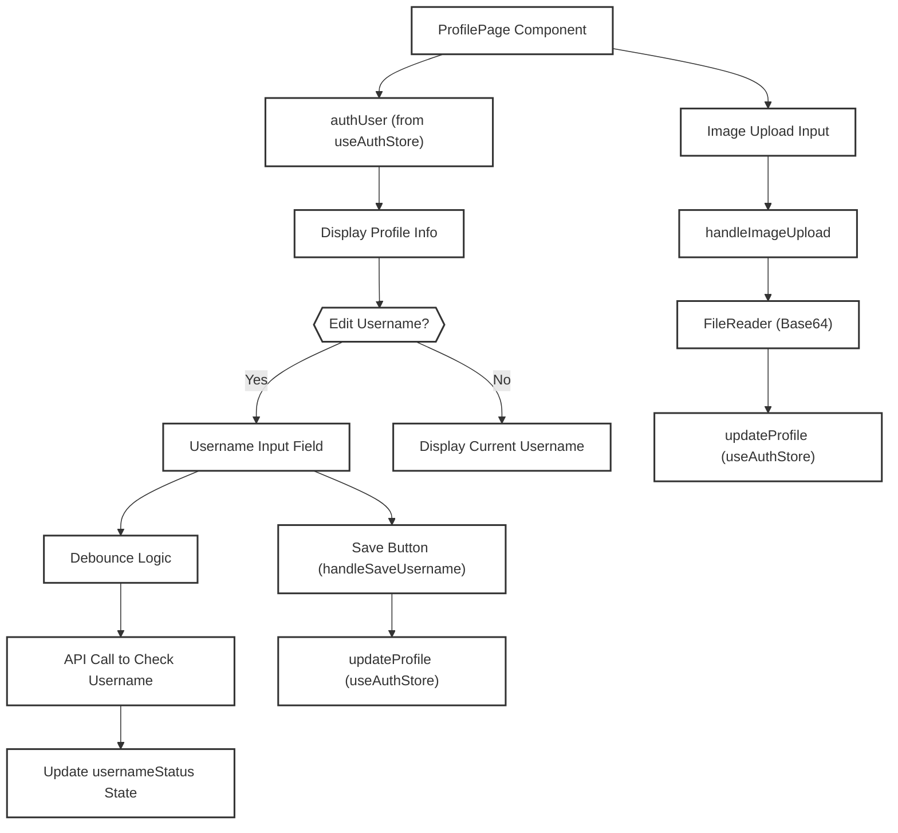

 # Page Views and Routing

This section details the primary user-facing pages within the chat application's frontend. Each page serves a distinct purpose, from user authentication to the core chat experience and profile management. We will explore their individual responsibilities, the key components they utilize, and how they contribute to the overall user navigation flow.

The relevant files for this section are:
- `frontend/src/pages/HomePage.jsx`
- `frontend/src/pages/LoginPage.jsx`
- `frontend/src/pages/ProfilePage.jsx`
- `frontend/src/pages/SignUpPage.jsx`

## Application Pages Overview

The application utilizes a set of dedicated pages to manage different user interactions and states. These pages are built using React and leverage Zustand for state management and React Router for navigation.

### Home Page (`HomePage.jsx`)

The `HomePage` serves as the central hub for the authenticated user's chat experience. It orchestrates the display of the chat sidebar, the main chat area (either an active conversation or a "no chat selected" prompt), and a dynamic friends list.

**Responsibilities:**
- Display the main application layout.
- Render `Sidebar` for navigation and contact lists.
- Conditionally render `ChatContainer` (if a user is selected) or `NoChatSelected` (if no chat is active).
- Conditionally render `FriendsBox` to manage friend requests and online status.

**Key Components & State Management:**
The page relies heavily on the `useChatStore` Zustand store to manage the application's chat-related state, specifically `selectedUser` to determine which chat to display and `isFriendsBoxOpen` to control the visibility of the `FriendsBox`.

<br />

```jsx showLineNumbers
// frontend/src/pages/HomePage.jsx
import ChatContainer from "../components/ChatContainer";
import FriendsBox from "../components/FriendsBox";
import NoChatSelected from "../components/NoChatSelected";
import Sidebar from "../components/Sidebar";
import { useChatStore } from "../store/useChatStore"

const HomePage = () => {
  const { selectedUser } = useChatStore();
  const { isFriendsBoxOpen } = useChatStore();
  return (
      <div className="h-screen bg-base-200">
      <div className="flex items-center justify-center pt-20 px-4 w-full">
        <div className="bg-base-100 rounded-lg shadow-xl w-full max-w-6xl h-[calc(100vh-8rem)]">
          <div className="flex h-full rounded-lg overflow-hidden w-full">
            <Sidebar />
            {!selectedUser ? <NoChatSelected /> : <ChatContainer />} {/* Conditional rendering */}
            {isFriendsBoxOpen && <FriendsBox />} {/* Conditional rendering */}
          </div>
        </div>
      </div>
    </div>
  )
}

export default HomePage
```
_View on GitHub: [HomePage.jsx](https://github.com/shinymack/Chat-App-MERN/blob/main/frontend/src/pages/HomePage.jsx)_

The conditional rendering (`{!selectedUser ? ... : ...}` and `{isFriendsBoxOpen && ...}`) ensures that the user interface adapts dynamically to the current chat state, providing a responsive and intuitive experience.

<br />





_Mermaid Diagram: HomePage Rendering Flow_

### Login Page (`LoginPage.jsx`)

The `LoginPage` facilitates user authentication, allowing existing users to sign in to their accounts using either email/password credentials or Google OAuth.

**Responsibilities:**
- Provide a form for email and password input.
- Handle form submission and trigger the `login` action.
- Offer a "Sign in with Google" option, redirecting to the backend's OAuth endpoint.
- Include a link to the `SignUpPage` for new users.
- Manage password visibility toggle.

**Authentication Flow:**
The page integrates with `useAuthStore` to handle the `login` process. The `handleSubmit` function prevents default form submission and dispatches the `login` action with the user's credentials. The Google OAuth flow is initiated by a direct link to the backend's `/api/auth/google` endpoint.

<br />

```jsx showLineNumbers
// frontend/src/pages/LoginPage.jsx
// ... (imports) ...
const LoginPage = () => {
  const [showPassword, setShowPassword] = useState(false);
  const [formData, setFormData] = useState({
    email: "",
    password: "",
  })
  const { login, isLoggingIn } = useAuthStore();

  const handleSubmit = async (e) => {
    e.preventDefault();
    login(formData); // Dispatches login action from Zustand store
  }
  const backendDomain = import.meta.env.VITE_BACKEND_URL;
  const googleAuthUrl = `${backendDomain}/api/auth/google`; // Google OAuth URL
  return (
    <div className="h-screen grid lg:grid-cols-2">
      {/* Left Side - Form */}
      <div className="flex flex-col justify-center items-center p-6 sm:p-12">
        {/* ... (logo and welcome message) ... */}
          <form onSubmit={handleSubmit} className="space-y-6">
            {/* ... (email and password input fields) ... */}
            <button type="submit" className="btn btn-primary w-full" disabled={isLoggingIn}>
              {isLoggingIn ? (
                <>
                  <Loader2 className="h-5 w-5 animate-spin" />
                  Loading...
                </>
              ) : (
                "Sign in"
              )}
            </button>
          </form>
          <div className="divider text-base-content/60 my-4">OR</div>
          <a
            href={googleAuthUrl} // Link to your backend Google auth route
            className="btn btn-primary btn-outline w-full"
          >
            <FcGoogle className="size-5 mr-2" />
            Sign in with Google
          </a>
          <div className="text-center">
            <p className="text-base-content/60">
              Don&apos;t have an account?{" "}
              <Link to="/signup" className="link link-primary">
                Create account
              </Link>
            </p>
          </div>
        </div>
      </div>
      <AuthImagePattern
        title={"Welcome back!"}
        subtitle={"Sign in to continue your conversations and catch up with your messages."}
      />
    </div>
  )
}

export default LoginPage
```
_View on GitHub: [LoginPage.jsx](https://github.com/shinymack/Chat-App-MERN/blob/main/frontend/src/pages/LoginPage.jsx)_

### Profile Page (`ProfilePage.jsx`)

The `ProfilePage` allows authenticated users to view and update their profile information, including their profile picture and username.

**Responsibilities:**
- Display the user's current profile picture, username, email, and account creation date.
- Allow users to upload a new profile picture.
- Enable editing of the username with real-time availability checks.
- Integrate with `useAuthStore` for profile updates.

**Profile Update Logic:**
The page uses `useAuthStore` to access `authUser` data and dispatch `updateProfile` actions. Profile picture updates involve reading the file as a Data URL and then sending it to the backend. Username editing includes a debounced check for username availability via `axiosInstance` to prevent frequent API calls while typing.

<br />

```jsx showLineNumbers
// frontend/src/pages/ProfilePage.jsx
// ... (imports) ...
const ProfilePage = () => {
	const { authUser, isUpdatingProfile, updateProfile } = useAuthStore();
	const [selectedImg, setSelectedImg] = useState(null);
	const [isEditingUsername, setIsEditingUsername] = useState(false);
	const [newUsername, setNewUsername] = useState(authUser?.username || "");
	const [usernameStatus, setUsernameStatus] = useState({
		checking: false,
		available: true,
		message: "",
	});
	const debounceTimeout = useRef(null);

	const handleImageUpload = async (e) => {
		const file = e.target.files[0];
		if (!file) return;

		const reader = new FileReader();
		reader.readAsDataURL(file);

		reader.onload = async () => {
			const base64Image = reader.result;
			setSelectedImg(base64Image);
			await updateProfile({ profilePic: base64Image }); // Update profile picture
		};
	};

	// --- Debounced Username Check ---
	useEffect(() => {
        // ... (debounce logic for username check) ...
	}, [newUsername, authUser.username]);
	// ---------------------------------

	const handleSaveUsername = async () => {
		if (!usernameStatus.available || newUsername === authUser.username) {
			toast.error("Cannot save. Username is either unavailable or unchanged.");
			return;
		}
		await updateProfile({ username: newUsername }); // Update username
		setIsEditingUsername(false);
	};
    // ... (rendering logic for profile details and edit forms) ...
};
export default ProfilePage;
```
_View on GitHub: [ProfilePage.jsx](https://github.com/shinymack/Chat-App-MERN/blob/main/frontend/src/pages/ProfilePage.jsx)_

The `ProfilePage` demonstrates sophisticated UI/UX for user profile management, including immediate visual feedback for image uploads and debounced validation for username changes.

<br />





_Mermaid Diagram: Profile Page Update Flow_

### Sign Up Page (`SignUpPage.jsx`)

The `SignUpPage` enables new users to create an account by providing a username, email, and password. It also offers a Google OAuth option for expedited registration.

**Responsibilities:**
- Provide a form for username, email, and password input.
- Validate form data before submission.
- Trigger the `signup` action via `useAuthStore`.
- Offer a "Sign up with Google" option.
- Include a link to the `LoginPage` for existing users.

**Validation and Registration:**
The `validateForm` function performs client-side validation for required fields, email format, and password strength. Upon successful validation, the `handleSubmit` function calls the `signup` action from `useAuthStore`, which handles the API request to register the new user.

<br />

```jsx showLineNumbers
// frontend/src/pages/SignUpPage.jsx
// ... (imports) ...
const SignUpPage = () => {
  const [showPassword, setShowPassword] = useState(false);
  const [formData, setFormData] = useState({
    username: "",
    email: "",
    password: "",
  });

  const { signup, IsSigningUp } = useAuthStore();

  const validateForm = () => {
    if(!formData.username.trim()) return toast.error("Username is required");
    if(!formData.email.trim()) return toast.error("Email is required");
    if (!/\S+@\S+\.\S+/.test(formData.email)) return toast.error("Invalid email format");
    if (!formData.password) return toast.error("Password is required");
    if (formData.password.length < 6) return toast.error("Password must be at least 6 characters");

    return true;
  };

  const handleSubmit = (e) => {
    e.preventDefault();

    const success = validateForm();
    if(success===true) signup(formData); // Dispatches signup action from Zustand store
  };
  
  const backendDomain = import.meta.env.VITE_BACKEND_URL;
  const googleAuthUrl = `${backendDomain}/api/auth/google`;
  return (
    <div className="min-h-screen grid lg:grid-cols-2">
      {/* ... (left side form) ... */}
          <form onSubmit={handleSubmit} className="space-y-6">
            {/* ... (username, email, password input fields) ... */}
            <button type="submit" className="btn btn-primary w-full" disabled={IsSigningUp}>
              {IsSigningUp ? (
                <>
                  <Loader2 className="size-5 animate-spin" />
                  Loading...
                </>
              ) : (
                "Create Account"
              )}
            </button>
          </form>
          <div className="divider text-base-content/60 my-4">OR</div>
          <a
            href={googleAuthUrl} // Link to your backend Google auth route
            className="btn btn-primary btn-outline w-full" 
          >
            <FcGoogle className="size-5 mr-2" /> 
            Sign up with Google
          </a>
          <div className="text-center">
            <p className="text-base-content/60">
              Already have an account?{" "}
              <Link to="/login" className="link link-primary">
                Sign in
              </Link>
            </p>
          </div>
        </div>
      </div>
      <AuthImagePattern
        title="Join our community"
        subtitle="Connect with friends, share moments, and stay in touch with your loved ones."
      />
    </div>
  );
};
export default SignUpPage;
```
_View on GitHub: [SignUpPage.jsx](https://github.com/shinymack/Chat-App-MERN/blob/main/frontend/src/pages/SignUpPage.jsx)_

## Key Integration Points

### Authentication State Management
Both `LoginPage` and `SignUpPage` critically rely on the `useAuthStore` (Zustand) for managing user authentication state, including `authUser`, `isLoggingIn`, `IsSigningUp`, and dispatching `login` and `signup` actions. This centralized state management ensures a consistent authentication experience across the application.

<br />

```jsx showLineNumbers
// frontend/src/store/useAuthStore.js (conceptual snippet)
import { create } from 'zustand';
import { axiosInstance } from '../lib/axios';

export const useAuthStore = create((set) => ({
  authUser: JSON.parse(localStorage.getItem('chat-app-user')) || null,
  isLoggingIn: false,
  IsSigningUp: false,
  // ... (other states) ...

  login: async (formData) => {
    set({ isLoggingIn: true });
    try {
      const res = await axiosInstance.post('/auth/login', formData);
      const user = res.data;
      localStorage.setItem('chat-app-user', JSON.stringify(user));
      set({ authUser: user });
    } catch (error) {
      // ... (error handling) ...
    } finally {
      set({ isLoggingIn: false });
    }
  },

  signup: async (formData) => {
    set({ IsSigningUp: true });
    try {
      const res = await axiosInstance.post('/auth/signup', formData);
      const user = res.data;
      localStorage.setItem('chat-app-user', JSON.stringify(user));
      set({ authUser: user });
    } catch (error) {
      // ... (error handling) ...
    } finally {
      set({ IsSigningUp: false });
    }
  },
  // ... (updateProfile, logout, etc.) ...
}));
```
_View on GitHub: [useAuthStore.js](https://github.com/shinymack/Chat-App-MERN/blob/main/frontend/src/store/useAuthStore.js)_

### Routing
React Router is used to manage navigation between these pages. The main application router typically renders `LoginPage` or `SignUpPage` for unauthenticated users and `HomePage` or `ProfilePage` for authenticated users, often using protected routes.

### API Communication
All authentication and profile update operations involve communicating with the backend API via `axiosInstance`. The `VITE_BACKEND_URL` environment variable is crucial for configuring the correct backend endpoint for both form submissions and Google OAuth redirects.

<br />

```jsx showLineNumbers
// frontend/src/lib/axios.js (conceptual snippet)
import axios from 'axios';

export const axiosInstance = axios.create({
    baseURL: import.meta.env.VITE_BACKEND_URL,
    withCredentials: true, // Important for sending cookies/session info
});

// Optional: Add interceptors for error handling or token refresh
axiosInstance.interceptors.response.use(
    (response) => response,
    (error) => {
        // ... (error handling logic) ...
        return Promise.reject(error);
    }
);
```
_View on GitHub: [axios.js](https://github.com/shinymack/Chat-App-MERN/blob/main/frontend/src/lib/axios.js)_

### Shared Components
Components like `AuthImagePattern` are reused across `LoginPage` and `SignUpPage` to maintain a consistent visual theme for authentication pages. This reduces code duplication and ensures design consistency.

## Navigation Flow

The overall navigation flow is designed to guide users through authentication and then into the core application experience.

- **Unauthenticated User:** Can navigate between `/login` and `/signup`.
- **Authenticated User:** Redirected to `/` (HomePage) upon successful login/signup. Can then navigate to `/profile`. Accessing `/login` or `/signup` while authenticated typically redirects back to `/`.

This modular page structure, combined with robust state management and clear navigation, forms the backbone of the application's user interface.

Next: [Styling and Theming](./3.4_styling-and-theming.mdx)