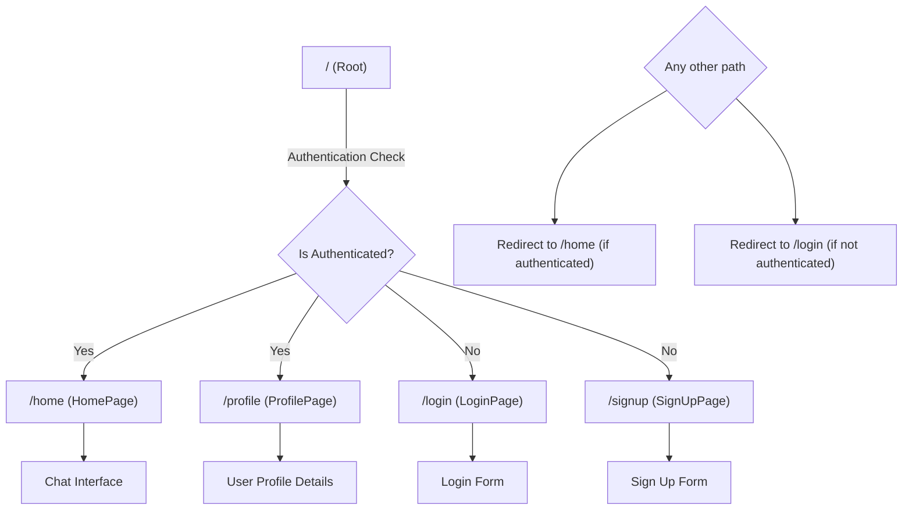

 # Pages and Routing

The DeepChat application's frontend is structured around a set of distinct pages, each serving a specific user interaction or information display purpose. Routing is handled by `react-router-dom`, ensuring smooth navigation between these pages without full page reloads. This section details the primary pages, their components, and the overall routing logic that ties them together.

## Application Pages

The core of the DeepChat user experience is delivered through several key pages:

### Home Page (`HomePage.jsx`)

The `HomePage` is the central hub for authenticated users, displaying the main chat interface. It conditionally renders either a `ChatContainer` when a user is selected for chat or a `NoChatSelected` component otherwise. It also integrates `Sidebar` for navigation and `FriendsBox` for managing contacts.

```jsx filename="frontend/src/pages/HomePage.jsx" {13-16}
// frontend/src/pages/HomePage.jsx
import ChatContainer from "../components/ChatContainer";
import FriendsBox from "../components/FriendsBox";
import NoChatSelected from "../components/NoChatSelected";
import Sidebar from "../components/Sidebar";
import { useChatStore } from "../store/useChatStore"

const HomePage = () => {
  const { selectedUser } = useChatStore();
  const { isFriendsBoxOpen } = useChatStore();
  return (
      <div className="h-screen bg-base-200">
          <Sidebar />
          {!selectedUser ? <NoChatSelected /> : <ChatContainer />}
          {isFriendsBoxOpen && <FriendsBox />}
      </div>
  )
}
export default HomePage
```

The snippet above showcases the conditional rendering logic within the `HomePage`. If `selectedUser` from the `useChatStore` is null, `NoChatSelected` is displayed, prompting the user to select a chat. Otherwise, the `ChatContainer` is rendered, showing the active conversation. The `FriendsBox` is also conditionally rendered based on `isFriendsBoxOpen`.
[View on GitHub](https://github.com/shinymack/Chat-App-MERN/blob/main/frontend/src/pages/HomePage.jsx#L13-L16)

### Login Page (`LoginPage.jsx`)

The `LoginPage` provides the interface for existing users to sign in to their accounts. It handles email/password authentication and also integrates Google OAuth for alternative sign-in. The page uses `useAuthStore` to manage authentication state and actions.

```jsx filename="frontend/src/pages/LoginPage.jsx" {22-26}
// frontend/src/pages/LoginPage.jsx
import { useState } from "react"
import { useAuthStore } from "../store/useAuthStore";
import { Eye, EyeOff, Loader2, Lock, Mail, MessageSquare } from "lucide-react";
import { Link } from "react-router-dom";
// ... other imports ...

const LoginPage = () => {
  const [showPassword, setShowPassword] = useState(false);
  const [formData, setFormData] = useState({
    email: "",
    password: "",
  })
  const { login, isLoggingIn } = useAuthStore();

  const handleSubmit = async (e) => {
    e.preventDefault();
    login(formData); // Initiates the login process via AuthStore
  }
  const backendDomain = import.meta.env.VITE_BACKEND_URL;
  const googleAuthUrl = `${backendDomain}/api/auth/google`; // Google OAuth endpoint
  return (
    <div className="h-screen grid lg:grid-cols-2">
      {/* Left Side - Form */}
      <div className="flex flex-col justify-center items-center p-6 sm:p-12">
        {/* ... form content ... */}
          <a
            href={googleAuthUrl}
            className="btn btn-primary btn-outline w-full"
          >
            <FcGoogle className="size-5 mr-2" />
            Sign in with Google
          </a>
          <div className="text-center">
            <p className="text-base-content/60">
              Don&apos;t have an account?{" "}
              <Link to="/signup" className="link link-primary">
                Create account
              </Link>
            </p>
          </div>
        </div>
      </div>
      <AuthImagePattern /* ... */ />
    </div>
  )
}
export default LoginPage
```

The `LoginPage` demonstrates a typical login form setup, using `useState` to manage form data and password visibility. The `handleSubmit` function triggers the `login` action from the `useAuthStore`. Additionally, it provides a "Sign in with Google" option, linking directly to the backend's Google authentication endpoint. Users can also navigate to the `SignUpPage` using a `Link` component.
[View on GitHub](https://github.com/shinymack/Chat-App-MERN/blob/main/frontend/src/pages/LoginPage.jsx#L22-L26)

### Sign Up Page (`SignUpPage.jsx`)

The `SignUpPage` allows new users to create an account by providing a username, email, and password. Similar to the `LoginPage`, it integrates with `useAuthStore` for registration logic and offers Google OAuth for streamlined sign-up.

```jsx filename="frontend/src/pages/SignUpPage.jsx" {17-21}
// frontend/src/pages/SignUpPage.jsx
import { useState } from "react";
import { useAuthStore } from "../store/useAuthStore";
import { MessageSquare, User, Mail, Lock, EyeOff, Eye, Loader2 } from "lucide-react";
import { Link } from "react-router-dom";
import AuthImagePattern from "../components/AuthImagePattern";
import toast from "react-hot-toast";
import { FcGoogle } from "react-icons/fc";

const SignUpPage = () => {
  const [showPassword, setShowPassword] = useState(false);
  const [formData, setFormData] = useState({
    username: "",
    email: "",
    password: "",
  });

  const { signup, IsSigningUp } = useAuthStore(); // AuthStore for signup

  const validateForm = () => {
    // ... validation logic ...
    return true;
  };

  const handleSubmit = (e) => {
    e.preventDefault();
    const success = validateForm();
    if(success===true) signup(formData); // Initiates the signup process
  };
  
  const backendDomain = import.meta.env.VITE_BACKEND_URL;
  const googleAuthUrl = `${backendDomain}/api/auth/google`; // Google OAuth endpoint
  return (
    <div className="min-h-screen grid lg:grid-cols-2">
      {/* ... form content ... */}
          <a
            href={googleAuthUrl} // Link to your backend Google auth route
            className="btn btn-primary btn-outline w-full" 
          >
            <FcGoogle className="size-5 mr-2" /> 
            Sign up with Google
          </a>

          <div className="text-center">
            <p className="text-base-content/60">
              Already have an account?{" "}
              <Link to="/login" className="link link-primary">
                Sign in
              </Link>
            </p>
          </div>
        </div>
      </div>
      <AuthImagePattern /* ... */ />
    </div>
  );
};
export default SignUpPage;
```

This snippet highlights the `signup` function from `useAuthStore` being called upon form submission after validation. It also includes the Google sign-up option, directing to the same Google OAuth endpoint as the login page, but initiating a registration flow. A `Link` to the `LoginPage` is provided for users who already have an account.
[View on GitHub](https://github.com/shinymack/Chat-App-MERN/blob/main/frontend/src/pages/SignUpPage.jsx#L17-L21)

### Profile Page (`ProfilePage.jsx`)

The `ProfilePage` displays the authenticated user's profile information, including username, email, and profile picture. It allows users to update their profile picture and username, with real-time validation for username availability.

```jsx filename="frontend/src/pages/ProfilePage.jsx" {34-40}
// frontend/src/pages/ProfilePage.jsx
import { useState, useEffect, useRef } from "react";
import { useAuthStore } from "../store/useAuthStore";
import { Camera, Mail, User, Edit, Save, X, Loader2 } from "lucide-react";
import toast from "react-hot-toast";
import { axiosInstance } from "../lib/axios";

const ProfilePage = () => {
	const { authUser, isUpdatingProfile, updateProfile } = useAuthStore();
	const [selectedImg, setSelectedImg] = useState(null);
	const [isEditingUsername, setIsEditingUsername] = useState(false);
	const [newUsername, setNewUsername] = useState(authUser?.username || "");
	const [usernameStatus, setUsernameStatus] = useState({
		checking: false,
		available: true,
		message: "",
	});
	const debounceTimeout = useRef(null);

	const handleImageUpload = async (e) => {
		const file = e.target.files[0];
		if (!file) return;

		const reader = new FileReader();
		reader.readAsDataURL(file);

		reader.onload = async () => {
			const base64Image = reader.result;
			setSelectedImg(base64Image);
			await updateProfile({ profilePic: base64Image }); // Update profile picture
		};
	};

	// --- Debounced Username Check ---
	useEffect(() => {
		clearTimeout(debounceTimeout.current);

		if (!newUsername.trim() || newUsername.trim().length < 3) {
			setUsernameStatus({ checking: false, available: false, message: "Must be 3+ characters." });
			return;
		}
		// ... more username validation/check logic ...
    }, [newUsername, authUser.username]);

	const handleSaveUsername = async () => { /* ... */ };
	const handleCancelEdit = () => { /* ... */ };

	return (
		<div className="h-screen pt-20">
			<div className="max-w-2xl mx-auto p-4 py-8">
				<div className="bg-base-300 rounded-xl p-6 space-y-8">
					{/* ... profile picture upload ... */}
					<div className="space-y-6">
						<div className="space-y-1.5">
							<div className="text-sm text-zinc-400 flex items-center gap-2">
								<User className="w-4 h-4" />
								Username
							</div>
							{!isEditingUsername ? (
								<div className="flex items-center gap-2">
									<p className="px-4 py-2.5 bg-base-200 rounded-lg border flex-grow">
										{authUser?.username}
									</p>
									<button onClick={() => setIsEditingUsername(true)} className="btn btn-ghost btn-sm">
										<Edit className="w-4 h-4" />
									</button>
								</div>
							) : (
								<div className="space-y-2">
									<div className="flex items-center gap-2">
										<input
											type="text"
											value={newUsername}
											onChange={(e) => setNewUsername(e.target.value.toLowerCase())}
											className="input input-bordered w-full"
										/>
										<button onClick={handleSaveUsername} className="btn btn-success btn-sm" disabled={!usernameStatus.available || usernameStatus.checking || isUpdatingProfile}>
											{isUpdatingProfile ? <Loader2 className="w-4 h-4 animate-spin" /> : <Save className="w-4 h-4" />}
										</button>
										<button onClick={handleCancelEdit} className="btn btn-error btn-sm">
											<X className="w-4 h-4" />
										</button>
									</div>
									<div className={`text-xs h-4 ${usernameStatus.available ? 'text-green-500' : 'text-error'}`}>
										{usernameStatus.checking ? <Loader2 className="w-3 h-3 animate-spin inline-block mr-1" /> : null}
										{usernameStatus.message}
									</div>
								</div>
							)}
						</div>
						{/* ... email display ... */}
					</div>
					{/* ... account info ... */}
				</div>
			</div>
		</div>
	);
};
export default ProfilePage;
```

This extensive snippet from `ProfilePage.jsx` illustrates the dynamic editing of the username. When `isEditingUsername` is true, an input field appears with save and cancel buttons. A `useEffect` hook, combined with `useRef` for debouncing, continuously checks the availability of the `newUsername` against the backend, providing real-time feedback to the user. The `updateProfile` action from `useAuthStore` handles the API call to save changes.
[View on GitHub](https://github.com/shinymack/Chat-App-MERN/blob/main/frontend/src/pages/ProfilePage.jsx#L34-L40)

## Routing Structure

The application's routing is managed by `react-router-dom`, typically configured in `frontend/src/App.jsx` or a similar main routing file. It ensures that only authenticated users can access private routes like the `HomePage` and `ProfilePage`, while unauthenticated users are directed to authentication pages.





This graph illustrates the primary routing logic based on user authentication status. The root path performs an authentication check, directing users to either the `HomePage` (and other protected routes) or the `LoginPage`/`SignUpPage`.

## Key Integration Points

### Authentication Flow

The authentication pages (`LoginPage`, `SignUpPage`) are tightly integrated with the `useAuthStore` Zustand store. This store manages user authentication state, including `authUser`, `isLoggingIn`, `IsSigningUp`, and `isUpdatingProfile`, along with actions like `login`, `signup`, and `updateProfile`. Upon successful authentication, the `react-router-dom` `navigate` function redirects the user to the `HomePage`. Conversely, if an authenticated user attempts to access `/login` or `/signup`, they are typically redirected to `/home`.


```mermaid
sequenceDiagram
    participant AppRouter as "App Router"
    participant Client as "Client Browser"
    participant AuthStore as "Auth Store (Zustand)"
    participant BackendAPI as "Backend API"

    Client->>+AppRouter: Accesses "/home" or "/profile"
    AppRouter->>AuthStore: Check authUser state
    alt User is NOT authenticated
        AuthStore ->>- AppRouter: No authUser present
        AppRouter->>+Client: Redirect to "/login"
        Client->>+LoginPage: Load LoginPage
        LoginPage->>AuthStore: Calls login(formData)
        AuthStore->>+BackendAPI: "POST /auth/login"
        BackendAPI->>-AuthStore: "Success Response + User Data"
        AuthStore->>Client: Update authUser, localStorage
        LoginPage->>+AppRouter: Redirect to "/home"
        AppRouter->>Client: Load HomePage (now authenticated)
    else User is authenticated
        AuthStore ->>- AppRouter: authUser present
        AppRouter->>Client: Load HomePage/ProfilePage
    end
```


This sequence diagram illustrates the core authentication flow. An unauthenticated user attempting to access a protected route is redirected to the `LoginPage`. Upon successful login, the `AuthStore` is updated, and the user is redirected to the `HomePage`.

### Profile Management

The `ProfilePage` leverages the `updateProfile` action from `useAuthStore` to manage changes to the user's profile picture and username. The process for updating the username involves a debounced API call to `axiosInstance.get(/auth/username/check/${newUsername})` to ensure the new username is unique and valid before allowing the user to save. Profile picture updates involve client-side file reading to convert the image to a base64 string, which is then sent to the backend via `updateProfile`. These operations update the global `authUser` state, ensuring consistency across the application.