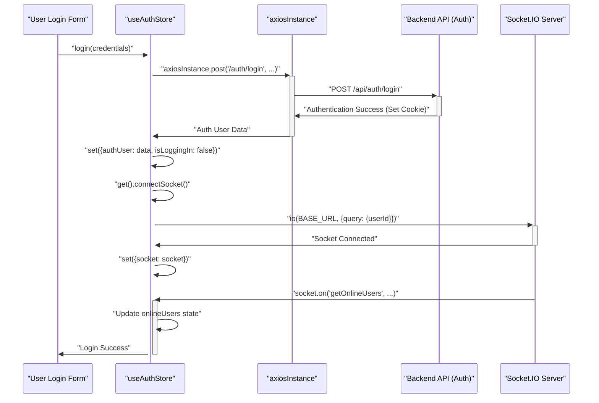
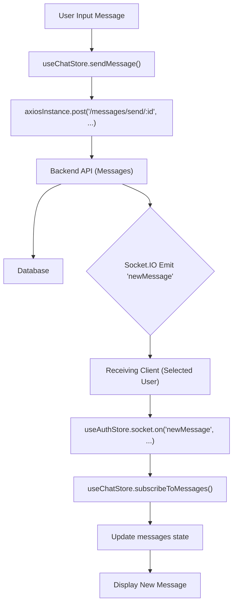

 # State Management and Utilities

The frontend application leverages a robust state management system using [Zustand](https://docs.pmnd.rs/zustand/getting-started/introduction) for global state and a set of utility functions to handle common client-side tasks. This section details the core components responsible for managing authentication, chat features, API interactions, and general-purpose helpers.

## API Client Configuration

The `axiosInstance` module provides a pre-configured Axios client, centralizing all API requests and ensuring consistent settings like the base URL and credential handling.

### `frontend/src/lib/axios.js`

This file exports a single `axiosInstance` configured to interact with the backend API. It dynamically sets the `baseURL` based on the environment (development or production) and ensures that `withCredentials` is enabled for handling HTTP-only cookies, which are crucial for authentication.

```javascript
// frontend/src/lib/axios.js
import axios from "axios";

export const axiosInstance = axios.create({
    baseURL: import.meta.env.MODE == "development" ? "http://localhost:5001/api": "/api",
    withCredentials: true,
});
```

This setup means all authenticated API requests automatically send and receive cookies, simplifying session management. [View on GitHub](https://github.com/shinymack/Chat-App-MERN/blob/main/frontend/src/lib/axios.js)

## Client-Side Utility Functions

The `utils.js` file contains a collection of helper functions designed to perform common client-side operations, making the codebase cleaner and more maintainable.

### `frontend/src/lib/utils.js`

Currently, this file includes `formatMessageTime`, a utility for formatting `Date` objects into a readable time string, ideal for displaying message timestamps.

```javascript
// frontend/src/lib/utils.js
export function formatMessageTime(date) {
    return new Date(date).toLocaleTimeString("en-US", {
        year: "numeric",
        month: "short",
        day:"2-digit",
        hour: "2-digit",
        minute: "2-digit",
        hour12: true,
    });
}
```

This function ensures consistent date and time formatting across the application, enhancing user experience. [View on GitHub](https://github.com/shinymack/Chat-App-MERN/blob/main/frontend/src/lib/utils.js)

## Authentication State Management

The `useAuthStore` manages all authentication-related state, including the authenticated user, online users, and various loading states for auth operations. It also handles Socket.IO connections for real-time online status updates.

### `frontend/src/store/useAuthStore.js`

This Zustand store centralizes user authentication logic. It holds the `authUser` object, `onlineUsers` array, and the `socket` instance. It provides actions for `checkAuth`, `signup`, `login`, `logout`, `updateProfile`, and crucially, `connectSocket` and `disconnectSocket`.

```javascript
// frontend/src/store/useAuthStore.js
import { create } from "zustand";
import { axiosInstance } from "../lib/axios";
import toast from "react-hot-toast";
import { io } from "socket.io-client";

const BASE_URL = import.meta.env.MODE == "development" ? "http://localhost:5001": "/";

export const useAuthStore = create((set, get) => ({
    authUser: null,
    isSigningUp: false,
    isLoggingIn: false,
    isUpdatingProfile: false,
    isCheckingAuth: true,
    onlineUsers: [],
    socket: null,

    checkAuth: async () => {
        // ... (truncated for brevity)
    },
    signup: async (data) => {
        // ... (truncated for brevity)
    },
    logout: async () => {
        // ... (truncated for brevity)
    },
    login: async (data) => {
        // ... (truncated for brevity)
    },
    updateProfile: async (data) => {
        // ... (truncated for brevity)
    },

    connectSocket: () => {
        const { authUser } = get();
        if(!authUser || get().socket?.connected) return;

        const socket = io(BASE_URL, {
            query: {
                userId : authUser._id,
            },
        });
        socket.connect();
        set({socket: socket});

        socket.on("getOnlineUsers", (userIds) => {
            set({onlineUsers: userIds})
        });
    },
    disconnectSocket : () => {
        if(get().socket?.connected) get().socket.disconnect();
    }
}));
```

The `checkAuth` action is typically called on application load to verify the user's session. Upon successful authentication (login, signup, or checkAuth), `connectSocket` is invoked to establish a WebSocket connection, enabling real-time features like tracking online users. The `getOnlineUsers` socket event updates the `onlineUsers` state. [View on GitHub](https://github.com/shinymack/Chat-App-MERN/blob/main/frontend/src/store/useAuthStore.js)

### Authentication Flow Diagram

This diagram illustrates the typical authentication and socket connection flow when a user logs in.





## Chat and Friend Management State

The `useChatStore` handles all state and logic related to messaging, friend lists, and friend requests.

### `frontend/src/store/useChatStore.js`

This Zustand store manages:
*   `messages` for the currently selected chat.
*   `users` (friends list).
*   `pendingRequests` (incoming friend requests).
*   `sentRequests` (outgoing friend requests).
*   `selectedUser` for the active chat.
*   Various loading states.
*   It provides actions for fetching, sending, and managing messages, as well as sending, accepting, rejecting, and removing friend requests.

```javascript
// frontend/src/store/useChatStore.js
import toast from "react-hot-toast";
import { create } from "zustand";
import { axiosInstance } from "../lib/axios";
import { useAuthStore } from "./useAuthStore";

export const useChatStore = create((set, get) => ({
    messages:[],
    users: [],
    pendingRequests: [],
    sentRequests: [],
    selectedUser: null,
    isUsersLoading: false,
    isMessagesLoading: false,
    isFriendBoxOpen: false,

    toggleFriendsBox: () => set(state => ({ isFriendsBoxOpen: !state.isFriendsBoxOpen })),

    getFriends: async () => { /* ... */ },
    getPendingRequests: async () => { /* ... */ },
    getSentRequests: async () => { /* ... */ },
    sendFriendRequest: async (identifier) => { /* ... */ },
    acceptFriendRequest: async (senderId) => { /* ... */ },
    rejectFriendRequest: async (senderId) => { /* ... */ },
    removeFriend: async (friendId) => { /* ... */ },

    getMessages: async (userId) => {
        set({isMessagesLoading: true});
        try {
            const res = await axiosInstance.get(`/messages/${userId}`);
            set({messages: res.data});
        } catch (error) {
            toast.error(error.response.data.message);
        } finally {
            set({isMessagesLoading: false});
        }
    },
    sendMessage: async (messageData) => {
        const {selectedUser, messages} = get();
        try {
            const res = await axiosInstance.post(`/messages/send/${selectedUser._id}`, messageData);
            set({messages : [...messages, res.data]});
        } catch (error){
            toast.error(error.response.data.message);
        }
    },

    subscribeToMessages: () => {
        const { selectedUser } = get();
        if(!selectedUser) return;

        const socket = useAuthStore.getState().socket;
        socket.on("newMessage", (newMessage) => {
            if(newMessage.senderId !== selectedUser._id) return
            set({
                messages: [...get().messages, newMessage]
            })
        })
    },

    unsubscribeFromMessages: () => {
        const socket = useAuthStore.getState().socket;
        socket.off("newMessage");
    },

    setSelectedUser: (selectedUser) => set({selectedUser})
}));
```

The `subscribeToMessages` and `unsubscribeFromMessages` actions integrate with the Socket.IO instance from `useAuthStore` to listen for new incoming messages in real-time. When a `newMessage` event is received for the `selectedUser`, the `messages` state is updated immediately. [View on GitHub](https://github.com/shinymack/Chat-App-MERN/blob/main/frontend/src/store/useChatStore.js)

### Chat Message Flow Diagram

This diagram illustrates the process of sending and receiving a chat message, highlighting the interaction between the client-side stores, the API, and the Socket.IO server.





## Key Integration Points

*   **Zustand for Global State**: Both `useAuthStore` and `useChatStore` are designed as global stores, providing easy access to shared state across different React components without prop drilling. The `get()` method within Zustand actions allows accessing the current state and other actions, facilitating complex state transitions and inter-store communication (e.g., `useChatStore` accessing `useAuthStore`'s socket).

*   **Axios Instance**: The `axiosInstance` is the backbone of all API communication, ensuring that requests are consistently handled with `baseURL` and `withCredentials`. This separation of concerns makes API calls concise and robust.

*   **Socket.IO for Real-time**: The integration of Socket.IO via `useAuthStore` for `onlineUsers` and `useChatStore` for `newMessage` events demonstrates a clear pattern for real-time functionality. The `connectSocket` and `disconnectSocket` actions ensure that WebSocket connections are managed alongside user authentication status.

*   **Toast Notifications**: `react-hot-toast` is used consistently across both stores to provide immediate user feedback for operations like login success, account creation, or API errors, significantly improving the user experience.

*   **Modular Design**: The separation of authentication, chat, API configuration, and utility functions into distinct modules (Zustand stores, `axios.js`, `utils.js`) promotes a clean, maintainable, and scalable architecture.