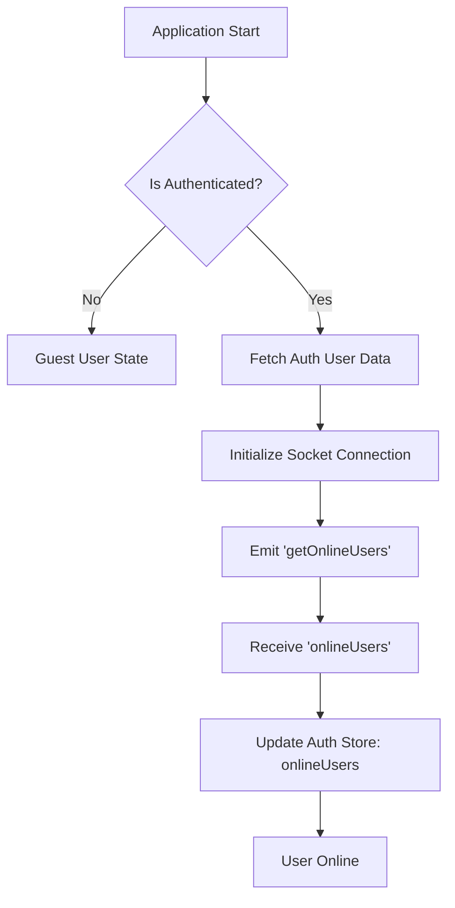
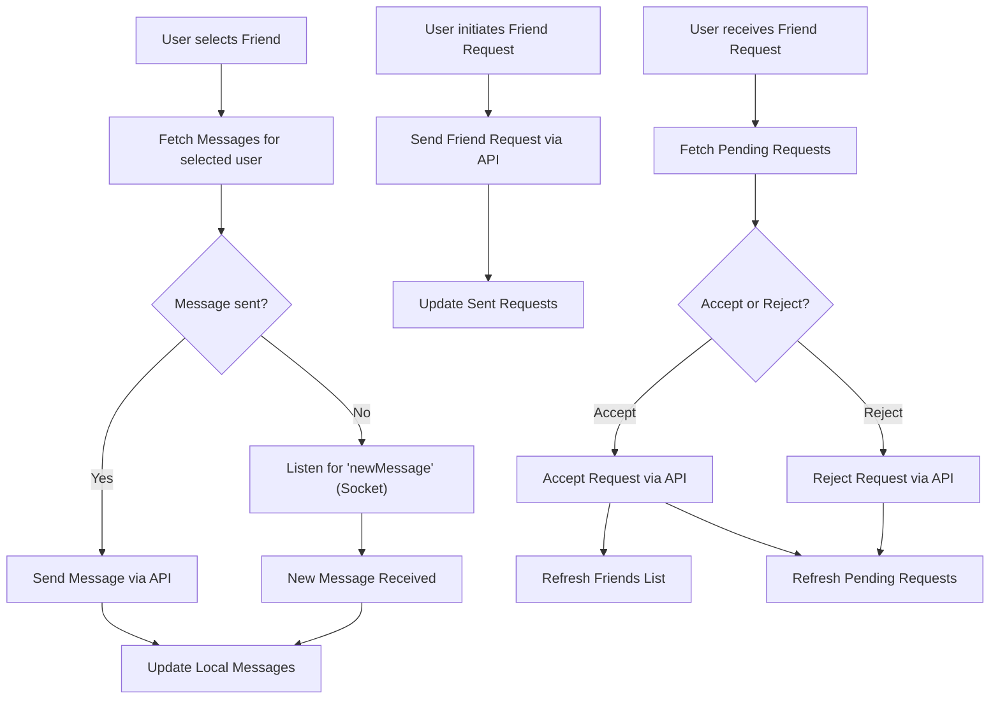

 # State Management and Utilities

This document outlines the approach to managing global application state and the collection of general utility functions used throughout the frontend. The application leverages `Zustand` for lightweight and flexible state management, ensuring a reactive user interface, and `Axios` for consistent API interactions.

## Global State Management with Zustand

The application utilizes Zustand, a small, fast, and scalable bear-necessities state management solution. It's chosen for its simplicity, hook-based API, and ability to manage complex global states without boilerplate.

### Authentication and User State (`useAuthStore`)

The `useAuthStore` manages all authentication-related state, including the currently authenticated user, authentication loading states, online users, and the WebSocket connection for real-time updates.

*   **File**: `frontend/src/store/useAuthStore.js`
*   **Purpose**: Handles user authentication, registration, profile updates, and manages the WebSocket connection for real-time user status.

#### Key State Variables

*   `authUser`: Stores the currently logged-in user object. `null` if not authenticated.
*   `isSigningUp`, `isLoggingIn`, `isUpdatingProfile`, `isCheckingAuth`: Boolean flags to indicate the loading status of various authentication operations.
*   `onlineUsers`: An array of user IDs representing currently online users.
*   `socket`: The WebSocket client instance used for real-time communication.

#### Core Actions

*   `checkAuth()`: Verifies the user's authentication status on application load. If authenticated, it fetches user data and establishes a WebSocket connection.
*   `signup(data)`: Registers a new user.
*   `login(data)`: Authenticates an existing user.
*   `logout()`: Clears the authenticated user state and disconnects the WebSocket.
*   `updateProfile(data)`: Updates the authenticated user's profile information.
*   `connectSocket()`: Initiates a WebSocket connection with the backend, sending the user's ID. This connection is used to receive `getOnlineUsers` updates.
*   `disconnectSocket()`: Terminates the active WebSocket connection.

#### Auth Flow and Socket Connection

The `useAuthStore` orchestrates the lifecycle of user authentication and their corresponding real-time presence. Upon successful login or initial authentication check, a WebSocket connection is established, allowing the application to receive updates on online users.





#### Snippet: Establishing Socket Connection

The `connectSocket` action demonstrates how the WebSocket client is initialized with the authenticated user's ID, which is crucial for the server to track online presence.

```javascript
// frontend/src/store/useAuthStore.js
import { io } from "socket.io-client";

const BASE_URL = import.meta.env.MODE == "development" ? "http://localhost:5001": "/";

export const useAuthStore = create((set, get) => ({
    // ... other state and actions
    connectSocket: () => {
        const { authUser } = get();
        if(!authUser || get().socket?.connected) return;

        const socket = io(BASE_URL, {
            query: {
                userId : authUser._id,
            },
        });
        socket.connect();
        set({socket: socket});

        socket.on("getOnlineUsers", (userIds) => {
            set({onlineUsers: userIds})
        });
    },
    // ...
}));
```
[View on GitHub](https://github.com/shinymack/Chat-App-MERN/blob/main/frontend/src/store/useAuthStore.js#L72-L91)

### Chat and Friend Management (`useChatStore`)

The `useChatStore` manages all chat-related functionalities, including messages, friend lists, friend requests, and selected chat partners.

*   **File**: `frontend/src/store/useChatStore.js`
*   **Purpose**: Manages chat messages, friends list, friend requests (pending/sent), and real-time message subscriptions.

#### Key State Variables

*   `messages`: An array of message objects for the currently selected chat.
*   `users`: An array of the authenticated user's friends.
*   `pendingRequests`: An array of incoming friend requests.
*   `sentRequests`: An array of outgoing friend requests.
*   `selectedUser`: The user object of the currently selected chat partner.
*   `isUsersLoading`, `isMessagesLoading`: Boolean flags for loading states.
*   `isFriendBoxOpen`: Controls the visibility of the friend management UI.

#### Core Actions

*   `toggleFriendsBox()`: Toggles the visibility of the friend management panel.
*   `getFriends()`: Fetches the list of the authenticated user's friends.
*   `getPendingRequests()`: Retrieves incoming friend requests.
*   `getSentRequests()`: Retrieves outgoing friend requests.
*   `sendFriendRequest(identifier)`: Sends a new friend request to another user.
*   `acceptFriendRequest(senderId)`: Accepts a pending friend request.
*   `rejectFriendRequest(senderId)`: Rejects a pending friend request.
*   `removeFriend(friendId)`: Removes an existing friend.
*   `getMessages(userId)`: Fetches chat messages for a specific user.
*   `sendMessage(messageData)`: Sends a new message to the `selectedUser`.
*   `subscribeToMessages()`: Sets up a listener for `newMessage` events from the WebSocket, updating the `messages` state.
*   `unsubscribeFromMessages()`: Cleans up the `newMessage` WebSocket listener.
*   `setSelectedUser(selectedUser)`: Sets the currently active chat partner.

#### Messaging and Friend Request Flow

The chat store handles the complete lifecycle of messaging and friend interactions, from sending requests to receiving messages in real-time.





#### Snippet: Real-time Message Subscription

The `subscribeToMessages` action demonstrates how the chat store interacts with the socket from `useAuthStore` to listen for new messages directed to the current user, updating the UI in real-time.

```javascript
// frontend/src/store/useChatStore.js
import { useAuthStore } from "./useAuthStore";

export const useChatStore = create((set, get) => ({
    // ... other state and actions
    subscribeToMessages: () => {
        const { selectedUser } = get();
        if(!selectedUser) return;

        // Access the socket instance from the Auth Store
        const socket = useAuthStore.getState().socket;
        socket.on("newMessage", (newMessage) => {
            // Only update if the message is from the currently selected user
            if(newMessage.senderId !== selectedUser._id) return
            set({
                messages: [...get().messages, newMessage]
            })
        })
    },

    unsubscribeFromMessages: () => {
        const socket = useAuthStore.getState().socket;
        socket.off("newMessage");
    },
    // ...
}));
```
[View on GitHub](https://github.com/shinymack/Chat-App-MERN/blob/main/frontend/src/store/useChatStore.js#L182-L199)

## Utility Functions

### Axios Instance (`lib/axios.js`)

A pre-configured Axios instance `axiosInstance` is used for all HTTP requests to the backend API. This centralizes configuration, such as the base URL and `withCredentials` settings, ensuring consistent behavior across all API calls.

*   **File**: `frontend/src/lib/axios.js`
*   **Purpose**: Provides a standardized Axios client for making API requests, automatically handling base URL and cookie credentials.

#### Snippet: Axios Instance Configuration

```javascript
// frontend/src/lib/axios.js
import axios from "axios";

export const axiosInstance = axios.create({
    baseURL: import.meta.env.MODE == "development" ? "http://localhost:5001/api": "/api",
    withCredentials: true, // Ensures cookies (like JWT) are sent with requests
});
```
[View on GitHub](https://github.com/shinymack/Chat-App-MERN/blob/main/frontend/src/lib/axios.js)

### General Utilities (`lib/utils.js`)

This file contains general-purpose utility functions that can be reused across different components or modules.

*   **File**: `frontend/src/lib/utils.js`
*   **Purpose**: Houses common helper functions to simplify repetitive tasks, such as date formatting.

#### Snippet: `formatMessageTime` Function

This utility function formats a given date into a human-readable time string, including year, month, day, hour, and minute.

```javascript
// frontend/src/lib/utils.js
export function formatMessageTime(date) {
    return new Date(date).toLocaleTimeString("en-US", {
        year: "numeric",
        month: "short",
        day:"2-digit",
        hour: "2-digit",
        minute: "2-digit",
        hour12: true,
    });
}
```
[View on GitHub](https://github.com/shinymack/Chat-App-MERN/blob/main/frontend/src/lib/utils.js)

## Key Integration Points

*   **Zustand Inter-Store Communication**: `useChatStore` directly accesses the `socket` instance from `useAuthStore` using `useAuthStore.getState().socket`. This pattern allows stores to share relevant global state without creating circular dependencies or overly complex prop drilling.
*   **Centralized API Calls**: All API interactions leverage the `axiosInstance` from `frontend/src/lib/axios.js`, ensuring that requests are always sent with the correct base URL and credentials. This consistency is vital for security and maintainability.
*   **Real-time Updates**: The `socket` managed by `useAuthStore` is the backbone for real-time features. `useChatStore` subscribes to `newMessage` events, and `useAuthStore` handles `getOnlineUsers`, demonstrating a clear division of concerns while maintaining real-time capabilities.
*   **Error Handling and User Feedback**: Both `useAuthStore` and `useChatStore` extensively use `react-hot-toast` to provide immediate and clear feedback to the user on the success or failure of various operations, improving the user experience.