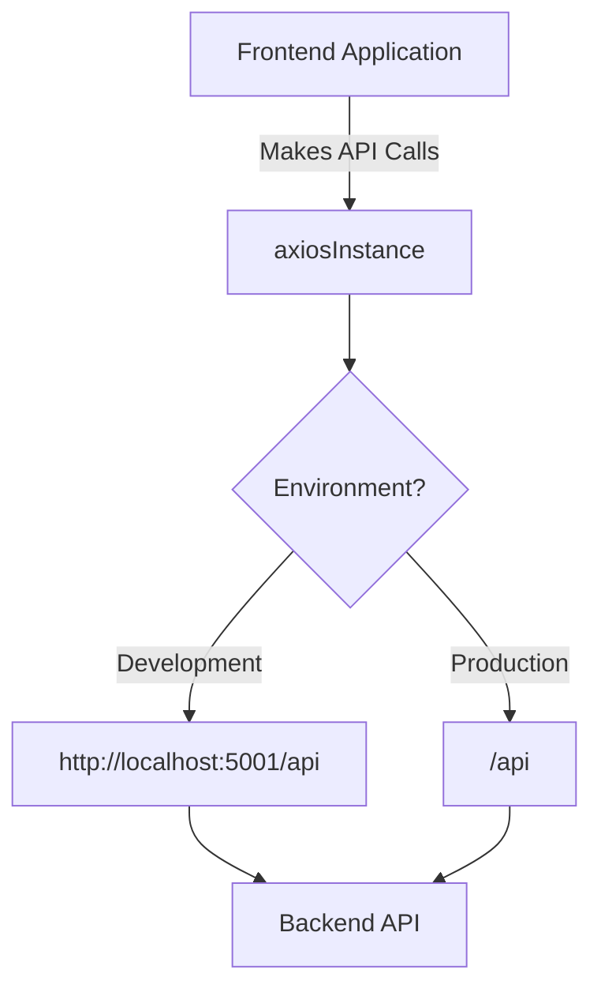
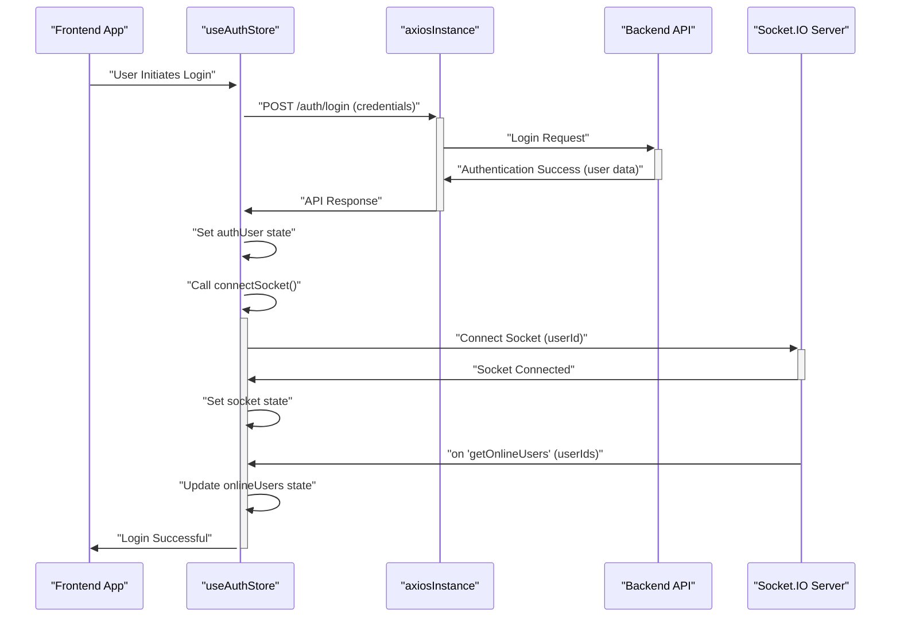

 # State Management and Utilities

This section details the client-side state management strategy using Zustand, alongside critical utility functions and API interaction configurations. These components collectively ensure a seamless and responsive user experience by managing authentication, chat data, and general application utilities efficiently.

## API Communication: `axiosInstance`

The application utilizes `axios` for making HTTP requests to the backend API. A custom `axiosInstance` is configured to handle base URLs and credential management, simplifying API calls throughout the frontend.

```javascript
// frontend/src/lib/axios.js
import axios from "axios";

export const axiosInstance = axios.create({
    baseURL: import.meta.env.MODE == "development" ? "http://localhost:5001/api": "/api",
    withCredentials: true,
});
```
[View on GitHub](https://github.com/shinymack/Chat-App-MERN/blob/main/frontend/src/lib/axios.js)

This instance automatically handles `withCredentials` for session management and dynamically sets the `baseURL` based on the environment, pointing to the local development server or a relative `/api` path in production.





## Client-Side Utility Functions

The `utils.js` file houses general-purpose utility functions that assist with common tasks like data formatting.

### `formatMessageTime`

This function formats a given date into a user-friendly time string, including year, month, day, hour, and minute, with AM/PM indicator.

```javascript
// frontend/src/lib/utils.js
export function formatMessageTime(date) {
    return new Date(date).toLocaleTimeString("en-US", {
        year: "numeric",
        month: "short",
        day:"2-digit",
        hour: "2-digit",
        minute: "2-digit",
        hour12: true,
    });
}
```
[View on GitHub](https://github.com/shinymack/Chat-App-MERN/blob/main/frontend/src/lib/utils.js#L1-L10)

This utility is particularly useful for displaying timestamps on messages in the chat interface, ensuring consistency and readability.

## State Management with Zustand

The application employs Zustand for lightweight and efficient state management. Two primary stores, `useAuthStore` and `useChatStore`, manage global authentication and chat-related data, respectively.

### Authentication Store: `useAuthStore`

The `useAuthStore` manages user authentication status, user data, online users, and WebSocket connection. It integrates with `axiosInstance` for API calls and `socket.io-client` for real-time features.

```javascript
// frontend/src/store/useAuthStore.js
import { create } from "zustand";
import { axiosInstance } from "../lib/axios";
import toast from "react-hot-toast";
import { io } from "socket.io-client";

const BASE_URL = import.meta.env.MODE == "development" ? "http://localhost:5001": "/";

export const useAuthStore = create((set, get) => ({
    authUser: null,
    isSigningUp: false,
    isLoggingIn: false,
    isUpdatingProfile: false,
    isCheckingAuth: true,
    onlineUsers: [],
    socket: null,

    checkAuth: async () => { /* ... */ },
    signup: async (data) => { /* ... */ },
    logout: async () => { /* ... */ },
    login: async (data) => {
        set({ isLoggingIn: true });
        try {
            const res = await axiosInstance.post("/auth/login", data);
            set({ authUser: res.data });
            get().connectSocket();
            toast.success("Logged in successfully");
        } catch (error) {
            toast.error(error.response.data.message);
        } finally {
            set({ isLoggingIn: false });
        }
    },
    updateProfile: async (data) => { /* ... */ },
    connectSocket: () => {
        const { authUser } = get();
        if(!authUser || get().socket?.connected) return;

        const socket = io(BASE_URL, {
            query: {
                userId : authUser._id,
            },
        });
        socket.connect();
        set({socket: socket});

        socket.on("getOnlineUsers", (userIds) => {
            set({onlineUsers: userIds})
        }); 
    },
    disconnectSocket : () => {
        if(get().socket?.connected) get().socket.disconnect();
    }
}));
```
[View on GitHub](https://github.com/shinymack/Chat-App-MERN/blob/main/frontend/src/store/useAuthStore.js)

#### Key State and Actions:

*   **`authUser`**: Stores the currently authenticated user's data.
*   **`isLoggingIn`, `isSigningUp`, `isCheckingAuth`, `isUpdatingProfile`**: Boolean flags to manage UI loading states during API operations.
*   **`onlineUsers`**: An array of user IDs currently online, received via WebSocket.
*   **`socket`**: The WebSocket client instance.
*   **`checkAuth()`**: Verifies the user's authentication status on application load.
*   **`signup(data)`**: Handles new user registration.
*   **`login(data)`**: Authenticates a user and establishes a WebSocket connection.
*   **`logout()`**: Clears user data and disconnects the WebSocket.
*   **`updateProfile(data)`**: Updates the authenticated user's profile information.
*   **`connectSocket()`**: Initializes and connects the WebSocket, registering handlers for real-time events like `getOnlineUsers`.
*   **`disconnectSocket()`**: Terminates the WebSocket connection.

#### Authentication and Socket Connection Flow





### Chat Store: `useChatStore`

The `useChatStore` manages all chat-related data, including messages, user lists, friend requests, and selected chat partners. It interacts with `axiosInstance` for fetching data and `useAuthStore`'s `socket` for real-time message updates.

```javascript
// frontend/src/store/useChatStore.js
import toast from "react-hot-toast";
import { create } from "zustand";
import { axiosInstance } from "../lib/axios";
import { useAuthStore } from "./useAuthStore";

export const useChatStore = create((set, get) => ({
    messages:[],
    users: [],
    pendingRequests: [],
    sentRequests: [],
    selectedUser: null,
    isUsersLoading: false,
    isMessagesLoading: false,
    isFriendBoxOpen: false,

    toggleFriendsBox: () => set(state => ({ isFriendsBoxOpen: !state.isFriendBoxOpen })),

    getFriends: async () => { /* ... */ },
    getPendingRequests: async () => { /* ... */ },
    getSentRequests: async () => { /* ... */ },
    sendFriendRequest: async (identifier) => { /* ... */ },
    acceptFriendRequest: async (senderId) => { /* ... */ },
    rejectFriendRequest: async (senderId) => { /* ... */ },
    removeFriend: async (friendId) => { /* ... */ },

    getMessages: async (userId) => {
        set({isMessagesLoading: true});
        try {
            const res = await axiosInstance.get(`/messages/${userId}`);
            set({messages: res.data});
        } catch (error) {
            toast.error(error.response.data.message);
        } finally {
            set({isMessagesLoading: false});
        }
    },
    sendMessage: async (messageData) => {
        const {selectedUser, messages} = get();
        try {
            const res = await axiosInstance.post(`/messages/send/${selectedUser._id}`, messageData);
            set({messages : [...messages, res.data]});
        } catch (error){
            toast.error(error.response.data.message);
        }
    },

    subscribeToMessages: () => {
        const { selectedUser } = get();
        if(!selectedUser) return;
        
        const socket = useAuthStore.getState().socket;
        socket.on("newMessage", (newMessage) => {
            if(newMessage.senderId !== selectedUser._id) return
            set({
                messages: [...get().messages, newMessage]
            })
        })
    },

    unsubscribeFromMessages: () => {
        const socket = useAuthStore.getState().socket;
        socket.off("newMessage");
    },
    
    setSelectedUser: (selectedUser) => set({selectedUser})
}));
```
[View on GitHub](https://github.com/shinymack/Chat-App-MERN/blob/main/frontend/src/store/useChatStore.js)

#### Key State and Actions:

*   **`messages`**: An array of messages in the currently selected chat.
*   **`users`**: List of the authenticated user's friends.
*   **`pendingRequests`**: List of friend requests received by the authenticated user.
*   **`sentRequests`**: List of friend requests sent by the authenticated user.
*   **`selectedUser`**: The user currently active in the chat window.
*   **`isUsersLoading`, `isMessagesLoading`**: Boolean flags for UI loading states.
*   **`toggleFriendsBox()`**: Toggles the visibility of the friend management panel.
*   **`getFriends()`**: Fetches the list of friends.
*   **`getPendingRequests()`**: Fetches received friend requests.
*   **`getSentRequests()`**: Fetches sent friend requests.
*   **`sendFriendRequest(identifier)`**: Sends a new friend request.
*   **`acceptFriendRequest(senderId)`**: Accepts a pending friend request.
*   **`rejectFriendRequest(senderId)`**: Rejects a pending friend request.
*   **`removeFriend(friendId)`**: Removes an existing friend.
*   **`getMessages(userId)`**: Fetches chat history with a specific user.
*   **`sendMessage(messageData)`**: Sends a new message to the `selectedUser`.
*   **`subscribeToMessages()`**: Sets up a WebSocket listener for incoming messages, updating the `messages` state if the message is from the `selectedUser`. This method directly accesses the `socket` instance from `useAuthStore`.
*   **`unsubscribeFromMessages()`**: Removes the WebSocket listener to prevent memory leaks when the chat component unmounts or the selected user changes.
*   **`setSelectedUser(selectedUser)`**: Sets the user whose chat is currently displayed.

## Key Integration Points

*   **Zustand for Global State**: `useAuthStore` and `useChatStore` provide a centralized, yet modular, way to manage state across the application, avoiding prop drilling and simplifying state updates.
*   **`axiosInstance` for API Interaction**: All HTTP requests are channeled through `axiosInstance`, ensuring consistent `baseURL`, `withCredentials`, and potential interception logic.
*   **WebSocket for Real-time Updates**: The `socket.io-client` instance, managed by `useAuthStore`, is critical for real-time features like online user status and instant message delivery. `useChatStore` leverages this existing socket connection for message subscription.
*   **Decoupled Concerns**: Authentication and chat functionalities are separated into distinct Zustand stores, promoting a clean architecture and easier maintenance.
*   **Reactive UI**: Zustand's reactivity ensures that components consuming the stores automatically re-render when the relevant state changes, providing a dynamic user interface. For instance, when `onlineUsers` updates, UI elements showing online status refresh instantly.