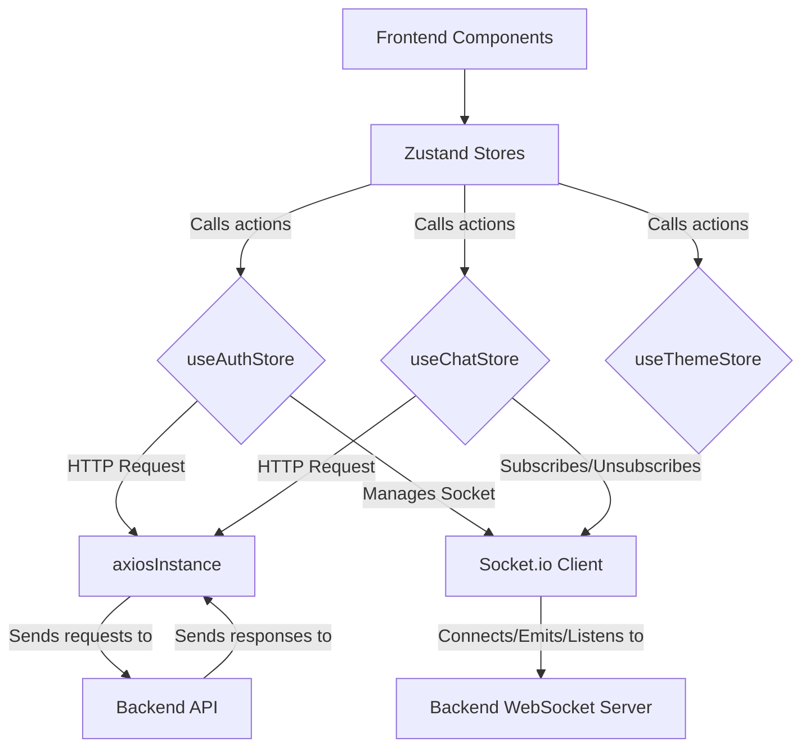
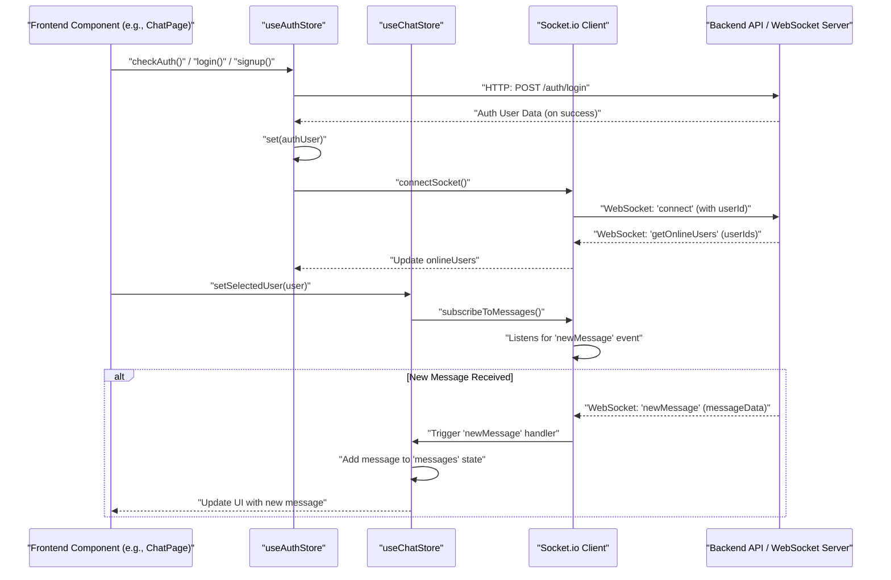

 # State Management and Utilities

This section details the client-side state management strategy and essential utility functions that underpin the frontend's interactivity and data handling. The application leverages [Zustand](https://zustand-bear.github.io/zustand/) for a lightweight and scalable state management solution, complemented by a custom Axios instance for streamlined API interactions.

## Core State Management Stores

The application's global state is segmented into three primary stores, each responsible for a distinct domain: `Auth`, `Chat`, and `Theme`. This modular approach, powered by Zustand, ensures a clear separation of concerns and efficient state updates.

### Authentication Store (`useAuthStore`)

The `useAuthStore` manages all user authentication-related states and actions, including user data, login/logout processes, profile updates, and real-time online user tracking via WebSockets. It acts as the central hub for user session management.

**Key Responsibilities:**

*   **User Authentication State**: Stores the authenticated user object (`authUser`), and loading indicators (`isSigningUp`, `isLoggingIn`, `isUpdatingProfile`, `isCheckingAuth`).
*   **Authentication Flows**: Implements `signup`, `login`, `logout`, `checkAuth`, and `updateProfile` actions to interact with the backend authentication endpoints.
*   **Real-time Connectivity**: Manages the WebSocket connection for the authenticated user, tracking `onlineUsers` and exposing the `socket` instance. It provides `connectSocket` and `disconnectSocket` methods.

```jsx
// frontend/src/store/useAuthStore.js
import { create } from "zustand";
import { axiosInstance } from "../lib/axios";
import toast from "react-hot-toast";
import { io } from "socket.io-client";

const BASE_URL = import.meta.env.MODE == "development" ? "http://localhost:5001": "/";

export const useAuthStore = create((set, get) => ({
    authUser: null,
    isSigningUp: false,
    isLoggingIn: false,
    isUpdatingProfile: false,
    isCheckingAuth: true,
    onlineUsers: [],
    socket: null,

    checkAuth: async () => {
        try {
            const res = await axiosInstance.get("/auth/check");
            set({ authUser: res.data });
            get().connectSocket(); // Connect socket on successful auth
        } catch (error) {
            set({ authUser: null });
            console.log("Error in checkAuth: ", error);
        } finally {
            set({ isCheckingAuth: false });
        }
    },
    // ... other auth actions (signup, login, logout, updateProfile)

    connectSocket: () => {
        const { authUser } = get();
        if(!authUser || get().socket?.connected) return;

        const socket = io(BASE_URL, {
            query: {
                userId : authUser._id,
            },
        });
        socket.connect();
        set({socket: socket});

        socket.on("getOnlineUsers", (userIds) => {
            set({onlineUsers: userIds})
        }); 
    },

    disconnectSocket : () => {
        if(get().socket?.connected) get().socket.disconnect();
    }
}));
```
[View on GitHub](https://github.com/shinymack/Chat-App-MERN/blob/main/frontend/src/store/useAuthStore.js#L1-L98)

### Chat Store (`useChatStore`)

The `useChatStore` manages all chat-related states, including messages, user lists (friends, pending, sent requests), and the currently selected chat partner. It also handles friend request management and real-time message updates.

**Key Responsibilities:**

*   **Chat Data**: Stores `messages` for the selected conversation, `users` (friends list), `pendingRequests`, and `sentRequests`.
*   **Selected Chat**: Manages the `selectedUser` for direct messaging.
*   **Friend Management**: Provides actions for `sendFriendRequest`, `acceptFriendRequest`, `rejectFriendRequest`, and `removeFriend`.
*   **Message Handling**: Actions to `getMessages` and `sendMessage`.
*   **Real-time Messaging**: Subscribes and unsubscribes to `newMessage` events from the WebSocket, leveraging the `socket` instance from `useAuthStore`.

```jsx
// frontend/src/store/useChatStore.js
import toast from "react-hot-toast";
import { create } from "zustand";
import { axiosInstance } from "../lib/axios";
import { useAuthStore } from "./useAuthStore"; // Accessing another store

export const useChatStore = create((set, get) => ({
    messages:[],
    users: [],
    pendingRequests: [],
    sentRequests: [],
    selectedUser: null,
    isUsersLoading: false,
    isMessagesLoading: false,
    isFriendBoxOpen: false,

    toggleFriendsBox: () => set(state => ({ isFriendsBoxOpen: !state.isFriendBoxOpen })),

    getFriends: async () => { /* ... fetch friends ... */ },
    getPendingRequests: async () => { /* ... fetch pending requests ... */ },
    getSentRequests: async () => { /* ... fetch sent requests ... */ },
    sendFriendRequest: async (identifier) => { /* ... send request ... */ },
    acceptFriendRequest: async (senderId) => { /* ... accept request ... */ },
    rejectFriendRequest: async (senderId) => { /* ... reject request ... */ },
    removeFriend: async (friendId) => { /* ... remove friend ... */ },
    getMessages: async (userId) => { /* ... fetch messages ... */ },
    sendMessage: async (messageData) => { /* ... send message ... */ },

    subscribeToMessages: () => {
        const { selectedUser } = get();
        if(!selectedUser) return;
        
        // Accessing the socket from useAuthStore
        const socket = useAuthStore.getState().socket; 
        socket.on("newMessage", (newMessage) => {
            if(newMessage.senderId !== selectedUser._id) return
            set({
                messages: [...get().messages, newMessage]
            })
        })
    },

    unsubscribeFromMessages: () => {
        const socket = useAuthStore.getState().socket;
        socket.off("newMessage");
    },
    
    setSelectedUser: (selectedUser) => set({selectedUser})
}));
```
[View on GitHub](https://github.com/shinymack/Chat-App-MERN/blob/main/frontend/src/store/useChatStore.js#L1-L150)

### Theme Store (`useThemeStore`)

The `useThemeStore` is a simple store dedicated to managing the application's current theme (e.g., "dark" or "light"). It persists the selected theme to `localStorage` for continuity across sessions.

**Key Responsibilities:**

*   **Theme State**: Stores the current `theme` string.
*   **Theme Persistence**: Initializes the theme from `localStorage` or defaults to "dark".
*   **Theme Updates**: Provides `setTheme` action to change the theme and persist it.

```jsx
// frontend/src/store/useThemeStore.js
import { create } from "zustand";

export const useThemeStore = create((set) => ({
    theme: localStorage.getItem("chat-theme") || "dark", // Load from localStorage
    setTheme: (theme) => {
        localStorage.setItem("chat-theme", theme); // Save to localStorage
        set({theme});
    }
}));
```
[View on GitHub](https://github.com/shinymack/Chat-App-MERN/blob/main/frontend/src/store/useThemeStore.js#L1-L7)

## Utility Functions and Integrations

Beyond state management, the application employs a custom Axios instance for all HTTP requests, ensuring consistent API interaction and error handling.

### Custom Axios Instance (`axiosInstance`)

The `axiosInstance` utility configures `axios` for consistent API calls across the frontend. It sets the `baseURL` dynamically based on the environment (development or production) and ensures `withCredentials` is enabled for proper cookie-based authentication.

```javascript
// frontend/src/lib/axios.js
import axios from "axios";

export const axiosInstance = axios.create({
    baseURL: import.meta.env.MODE == "development" ? "http://localhost:5001/api": "/api",
    withCredentials: true, // Important for sending/receiving cookies (e.g., JWT)
});
```
[View on GitHub](https://github.com/shinymack/Chat-App-MERN/blob/main/frontend/src/lib/axios.js#L1-L7)

This instance is imported and used by all Zustand stores (and potentially other frontend components) that need to communicate with the backend API.

## Data Flow Diagram: State Management and API Interactions

The following diagram illustrates the interaction between the frontend components, Zustand stores, and the custom Axios instance for typical data flows.





## Real-time Messaging Workflow

The integration of `useAuthStore` and `useChatStore` for real-time messaging using WebSockets is a critical aspect. The `useAuthStore` is responsible for establishing and managing the primary WebSocket connection for the authenticated user, while `useChatStore` leverages this connection to subscribe to message-specific events.





## Key Integration Points

### Zustand Store Interoperability
Zustand's `getState()` method is crucial for allowing stores to access and interact with each other. For instance, `useChatStore` needs access to the `socket` instance managed by `useAuthStore` to subscribe to real-time message events. This is achieved by calling `useAuthStore.getState().socket`. This pattern maintains a clear owner for the `socket` (the `useAuthStore`) while allowing other stores to utilize it.

```jsx
// Accessing socket from useAuthStore within useChatStore
const socket = useAuthStore.getState().socket; 
```
[View on GitHub](https://github.com/shinymack/Chat-App-MERN/blob/main/frontend/src/store/useChatStore.js#L125)

### Centralized API Client
The `axiosInstance` is imported into both `useAuthStore` and `useChatStore`. This ensures that all HTTP requests originating from these stores benefit from the same base URL, cookie handling (`withCredentials`), and potential future interceptor configurations. This centralization simplifies API interaction logic and promotes consistency.

```jsx
// Importing into useAuthStore
import { axiosInstance } from "../lib/axios";
```
[View on GitHub](https://github.com/shinymack/Chat-App-MERN/blob/main/frontend/src/store/useAuthStore.js#L2)

```jsx
// Importing into useChatStore
import { axiosInstance } from "../lib/axios";
```
[View on GitHub](https://github.com/shinymack/Chat-App-MERN/blob/main/frontend/src/store/useChatStore.js#L3)

### Environment-Specific Configurations
The `baseURL` for the `axiosInstance` and the `BASE_URL` for the Socket.IO client are dynamically determined based on `import.meta.env.MODE`. This allows the application to seamlessly switch between development (e.g., `http://localhost:5001`) and production (e.g., `/api` or `/`) backend endpoints without code changes, improving deployment flexibility.

```javascript
// Dynamic baseURL for Axios
baseURL: import.meta.env.MODE == "development" ? "http://localhost:5001/api": "/api",
```
[View on GitHub](https://github.com/shinymack/Chat-App-MERN/blob/main/frontend/src/lib/axios.js#L4)

```javascript
// Dynamic BASE_URL for Socket.io
const BASE_URL = import.meta.env.MODE == "development" ? "http://localhost:5001": "/";
```
[View on GitHub](https://github.com/shinymack/Chat-App-MERN/blob/main/frontend/src/store/useAuthStore.js#L8)