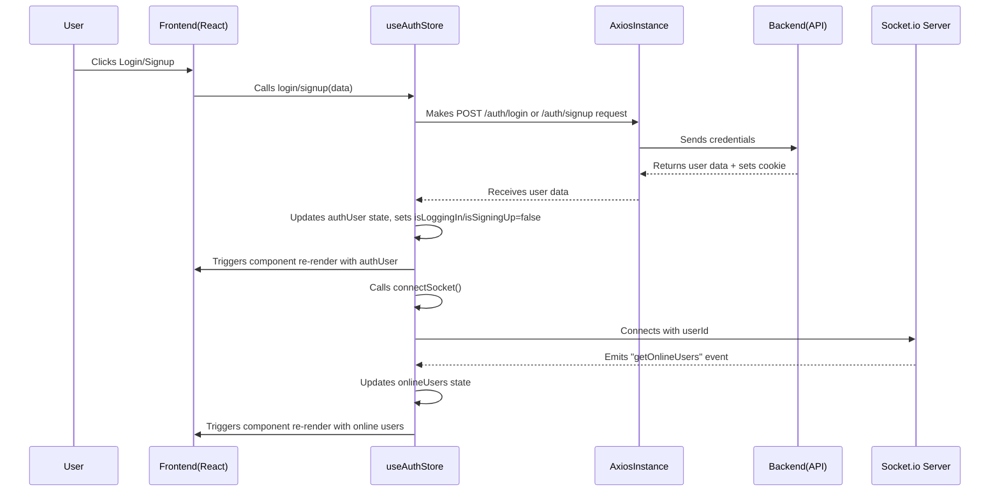

 # State Management and Utilities

This section details the core mechanisms for managing application state, handling API requests, and providing essential utility functions within the frontend. It primarily focuses on the integration of Zustand for reactive state management, Axios for HTTP client functionality, and a dedicated utility file for common helper functions. These components ensure a robust and maintainable architecture for data flow and interaction with the backend services.

## Axios Configuration

The `axios.js` file centralizes the configuration for the Axios HTTP client, which is used for all API requests to the backend. This setup ensures consistent base URL handling and automatic credential management for authenticated requests.

```javascript
// frontend/src/lib/axios.js
import axios from "axios";

export const axiosInstance = axios.create({
    baseURL: import.meta.env.MODE == "development" ? "http://localhost:5001/api": "/api",
    withCredentials: true,
});
```
[View on GitHub](https://github.com/shinymack/Chat-App-MERN/blob/main/frontend/src/lib/axios.js)

The `axiosInstance` is configured with:
*   **`baseURL`**: Dynamically set based on the environment (`development` vs. `production`), ensuring requests are sent to the correct API endpoint.
*   **`withCredentials: true`**: This is crucial for sending cookies (e.g., session cookies) with cross-origin requests, which is essential for maintaining user sessions and authentication status.

This centralized configuration simplifies API interactions throughout the application, allowing other modules to simply import `axiosInstance` without worrying about repetitive setup.

## Frontend Utility Functions

The `utils.js` file houses common utility functions that provide reusable logic across different components. These functions aim to encapsulate specific formatting or data manipulation tasks, improving code readability and maintainability.

```javascript
// frontend/src/lib/utils.js
export function formatMessageTime(date) {
    return new Date(date).toLocaleTimeString("en-US", {
        year: "numeric",
        month: "short",
        day:"2-digit",
        hour: "2-digit",
        minute: "2-digit",
        hour12: true,
    });
}
```
[View on GitHub](https://github.com/shinymack/Chat-App-MERN/blob/main/frontend/src/lib/utils.js)

The `formatMessageTime` function takes a `Date` object or a date string and formats it into a user-friendly locale-specific time string, including the full date and AM/PM indicator. This is particularly useful for displaying timestamps on messages in the chat interface.

## State Management with Zustand

The application leverages [Zustand](https://zustand-bear.pm/) for efficient and scalable state management. Zustand is a small, fast, and scalable bear-necessities state-management solution that offers a minimalist API and eliminates the need for context providers. It's used here to manage both authentication-related state (`useAuthStore`) and chat-specific state (`useChatStore`).

### Auth Store (`useAuthStore`)

The `useAuthStore` manages all user authentication-related state, including the authenticated user's data, loading states for auth operations, and integration with Socket.io for real-time online user tracking.

```javascript
// frontend/src/store/useAuthStore.js
import { create } from "zustand";
import { axiosInstance } from "../lib/axios";
import toast from "react-hot-toast";
import { io } from "socket.io-client";

const BASE_URL = import.meta.env.MODE == "development" ? "http://localhost:5001": "/";

export const useAuthStore = create((set, get) => ({
    authUser: null,
    isSigningUp: false,
    isLoggingIn: false,
    isUpdatingProfile: false,
    isCheckingAuth: true,
    onlineUsers: [],
    socket: null,
    // ... other actions
}));
```
[View on GitHub](https://github.com/shinymack/Chat-App-MERN/blob/main/frontend/src/store/useAuthStore.js#L1-L20)

**Key State Variables:**
*   `authUser`: Stores the currently authenticated user's data. `null` if not authenticated.
*   `isSigningUp`, `isLoggingIn`, `isUpdatingProfile`, `isCheckingAuth`: Boolean flags to indicate the loading status of respective asynchronous operations.
*   `onlineUsers`: An array of user IDs representing currently online users, updated via Socket.io.
*   `socket`: The Socket.io client instance, managed within the store for global access.

**Core Authentication Actions:**

The store provides actions for user lifecycle management:
*   **`checkAuth`**: Fetches the current user's authentication status from the backend upon application load. If authenticated, it sets `authUser` and connects the Socket.io client.
    ```javascript
    // frontend/src/store/useAuthStore.js
    // ...
    checkAuth: async () => {
        try {
            const res = await axiosInstance.get("/auth/check");
            set({ authUser: res.data });
            get().connectSocket(); // Connect socket if authenticated
        } catch (error) {
            set({ authUser: null });
            console.log("Error in checkAuth: ", error);
        } finally {
            set({ isCheckingAuth: false });
        }
    },
    // ...
    ```
    [View on GitHub](https://github.com/shinymack/Chat-App-MERN/blob/main/frontend/src/store/useAuthStore.js#L22-L34)

*   **`signup` / `login`**: Sends user credentials to the backend. On successful authentication, sets `authUser`, displays a success toast, and initiates the Socket.io connection.
*   **`logout`**: Invalidates the session on the backend, clears `authUser` locally, shows a success toast, and disconnects the Socket.io client.
*   **`updateProfile`**: Sends updated user profile data to the backend and refreshes the `authUser` state.

**Socket.io Integration:**

`useAuthStore` is responsible for establishing and managing the Socket.io connection, crucial for real-time features like online user status.

```javascript
// frontend/src/store/useAuthStore.js
// ...
connectSocket: () => {
    const { authUser } = get();
    if(!authUser || get().socket?.connected) return;

    const socket = io(BASE_URL, {
        query: {
            userId : authUser._id,
        },
    });
    socket.connect();
    set({socket: socket});

    socket.on("getOnlineUsers", (userIds) => {
        set({onlineUsers: userIds})
    }); 
},

disconnectSocket : () => {
    if(get().socket?.connected) get().socket.disconnect();
}
// ...
```
[View on GitHub](https://github.com/shinymack/Chat-App-MERN/blob/main/frontend/src/store/useAuthStore.js#L107-L127)

*   **`connectSocket`**: Initializes a new Socket.io client when a user is authenticated. It passes the `userId` as a query parameter for server-side identification. It then listens for the `getOnlineUsers` event to update the `onlineUsers` state.
*   **`disconnectSocket`**: Closes the Socket.io connection, typically called upon user logout.

**User Authentication Flow:**





### Chat Store (`useChatStore`)

The `useChatStore` manages all chat-specific state, including messages, user lists, friend requests, and selected chat partners. It also integrates with Socket.io to receive real-time messages.

```javascript
// frontend/src/store/useChatStore.js
import toast from "react-hot-toast";
import { create } from "zustand";
import { axiosInstance } from "../lib/axios";
import { useAuthStore } from "./useAuthStore";

export const useChatStore = create((set, get) => ({
    messages:[],
    users: [], // Friends list
    pendingRequests: [],
    sentRequests: [],
    selectedUser: null,
    isUsersLoading: false,
    isMessagesLoading: false,
    isFriendBoxOpen: false,
    // ... other actions
}));
```
[View on GitHub](https://github.com/shinymack/Chat-App-MERN/blob/main/frontend/src/store/useChatStore.js#L1-L16)

**Key State Variables:**
*   `messages`: An array of messages for the currently selected chat.
*   `users`: An array of the authenticated user's friends.
*   `pendingRequests`: An array of friend requests received by the user.
*   `sentRequests`: An array of friend requests sent by the user.
*   `selectedUser`: The currently active chat partner.
*   `isUsersLoading`, `isMessagesLoading`: Flags for loading states.
*   `isFriendBoxOpen`: Boolean to control visibility of a friends management UI.

**Friend Management Actions:**

The store provides a comprehensive set of actions for managing friend relationships:
*   **`getFriends`**: Fetches the list of approved friends.
*   **`getPendingRequests`**: Retrieves friend requests sent *to* the current user.
*   **`getSentRequests`**: Retrieves friend requests sent *by* the current user.
*   **`sendFriendRequest(identifier)`**: Sends a friend request to another user. On success, it refreshes the `sentRequests` list.
*   **`acceptFriendRequest(senderId)`**: Accepts a pending friend request. Refreshes both `friends` and `pendingRequests` lists.
*   **`rejectFriendRequest(senderId)`**: Rejects a pending friend request. Refreshes the `pendingRequests` list.
*   **`removeFriend(friendId)`**: Removes an existing friend. Refreshes the `friends` list and deselects the user if they were the active chat partner.

**Message Management Actions:**

*   **`getMessages(userId)`**: Fetches the message history with a specific user.
    ```javascript
    // frontend/src/store/useChatStore.js
    // ...
    getMessages: async (userId) => {
        set({isMessagesLoading: true});
        try {
            const res = await axiosInstance.get(`/messages/${userId}`);
            set({messages: res.data});
        } catch (error) {
            toast.error(error.response.data.message);
        } finally {
            set({isMessagesLoading: false});
        }
    },
    // ...
    ```
    [View on GitHub](https://github.com/shinymack/Chat-App-MERN/blob/main/frontend/src/store/useChatStore.js#L134-L144)

*   **`sendMessage(messageData)`**: Sends a new message to the `selectedUser`. The new message is immediately appended to the local `messages` state to provide an optimistic UI update.

**Real-time Messaging with Socket.io:**

The `useChatStore` integrates with the Socket.io client managed by `useAuthStore` to listen for new messages.

```javascript
// frontend/src/store/useChatStore.js
// ...
subscribeToMessages: () => {
    const { selectedUser } = get();
    if(!selectedUser) return;
    
    const socket = useAuthStore.getState().socket; // Access socket from auth store
    socket.on("newMessage", (newMessage) => {
        if(newMessage.senderId !== selectedUser._id) return // Ensure message is for current chat
        set({
            messages: [...get().messages, newMessage]
        })
    })
},

unsubscribeFromMessages: () => {
    const socket = useAuthStore.getState().socket;
    socket.off("newMessage");
},
// ...
```
[View on GitHub](https://github.com/shinymack/Chat-App-MERN/blob/main/frontend/src/store/useChatStore.js#L159-L177)

*   **`subscribeToMessages`**: This function registers a listener for the `newMessage` Socket.io event. It's designed to only update the `messages` state if the incoming message is from the `selectedUser`, ensuring that messages are added to the correct chat thread in real-time. It retrieves the `socket` instance directly from `useAuthStore.getState().socket`.
*   **`unsubscribeFromMessages`**: Removes the `newMessage` listener, typically called when a component unmounts or the selected user changes, to prevent memory leaks and incorrect message handling.

## Key Integration Points

*   **`axiosInstance` as the API Backbone**: All backend communication within both `useAuthStore` and `useChatStore` relies on the `axiosInstance`. This ensures consistent request handling, base URL resolution, and cookie management, vital for session-based authentication.
*   **Inter-Store Communication (Zustand `getState`)**: The `useChatStore` accesses the Socket.io instance from `useAuthStore` using `useAuthStore.getState().socket`. This pattern allows different stores to share and react to global state without direct dependencies, while maintaining a clear separation of concerns (auth manages socket connection, chat uses it for messages).
*   **Real-time Updates**: The `connectSocket` in `useAuthStore` and `subscribeToMessages` in `useChatStore` work in tandem to establish and utilize real-time communication. `useAuthStore` handles the initial connection and online user list, while `useChatStore` specifically leverages the established socket for incoming messages to the active chat.
*   **Optimistic UI Updates**: For actions like `sendMessage`, the frontend updates the `messages` array immediately before waiting for a server response. This provides a snappier user experience, with error handling in place to revert or notify if the server request fails.
*   **Error Handling with `react-hot-toast`**: Throughout both stores, `react-hot-toast` is used to provide user-friendly feedback for success and error conditions of asynchronous operations.
*   **Environment-Specific Configuration**: The dynamic `baseURL` for Axios and `BASE_URL` for Socket.io ensures the application seamlessly adapts between development and production environments, improving deployment flexibility.