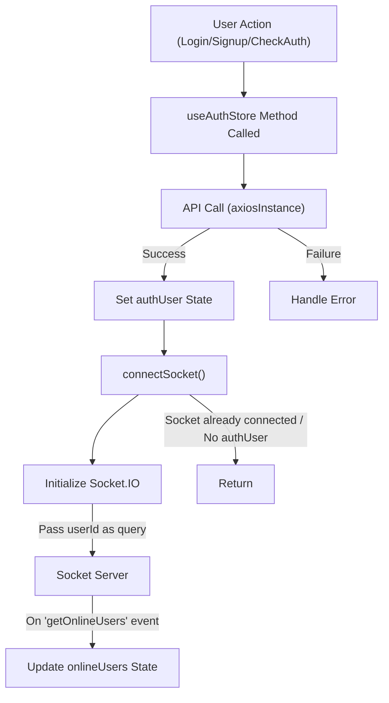

 # State Management and Utilities

This section details the global state management architecture used within the frontend application, focusing on authentication, chat functionalities, and user interface theming. It also covers essential client-side utility functions that support these features. The application leverages [Zustand](https://zustand-bear.github.io/zustand/) for a lightweight and scalable approach to state management, alongside [Socket.IO](https://socket.io/) for real-time communication.

## Global State Management Overview

The application's state is centrally managed by three distinct Zustand stores: `useAuthStore`, `useChatStore`, and `useThemeStore`. This modular design ensures clear separation of concerns, improves maintainability, and facilitates efficient state updates across components.

### Core State Stores

*   **Authentication State (`useAuthStore`)**: Handles user authentication status, login/signup processes, user profile management, and integrates with Socket.IO for real-time online user tracking.
*   **Chat State (`useChatStore`)**: Manages chat messages, user lists, friend requests (sending, accepting, rejecting, removing), and the currently selected chat partner. It also includes logic for fetching and sending messages.
*   **Theme State (`useThemeStore`)**: Controls the application's visual theme (e.g., dark/light mode), persisting the user's preference using `localStorage`.

### Utilities (`utils.js`)

A dedicated utility file provides common helper functions that are reusable across different parts of the frontend, simplifying data manipulation and formatting tasks.

## Authentication and Real-time Presence (`useAuthStore`)

The `useAuthStore` manages all aspects related to user authentication and leverages Socket.IO to establish a real-time connection for features like online user presence.

### State Structure

The store maintains state variables such as `authUser` (the currently logged-in user), various loading flags (`isSigningUp`, `isLoggingIn`, `isCheckingAuth`, `isUpdatingProfile`), `onlineUsers` (IDs of currently online users), and the `socket` instance.

```javascript filename="frontend/src/store/useAuthStore.js"
export const useAuthStore = create((set, get) => ({
    authUser: null,
    isSigningUp: false,
    isLoggingIn: false,
    isUpdatingProfile: false,
    isCheckingAuth: true,
    onlineUsers: [],
    socket: null,

    // ... methods
}));
```
[View on GitHub](https://github.com/shinymack/Chat-App-MERN/blob/main/frontend/src/store/useAuthStore.js#L14-L23)

### Authentication Flow

The store includes methods for user registration (`signup`), login (`login`), session verification (`checkAuth`), and logout (`logout`). All these methods interact with the backend API via `axiosInstance`. Upon successful authentication, the `connectSocket` method is invoked to establish a WebSocket connection.

```javascript filename="frontend/src/store/useAuthStore.js"
    checkAuth: async () => {
        try {
            const res = await axiosInstance.get("/auth/check");
            set({ authUser: res.data });
            get().connectSocket(); // Connect socket on successful authentication
        } catch (error) {
            set({ authUser: null });
            console.log("Error in checkAuth: ", error);
        } finally {
            set({ isCheckingAuth: false });
        }
    },
```
[View on GitHub](https://github.com/shinymack/Chat-App-MERN/blob/main/frontend/src/store/useAuthStore.js#L25-L36)

### Socket Connection Management

The `connectSocket` method initializes a Socket.IO connection, passing the authenticated user's ID as a query parameter. It also sets up an event listener for `getOnlineUsers` to update the `onlineUsers` state. The `disconnectSocket` method ensures the connection is properly closed on logout.

```javascript filename="frontend/src/store/useAuthStore.js"
    connectSocket: () => {
        const { authUser } = get();
        if(!authUser || get().socket?.connected) return;

        const socket = io(BASE_URL, {
            query: {
                userId : authUser._id,
            },
        });
        socket.connect();
        set({socket: socket});

        socket.on("getOnlineUsers", (userIds) => {
            set({onlineUsers: userIds})
        }); 
    },
    disconnectSocket : () => {
        if(get().socket?.connected) get().socket.disconnect();
    }
```
[View on GitHub](https://github.com/shinymack/Chat-App-MERN/blob/main/frontend/src/store/useAuthStore.js#L113-L130)

Here's a diagram illustrating the authentication and socket connection flow:





## Chat and Friend Management (`useChatStore`)

The `useChatStore` is central to the application's messaging and social features, managing messages, friends, and friend requests.

### State Structure

This store holds `messages` for the current conversation, a list of `users` (friends), `pendingRequests`, `sentRequests`, `selectedUser` for active chats, and loading indicators. It also manages a boolean for the friend box visibility `isFriendBoxOpen`.

```javascript filename="frontend/src/store/useChatStore.js"
export const useChatStore = create((set, get) => ({
    messages:[],
    users: [],
    pendingRequests: [],
    sentRequests: [],
    selectedUser: null,
    isUsersLoading: false,
    isMessagesLoading: false,
    isFriendBoxOpen: false,

    // ... methods
}));
```
[View on GitHub](https://github.com/shinymack/Chat-App-MERN/blob/main/frontend/src/store/useChatStore.js#L7-L17)

### Friend Management

Methods like `getFriends`, `getPendingRequests`, `getSentRequests`, `sendFriendRequest`, `acceptFriendRequest`, `rejectFriendRequest`, and `removeFriend` handle all interactions related to managing a user's friend list and request lifecycle. These operations update the relevant state arrays (`users`, `pendingRequests`, `sentRequests`) upon success.

```javascript filename="frontend/src/store/useChatStore.js"
    sendFriendRequest: async (identifier) => {
        try {
            const res = await axiosInstance.post("/friends/request/send", { identifier });
            toast.success(res.data.message);
            get().getSentRequests(); // Refresh sent requests list
        } catch (error) {
            toast.error(error.response?.data?.message || "Failed to send request");
        }
    },
    acceptFriendRequest: async (senderId) => {
        try {
            const res = await axiosInstance.post(`/friends/request/accept/${senderId}`);
            toast.success(res.data.message);
            get().getFriends(); // Refresh both friends
            get().getPendingRequests(); // and pending requests lists
        } catch (error) {
            toast.error(error.response?.data?.message || "Failed to accept request");
        }
    },
```
[View on GitHub](https://github.com/shinymack/Chat-App-MERN/blob/main/frontend/src/store/useChatStore.js#L54-L78)

### Message Handling

The store provides `getMessages` to fetch historical messages for a `selectedUser` and `sendMessage` to post new messages. For real-time message reception, `subscribeToMessages` listens for `newMessage` events from the Socket.IO instance managed by `useAuthStore`, and `unsubscribeFromMessages` cleans up the listener.

```javascript filename="frontend/src/store/useChatStore.js"
    subscribeToMessages: () => {
        const { selectedUser } = get();
        if(!selectedUser) return;
        
        const socket = useAuthStore.getState().socket; // Access socket from auth store
        socket.on("newMessage", (newMessage) => {
            if(newMessage.senderId !== selectedUser._id) return
            set({
                messages: [...get().messages, newMessage]
            })
        })
    },

    unsubscribeFromMessages: () => {
        const socket = useAuthStore.getState().socket;
        socket.off("newMessage");
    },
```
[View on GitHub](https://github.com/shinymack/Chat-App-MERN/blob/main/frontend/src/store/useChatStore.js#L125-L140)

## Theming (`useThemeStore`)

The `useThemeStore` is a simple Zustand store dedicated to managing the application's theme.

### State and Actions

It stores the current `theme` (e.g., "dark" or "light") and provides a `setTheme` action. The theme preference is persisted in `localStorage` to ensure consistency across user sessions.

```javascript filename="frontend/src/store/useThemeStore.js"
import { create } from "zustand";

export const useThemeStore = create((set) => ({
    theme: localStorage.getItem("chat-theme") || "dark",
    setTheme: (theme) => {
        localStorage.setItem("chat-theme", theme);
        set({theme});
    }
}))
```
[View on GitHub](https://github.com/shinymack/Chat-App-MERN/blob/main/frontend/src/store/useThemeStore.js#L3-L9)

## Client-Side Utilities (`utils.js`)

The `frontend/src/lib/utils.js` file contains general-purpose utility functions that can be imported and used across various components and stores.

### `formatMessageTime`

This function takes a `Date` object and formats it into a human-readable string, including year, month, day, and time, typically used for displaying message timestamps in the chat interface.

```javascript filename="frontend/src/lib/utils.js"
export function formatMessageTime(date) {
    return new Date(date).toLocaleTimeString("en-US", {
        year: "numeric",
        month: "short",
        day:"2-digit",
        hour: "2-digit",
        minute: "2-digit",
        hour12: true,
    });
}
```
[View on GitHub](https://github.com/shinymack/Chat-App-MERN/blob/main/frontend/src/lib/utils.js#L2-L10)

## Key Integration Points

The various state stores are designed to work in conjunction to provide a cohesive user experience:

*   **Authentication and Chat**: `useAuthStore`'s `authUser` and `socket` instances are crucial for `useChatStore`. The `useChatStore` accesses the `socket` from `useAuthStore` to subscribe to real-time `newMessage` events, ensuring messages are displayed instantly if the `selectedUser` is the sender.
*   **Centralized State Access**: Zustand's `create` function allows for `get()` to access the current state and other actions within the same store. Furthermore, `useAuthStore.getState().socket` demonstrates how one store can programmatically access the state of another, fostering inter-store communication when necessary.
*   **User Interface Responsiveness**: All stores include loading states (`isCheckingAuth`, `isUsersLoading`, `isMessagesLoading`) to provide immediate feedback to the user during asynchronous operations, enhancing the perceived responsiveness of the application.
*   **Persistence**: The `useThemeStore` exemplifies how `localStorage` can be integrated with Zustand to persist user preferences across browser sessions, improving user experience by remembering their theme choice.

This modular state management approach with Zustand, combined with real-time capabilities via Socket.IO, creates a robust and scalable foundation for the chat application.