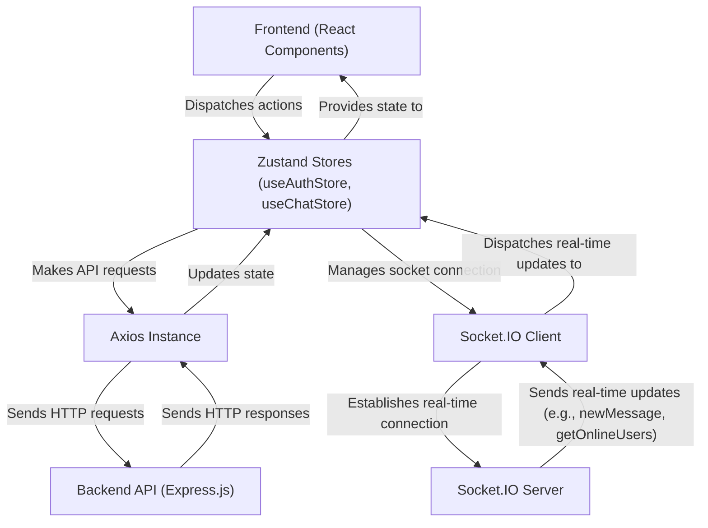

 # State Management and API Integration

This document outlines the approach to state management within the frontend application and details how it interacts with the backend API for data exchange. The application leverages **Zustand** for efficient state management and **Axios** for robust HTTP request handling, complemented by **Socket.IO** for real-time communication.

## Frontend State Management with Zustand

Zustand is a lightweight, fast, and scalable state-management solution that is central to how the application handles global state. It provides a simple API for creating stores and subscribing to changes, making it ideal for managing user authentication, chat messages, and user lists.

### Authentication State (`useAuthStore`)

The `useAuthStore` manages all authentication-related state, including the authenticated user's data, online status, and Socket.IO connection.

```javascript
// frontend/src/store/useAuthStore.js
import { create } from "zustand";
import { axiosInstance } from "../lib/axios";
import { io } from "socket.io-client";

const BASE_URL = import.meta.env.MODE == "development" ? "http://localhost:5001": "/";

export const useAuthStore = create((set, get) => ({
    authUser: null,
    isCheckingAuth: true,
    onlineUsers: [],
    socket: null,

    checkAuth: async () => {
        try {
            const res = await axiosInstance.get("/auth/check");
            set({ authUser: res.data });
            get().connectSocket(); // Connect socket upon successful authentication
        } catch (error) {
            set({ authUser: null });
        } finally {
            set({ isCheckingAuth: false });
        }
    },
    // ... other auth methods like signup, login, logout, updateProfile
    connectSocket: () => {
        const { authUser } = get();
        if(!authUser || get().socket?.connected) return;

        const socket = io(BASE_URL, {
            query: { userId : authUser._id },
        });
        socket.connect();
        set({socket: socket});

        socket.on("getOnlineUsers", (userIds) => {
            set({onlineUsers: userIds})
        }); 
    },
    disconnectSocket : () => {
        if(get().socket?.connected) get().socket.disconnect();
    }
}));
```
[View on GitHub](https://github.com/shinymack/Chat-App-MERN/blob/main/frontend/src/store/useAuthStore.js)

**Key responsibilities of `useAuthStore`:**
*   **`authUser`**: Stores the currently logged-in user's information.
*   **`isCheckingAuth`**: A loading state indicating if the initial authentication check is in progress.
*   **`onlineUsers`**: An array of user IDs representing currently online users, updated via Socket.IO.
*   **`socket`**: Holds the Socket.IO client instance for real-time communication.
*   **`checkAuth`**: Verifies the user's authentication status with the backend and initializes the Socket.IO connection.
*   **`connectSocket`/`disconnectSocket`**: Manages the lifecycle of the Socket.IO connection, linking it to the `authUser` state.

### Chat and Friend Management State (`useChatStore`)

The `useChatStore` manages states related to chat functionality, including messages, user lists, and friend requests.

```javascript
// frontend/src/store/useChatStore.js
import { create } from "zustand";
import { axiosInstance } from "../lib/axios";
import { useAuthStore } from "./useAuthStore"; // Access socket from AuthStore

export const useChatStore = create((set, get) => ({
    messages:[],
    users: [],
    pendingRequests: [],
    sentRequests: [],
    selectedUser: null,
    isMessagesLoading: false,

    getFriends: async () => { /* ... API call ... */ },
    getPendingRequests: async () => { /* ... API call ... */ },
    sendFriendRequest: async (identifier) => { /* ... API call ... */ },
    acceptFriendRequest: async (senderId) => { /* ... API call ... */ },
    getMessages: async (userId) => {
        set({isMessagesLoading: true});
        try {
            const res = await axiosInstance.get(`/messages/${userId}`);
            set({messages: res.data});
        } finally {
            set({isMessagesLoading: false});
        }
    },
    sendMessage: async (messageData) => {
        const {selectedUser, messages} = get();
        try {
            const res = await axiosInstance.post(`/messages/send/${selectedUser._id}`, messageData);
            set({messages : [...messages, res.data]});
        } catch (error){ /* ... error handling ... */ }
    },
    subscribeToMessages: () => {
        const { selectedUser } = get();
        if(!selectedUser) return;
        
        const socket = useAuthStore.getState().socket; // Get socket from AuthStore
        socket.on("newMessage", (newMessage) => {
            if(newMessage.senderId !== selectedUser._id) return
            set({
                messages: [...get().messages, newMessage]
            })
        })
    },
    unsubscribeFromMessages: () => {
        const socket = useAuthStore.getState().socket;
        socket.off("newMessage");
    },
    setSelectedUser: (selectedUser) => set({selectedUser})
}));
```
[View on GitHub](https://github.com/shinymack/Chat-App-MERN/blob/main/frontend/src/store/useChatStore.js)

**Key responsibilities of `useChatStore`:**
*   **`messages`**: Stores the chat messages for the `selectedUser`.
*   **`users`**: The list of authenticated user's friends.
*   **`pendingRequests`/`sentRequests`**: Lists for incoming and outgoing friend requests.
*   **`selectedUser`**: The user currently active in the chat window.
*   **`getFriends`/`getPendingRequests`/`getSentRequests`**: API calls to fetch friend-related data.
*   **`sendFriendRequest`/`acceptFriendRequest`/`rejectFriendRequest`/`removeFriend`**: Actions for managing friend relationships.
*   **`getMessages`/`sendMessage`**: API calls for fetching and sending chat messages.
*   **`subscribeToMessages`/`unsubscribeFromMessages`**: Manages real-time message updates using the Socket.IO instance from `useAuthStore`.

## API Integration with Axios

All HTTP requests to the backend API are handled through a centralized Axios instance, ensuring consistent configuration, such as base URL and cookie handling.

```javascript
// frontend/src/lib/axios.js
import axios from "axios";

export const axiosInstance = axios.create({
    baseURL: import.meta.env.MODE == "development" ? "http://localhost:5001/api": "/api",
    withCredentials: true, // Crucial for sending and receiving HTTP-only cookies
});
```
[View on GitHub](https://github.com/shinymack/Chat-App-MERN/blob/main/frontend/src/lib/axios.js)

*   **`baseURL`**: Dynamically set based on the environment (`development` or `production`).
*   **`withCredentials: true`**: This is vital for the application, enabling Axios to send and receive HTTP-only cookies from the backend. These cookies are typically used for session management and authentication, preventing XSS attacks by making session tokens inaccessible to client-side JavaScript.

### Utility Functions

A `utils.js` file houses small, reusable utility functions, such as message formatting, which can be shared across components.

```javascript
// frontend/src/lib/utils.js
export function formatMessageTime(date) {
    return new Date(date).toLocaleTimeString("en-US", {
        year: "numeric",
        month: "short",
        day:"2-digit",
        hour: "2-digit",
        minute: "2-digit",
        hour12: true,
    });
}
```
[View on GitHub](https://github.com/shinymack/Chat-App-MERN/blob/main/frontend/src/lib/utils.js)

This function ensures consistent formatting of message timestamps throughout the application.

## State and API Interaction Flow

This diagram illustrates the primary data flow and interactions between the frontend components, Zustand stores, API services, and the backend.





**Explanation of the diagram:**
*   Frontend React components interact directly with Zustand stores by dispatching actions (e.g., `login`, `sendMessage`).
*   Zustand stores encapsulate the logic for making API requests using the `axiosInstance`.
*   The `axiosInstance` handles the actual HTTP communication with the Backend API.
*   Responses from the Backend API update the state within the Zustand stores, which then triggers re-renders in the subscribed React components.
*   Zustand stores (specifically `useAuthStore`) also manage the `Socket.IO Client` lifecycle.
*   The `Socket.IO Client` establishes a persistent connection with the `Socket.IO Server` on the backend.
*   Real-time events (e.g., new messages, online user lists) are emitted from the `Socket.IO Server` to the `Socket.IO Client`, which then updates the relevant Zustand stores.

## Real-time Messaging and Online Status

The application incorporates real-time features using Socket.IO, integrated directly into the Zustand stores to manage connectivity and event handling.


```mermaid
sequenceDiagram
    participant C as "Client (Browser)"
    participant AS as "useAuthStore"
    participant CS as "useChatStore"
    participant AX as "Axios Instance"
    participant BE as "Backend (API/Socket)"

    C->>AS: "User logs in / App loads (calls checkAuth)"
    AS->>AX: "GET /auth/check"
    AX->>BE: "HTTP Request"
    BE-->>AX: "User data / Authenticated"
    AX-->>AS: "Receives user data"
    AS->>AS: "Set authUser; Call connectSocket"
    AS->>BE: "Socket.IO Connect (with userId)"
    BE->>BE: "Server tracks online users"
    BE-->>AS: "Socket.IO event: 'getOnlineUsers'"
    AS->>AS: "Update onlineUsers state"

    C->>CS: "User selects chat, calls getMessages"
    CS->>AX: "GET /messages/{userId}"
    AX->>BE: "HTTP Request"
    BE-->>AX: "Message history"
    AX-->>CS: "Receives messages"
    CS->>CS: "Set messages state; Call subscribeToMessages"

    C->>CS: "User sends message"
    CS->>AX: "POST /messages/send/{userId} (messageData)"
    AX->>BE: "HTTP Request (saves message)"
    BE-->>AX: "New message object"
    AX-->>CS: "Receives new message"
    CS->>CS: "Adds message to messages state"
    BE->>BE: "Emits 'newMessage' to relevant client(s)"
    BE-->>CS: "Socket.IO event: 'newMessage'"
    CS->>CS: "Adds received newMessage to messages state"
```


**Explanation of the sequence diagram:**
1.  **Authentication & Socket Connection**: Upon login or initial app load, the `checkAuth` action in `useAuthStore` authenticates with the backend. If successful, `connectSocket` is called, establishing a Socket.IO connection. The backend then informs the client about currently online users.
2.  **Chat Selection & Message Fetching**: When a user selects a chat, `useChatStore` fetches past messages via Axios and then subscribes to real-time `newMessage` events from the Socket.IO server.
3.  **Sending & Receiving Messages**: A user sending a message triggers an Axios POST request. The backend saves the message and then broadcasts a `newMessage` Socket.IO event to the recipient(s), ensuring real-time delivery and updating their `messages` state.

## Key Integration Points

*   **Centralized API Client**: Using `axiosInstance` ensures all API calls adhere to a consistent base URL and handle credentials appropriately, promoting maintainability and security.
*   **Unified State Management**: Zustand stores (`useAuthStore`, `useChatStore`) act as single sources of truth for different domains of application state. This prevents prop drilling and complex context setups.
*   **Socket.IO Integration with Zustand**: By storing the Socket.IO client instance in `useAuthStore` and having `useChatStore` subscribe to its events, the real-time communication layer is cleanly integrated into the application's state flow. This allows components to react to real-time updates without direct Socket.IO interaction.
*   **Lifecycle Management**: The `connectSocket` and `disconnectSocket` methods in `useAuthStore` are crucial for correctly managing the Socket.IO connection lifecycle, linking it directly to the user's authentication status. Similarly, `subscribeToMessages` and `unsubscribeFromMessages` in `useChatStore` ensure efficient event listener management.
*   **Error Handling and User Feedback**: The consistent use of `toast` notifications for success and error messages across API calls provides immediate feedback to the user, enhancing the user experience.
*   **Environment Configuration**: Dynamically setting `baseURL` using `import.meta.env.MODE` ensures the application can seamlessly transition between development and production environments without code changes.