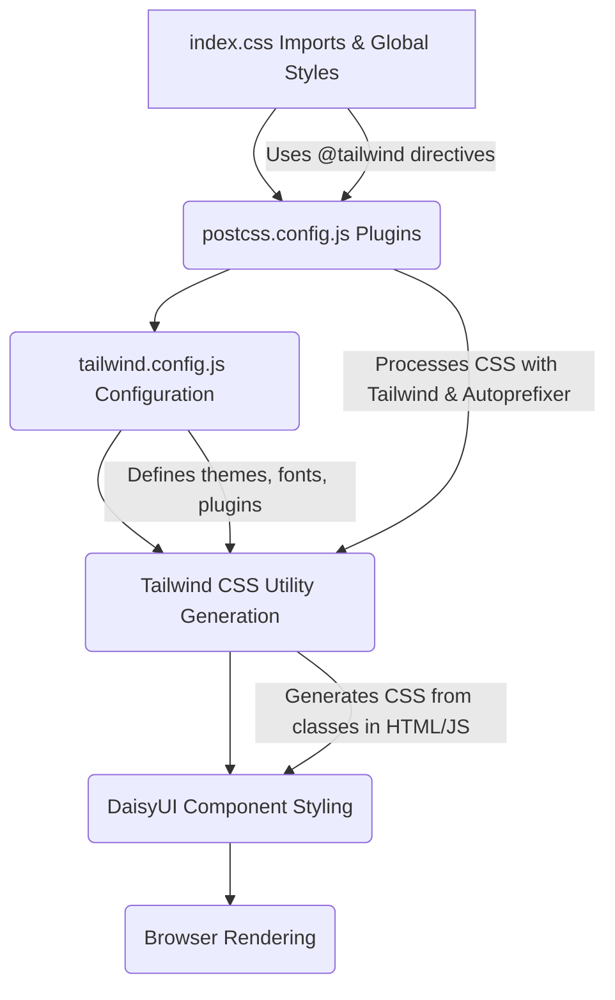

 # Styling and Theming

The application employs a modern and highly customizable styling and theming approach, leveraging the power of [Tailwind CSS](https://tailwindcss.com/) in conjunction with [DaisyUI](https://daisyui.com/) components and [Zustand](https://zustand-zustand.github.io/) for state management of themes. This combination provides a utility-first CSS framework with pre-built UI components and efficient client-side theme switching, ensuring a consistent and user-friendly experience across the application.

## Core Styling Principles

The styling philosophy is centered around flexibility, maintainability, and rapid development. By adopting Tailwind CSS, developers can build designs directly in their markup using utility classes, significantly reducing the need for custom CSS. DaisyUI further enhances this by providing a collection of Tailwind CSS components that are easily customizable and themeable.

### Tailwind CSS Configuration

The primary configuration for Tailwind CSS is located in `frontend/tailwind.config.js`. This file defines custom fonts, extends default themes, and integrates plugins like DaisyUI.

```javascript
// frontend/tailwind.config.js
import daisyui from "daisyui"

/** @type {import('tailwindcss').Config} */
export default {
  content: [
    "./index.html",
    "./src/**/*.{js,ts,jsx,tsx}",
  ],
  theme: {
    extend: {
      fontFamily : {
        chivo : ['Chivo', 'sans-serif'], // Defines a custom 'chivo' font family
      }
    },
  },
  plugins: [daisyui], // Integrates DaisyUI as a Tailwind CSS plugin
  daisyui : {
    themes: [
      "light",
      "dark",
      "cupcake",
      // ... many other themes available
      "sunset",
    ],
  }
}
```
[View on GitHub](https://github.com/shinymack/Chat-App-MERN/blob/main/frontend/tailwind.config.js)

**Key Configuration Aspects:**

*   **`content`**: Specifies the files where Tailwind CSS should look for utility classes to generate the final CSS. This ensures that only used classes are included, optimizing the bundle size.
*   **`theme.extend`**: Allows extending the default Tailwind theme. Here, a custom font family named `chivo` is defined, which can then be applied using the `font-chivo` utility class.
*   **`plugins`**: Integrates third-party Tailwind CSS plugins. DaisyUI is added here, providing a vast collection of ready-to-use components.
*   **`daisyui.themes`**: An array listing all the DaisyUI themes available for the application. This extensive list enables a wide range of aesthetic choices, from "light" and "dark" to more vibrant options like "halloween" or "synthwave."

### PostCSS Integration

[PostCSS](https://postcss.org/) is used to process CSS with JavaScript plugins. In this setup, it primarily facilitates the integration of Tailwind CSS and [Autoprefixer](https://github.com/postcss/autoprefixer).

```javascript
// frontend/postcss.config.js
export default {
  plugins: {
    tailwindcss: {}, // Enables Tailwind CSS processing
    autoprefixer: {}, // Adds vendor prefixes to CSS rules
  },
}
```
[View on GitHub](https://github.com/shinymack/Chat-App-MERN/blob/main/frontend/postcss.config.js)

*   **`tailwindcss`**: This plugin transforms the `@tailwind` directives in `index.css` into the actual utility classes based on the `tailwind.config.js` configuration.
*   **`autoprefixer`**: Automatically adds vendor prefixes to CSS rules, ensuring compatibility across different browsers without manual intervention.

### Global Styles and Font Loading

The `frontend/src/index.css` file serves as the entry point for global styles and imports necessary CSS frameworks.

```css
/* frontend/src/index.css */
@import url('https://fonts.googleapis.com/css2?family=Chivo:ital,wght@0,100..900;1,100..900&display=swap');
@tailwind base;
@tailwind components;
@tailwind utilities;


@layer base {
    body {
        @apply font-chivo; /* Applies the custom 'chivo' font to the body element */
    }
}
```
[View on GitHub](https://github.com/shinymack/Chat-App-MERN/blob/main/frontend/src/index.css)

*   **Google Fonts Import**: The `Chivo` font family is imported directly from Google Fonts, making it available for use throughout the application.
*   **Tailwind Directives**: `@tailwind base`, `@tailwind components`, and `@tailwind utilities` are essential directives that Tailwind CSS uses to inject its generated styles.
    *   `base`: Injects Tailwind's base styles, including a modern CSS reset.
    *   `components`: Injects component-specific styles, often from plugins like DaisyUI.
    *   `utilities`: Injects all of Tailwind's utility classes.
*   **`@layer base`**: This PostCSS directive allows defining custom CSS within Tailwind's layer system. Here, the `font-chivo` utility class is applied to the `body` element, ensuring the custom font is the default for all text.

### Styling Workflow

The styling workflow can be visualized as a pipeline:





This diagram illustrates how global styles, PostCSS plugins, and Tailwind's configuration work together to produce the final CSS output that the browser renders.

## Theme Management with Zustand

The application implements dynamic theme switching using [Zustand](https://zustand-zustand.github.io/), a lightweight and fast state management library. This allows users to select their preferred theme from the extensive list provided by DaisyUI, and their choice is persisted across sessions using `localStorage`.

```javascript
// frontend/src/store/useThemeStore.js
import { create } from "zustand";

export const useThemeStore = create((set) => ({
    // Initialize theme from localStorage or default to "dark"
    theme: localStorage.getItem("chat-theme") || "dark",
    setTheme: (theme) => {
        localStorage.setItem("chat-theme", theme); // Persist theme to localStorage
        set({theme}); // Update the Zustand store
    }
}))
```
[View on GitHub](https://github.com/shinymack/Chat-App-MERN/blob/main/frontend/src/store/useThemeStore.js)

**Key Features of `useThemeStore.js`:**

*   **`create((set) => ({...}))`**: This is the core function of Zustand, creating a store. The `set` function is used to update the store's state.
*   **`theme: localStorage.getItem("chat-theme") || "dark"`**:
    *   On initialization, the store attempts to retrieve the theme preference from `localStorage` using the key `"chat-theme"`.
    *   If no theme is found (e.g., first-time user), it defaults to `"dark"`, ensuring a consistent initial experience.
*   **`setTheme: (theme) => {...}`**:
    *   This action is responsible for updating the current theme.
    *   `localStorage.setItem("chat-theme", theme)`: The selected `theme` is stored in `localStorage`, making the preference persistent even after the browser is closed or refreshed.
    *   `set({theme})`: The Zustand store's `theme` state is updated, triggering re-renders in any components that are consuming this state, thereby applying the new theme.

### Theme Switching Mechanism

The integration of `useThemeStore` with DaisyUI themes typically involves binding the store's `theme` state to the `data-theme` attribute on the `<html>` or `<body>` element. DaisyUI automatically applies the corresponding CSS variables and styles based on this attribute.

```jsx
// Example in a React component (conceptual)
import React, { useEffect } from 'react';
import { useThemeStore } from '../store/useThemeStore';

function App() {
  const { theme } = useThemeStore();

  useEffect(() => {
    document.documentElement.setAttribute('data-theme', theme);
  }, [theme]);

  // ... rest of the component
}
```

This ensures that whenever `setTheme` is called (e.g., from a theme selector dropdown), the `data-theme` attribute is updated, and DaisyUI instantaneously switches the entire application's visual theme.

## Key Integration Points

*   **Unified Styling**: The combination of Tailwind CSS and DaisyUI provides a powerful and coherent styling solution. Tailwind's utility-first approach offers granular control, while DaisyUI adds pre-built, accessible, and themeable components.
*   **Efficient Theme Management**: Zustand's minimalist state management coupled with `localStorage` offers a straightforward and performant way to handle user-preferred themes. This ensures a personalized experience that persists across sessions.
*   **Customization and Extensibility**: The `tailwind.config.js` file is the central hub for customizing the application's look and feel, from fonts to color palettes. The extensive list of DaisyUI themes provides a robust starting point for diverse aesthetics.
*   **Developer Experience**: The utility-first nature of Tailwind CSS speeds up development by allowing styling directly within the JSX/HTML, reducing context switching and improving maintainability. DaisyUI's component library further accelerates UI development.

Next: [Development and Deployment](./4_development-and-deployment.mdx)