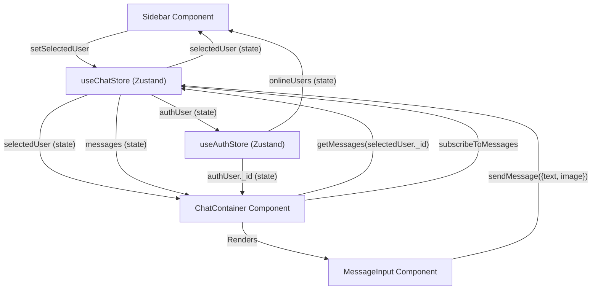

 # User Interface Components

This section provides comprehensive documentation for the core reusable React components that construct the chat application's user interface. These components handle rendering chat messages, managing friend lists, composing new messages, and presenting the overall chat layout. Each component is designed to be modular, leveraging Zustand for state management and adhering to modern React best practices.

## ChatContainer

The `ChatContainer` component is the central display area for chat messages. It orchestrates the fetching, rendering, and real-time subscription of messages for a `selectedUser`. It also integrates the `ChatHeader` and `MessageInput` components, forming a complete chat view.

### Features

*   **Message Display**: Renders a list of messages, distinguishing between sent and received messages.
*   **Real-time Updates**: Subscribes to new messages via WebSocket connections managed by the `useChatStore`.
*   **Automatic Scrolling**: Automatically scrolls to the latest message using `useRef` and `useEffect`.
*   **Loading State**: Displays `MessageSkeleton` during message fetching.
*   **Image Previews**: Supports displaying attached images within messages.

### Usage

```jsx filename="frontend/src/components/ChatContainer.jsx"
import { useEffect, useRef } from "react";
import { useChatStore } from "../store/useChatStore";
import { useAuthStore } from "../store/useAuthStore";
import ChatHeader from "./ChatHeader";
import MessageInput from "./MessageInput";
import MessageSkeleton from "./skeletons/MessageSkeleton";
import { formatMessageTime } from "../lib/utils";

const ChatContainer = () => {
    // ... component logic ...
};

export default ChatContainer;
```

[View on GitHub](https://github.com/shinymack/Chat-App-MERN/blob/main/frontend/src/components/ChatContainer.jsx)

### Message Subscription

The `useEffect` hook in `ChatContainer` manages the lifecycle of message subscriptions. It fetches initial messages and then sets up a real-time listener.

```jsx filename="frontend/src/components/ChatContainer.jsx" {14-20}
import { useEffect } from "react";
import { useChatStore } from "../store/useChatStore";
// ... other imports ...

const ChatContainer = () => {
    const { messages, getMessages, isMessagesLoading, selectedUser, subscribeToMessages, unsubscribeFromMessages } =
        useChatStore();
    // ... other state ...

    useEffect(() => {
        getMessages(selectedUser._id);
        subscribeToMessages();

        return () => unsubscribeFromMessages();
    }, [selectedUser._id, getMessages, subscribeToMessages, unsubscribeFromMessages]);
    
    // ... rest of component ...
};
```

[View on GitHub](https://github.com/shinymack/Chat-App-MERN/blob/main/frontend/src/components/ChatContainer.jsx#L14-L20)

This snippet demonstrates how the component fetches messages for the currently selected user and subscribes to real-time updates. The cleanup function ensures that the subscription is properly terminated when the component unmounts or the `selectedUser` changes, preventing memory leaks.

### Auto-scrolling to Latest Message

To enhance user experience, the chat view automatically scrolls to the latest message.

```jsx filename="frontend/src/components/ChatContainer.jsx" {22-26}
// ... imports and state ...
    const messageEndRef = useRef(null);

    useEffect(() => {
        getMessages(selectedUser._id);
        subscribeToMessages();

        return () => unsubscribeFromMessages();
    }, [selectedUser._id, getMessages, subscribeToMessages, unsubscribeFromMessages]);
    
    useEffect(() => {
        if(messageEndRef.current && messages){
            messageEndRef.current.scrollIntoView({behaviour : "smooth"})
        }
    }, [messages])
// ... rest of component ...
```

[View on GitHub](https://github.com/shinymack/Chat-App-MERN/blob/main/frontend/src/components/ChatContainer.jsx#L22-L26)

This `useEffect` hook triggers a scroll action whenever the `messages` array updates, ensuring the newest message is always visible. The `messageEndRef` is attached to the last message in the `messages.map` loop.

## FriendsBox

The `FriendsBox` component provides an interface for managing friends within the application. It allows users to view their friends, pending requests, sent requests, and send new friend requests.

### Features

*   **Tabbed Navigation**: Organizes friend management into "Friends," "Pending Requests," and "Sent Requests" tabs.
*   **Friend Request Management**: Functionality to send, accept, and reject friend requests.
*   **Friend Removal**: Option to remove existing friends.
*   **Dynamic Counts**: Displays the number of friends and requests in each tab.
*   **Modal View**: Presented as a modal overlay, enhancing user focus.

### Usage

```jsx filename="frontend/src/components/FriendsBox.jsx"
import { useEffect, useState } from 'react';
import { useChatStore } from '../store/useChatStore';
import { X, UserPlus, Check, Trash2 } from 'lucide-react';

const FriendsBox = () => {
    // ... component logic ...
};

export default FriendsBox;
```

[View on GitHub](https://github.com/shinymack/Chat-App-MERN/blob/main/frontend/src/components/FriendsBox.jsx)

### Friend Data Fetching

Upon mounting, `FriendsBox` fetches all relevant friend data using actions from `useChatStore`.

```jsx filename="frontend/src/components/FriendsBox.jsx" {13-17}
// ... imports ...
const FriendsBox = () => {
    const { 
        toggleFriendsBox, 
        getFriends, users,
        getPendingRequests, pendingRequests,
        getSentRequests, sentRequests,
        sendFriendRequest, acceptFriendRequest, rejectFriendRequest, removeFriend
    } = useChatStore();

    const [activeTab, setActiveTab] = useState('friends');
    const [identifier, setIdentifier] = useState('');

    useEffect(() => {
        // Fetch all necessary data when the component mounts
        getFriends();
        getPendingRequests();
        getSentRequests();
    }, [getFriends, getPendingRequests, getSentRequests]);
    // ... rest of component ...
};
```

[View on GitHub](https://github.com/shinymack/Chat-App-MERN/blob/main/frontend/src/components/FriendsBox.jsx#L13-L17)

This ensures that the user's friend list and request statuses are up-to-date every time the `FriendsBox` is opened.

## MessageInput

The `MessageInput` component is responsible for composing and sending messages, including text and image attachments.

### Features

*   **Text Input**: Standard input field for typing messages.
*   **Image Attachment**: Allows users to select and preview images before sending.
*   **Image Preview Management**: Displays a preview of the selected image and provides an option to remove it.
*   **Send Functionality**: Dispatches messages (text and/or image) via `useChatStore`.
*   **Input Validation**: Ensures at least text or an image is present before sending.

### Usage

```jsx filename="frontend/src/components/MessageInput.jsx"
import { useRef, useState } from "react";
import { useChatStore } from "../store/useChatStore";
import { Image, Send, X } from "lucide-react";
import toast from "react-hot-toast";

const MessageInput = () => {
    // ... component logic ...
};

export default MessageInput;
```

[View on GitHub](https://github.com/shinymack/Chat-App-MERN/blob/main/frontend/src/components/MessageInput.jsx)

### Handling Image Attachments

The `MessageInput` manages image selection, preview, and removal.

```jsx filename="frontend/src/components/MessageInput.jsx" {9-24,37-38}
// ... imports ...
const MessageInput = () => {
    const [text, setText] = useState("");
    const [imagePreview, setImagePreview] = useState(null);
    const fileInputRef = useRef(null);
    const { sendMessage } = useChatStore();

    const handleImageChange = (e) => {
        const file = e.target.files[0];
        if (!file.type.startsWith("image/")) {
            toast.error("Please select an image file");
            return;
        }

        const reader = new FileReader();
        reader.onloadend = () => {
            setImagePreview(reader.result);
        };
        reader.readAsDataURL(file);
    };

    const removeImage = () => {
        setImagePreview(null);
        if (fileInputRef.current) fileInputRef.current.value = "";
    };

    const handleSendMessage = async (e) => {
        e.preventDefault();
        if (!text.trim() && !imagePreview) return; // Prevent sending empty messages

        try {
            await sendMessage({
                text: text.trim(),
                image: imagePreview,
            });
            // ... clear inputs ...
        } catch (error) {
            console.error("Failed to send message", error);
        }
    };
    // ... JSX ...
};
```

[View on GitHub](https://github.com/shinymack/Chat-App-MERN/blob/main/frontend/src/components/MessageInput.jsx#L9-L24)
[View on GitHub](https://github.com/shinymack/Chat-App-MERN/blob/main/frontend/src/components/MessageInput.jsx#L37-L38)

This logic manages the file input, converts the selected image to a Data URL for preview, and clears the preview when the message is sent or the image is removed.

## Sidebar

The `Sidebar` component displays a list of the user's friends, allowing selection to initiate or continue a chat. It also includes filtering options for online users.

### Features

*   **Friend List Display**: Shows a list of all friends with their profile pictures and online/offline status.
*   **User Selection**: Allows users to select a friend to open a chat, updating the `selectedUser` state.
*   **Online Filter**: Toggles to show only online friends.
*   **Loading State**: Displays `SidebarSkeleton` during friend list fetching.
*   **Online Indicator**: Visually indicates if a friend is online.

### Usage

```jsx filename="frontend/src/components/Sidebar.jsx"
import { useEffect, useState } from "react";
import { useChatStore } from "../store/useChatStore";
import SidebarSkeleton from "./skeletons/SidebarSkeleton";
import { Users } from "lucide-react";
import { useAuthStore } from "../store/useAuthStore";

const Sidebar = () => {
    // ... component logic ...
};

export default Sidebar;
```

[View on GitHub](https://github.com/shinymack/Chat-App-MERN/blob/main/frontend/src/components/Sidebar.jsx)

### Filtering Online Users

The `Sidebar` uses a local state to toggle between displaying all friends and only online friends.

```jsx filename="frontend/src/components/Sidebar.jsx" {9-11,15-18}
// ... imports ...
const Sidebar = () => {
    const { getFriends, users, selectedUser, setSelectedUser, isUsersLoading } =
        useChatStore();

    const { onlineUsers } = useAuthStore();
    const [showOnlineOnly, setShowOnlineOnly] = useState(false);
    useEffect(() => {
        getFriends();
    }, [getFriends]);
    const filteredUsers = showOnlineOnly
        ? users.filter((user) => onlineUsers.includes(user._id))
        : users;
    // ... rest of component ...
};
```

[View on GitHub](https://github.com/shinymack/Chat-App-MERN/blob/main/frontend/src/components/Sidebar.jsx#L9-L11)
[View on GitHub](https://github.com/shinymack/Chat-App-MERN/blob/main/frontend/src/components/Sidebar.jsx#L15-L18)

This snippet demonstrates how `filteredUsers` is dynamically computed based on the `showOnlineOnly` state and the `onlineUsers` array provided by `useAuthStore`.

## Component Interaction Flow

The following diagram illustrates how the `ChatContainer`, `Sidebar`, and `MessageInput` components interact with each other and the Zustand stores to manage chat functionality.





This diagram shows a unidirectional data flow from stores to components, and actions from components modifying the store. `Sidebar` selects a user, which updates `useChatStore`. `ChatContainer` then reacts to `selectedUser` and `messages` from `useChatStore`. `MessageInput` sends messages back to `useChatStore`. `useAuthStore` provides authentication and online status information to both `Sidebar` and `ChatContainer`.

## Key Integration Points

### Zustand Store Centralization

All components heavily rely on `useChatStore` and `useAuthStore` (from Zustand) for state management. This centralization provides a single source of truth for chat data (messages, selected user, friends, requests) and authentication/user status. This pattern simplifies state updates and ensures consistency across the UI.

### Real-time Communication

The `ChatContainer` demonstrates effective integration of real-time capabilities by subscribing to message updates (`subscribeToMessages`) from the `useChatStore`. This store likely interfaces with a WebSocket or similar technology on the backend, ensuring messages appear instantly without manual refreshes. The cleanup function in `useEffect` is crucial here to prevent multiple subscriptions.

### Component Composition

The application leverages component composition by nesting `ChatHeader` and `MessageInput` within `ChatContainer`. This modular approach promotes reusability and separation of concerns. `FriendsBox` is designed as a standalone modal, minimizing its impact on the main chat layout.

### Responsiveness and Adaptive Layout

The `Sidebar` component specifically includes logic for responsive display, showing/hiding itself based on whether a user is selected on smaller screens (`selectedUser ? "hidden sm:flex w-[100vw]" : ""`). This indicates an adaptive design strategy to optimize the user experience across different device sizes.

Next: [Pages and Navigation](./3.2_pages-and-navigation.mdx)