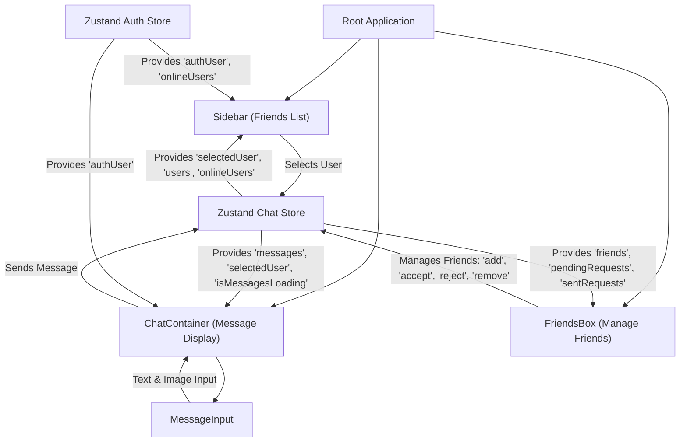
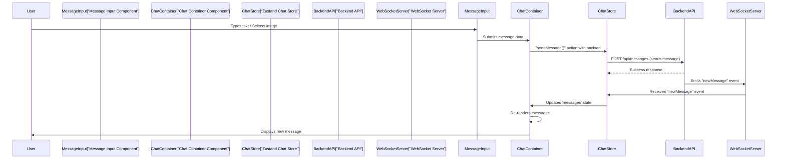

 # User Interface Components

This section details the core React components that constitute the user interface of the chat application. These components are designed for reusability and manage specific parts of the UI, interacting with global state and utility functions to deliver a dynamic user experience.

## Chat Container

The `ChatContainer` component is responsible for displaying the chat history for a selected user. It dynamically loads messages, handles real-time updates, and provides an interface for message input.

### Features

*   **Dynamic Message Loading**: Fetches messages for the currently selected chat partner.
*   **Real-time Updates**: Subscribes to and unsubscribes from message updates via WebSockets to ensure messages are displayed instantly.
*   **Auto-Scroll**: Automatically scrolls to the bottom of the chat to show the latest messages.
*   **Message Display**: Renders individual messages, distinguishing between sent and received messages.
*   **Loading State**: Displays a skeleton loader while messages are being fetched.

### Component Structure

The `ChatContainer` integrates several sub-components and hooks to manage its functionality:

*   `ChatHeader`: (Not provided in snippet, but imported) Likely displays information about the selected chat partner.
*   `MessageInput`: Allows users to type and send new messages, including image attachments.
*   `MessageSkeleton`: Provides a visual loading indicator.
*   `useChatStore`: Manages chat-related state, including `messages`, `selectedUser`, and actions like `getMessages`, `subscribeToMessages`, `unsubscribeFromMessages`, `isMessagesLoading`.
*   `useAuthStore`: Provides access to the currently authenticated user (`authUser`).
*   `formatMessageTime`: Utility for formatting message timestamps.

```jsx title="frontend/src/components/ChatContainer.jsx"
import { useEffect, useRef } from "react";
import { useChatStore } from "../store/useChatStore";
import { useAuthStore } from "../store/useAuthStore";
import ChatHeader from "./ChatHeader";
import MessageInput from "./MessageInput";
import MessageSkeleton from "./skeletons/MessageSkeleton";
import { formatMessageTime } from "../lib/utils";

const ChatContainer = () => {
    const { messages, getMessages, isMessagesLoading, selectedUser, subscribeToMessages, unsubscribeFromMessages } =
        useChatStore();
    const { authUser } = useAuthStore();
    const messageEndRef = useRef(null);

    // Effect to fetch messages and subscribe to real-time updates
    useEffect(() => {
        getMessages(selectedUser._id);
        subscribeToMessages();

        return () => unsubscribeFromMessages(); // Cleanup on unmount or selectedUser change
    }, [selectedUser._id, getMessages, subscribeToMessages, unsubscribeFromMessages]);

    // Effect to scroll to the latest message
    useEffect(() => {
        if(messageEndRef.current && messages){
            messageEndRef.current.scrollIntoView({behaviour : "smooth"})
        }
    }, [messages])

    // ... rest of the component
};

export default ChatContainer;
```
[View on GitHub](https://github.com/shinymack/Chat-App-MERN/blob/main/frontend/src/components/ChatContainer.jsx#L1-L26)

The component leverages `useEffect` hooks for side effects like data fetching and real-time subscription management. The `messageEndRef` is used to maintain the scroll position at the bottom of the chat, ensuring the latest message is always visible.

### Message Rendering Logic

Messages are rendered dynamically, with conditional styling to differentiate between messages sent by the authenticated user and those received from the selected user. It supports both text and image messages.

```jsx title="frontend/src/components/ChatContainer.jsx" {34-58}
    // ... (previous code)

    return (
        <div className="flex-1 flex flex-col overflow-auto">
            <ChatHeader />
            <div className="flex-1 overflow-y-auto p-4 space-y-4">
                {messages.map((message) => (
                    <div
                        key={message._id}
                        className={`chat ${message.senderId == authUser._id ? "chat-end": "chat-start"} `}
                        ref={messageEndRef} // This ref should ideally be on the last message, not all.
                    >
                        <div className="chat-image avatar">
                            <div className="size-9 rounded-full border">
                                
                            </div>
                        </div>
                        <div className="chat-header mb-1">
                            <time className="text-xs opacity-50 ml-1">{formatMessageTime(message.createdAt)}</time>
                        </div>
                        <div className="chat-bubble flex flex-col">
                            {message.image && (
                                
                            )}
                            {message.text && <p>{message.text}</p>}
                        </div>
                    </div>
                ))}
            </div>
            <MessageInput />
        </div>
    );
};
```
[View on GitHub](https://github.com/shinymack/Chat-App-MERN/blob/main/frontend/src/components/ChatContainer.jsx#L34-L58)

## Friends Box

The `FriendsBox` component provides an interface for managing a user's friends list, including adding new friends, viewing pending requests, and handling sent requests. It appears as a modal overlay.

### Features

*   **Friend Management**: Displays current friends, pending requests, and sent requests in separate tabs.
*   **Add Friend**: Allows users to send friend requests by entering a username or email.
*   **Request Handling**: Enables accepting or rejecting incoming friend requests.
*   **Remove Friend**: Provides functionality to remove existing friends.
*   **Modal Interface**: Presented as a full-screen overlay, controlled by the `toggleFriendsBox` action.

### Component Structure

`FriendsBox` relies heavily on the `useChatStore` for all friend-related state and actions:

*   `toggleFriendsBox`: Controls the visibility of the modal.
*   `getFriends`, `getPendingRequests`, `getSentRequests`: Fetch initial data for each tab.
*   `users`, `pendingRequests`, `sentRequests`: State variables holding the respective friend data.
*   `sendFriendRequest`, `acceptFriendRequest`, `rejectFriendRequest`, `removeFriend`: Actions to modify friend relationships.

```jsx title="frontend/src/components/FriendsBox.jsx"
import { useEffect, useState } from 'react';
import { useChatStore } from '../store/useChatStore';
import { X, UserPlus, Check, Trash2 } from 'lucide-react';

const FriendsBox = () => {
    const { 
        toggleFriendsBox, 
        getFriends, users,
        getPendingRequests, pendingRequests,
        getSentRequests, sentRequests,
        sendFriendRequest, acceptFriendRequest, rejectFriendRequest, removeFriend
    } = useChatStore();

    const [activeTab, setActiveTab] = useState('friends');
    const [identifier, setIdentifier] = useState('');

    useEffect(() => {
        // Fetch all necessary data when the component mounts
        getFriends();
        getPendingRequests();
        getSentRequests();
    }, [getFriends, getPendingRequests, getSentRequests]);

    // ... rest of the component
};

export default FriendsBox;
```
[View on GitHub](https://github.com/shinymack/Chat-App-MERN/blob/main/frontend/src/components/FriendsBox.jsx#L1-L26)

The component uses local state (`activeTab`, `identifier`) to manage UI-specific interactions within the modal, such as tab selection and input field values.

### Tab Rendering Logic

The `renderContent` function dynamically renders the appropriate list based on the `activeTab` state, displaying friends, pending requests, or sent requests.

```jsx title="frontend/src/components/FriendsBox.jsx" {28-76}
    // ... (previous code)

    const renderContent = () => {
        switch (activeTab) {
            case 'pending':
                return (
                    <div className="space-y-2">
                        {pendingRequests.length > 0 ? pendingRequests.map(req => (
                            <div key={req._id} className="flex items-center justify-between p-2 rounded-lg bg-base-200">
                                <div className="flex items-center gap-3">
                                    
                                    <span>{req.username}</span>
                                </div>
                                <div className="flex gap-2">
                                    <button onClick={() => acceptFriendRequest(req._id)} className="btn btn-xs btn-success btn-circle"><Check size={16}/></button>
                                    <button onClick={() => rejectFriendRequest(req._id)} className="btn btn-xs btn-error btn-circle"><X size={16}/></button>
                                </div>
                            </div>
                        )) : <p className="text-center text-base-content/60 py-4">No pending requests.</p>}
                    </div>
                );
            case 'sent':
                return (
                    <div className="space-y-2">
                        {sentRequests.length > 0 ? sentRequests.map(req => (
                             <div key={req._id} className="flex items-center justify-between p-2 rounded-lg bg-base-200">
                                <div className="flex items-center gap-3">
                                    
                                    <span>{req.username}</span>
                                </div>
                                <span className="text-sm text-base-content/50">Pending</span>
                            </div>
                        )) : <p className="text-center text-base-content/60 py-4">No sent requests.</p>}
                    </div>
                );
            case 'friends':
            default:
                return (
                    <div className="space-y-2">
                        {users.length > 0 ? users.map(friend => (
                            <div key={friend._id} className="flex items-center justify-between p-2 rounded-lg bg-base-200">
                               <div className="flex items-center gap-3">
                                    
                                    <span>{friend.username}</span>
                                </div>
                                <button onClick={() => removeFriend(friend._id)} className="btn btn-xs btn-ghost btn-circle text-error"><Trash2 size={16}/></button>
                            </div>
                        )) : <p className="text-center text-base-content/60 py-4">You have no friends yet.</p>}
                    </div>
                );
        }
    };
    
    // ... (rest of the component)
```
[View on GitHub](https://github.com/shinymack/Chat-App-MERN/blob/main/frontend/src/components/FriendsBox.jsx#L28-L76)

## Message Input

The `MessageInput` component provides the interface for composing and sending messages. It supports both text input and image attachments.

### Features

*   **Text Input**: A text area for typing messages.
*   **Image Attachment**: Allows users to select an image file to send along with or instead of text.
*   **Image Preview**: Displays a preview of the selected image before sending.
*   **Send Button**: Sends the message (text, image, or both) to the chat.
*   **Validation**: Prevents sending empty messages.

### Component Structure

`MessageInput` manages its local state for `text` and `imagePreview` and interacts with the `useChatStore` to send messages.

*   `useState`: For `text` input and `imagePreview`.
*   `useRef`: To control the hidden file input element.
*   `useChatStore`: Provides the `sendMessage` action.
*   `toast`: For displaying error notifications (e.g., if a non-image file is selected).

```jsx title="frontend/src/components/MessageInput.jsx"
import { useRef, useState } from "react";
import { useChatStore } from "../store/useChatStore";
import { Image, Send, X } from "lucide-react";
import toast from "react-hot-toast";

const MessageInput = () => {
    const [text, setText] = useState("");
    const [imagePreview, setImagePreview] = useState(null);
    const fileInputRef = useRef(null);
    const { sendMessage } = useChatStore();

    const handleImageChange = (e) => {
        const file = e.target.files[0];
        if (!file.type.startsWith("image/")) {
            toast.error("Please select an image file");
            return;
        }

        const reader = new FileReader();
        reader.onloadend = () => {
            setImagePreview(reader.result);
        };
        reader.readAsDataURL(file);
    };

    const removeImage = () => {
        setImagePreview(null);
        if (fileInputRef.current) fileInputRef.current.value = "";
    };

    const handleSendMessage = async (e) => {
        e.preventDefault();
        if (!text.trim() && !imagePreview) return; // Prevent sending empty messages

        try {
            await sendMessage({
                text: text.trim(),
                image: imagePreview,
            });

            setText(""); // Clear input fields after sending
            setImagePreview(null);
            if (fileInputRef.current) fileInputRef.current = "";
        } catch (error) {
            console.error("Failed to send message", error);
        }
    };

    // ... rest of the component
};

export default MessageInput;
```
[View on GitHub](https://github.com/shinymack/Chat-App-MERN/blob/main/frontend/src/components/MessageInput.jsx#L1-L50)

The `handleImageChange` function reads the selected image file and sets up a preview, while `removeImage` clears it. `handleSendMessage` dispatches the message data to the `sendMessage` action in the `useChatStore`.

### Image Preview UI

The component conditionally renders an image preview and a "remove" button when an image has been selected.

```jsx title="frontend/src/components/MessageInput.jsx" {53-69}
    // ... (previous code)

    return (
        <div className="p-4 w-full">
            {imagePreview && (
                <div className="mb-3 flex items-center gap-2">
                    <div className="relative">
                        
                        <button
                            onClick={removeImage}
                            className="absolute -top-1.5 -right-1.5 w-5 h-5 rounded-full bg-base-300
              flex items-center justify-center"
                            type="button"
                        >
                            <X className="size-3" />
                        </button>
                    </div>
                </div>
            )}

            <form
                onSubmit={handleSendMessage}
                className="flex items-center gap-2"
            >
                {/* ... input and buttons */}
            </form>
        </div>
    );
};
```
[View on GitHub](https://github.com/shinymack/Chat-App-MERN/blob/main/frontend/src/components/MessageInput.jsx#L53-L69)

## Sidebar

The `Sidebar` component displays the list of friends (or users) and allows the user to select a chat partner. It also includes functionality to filter online friends.

### Features

*   **Friend List Display**: Shows a list of available friends.
*   **User Selection**: Allows clicking on a friend to select them as the current chat partner.
*   **Online Status Indicator**: Visually indicates which friends are currently online.
*   **Online Filter**: Toggles the display to show only online friends.
*   **Loading State**: Displays a skeleton loader while the friend list is being fetched.

### Component Structure

The `Sidebar` interacts with both `useChatStore` for friend data and `useAuthStore` for online user information.

*   `useChatStore`: Provides `getFriends`, `users`, `selectedUser`, `setSelectedUser`, `isUsersLoading`.
*   `useAuthStore`: Provides `onlineUsers`.
*   `useState`: Manages the `showOnlineOnly` filter.
*   `SidebarSkeleton`: Visual loading indicator.

```jsx title="frontend/src/components/Sidebar.jsx"
import { useEffect, useState } from "react";
import { useChatStore } from "../store/useChatStore";
import SidebarSkeleton from "./skeletons/SidebarSkeleton";
import { Users } from "lucide-react";
import { useAuthStore } from "../store/useAuthStore";

const Sidebar = () => {
    const { getFriends, users, selectedUser, setSelectedUser, isUsersLoading } =
        useChatStore();

    const { onlineUsers } = useAuthStore();
    const [showOnlineOnly, setShowOnlineOnly] = useState(false);

    useEffect(() => {
        getFriends(); // Fetch friends when the component mounts
    }, [getFriends]);

    const filteredUsers = showOnlineOnly // Logic to filter users based on online status
        ? users.filter((user) => onlineUsers.includes(user._id))
        : users;

    if (isUsersLoading) return <SidebarSkeleton />; // Show skeleton while loading

    // ... rest of the component
};

export default Sidebar;
```
[View on GitHub](https://github.com/shinymack/Chat-App-MERN/blob/main/frontend/src/components/Sidebar.jsx#L1-L26)

The `useEffect` hook fetches the initial list of friends. The `filteredUsers` computed property applies the "show online only" filter based on the `onlineUsers` array from the authentication store.

### Online Status and Filtering

The sidebar dynamically renders user items, showing their online status and providing a checkbox to filter the list.

```jsx title="frontend/src/components/Sidebar.jsx" {34-68}
    // ... (previous code)

    return (
        <div className={`h-full sm:w-72 sm:border-r border-base-300  flex-col transition-all duration-200 ${selectedUser ?
                                    "hidden sm:flex w-[100vw] " // Responsive hiding when a user is selected on small screens
                                    : ""}`}>
            <div className="border-b border-base-300  p-5">
                <div className="flex items-center gap-2">
                    <Users className="size-6"></Users>
                    <span className="font-medium  lg:block">
                        Friends
                    </span>
                </div>
                {/* Online toggle filter */}
                <div className="mt-3 lg:flex items-center gap-2">
                    <label className="cursor-pointer flex items-center gap-2">
                        <input
                            type="checkbox"
                            checked={showOnlineOnly}
                            onChange={(e) =>
                                setShowOnlineOnly(e.target.checked)
                            }
                            className="checkbox checkbox-sm"
                        />
                        <span className="text-sm">Show online only</span>
                    </label>
                    <span className="text-xs text-zinc-500">
                          ({users.filter(friend => onlineUsers.includes(friend._id)).length} online)
                    </span>
                </div>
                <div className="overflow-y-scroll h-[calc(100vh-14rem)] w-full flex flex-col py-3">
                    {filteredUsers.map((user) => (
                        <button
                            key={user._id}
                            onClick={() => setSelectedUser(user)}
                            className={`sm:w-full w-[88vw] p-3 flex items-center gap-3 hover:bg-base-300 transition-colors
                            ${
                                selectedUser?._id === user._id
                                    ? "bg-base-300 ring-1 ring-base-300"
                                    : ""
                            }`}
                        >
                            <div className="relative mx-0">
                                
                                {onlineUsers.includes(user._id) && (
                                    <span className="absolute bottom-0 right-0 size-3 bg-green-500 rounded-full ring-2 ring-zinc-900" />
                                )}
                            </div>
                            <div className=" block text-left min-w-0">
                                <div className=" font-medium truncate">
                                    {user.username}
                                </div>
                                <div className="text-sm text-zinc-400">
                                    {onlineUsers.includes(user._id)
                                        ? "Online"
                                        : "Offline"}
                                </div>
                            </div>
                        </button>
                    ))}
                </div>
                {filteredUsers.length == 0 && (
                    <div className="text-center text-zinc-500 py-4">No online friends</div>
                )}
            </div>
        </div>
    );
};
```
[View on GitHub](https://github.com/shinymack/Chat-App-MERN/blob/main/frontend/src/components/Sidebar.jsx#L34-L68)

## Key Integration Points

The user interface components demonstrate a clear separation of concerns, with each component focusing on a specific part of the UI. Their primary integration mechanism is through the Zustand stores (`useChatStore` and `useAuthStore`), which act as the central source of truth for application state.

### Component Interaction Flow

The following diagram illustrates how the core UI components interact with each other and the global state stores:





This diagram highlights:
*   The root application renders the main UI components.
*   `Sidebar`, `ChatContainer`, and `FriendsBox` all depend on the `Zustand Chat Store` for their primary data and actions.
*   `Sidebar` and `ChatContainer` also consume `Auth Store` data for user context and online status.
*   `MessageInput` is a sub-component of `ChatContainer`, feeding message data up to it, which then dispatches to the `Chat Store`.

### Data Flow for Messages

This sequence diagram illustrates the flow from sending a message to its display:





This flow depicts:
1.  User interaction with `MessageInput`.
2.  `MessageInput` submitting to `ChatContainer`.
3.  `ChatContainer` dispatching `sendMessage` to `ChatStore`.
4.  `ChatStore` making an API call and receiving real-time updates via WebSockets.
5.  `ChatStore` updating its state, which triggers `ChatContainer` to re-render and display the new message.

### Best Practices

*   **State Centralization**: Leveraging Zustand for chat-related and authentication state ensures a single source of truth and simplifies state management across components.
*   **Component-Level State for UI**: Using `useState` within components like `FriendsBox` and `MessageInput` for UI-specific concerns (e.g., active tab, input values) prevents unnecessary global state bloat.
*   **Effect Cleanup**: Proper cleanup functions in `useEffect` (e.g., `unsubscribeFromMessages` in `ChatContainer`) prevent memory leaks and ensure efficient resource management.
*   **Loading Indicators**: Providing `MessageSkeleton` and `SidebarSkeleton` improves user experience by giving visual feedback during data fetching.
*   **Modularity**: Breaking down the UI into smaller, focused components (e.g., `ChatHeader`, `MessageInput`) enhances reusability and maintainability.

Next: [State Management and Utilities](./3.2_state-management-and-utilities.mdx)