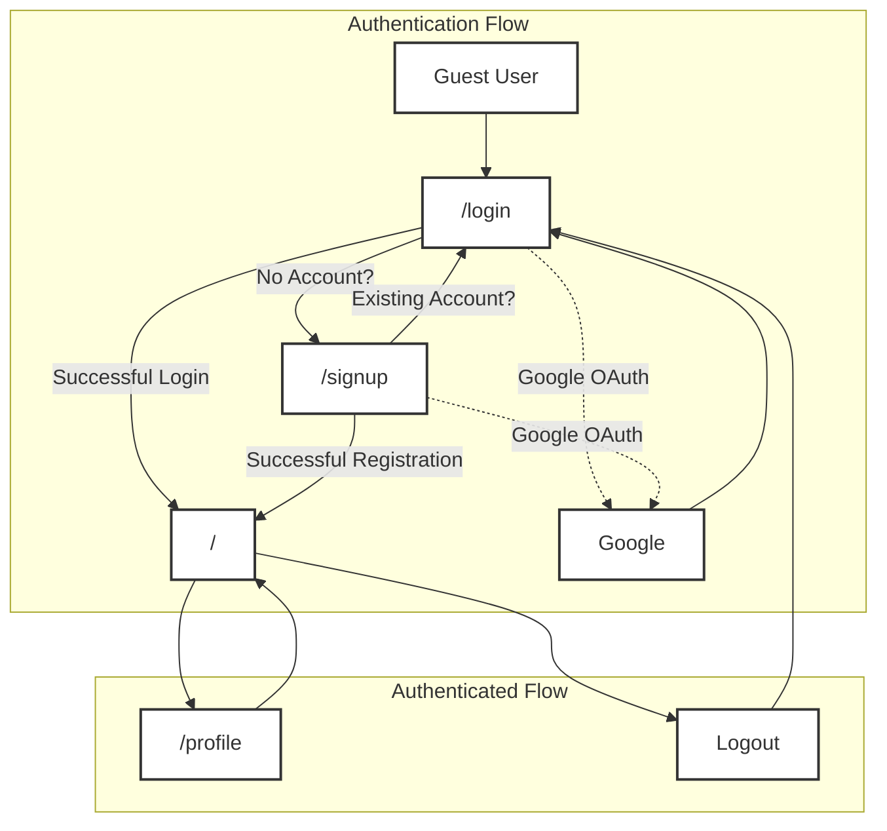

 # Pages and Navigation

This section outlines the core pages of the Chat Application frontend, detailing their purpose, associated routes, and the components that drive user interaction and navigation. Understanding these pages is crucial for grasping the application's overall structure and user experience flow.

## Application Pages Overview

The frontend of the application is composed of several key pages, each serving a distinct function:

*   **Home Page (`/`)**: The main interface for chat interactions.
*   **Login Page (`/login`)**: Handles user authentication and sign-in.
*   **Sign Up Page (`/signup`)**: Facilitates new user registration.
*   **Profile Page (`/profile`)**: Allows users to view and manage their profile information.

### Home Page (`HomePage.jsx`)

The `HomePage` is the central hub where users engage in conversations. It dynamically renders different components based on the user's interaction state, primarily whether a chat partner has been selected.

**Route**: `/`

**Key Features**:
*   Displays a `Sidebar` for navigating contacts.
*   Conditionally renders `ChatContainer` (if a user is selected) or `NoChatSelected` (if no user is selected).
*   Integrates `FriendsBox` for managing friend requests, shown only when `isFriendsBoxOpen` is true.

**Relevant File**: [`frontend/src/pages/HomePage.jsx`](https://github.com/shinymack/Chat-App-MERN/blob/main/frontend/src/pages/HomePage.jsx)

```jsx title="frontend/src/pages/HomePage.jsx" {12-14}
// import React from 'react'

import ChatContainer from "../components/ChatContainer";
import FriendsBox from "../components/FriendsBox";
import NoChatSelected from "../components/NoChatSelected";
import Sidebar from "../components/Sidebar";
import { useChatStore } from "../store/useChatStore"

const HomePage = () => {
  const { selectedUser } = useChatStore();
  const { isFriendsBoxOpen } = useChatStore();
  return (
      <div className="h-screen bg-base-200">
      <div className="flex items-center justify-center pt-20 px-4 w-full">
        <div className="bg-base-100 rounded-lg shadow-xl w-full max-w-6xl h-[calc(100vh-8rem)]">
          <div className="flex h-full rounded-lg overflow-hidden w-full">
            <Sidebar />
            {!selectedUser ? <NoChatSelected /> : <ChatContainer />}
            {isFriendsBoxOpen && <FriendsBox />}

          </div>

        </div>
      </div>
    </div>
  )
}

export default HomePage
```
This snippet shows how the `HomePage` dynamically switches between displaying `NoChatSelected` and `ChatContainer` based on the `selectedUser` state, and reveals the `FriendsBox` when `isFriendsBoxOpen` is true.

### Login Page (`LoginPage.jsx`)

The `LoginPage` provides the interface for existing users to sign into their accounts. It supports both email/password authentication and Google OAuth.

**Route**: `/login`

**Key Features**:
*   Form-based login with email and password.
*   Toggle visibility for the password field.
*   Integration with Google OAuth for third-party authentication.
*   Link to the sign-up page for new users.

**Relevant File**: [`frontend/src/pages/LoginPage.jsx`](https://github.com/shinymack/Chat-App-MERN/blob/main/frontend/src/pages/LoginPage.jsx)

```jsx title="frontend/src/pages/LoginPage.jsx" {23-28}
// ... (imports)
const LoginPage = () => {
  const [showPassword, setShowPassword] = useState(false);
  const [formData, setFormData] = useState({
    email: "",
    password: "",
  })
  const { login, isLoggingIn } = useAuthStore();

  const handleSubmit = async (e) => {
    e.preventDefault();
    login(formData);
  }
  const backendDomain = import.meta.env.VITE_BACKEND_URL;
  const googleAuthUrl = `${backendDomain}/api/auth/google`;
  return (
    <div className="h-screen grid lg:grid-cols-2">
      {/* Left Side - Form */}
      <div className="flex flex-col justify-center items-center p-6 sm:p-12">
        <div className="w-full max-w-md space-y-8">
          {/* Logo */}
          {/* ... (logo and text) */}

          {/* Form */}
          <form onSubmit={handleSubmit} className="space-y-6">
            {/* ... (email and password inputs) */}

            <button type="submit" className="btn btn-primary w-full" disabled={isLoggingIn}>
              {isLoggingIn ? (
                <>
                  <Loader2 className="h-5 w-5 animate-spin" />
                  Loading...
                </>
              ) : (
                "Sign in"
              )}
            </button>
          </form>
          <div className="divider text-base-content/60 my-4">OR</div>

          <a
            href={googleAuthUrl} // Link to your backend Google auth route
            className="btn btn-primary btn-outline w-full"
          >
            <FcGoogle className="size-5 mr-2" />
            Sign in with Google
          </a>

          <div className="text-center">
            <p className="text-base-content/60">
              Don&apos;t have an account?{" "}
              <Link to="/signup" className="link link-primary">
                Create account
              </Link>
            </p>
          </div>
        </div>
      </div>

      {/* Right Side - Image/Pattern */}
      <AuthImagePattern
        title={"Welcome back!"}
        subtitle={"Sign in to continue your conversations and catch up with your messages."}
      />
    </div>
  )
}

export default LoginPage
```
The `handleSubmit` function manages the form submission for email/password login, dispatching the `login` action from the `useAuthStore`. Google authentication is handled via a direct link to the backend's Google OAuth route.

### Sign Up Page (`SignUpPage.jsx`)

The `SignUpPage` is where new users can create an account using a username, email, and password. Similar to the login page, it also offers Google OAuth for convenience.

**Route**: `/signup`

**Key Features**:
*   Registration form for username, email, and password.
*   Client-side validation for input fields.
*   Password visibility toggle.
*   Google OAuth integration.
*   Link to the login page for existing users.

**Relevant File**: [`frontend/src/pages/SignUpPage.jsx`](https://github.com/shinymack/Chat-App-MERN/blob/main/frontend/src/pages/SignUpPage.jsx)

```jsx title="frontend/src/pages/SignUpPage.jsx" {20-27}
// ... (imports)
const SignUpPage = () => {
  const [showPassword, setShowPassword] = useState(false);
  const [formData, setFormData] = useState({
    username: "",
    email: "",
    password: "",
  });

  const { signup, IsSigningUp } = useAuthStore();

  const validateForm = () => {
    if(!formData.username.trim()) return toast.error("Username is required");
    if(!formData.email.trim()) return toast.error("Email is required");
    if (!/\S+@\S+\.\S+/.test(formData.email)) return toast.error("Invalid email format");
    if (!formData.password) return toast.error("Password is required");
    if (formData.password.length < 6) return toast.error("Password must be at least 6 characters");

    return true;
  };

  const handleSubmit = (e) => {
    e.preventDefault();

    const success = validateForm();
    if(success===true) signup(formData);
  };

  const backendDomain = import.meta.env.VITE_BACKEND_URL;
  const googleAuthUrl = `${backendDomain}/api/auth/google`;
  return (
    <div className="min-h-screen grid lg:grid-cols-2">
      {/* left side */}
      <div className="flex flex-col justify-center items-center p-6 sm:p-12">
        <div className="w-full max-w-md space-y-8">
          {/* LOGO */}
          {/* ... (logo and text) */}

          <form onSubmit={handleSubmit} className="space-y-6">
            {/* ... (username, email, password inputs) */}

            <button type="submit" className="btn btn-primary w-full" disabled={IsSigningUp}>
              {IsSigningUp ? (
                <>
                  <Loader2 className="size-5 animate-spin" />
                  Loading...
                </>
              ) : (
                "Create Account"
              )}
            </button>
          </form>
          <div className="divider text-base-content/60 my-4">OR</div>

          <a
            href={googleAuthUrl} // Link to your backend Google auth route
            className="btn btn-primary btn-outline w-full"
          >
            <FcGoogle className="size-5 mr-2" />
            Sign up with Google
          </a>

          <div className="text-center">
            <p className="text-base-content/60">
              Already have an account?{" "}
              <Link to="/login" className="link link-primary">
                Sign in
              </Link>
            </p>
          </div>
        </div>
      </div>

      {/* right side */}

      <AuthImagePattern
        title="Join our community"
        subtitle="Connect with friends, share moments, and stay in touch with your loved ones."
      />
    </div>
  );
};
export default SignUpPage;
```
The `validateForm` function ensures that user inputs meet the minimum requirements before the `signup` action is dispatched to the authentication store.

### Profile Page (`ProfilePage.jsx`)

The `ProfilePage` allows authenticated users to manage their personal information, specifically their profile picture and username.

**Route**: `/profile`

**Key Features**:
*   Display of current profile picture, username, and email.
*   Ability to upload and change the profile picture.
*   Editable username with real-time availability checking and debouncing.
*   Display of account creation date and status.

**Relevant File**: [`frontend/src/pages/ProfilePage.jsx`](https://github.com/shinymack/Chat-App-MERN/blob/main/frontend/src/pages/ProfilePage.jsx)

```jsx title="frontend/src/pages/ProfilePage.jsx" {32-49}
// ... (imports)
const ProfilePage = () => {
	const { authUser, isUpdatingProfile, updateProfile } = useAuthStore();
	const [selectedImg, setSelectedImg] = useState(null);

	const [isEditingUsername, setIsEditingUsername] = useState(false);
	const [newUsername, setNewUsername] = useState(authUser?.username || "");
	const [usernameStatus, setUsernameStatus] = useState({
		checking: false,
		available: true,
		message: "",
	});
	const debounceTimeout = useRef(null);


	const handleImageUpload = async (e) => {
		const file = e.target.files[0];
		if (!file) return;

		const reader = new FileReader();
		reader.readAsDataURL(file);

		reader.onload = async () => {
			const base64Image = reader.result;
			setSelectedImg(base64Image);
			// Let's call updateProfile from here
			await updateProfile({ profilePic: base64Image });
			// No need to call it again from the save button if you have one
		};
	};

	// --- Debounced Username Check ---
	useEffect(() => {
		clearTimeout(debounceTimeout.current);

		if (!newUsername.trim() || newUsername.trim().length < 3) {
			setUsernameStatus({ checking: false, available: false, message: "Must be 3+ characters." });
			return;
		}

		if (newUsername === authUser.username) {
			setUsernameStatus({ checking: false, available: true, message: "" });
			return;
		}

		setUsernameStatus((prev) => ({ ...prev, checking: true, message: "Checking..." }));

		debounceTimeout.current = setTimeout(async () => {
			try {
				const res = await axiosInstance.get(`/auth/username/check/${newUsername}`);
				setUsernameStatus({
					checking: false,
					available: res.data.available,
					message: res.data.message,
				});
			} catch (error) {
				const message = error.response?.data?.message || "Error checking username.";
				setUsernameStatus({ checking: false, available: false, message });
			}
		}, 500);

		return () => clearTimeout(debounceTimeout.current);
	}, [newUsername, authUser.username]);
	// ---------------------------------

	const handleSaveUsername = async () => {
		if (!usernameStatus.available || newUsername === authUser.username) {
			toast.error("Cannot save. Username is either unavailable or unchanged.");
			return;
		}
		await updateProfile({ username: newUsername });
		setIsEditingUsername(false);
	};

	const handleCancelEdit = () => {
		setIsEditingUsername(false);
		setNewUsername(authUser.username);
		setUsernameStatus({ checking: false, available: true, message: "" });
	};

	return (
		<div className="h-screen pt-20">
			{/* ... (page structure) */}

					{/* profilePic section */}
					<div className="flex flex-col items-center gap-4">
						<div className="relative">
							
							<label
								htmlFor="avatar-upload"
								className={`
                  absolute bottom-0 right-0
                  bg-base-content hover:scale-105
                  p-2 rounded-full cursor-pointer
                  transition-all duration-200
                  ${isUpdatingProfile ? "animate-pulse pointer-events-none" : ""}
                `}
							>
								<Camera className="w-5 h-5 text-base-200" />
								<input
									type="file"
									id="avatar-upload"
									className="hidden"
									accept="image/*"
									onChange={handleImageUpload}
									disabled={isUpdatingProfile}
								/>
							</label>
						</div>
						<p className="text-sm text-zinc-400">
							{isUpdatingProfile ? "Updating profile..." : "Click the camera icon to update your photo"}
						</p>
					</div>

					{/* User Info section  */}
					<div className="space-y-6">
						<div className="space-y-1.5">
							<div className="text-sm text-zinc-400 flex items-center gap-2">
								<User className="w-4 h-4" />
								Username
							</div>

							{/* --- Conditional Username Display/Edit --- */}
							{!isEditingUsername ? (
								<div className="flex items-center gap-2">
									<p className="px-4 py-2.5 bg-base-200 rounded-lg border flex-grow">
										{authUser?.username}
									</p>
									<button onClick={() => setIsEditingUsername(true)} className="btn btn-ghost btn-sm">
										<Edit className="w-4 h-4" />
									</button>
								</div>
							) : (
								<div className="space-y-2">
									<div className="flex items-center gap-2">
										<input
											type="text"
											value={newUsername}
											onChange={(e) => setNewUsername(e.target.value.toLowerCase())}
											className="input input-bordered w-full"
										/>
										<button onClick={handleSaveUsername} className="btn btn-success btn-sm" disabled={!usernameStatus.available || usernameStatus.checking || isUpdatingProfile}>
											{isUpdatingProfile ? <Loader2 className="w-4 h-4 animate-spin" /> : <Save className="w-4 h-4" />}
										</button>
										<button onClick={handleCancelEdit} className="btn btn-error btn-sm">
											<X className="w-4 h-4" />
										</button>
									</div>
									<div className={`text-xs h-4 ${usernameStatus.available ? 'text-green-500' : 'text-error'}`}>
										{usernameStatus.checking ? <Loader2 className="w-3 h-3 animate-spin inline-block mr-1" /> : null}
										{usernameStatus.message}
									</div>
								</div>
							)}
							{/* ------------------------------------------- */}
						</div>

						<div className="space-y-1.5">
							<div className="text-sm text-zinc-400 flex items-center gap-2">
								<Mail className="w-4 h-4" />
								Email Address
							</div>
							<p className="px-4 py-2.5 bg-base-200 rounded-lg border">{authUser?.email}</p>
						</div>
					</div>

					{/* Account Info Section */}
					<div className="mt-6 bg-base-300 rounded-xl p-6">
						<h2 className="text-lg font-medium  mb-4">Account Information</h2>
						<div className="space-y-3 text-sm">
							<div className="flex items-center justify-between py-2 border-b border-zinc-700">
								<span>Member Since</span>
								<span>{authUser.createdAt?.split("T")[0]}</span>
							</div>
							<div className="flex items-center justify-between py-2">
								<span>Account Status</span>
								<span className="text-green-500">Active</span>
							</div>
						</div>
					</div>
				</div>
			</div>
		</div>
	);
};

export default ProfilePage;
```
The `handleImageUpload` function captures a new profile picture, converts it to base64, and dispatches it to the `updateProfile` action. The `useEffect` hook, combined with `debounceTimeout`, implements a debounced check for username availability against the backend.

## Navigation Flow

User navigation through the application pages is managed primarily by `react-router-dom` and conditional rendering based on authentication status.





This diagram illustrates the primary user journey, from initial access (as a Guest) through authentication (Login/SignUp), to the main application (`HomePage`), and profile management (`ProfilePage`).

## Key Integration Points

*   **`react-router-dom`**: Manages client-side routing, ensuring seamless transitions between pages without full page reloads. The main `App.jsx` file defines these routes. [View `App.jsx` on GitHub](https://github.com/shinymack/Chat-App-MERN/blob/main/frontend/src/App.jsx).
*   **`useAuthStore` (Zustand)**: This global state store holds the `authUser` object and authentication-related functions (`login`, `signup`, `logout`). Page redirection often depends on the presence of `authUser` (e.g., redirecting from `/login` to `/` if already logged in). This is often managed in a `ProtectedRoutes` or `AuthChecker` component, or directly in the main router setup.
*   **Conditional Rendering**: Within `HomePage`, components like `ChatContainer`, `NoChatSelected`, and `FriendsBox` are conditionally rendered based on the `useChatStore` state (`selectedUser`, `isFriendsBoxOpen`), providing a dynamic user experience.
*   **Backend API Endpoints**: Authentication pages (`LoginPage`, `SignUpPage`) communicate directly with backend `/api/auth` endpoints for user registration, login, and Google OAuth. The `ProfilePage` also interacts with the backend to update user data (e.g., profile picture, username).

Next: [State Management and Utilities](./3.3_state-management-and-utilities.mdx)