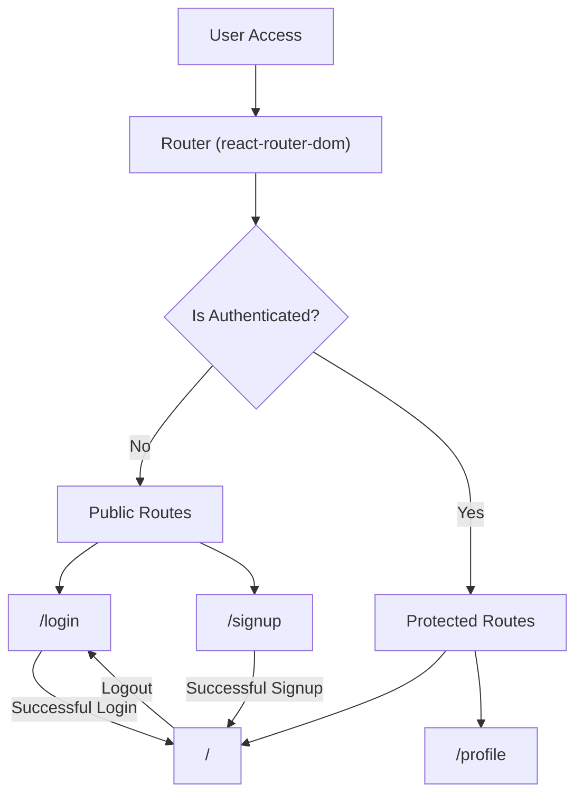
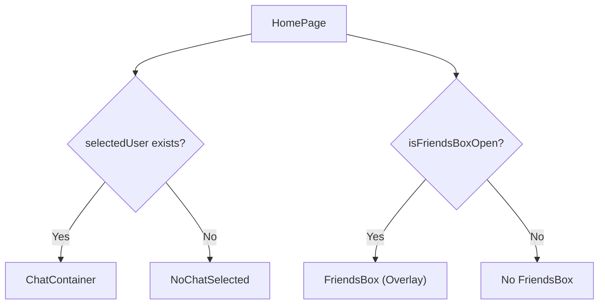

 # Pages and Routing

The frontend of the chat application is structured around several key pages, each serving a distinct purpose for user interaction. Navigation between these pages is managed using `react-router-dom`, providing a seamless single-page application experience. This section details the primary pages, their responsibilities, and how routing is implemented.

## Core Application Pages

The application features several dedicated pages to handle user authentication, profile management, and the main chat interface.

### Home Page (`HomePage.jsx`)

The `HomePage` serves as the primary hub for authenticated users, displaying the main chat interface. It conditionally renders either a chat conversation (if a user is selected) or a placeholder message, alongside a sidebar for navigation and a friends list.

*   **Path:** `/` (root route, accessible after authentication)
*   **Purpose:** Displays the main chat area, user sidebar, and friend list.
*   **Key Components:**
    *   `Sidebar`: For general navigation and user actions.
    *   `ChatContainer`: Renders the active chat conversation.
    *   `NoChatSelected`: Displayed when no specific chat is active.
    *   `FriendsBox`: A component to manage or view friends, conditionally rendered.

```jsx filename="frontend/src/pages/HomePage.jsx"
import ChatContainer from "../components/ChatContainer";
import FriendsBox from "../components/FriendsBox";
import NoChatSelected from "../components/NoChatSelected";
import Sidebar from "../components/Sidebar";
import { useChatStore } from "../store/useChatStore"

const HomePage = () => {
  const { selectedUser } = useChatStore();
  const { isFriendsBoxOpen } = useChatStore();
  return (
      <div className="h-screen bg-base-200">
      <div className="flex items-center justify-center pt-20 px-4 w-full">
        <div className="bg-base-100 rounded-lg shadow-xl w-full max-w-6xl h-[calc(100vh-8rem)]">
          <div className="flex h-full rounded-lg overflow-hidden w-full">
            <Sidebar />
            {!selectedUser ? <NoChatSelected /> : <ChatContainer />}
            {isFriendsBoxOpen && <FriendsBox />}
          </div>
        </div>
      </div>
    </div>
  )
}

export default HomePage
```
[View on GitHub](https://github.com/shinymack/Chat-App-MERN/blob/main/frontend/src/pages/HomePage.jsx)

### Login Page (`LoginPage.jsx`)

The `LoginPage` provides the interface for users to authenticate into the application using their email and password, or through Google OAuth. It includes form validation and visual feedback during the login process.

*   **Path:** `/login`
*   **Purpose:** User authentication.
*   **Features:**
    *   Email and password input fields.
    *   Password visibility toggle.
    *   Integration with `useAuthStore` for login logic.
    *   Link to Google OAuth for external authentication.
    *   Navigation link to the sign-up page.

```jsx filename="frontend/src/pages/LoginPage.jsx"
import { useState } from "react"
import { useAuthStore } from "../store/useAuthStore";
import { Eye, EyeOff, Loader2, Lock, Mail, MessageSquare } from "lucide-react";
import { Link } from "react-router-dom";
import AuthImagePattern from "../components/AuthImagePattern";
import { FcGoogle } from "react-icons/fc";

const LoginPage = () => {
  const [showPassword, setShowPassword] = useState(false);
  const [formData, setFormData] = useState({
    email: "",
    password: "",
  })
  const { login, isLoggingIn } = useAuthStore();

  const handleSubmit = async (e) => {
    e.preventDefault();
    login(formData);
  }
  const backendDomain = import.meta.env.VITE_BACKEND_URL;
  const googleAuthUrl = `${backendDomain}/api/auth/google`;
  return (
    <div className="h-screen grid lg:grid-cols-2">
      {/* Left Side - Form */}
      <div className="flex flex-col justify-center items-center p-6 sm:p-12">
        {/* ... form content ... */}
          <form onSubmit={handleSubmit} className="space-y-6">
            <div className="form-control">
              <label className="label">
                <span className="label-text font-medium">Email</span>
              </label>
              <div className="relative">
                <input
                  type="email"
                  className={`input input-bordered w-full pl-10`}
                  placeholder="you@example.com"
                  value={formData.email}
                  onChange={(e) => setFormData({ ...formData, email: e.target.value })}
                />
              </div>
            </div>
            {/* ... other form fields and buttons ... */}
          </form>
          <div className="divider text-base-content/60 my-4">OR</div>
          <a
            href={googleAuthUrl} // Link to your backend Google auth route
            className="btn btn-primary btn-outline w-full"
          >
            <FcGoogle className="size-5 mr-2" />
            Sign in with Google
          </a>
          <div className="text-center">
            <p className="text-base-content/60">
              Don&apos;t have an account?{" "}
              <Link to="/signup" className="link link-primary">
                Create account
              </Link>
            </p>
          </div>
        </div>
      </div>
      <AuthImagePattern
        title={"Welcome back!"}
        subtitle={"Sign in to continue your conversations and catch up with your messages."}
      />
    </div>
  )
}

export default LoginPage
```
[View on GitHub](https://github.com/shinymack/Chat-App-MERN/blob/main/frontend/src/pages/LoginPage.jsx)

### Sign Up Page (`SignUpPage.jsx`)

The `SignUpPage` facilitates the creation of new user accounts. Users can register by providing a username, email, and password, or by using Google OAuth. Basic client-side validation ensures data integrity before submission.

*   **Path:** `/signup`
*   **Purpose:** New user registration.
*   **Features:**
    *   Username, email, and password input fields.
    *   Password visibility toggle.
    *   Client-side validation using `toast` notifications.
    *   Integration with `useAuthStore` for signup logic.
    *   Link to Google OAuth for external registration.
    *   Navigation link to the login page.

```jsx filename="frontend/src/pages/SignUpPage.jsx"
import { useState } from "react";
import { useAuthStore } from "../store/useAuthStore";
import { MessageSquare, User, Mail, Lock, EyeOff, Eye, Loader2 } from "lucide-react";
import { Link } from "react-router-dom";
import AuthImagePattern from "../components/AuthImagePattern";
import toast from "react-hot-toast";

import { FcGoogle } from "react-icons/fc";
const SignUpPage = () => {
  const [showPassword, setShowPassword] = useState(false);
  const [formData, setFormData] = useState({
    username: "",
    email: "",
    password: "",
  });

  const { signup, IsSigningUp } = useAuthStore();

  const validateForm = () => { /* ... validation logic ... */ return true; };

  const handleSubmit = (e) => {
    e.preventDefault();
    const success = validateForm();
    if(success===true) signup(formData);
  };

  const backendDomain = import.meta.env.VITE_BACKEND_URL;
  const googleAuthUrl = `${backendDomain}/api/auth/google`;
  return (
    <div className="min-h-screen grid lg:grid-cols-2">
      {/* left side */}
      <div className="flex flex-col justify-center items-center p-6 sm:p-12">
        {/* ... form content ... */}
          <form onSubmit={handleSubmit} className="space-y-6">
            <div className="form-control">
              <label className="label">
                <span className="label-text font-medium">Username</span>
              </label>
              <div className="relative">
                <input
                  type="text"
                  className={`input input-bordered w-full pl-10`}
                  placeholder="johndoe"
                  value={formData.username}
                  onChange={(e) => setFormData({ ...formData, username: e.target.value })}
                />
              </div>
            </div>
            {/* ... other form fields and buttons ... */}
          </form>
          <div className="divider text-base-content/60 my-4">OR</div>
          <a
            href={googleAuthUrl} // Link to your backend Google auth route
            className="btn btn-primary btn-outline w-full"
          >
            <FcGoogle className="size-5 mr-2" />
            Sign up with Google
          </a>
          <div className="text-center">
            <p className="text-base-content/60">
              Already have an account?{" "}
              <Link to="/login" className="link link-primary">
                Sign in
              </Link>
            </p>
          </div>
        </div>
      </div>
      <AuthImagePattern
        title="Join our community"
        subtitle="Connect with friends, share moments, and stay in touch with your loved ones."
      />
    </div>
  );
};
export default SignUpPage;
```
[View on GitHub](https://github.com/shinymack/Chat-App-MERN/blob/main/frontend/src/pages/SignUpPage.jsx)

### Profile Page (`ProfilePage.jsx`)

The `ProfilePage` allows authenticated users to view and update their profile information, specifically their profile picture and username. It includes a debounced mechanism for username availability checking to enhance user experience.

*   **Path:** `/profile`
*   **Purpose:** Display and edit user profile details.
*   **Features:**
    *   Profile picture upload and update functionality.
    *   Editable username with debounced availability check using `axiosInstance`.
    *   Displays email, member since date, and account status.
    *   Integration with `useAuthStore` for profile updates.

```jsx filename="frontend/src/pages/ProfilePage.jsx"
import { useState, useEffect, useRef } from "react";
import { useAuthStore } from "../store/useAuthStore";
import { Camera, Mail, User, Edit, Save, X, Loader2 } from "lucide-react";
import toast from "react-hot-toast";
import { axiosInstance } from "../lib/axios";

const ProfilePage = () => {
	const { authUser, isUpdatingProfile, updateProfile } = useAuthStore();
	const [selectedImg, setSelectedImg] = useState(null);

	const [isEditingUsername, setIsEditingUsername] = useState(false);
	const [newUsername, setNewUsername] = useState(authUser?.username || "");
	const [usernameStatus, setUsernameStatus] = useState({
		checking: false,
		available: true,
		message: "",
	});
	const debounceTimeout = useRef(null);

	const handleImageUpload = async (e) => {
		const file = e.target.files[0];
		if (!file) return;

		const reader = new FileReader();
		reader.readAsDataURL(file);

		reader.onload = async () => {
			const base64Image = reader.result;
			setSelectedImg(base64Image);
			await updateProfile({ profilePic: base64Image });
		};
	};

	useEffect(() => {
		clearTimeout(debounceTimeout.current);
		if (!newUsername.trim() || newUsername.trim().length < 3) {
			setUsernameStatus({ checking: false, available: false, message: "Must be 3+ characters." });
			return;
		}
		if (newUsername === authUser.username) {
			setUsernameStatus({ checking: false, available: true, message: "" });
			return;
		}
		setUsernameStatus((prev) => ({ ...prev, checking: true, message: "Checking..." }));
		debounceTimeout.current = setTimeout(async () => {
			try {
				const res = await axiosInstance.get(`/auth/username/check/${newUsername}`);
				setUsernameStatus({
					checking: false,
					available: res.data.available,
					message: res.data.message,
				});
			} catch (error) {
				const message = error.response?.data?.message || "Error checking username.";
				setUsernameStatus({ checking: false, available: false, message });
			}
		}, 500);
		return () => clearTimeout(debounceTimeout.current);
	}, [newUsername, authUser.username]);

	const handleSaveUsername = async () => {
		if (!usernameStatus.available || newUsername === authUser.username) {
			toast.error("Cannot save. Username is either unavailable or unchanged.");
			return;
		}
		await updateProfile({ username: newUsername });
		setIsEditingUsername(false);
	};

	const handleCancelEdit = () => {
		setIsEditingUsername(false);
		setNewUsername(authUser.username);
		setUsernameStatus({ checking: false, available: true, message: "" });
	};

	return (
		<div className="h-screen pt-20">
			<div className="max-w-2xl mx-auto p-4 py-8">
				{/* ... profile content ... */}
			</div>
		</div>
	);
};

export default ProfilePage;
```
[View on GitHub](https://github.com/shinymack/Chat-App-MERN/blob/main/frontend/src/pages/ProfilePage.jsx)

The `useEffect` hook in `ProfilePage.jsx` implements a debounced username check, preventing excessive API calls as the user types.

```jsx filename="frontend/src/pages/ProfilePage.jsx" {64-90}
// ... (previous code)

	// --- Debounced Username Check ---
	useEffect(() => {
		// Clear any existing timer when newUsername changes
		clearTimeout(debounceTimeout.current);

		if (!newUsername.trim() || newUsername.trim().length < 3) {
			setUsernameStatus({ checking: false, available: false, message: "Must be 3+ characters." });
			return;
		}

		if (newUsername === authUser.username) {
			setUsernameStatus({ checking: false, available: true, message: "" });
			return;
		}

		setUsernameStatus((prev) => ({ ...prev, checking: true, message: "Checking..." }));

		debounceTimeout.current = setTimeout(async () => {
			try {
				const res = await axiosInstance.get(`/auth/username/check/${newUsername}`);
				setUsernameStatus({
					checking: false,
					available: res.data.available,
					message: res.data.message,
				});
			} catch (error) {
				const message = error.response?.data?.message || "Error checking username.";
				setUsernameStatus({ checking: false, available: false, message });
			}
		}, 500); // 500ms debounce delay

		// Cleanup function to clear timeout on component unmount
		return () => clearTimeout(debounceTimeout.current);
	}, [newUsername, authUser.username]);
	// ---------------------------------

// ... (rest of the code)
```
[View on GitHub](https://github.com/shinymack/Chat-App-MERN/blob/main/frontend/src/pages/ProfilePage.jsx#L64-L90)

## Routing Flow

The routing within the frontend is managed by `react-router-dom`, defining public and protected routes. Authentication status, typically managed by a global state (e.g., `useAuthStore`), dictates access to certain pages.





## Key Integration Points

### Authentication State and Navigation Guards

The `useAuthStore` plays a critical role in controlling navigation. When a user successfully logs in or signs up, their authentication status is updated, triggering a redirect to the `HomePage`. Conversely, logging out directs the user back to the `LoginPage`. This ensures that protected routes are only accessible to authenticated users.

The `AuthImagePattern` component is used across authentication pages (`LoginPage`, `SignUpPage`) to provide a consistent visual background.

```jsx filename="frontend/src/components/AuthImagePattern.jsx"
// Simplified for brevity, typically contains styling and placeholder content
const AuthImagePattern = ({ title, subtitle }) => {
  return (
    <div className="hidden lg:flex relative bg-base-300 items-center justify-center p-12">
      <div className="absolute inset-0 bg-gradient-to-br from-primary/20 via-transparent to-secondary/20 z-0"></div>
      <div className="relative z-10 text-center text-white space-y-4">
        <h2 className="text-3xl font-bold">{title}</h2>
        <p className="text-lg opacity-80">{subtitle}</p>
      </div>
    </div>
  );
};
export default AuthImagePattern;
```
[View on GitHub](https://github.com/shinymack/Chat-App-MERN/blob/main/frontend/src/components/AuthImagePattern.jsx) (note: exact file might differ, but concept applies)

### Dynamic Chat Rendering

The `HomePage` dynamically renders either `ChatContainer` or `NoChatSelected` based on the `selectedUser` state from `useChatStore`. This pattern allows for a flexible UI that adapts to user interactions without full page reloads. The `FriendsBox` also appears conditionally, enabling an overlay for friend management.





Next: [State Management and Utilities](./3.3_state-management-utilities.mdx)