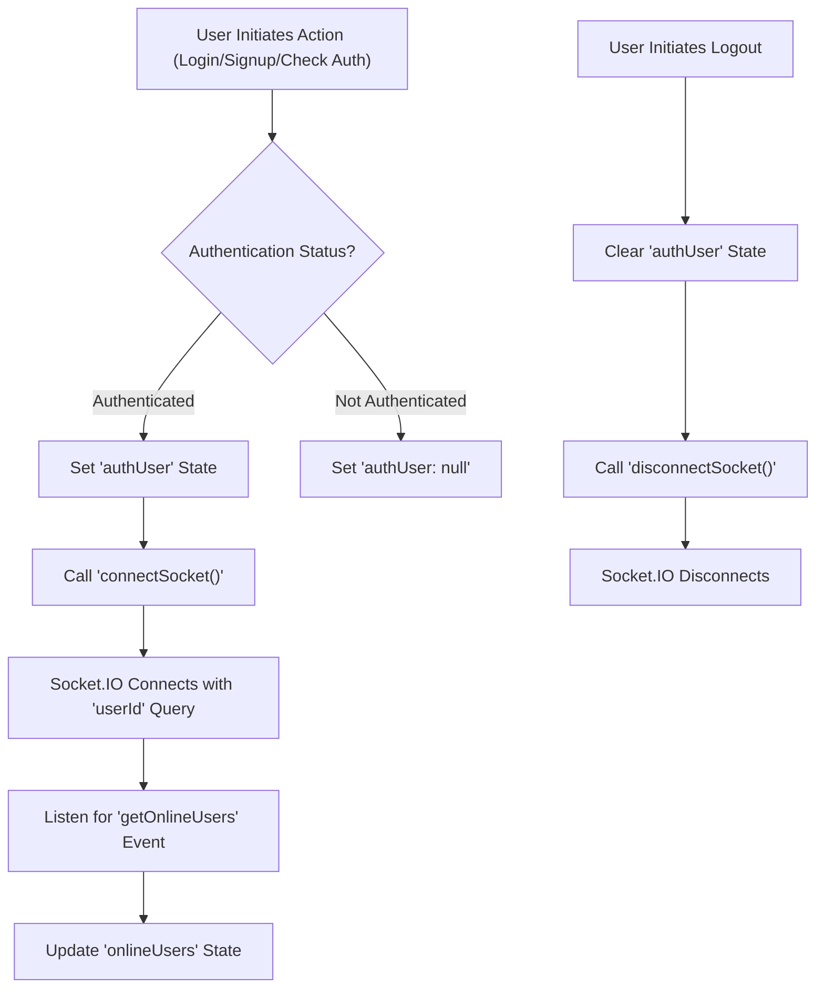
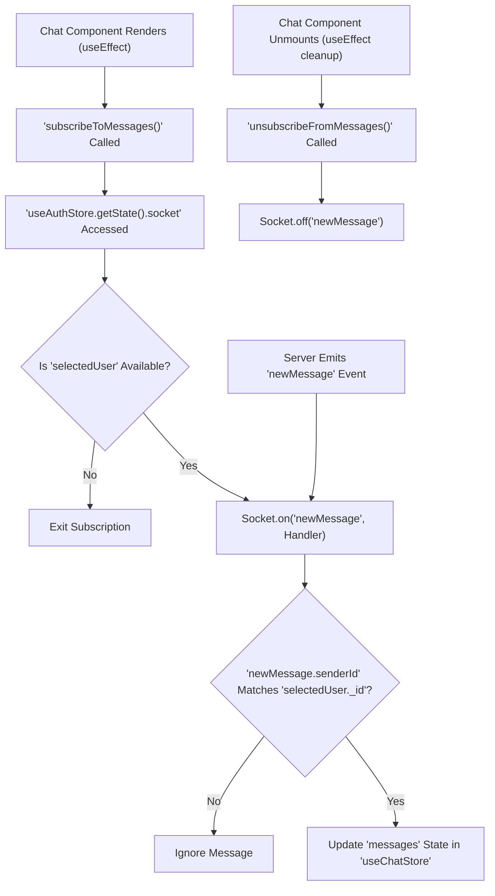

 # State Management and Utilities

This section details the core mechanisms for managing application state and common utility functions within the frontend. The application leverages Zustand for reactive state management, providing a lightweight and efficient way to share data across components. API interactions are standardized through an Axios instance, while general helpers are grouped in a dedicated utilities file.

## Centralized API Configuration with Axios

The `axios.js` file establishes a pre-configured Axios instance, `axiosInstance`, which simplifies API requests throughout the application. This setup centralizes configurations like the base URL and ensures credentials are sent with every request, crucial for authenticated operations.

### Key Features
*   **Base URL Management**: Dynamically sets the API base URL based on the environment (development or production).
*   **Credential Handling**: Automatically includes cookies and authorization headers with `withCredentials: true`, essential for session management.

### Implementation
The `axiosInstance` is exported and imported by various state stores (`useAuthStore`, `useChatStore`) to perform API calls, ensuring consistency and reducing boilerplate.

```javascript
// frontend/src/lib/axios.js
import axios from "axios";

export const axiosInstance = axios.create({
    baseURL: import.meta.env.MODE == "development" ? "http://localhost:5001/api": "/api",
    withCredentials: true,
});
```
[View on GitHub](https://github.com/shinymack/Chat-App-MERN/blob/main/frontend/src/lib/axios.js)

## General Utility Functions

The `utils.js` file houses common helper functions that perform various tasks not directly related to state management or API interaction. These utilities enhance user experience by formatting data or providing common transformations.

### `formatMessageTime`

This utility function is responsible for formatting timestamps into a user-friendly date and time string, including year, month, day, hour, and minute, along with AM/PM indicator. This is particularly useful for displaying message timestamps in the chat interface.

```javascript
// frontend/src/lib/utils.js
export function formatMessageTime(date) {
    return new Date(date).toLocaleTimeString("en-US", {
        year: "numeric",
        month: "short",
        day:"2-digit",
        hour: "2-digit",
        minute: "2-digit",
        hour12: true,
    });
}
```
[View on GitHub](https://github.com/shinymack/Chat-App-MERN/blob/main/frontend/src/lib/utils.js)

## Zustand State Management

Zustand is used for managing the application's global state, offering a simple and performant approach. The application defines two primary stores: `useAuthStore` for authentication and user-related data, and `useChatStore` for chat-specific state and logic.

### Authentication State (`useAuthStore`)

The `useAuthStore` manages all authentication-related state, including the authenticated user, online users, and the WebSocket connection for real-time updates. It encapsulates actions for signup, login, logout, profile updates, and authentication checks.

#### Key States
*   `authUser`: The currently authenticated user object.
*   `isSigningUp`, `isLoggingIn`, `isUpdatingProfile`, `isCheckingAuth`: Boolean flags to indicate the status of various authentication operations.
*   `onlineUsers`: An array of user IDs currently online, received via WebSocket.
*   `socket`: The WebSocket connection instance (Socket.IO).

#### Key Actions
*   `checkAuth()`: Verifies user authentication status on application load.
*   `signup(data)`: Registers a new user.
*   `login(data)`: Authenticates an existing user.
*   `logout()`: Clears user session and disconnects the WebSocket.
*   `updateProfile(data)`: Updates the `authUser`'s profile information.
*   `connectSocket()`: Establishes a WebSocket connection for the authenticated user.
*   `disconnectSocket()`: Closes the WebSocket connection.

```javascript
// frontend/src/store/useAuthStore.js - Excerpt
import { create } from "zustand";
import { axiosInstance } from "../lib/axios";
import toast from "react-hot-toast";
import { io } from "socket.io-client";

const BASE_URL = import.meta.env.MODE == "development" ? "http://localhost:5001": "/";

export const useAuthStore = create((set, get) => ({
    authUser: null,
    isSigningUp: false,
    isLoggingIn: false,
    isUpdatingProfile: false,
    isCheckingAuth: true,
    onlineUsers: [],
    socket: null,

    checkAuth: async () => { /* ... */ },
    signup: async (data) => { /* ... */ },
    logout: async () => { /* ... */ },
    login: async (data) => { /* ... */ },
    updateProfile: async (data) => { /* ... */ },

    connectSocket: () => {
        const { authUser } = get();
        if(!authUser || get().socket?.connected) return;

        const socket = io(BASE_URL, {
            query: {
                userId : authUser._id,
            },
        });
        socket.connect();
        set({socket: socket});

        socket.on("getOnlineUsers", (userIds) => {
            set({onlineUsers: userIds})
        }); 
    },

    disconnectSocket : () => {
        if(get().socket?.connected) get().socket.disconnect();
    }
}));
```
[View on GitHub](https://github.com/shinymack/Chat-App-MERN/blob/main/frontend/src/store/useAuthStore.js)

#### Authentication Flow Diagram
The following diagram illustrates the typical authentication flow, including WebSocket connection management.





### Chat State (`useChatStore`)

The `useChatStore` manages all chat-specific data and interactions, including messages, user lists, friend requests, and sending/receiving messages. It integrates with `useAuthStore` to utilize the established WebSocket connection for real-time messaging.

#### Key States
*   `messages`: Array of messages in the currently selected chat.
*   `users`: Array of the current user's friends.
*   `pendingRequests`: Array of incoming friend requests.
*   `sentRequests`: Array of outgoing friend requests.
*   `selectedUser`: The user currently selected for chat.
*   `isUsersLoading`, `isMessagesLoading`: Flags for loading states.
*   `isFriendBoxOpen`: Boolean to control visibility of friend management UI.

#### Key Actions
*   `toggleFriendsBox()`: Toggles the visibility of the friends management UI.
*   `getFriends()`: Fetches the list of friends for the `authUser`.
*   `getPendingRequests()`: Retrieves friend requests waiting for approval.
*   `getSentRequests()`: Retrieves friend requests that have been sent.
*   `sendFriendRequest(identifier)`: Sends a new friend request.
*   `acceptFriendRequest(senderId)`: Accepts an incoming friend request.
*   `rejectFriendRequest(senderId)`: Rejects an incoming friend request.
*   `removeFriend(friendId)`: Removes an existing friend.
*   `getMessages(userId)`: Fetches chat messages for a specific user.
*   `sendMessage(messageData)`: Sends a new message to the `selectedUser`.
*   `subscribeToMessages()`: Subscribes to new message events via WebSocket.
*   `unsubscribeFromMessages()`: Unsubscribes from new message events.
*   `setSelectedUser(user)`: Sets the `selectedUser` for the chat interface.

```javascript
// frontend/src/store/useChatStore.js - Excerpt
import toast from "react-hot-toast";
import { create } from "zustand";
import { axiosInstance } from "../lib/axios";
import { useAuthStore } from "./useAuthStore";

export const useChatStore = create((set, get) => ({
    messages:[],
    users: [],
    pendingRequests: [],
    sentRequests: [],
    selectedUser: null,
    isUsersLoading: false,
    isMessagesLoading: false,
    isFriendBoxOpen: false,

    toggleFriendsBox: () => set(state => ({ isFriendsBoxOpen: !state.isFriendsBoxOpen })),
    getFriends: async () => { /* ... */ },
    getPendingRequests: async () => { /* ... */ },
    getSentRequests: async () => { /* ... */ },
    sendFriendRequest: async (identifier) => { /* ... */ },
    acceptFriendRequest: async (senderId) => { /* ... */ },
    rejectFriendRequest: async (senderId) => { /* ... */ },
    removeFriend: async (friendId) => { /* ... */ },
    getMessages: async (userId) => { /* ... */ },
    sendMessage: async (messageData) => { /* ... */ },

    subscribeToMessages: () => {
        const { selectedUser } = get();
        if(!selectedUser) return;
        
        const socket = useAuthStore.getState().socket;
        socket.on("newMessage", (newMessage) => {
            if(newMessage.senderId !== selectedUser._id) return
            set({
                messages: [...get().messages, newMessage]
            })
        })
    },

    unsubscribeFromMessages: () => {
        const socket = useAuthStore.getState().socket;
        socket.off("newMessage");
    },
    
    setSelectedUser: (selectedUser) => set({selectedUser})
}))
```
[View on GitHub](https://github.com/shinymack/Chat-App-MERN/blob/main/frontend/src/store/useChatStore.js)

#### Real-time Message Flow Diagram
This diagram illustrates how `useChatStore` integrates with the `useAuthStore`'s socket to handle real-time message updates.





## Key Integration Points

*   **AxiosInstance**: Both `useAuthStore` and `useChatStore` rely on the `axiosInstance` for all their API communication. This ensures consistent request headers, base URLs, and credential handling across the application.
*   **Zustand Inter-store Communication**: The `useChatStore` directly accesses the `socket` instance from `useAuthStore` using `useAuthStore.getState().socket`. This pattern allows the chat store to subscribe to and manage real-time events without duplicating the socket connection logic or state.
*   **Real-time Updates**: User authentication status (via `checkAuth`) triggers the WebSocket connection, which then enables features like `onlineUsers` in `useAuthStore` and `newMessage` subscriptions in `useChatStore`.
*   **Toast Notifications**: Both stores utilize `react-hot-toast` to provide immediate feedback to the user on the success or failure of various operations (e.g., login success, friend request sent, profile update error).

These integrations form a robust foundation for managing user sessions, handling dynamic data, and providing a real-time interactive experience.

Next: [Pages and Navigation](./3.3_pages-and-navigation.mdx)