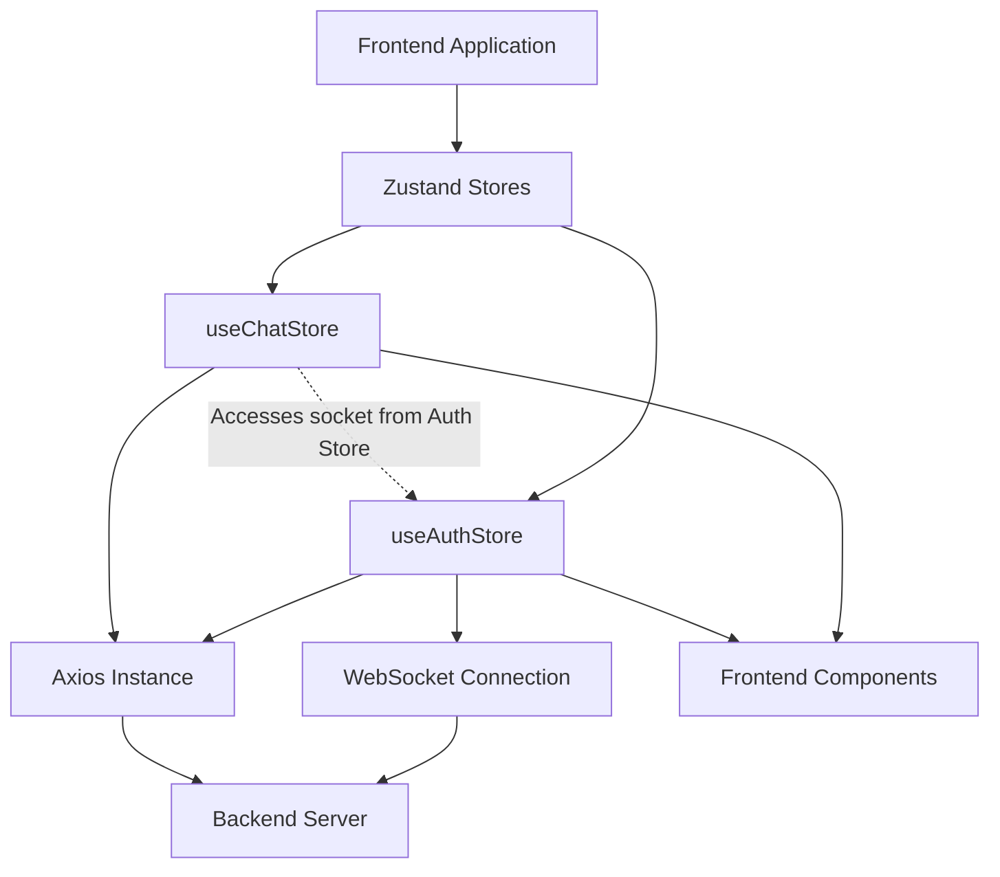
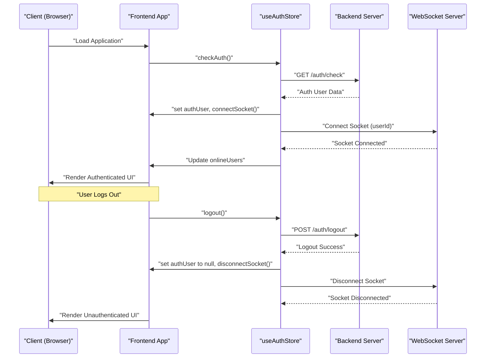

 # State Management and Utilities

This section details the core mechanisms for managing application state within the frontend, primarily leveraging [Zustand](https://zustand-bear.github.io/zustand/) for a lightweight and scalable approach. It also covers essential utility functions and the `axios` instance configuration for API communication. Effective state management is crucial for maintaining a responsive and predictable user interface, especially in a real-time application like a chat client.

The frontend's state is encapsulated within two main Zustand stores: `useAuthStore` for user authentication, online status, and WebSocket management, and `useChatStore` for handling chat-specific data like messages, user lists, and friend requests. These stores provide a centralized, yet modular, way to manage global and feature-specific states.

## Global State Management with Zustand

Zustand is a small, fast, and scalable bear-bones state-management solution. It's often praised for its simplicity and un-opinionated nature, making it a flexible choice for React applications.

### Authentication and User State (`useAuthStore`)

The `useAuthStore` is responsible for managing the authenticated user's data, their authentication status, and the WebSocket connection. It acts as the central hub for user-related actions such as login, signup, logout, and profile updates.

**Key Features:**

*   **`authUser`**: Stores the currently authenticated user's object.
*   **Loading States**: `isSigningUp`, `isLoggingIn`, `isUpdatingProfile`, `isCheckingAuth` provide feedback on ongoing authentication operations.
*   **`onlineUsers`**: An array of user IDs representing currently online users, updated via WebSocket.
*   **`socket`**: Holds the WebSocket connection instance, managed by `connectSocket` and `disconnectSocket`.

#### Authentication Flow

The authentication process involves several asynchronous actions, all managed within `useAuthStore` to ensure a consistent state across the application.

```jsx
// frontend/src/store/useAuthStore.js
import { create } from "zustand";
import { axiosInstance } from "../lib/axios";
import toast from "react-hot-toast";
import { io } from "socket.io-client";

const BASE_URL = import.meta.env.MODE == "development" ? "http://localhost:5001": "/";

export const useAuthStore = create((set, get) => ({
    authUser: null,
    isSigningUp: false,
    isLoggingIn: false,
    isUpdatingProfile: false,
    isCheckingAuth: true,
    onlineUsers: [],
    socket: null,

    checkAuth: async () => {
        try {
            const res = await axiosInstance.get("/auth/check");
            set({ authUser: res.data });
            get().connectSocket(); // Connect socket upon successful auth
        } catch (error) {
            set({ authUser: null });
            console.log("Error in checkAuth: ", error);
        } finally {
            set({ isCheckingAuth: false });
        }
    },

    signup: async (data) => {
        set({ isSigningUp: true });
        try {
            const res = await axiosInstance.post("/auth/signup", data);
            set({ authUser: res.data });
            toast.success("Account created successfully");
            get().connectSocket(); // Connect socket after signup
        } catch (error) {
            toast.error(error.response.data.message);
        } finally {
            set({ isSigningUp: false });
        }
    },
    // ... other auth actions (login, logout, updateProfile)
}));
```
[View on GitHub](https://github.com/shinymack/Chat-App-MERN/blob/main/frontend/src/store/useAuthStore.js#L14-L44)

#### WebSocket Integration

The `useAuthStore` also handles the lifecycle of the WebSocket connection. The socket is instantiated and connected after a user successfully authenticates (`checkAuth`, `signup`, `login`) and disconnected upon `logout`. This ensures that real-time features like online user status and new messages are only active when a user is authenticated.

```jsx
// frontend/src/store/useAuthStore.js
// ... (imports and initial state)

export const useAuthStore = create((set, get) => ({
    // ... (state properties and auth actions)

    connectSocket: () => {
        const { authUser } = get();
        if(!authUser || get().socket?.connected) return;

        const socket = io(BASE_URL, {
            query: {
                userId : authUser._id,
            },
        });
        socket.connect();
        set({socket: socket});

        socket.on("getOnlineUsers", (userIds) => {
            set({onlineUsers: userIds})
        }); 
    },

    disconnectSocket : () => {
        if(get().socket?.connected) get().socket.disconnect();
    }
}));
```
[View on GitHub](https://github.com/shinymack/Chat-App-MERN/blob/main/frontend/src/store/useAuthStore.js#L95-L113)

This design ensures that the WebSocket connection is tightly coupled with the user's authentication status, preventing unnecessary connections and simplifying the logic for real-time updates.

### Chat-Specific State (`useChatStore`)

The `useChatStore` manages all data related to chat functionalities, including messages, user lists, friend requests, and the currently selected chat partner.

**Key Features:**

*   **`messages`**: An array holding the messages of the currently selected chat.
*   **`users`**: List of friends of the authenticated user.
*   **`pendingRequests`**: Friend requests received by the user.
*   **`sentRequests`**: Friend requests sent by the user.
*   **`selectedUser`**: The `User` object of the user currently selected for chat.
*   **Loading States**: `isUsersLoading`, `isMessagesLoading` for data fetching feedback.
*   **`isFriendBoxOpen`**: Boolean to control the visibility of the friend management UI.

#### Friend Management

The `useChatStore` encapsulates all friend-related actions, from fetching lists to sending, accepting, rejecting, and removing friends. Each action integrates with `axiosInstance` to communicate with the backend API and updates the relevant state.

```jsx
// frontend/src/store/useChatStore.js
import toast from "react-hot-toast";
import { create } from "zustand";
import { axiosInstance } from "../lib/axios";

export const useChatStore = create((set, get) => ({
    messages:[],
    users: [],
    pendingRequests: [],
    sentRequests: [],
    selectedUser: null,
    isUsersLoading: false,
    isMessagesLoading: false,
    isFriendBoxOpen: false,

    toggleFriendsBox: () => set(state => ({ isFriendsBoxOpen: !state.isFriendBoxOpen })),

    getFriends: async () => {
        set({isUsersLoading: true});
        try {
            const res = await axiosInstance.get("/friends/list");
            set({ users: res.data});
        } catch (error) {
            toast.error(error.response?.data?.message || "Failed to fetch friends");
        } finally {
            set({ isUsersLoading: false});
        }
    },
    // ... other friend request actions (getPendingRequests, sendFriendRequest, acceptFriendRequest, etc.)
}));
```
[View on GitHub](https://github.com/shinymack/Chat-App-MERN/blob/main/frontend/src/store/useChatStore.js#L11-L40)

#### Message Management and Real-time Updates

Similar to friend management, `useChatStore` handles fetching and sending messages. It also subscribes to WebSocket events for real-time message reception. This subscription is context-aware, only adding incoming messages to the `messages` array if they belong to the `selectedUser`.

```jsx
// frontend/src/store/useChatStore.js
// ... (imports and initial state)
import { useAuthStore } from "./useAuthStore"; // Import useAuthStore for socket access

export const useChatStore = create((set, get) => ({
    // ... (state properties and friend actions)

    getMessages: async (userId) => {
        set({isMessagesLoading: true});
        try {
            const res = await axiosInstance.get(`/messages/${userId}`);
            set({messages: res.data});
        } catch (error) {
            toast.error(error.response.data.message);
        } finally {
            set({isMessagesLoading: false});
        }
    },
    sendMessage: async (messageData) => {
        const {selectedUser, messages} = get();
        try {
            const res = await axiosInstance.post(`/messages/send/${selectedUser._id}`, messageData);
            set({messages : [...messages, res.data]});
        } catch (error){
            toast.error(error.response.data.message);
        }
    },

    subscribeToMessages: () => {
        const { selectedUser } = get();
        if(!selectedUser) return;
        
        const socket = useAuthStore.getState().socket; // Access socket from auth store
        socket.on("newMessage", (newMessage) => {
            if(newMessage.senderId !== selectedUser._id) return // Only add messages for the selected user
            set({
                messages: [...get().messages, newMessage]
            })
        })
    },

    unsubscribeFromMessages: () => {
        const socket = useAuthStore.getState().socket;
        socket.off("newMessage");
    },
    
    setSelectedUser: (selectedUser) => set({selectedUser})
}));
```
[View on GitHub](https://github.com/shinymack/Chat-App-MERN/blob/main/frontend/src/store/useChatStore.js#L118-L157)

This approach demonstrates how Zustand stores can interact, with `useChatStore` relying on the `socket` instance managed by `useAuthStore` to handle real-time message updates.

## Utility Functions and API Integration

Beyond state management, the frontend relies on a set of utility functions and a configured `axios` instance for various tasks.

### `axiosInstance` for API Communication

The `axiosInstance` provides a pre-configured `axios` client with a base URL and `withCredentials` set to `true`. This ensures that cookies (which hold authentication tokens) are sent with every request, simplifying authenticated API calls. The `baseURL` is dynamically set based on the `NODE_ENV` to support both development and production environments.

```javascript
// frontend/src/lib/axios.js
import axios from "axios";

export const axiosInstance = axios.create({
    baseURL: import.meta.env.MODE == "development" ? "http://localhost:5001/api": "/api",
    withCredentials: true, // Crucial for sending authentication cookies
});
```
[View on GitHub](https://github.com/shinymack/Chat-App-MERN/blob/main/frontend/src/lib/axios.js#L1-L6)

### General Utilities (`utils.js`)

The `utils.js` file houses general-purpose utility functions that can be used across various components. Currently, it includes a function for formatting message timestamps.

#### `formatMessageTime`

This function takes a `Date` object or string and formats it into a human-readable time string, including year, month, day, hour, and minute, in a 12-hour format with AM/PM.

```javascript
// frontend/src/lib/utils.js
export function formatMessageTime(date) {
    return new Date(date).toLocaleTimeString("en-US", {
        year: "numeric",
        month: "short",
        day:"2-digit",
        hour: "2-digit",
        minute: "2-digit",
        hour12: true,
    });
}
```
[View on GitHub](https://github.com/shinymack/Chat-App-MERN/blob/main/frontend/src/lib/utils.js#L1-L10)

This utility ensures a consistent and user-friendly display of message timestamps throughout the chat interface.

## System Architecture for State and Utilities

The following diagrams illustrate the relationships between the state stores, utility functions, and the overall frontend architecture.

### Frontend State Management Overview





This diagram shows how the frontend application relies on Zustand stores, which in turn utilize the `axiosInstance` for API calls and `useAuthStore` manages the WebSocket connection. `useChatStore` directly interacts with the `socket` exposed by `useAuthStore` for real-time updates.

### Authentication and Socket Lifecycle





This sequence diagram illustrates the lifecycle of authentication and WebSocket connection. The `useAuthStore` orchestrates the `checkAuth` process with the backend, and upon successful authentication, initiates the WebSocket connection. Conversely, a logout action triggers both backend logout and WebSocket disconnection, ensuring a clean state transition.

## Key Integration Points

*   **Zustand for Global State**: `useAuthStore` and `useChatStore` provide a clear separation of concerns while allowing inter-store communication (e.g., `useChatStore` accessing `useAuthStore`'s socket).
*   **`axiosInstance` Centralization**: All API calls leverage a single, pre-configured `axiosInstance`, ensuring consistent `baseURL` and credential handling.
*   **Real-time with WebSockets**: The WebSocket connection is managed by `useAuthStore` and consumed by `useChatStore` for real-time updates, tightly coupling it with the user's authentication status.
*   **Utility Functions**: The `utils.js` file provides reusable, small, pure functions that improve code readability and maintainability across the application.

Next: [Development and Configuration](./4_development-configuration.mdx)