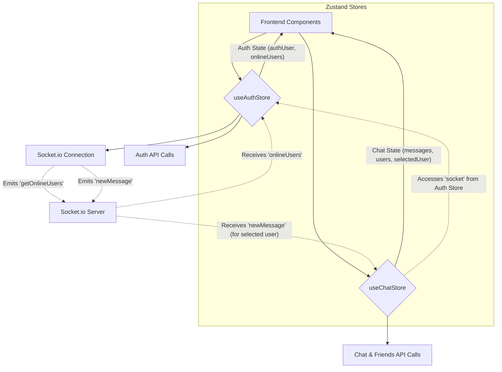
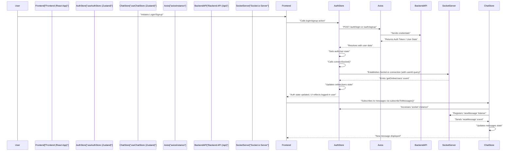

 # State Management and Utilities

This document details the architecture for client-side state management and utility functions within the application. It covers how global state is managed using Zustand for authentication and chat functionalities, alongside essential utilities for API interaction and data formatting. The core idea is to provide a robust and predictable state layer that components can subscribe to and update, ensuring data consistency and reactivity across the user interface.

## Global State Management with Zustand

The application leverages [Zustand](https://zustand-bear.github.io/zustand/) for its lightweight, performant, and scalable approach to global state management. Zustand stores are defined as custom hooks, making them highly intuitive to use within React components. There are two primary stores: `useAuthStore` and `useChatStore`, each responsible for distinct domains of the application's state.

### `useAuthStore`

The `useAuthStore` is central to managing user authentication status, profile information, and real-time online user presence via Socket.io. It encapsulates all authentication-related logic, including user signup, login, logout, profile updates, and the crucial establishment and management of the WebSocket connection.

**Key Responsibilities:**

*   **User Authentication:** Manages `authUser` state, reflecting the currently logged-in user's data.
*   **Authentication Status Flags:** Provides `isSigningUp`, `isLoggingIn`, `isUpdatingProfile`, and `isCheckingAuth` to manage UI loading states.
*   **Online Users:** Tracks `onlineUsers` received from the Socket.io server, allowing for real-time presence indicators.
*   **Socket.io Connection:** Establishes and disconnects the WebSocket connection for real-time communication.

```javascript showLineNumbers
// frontend/src/store/useAuthStore.js
import { create } from "zustand";
import { axiosInstance } from "../lib/axios";
import toast from "react-hot-toast";
import { io } from "socket.io-client";

const BASE_URL = import.meta.env.MODE == "development" ? "http://localhost:5001": "/";

export const useAuthStore = create((set, get) => ({
    authUser: null,
    isSigningUp: false,
    isLoggingIn: false,
    isUpdatingProfile: false,
    isCheckingAuth: true,
    onlineUsers: [],
    socket: null,

    checkAuth: async () => { /* ... */ },
    signup: async (data) => { /* ... */ },
    logout: async () => { /* ... */ },
    login: async (data) => { /* ... */ },
    updateProfile: async (data) => { /* ... */ },

    connectSocket: () => {
        const { authUser } = get();
        if(!authUser || get().socket?.connected) return;

        const socket = io(BASE_URL, {
            query: {
                userId : authUser._id,
            },
        });
        socket.connect();
        set({socket: socket});

        socket.on("getOnlineUsers", (userIds) => {
            set({onlineUsers: userIds})
        }); 
    },

    disconnectSocket : () => {
        if(get().socket?.connected) get().socket.disconnect();
    }
}));
```
[View on GitHub](https://github.com/shinymack/Chat-App-MERN/blob/main/frontend/src/store/useAuthStore.js)

### `useChatStore`

The `useChatStore` handles all chat-related data, including messages, user lists (friends), friend requests (pending and sent), and the currently selected chat partner. It provides actions to fetch, send, and manage messages and friend relationships.

**Key Responsibilities:**

*   **Message Management:** Stores and updates `messages` for the currently selected chat.
*   **User/Friend Management:** Manages lists of `users` (friends), `pendingRequests`, and `sentRequests`.
*   **Selected Chat User:** `selectedUser` keeps track of the conversation partner.
*   **Loading States:** `isUsersLoading` and `isMessagesLoading` indicate data fetching status.
*   **Friend Request Workflow:** Provides actions to send, accept, reject, and remove friend requests.
*   **Real-time Messages:** Subscribes to `newMessage` events from Socket.io, integrating new messages into the store.

```javascript showLineNumbers
// frontend/src/store/useChatStore.js
import toast from "react-hot-toast";
import { create } from "zustand";
import { axiosInstance } from "../lib/axios";
import { useAuthStore } from "./useAuthStore"; // Interacts with AuthStore's socket

export const useChatStore = create((set, get) => ({
    messages:[],
    users: [],
    pendingRequests: [],
    sentRequests: [],
    selectedUser: null,
    isUsersLoading: false,
    isMessagesLoading: false,
    isFriendBoxOpen: false,

    toggleFriendsBox: () => set(state => ({ isFriendsBoxOpen: !state.isFriendBoxOpen })),
    getFriends: async () => { /* ... */ },
    getPendingRequests: async () => { /* ... */ },
    getSentRequests: async () => { /* ... */ },
    sendFriendRequest: async (identifier) => { /* ... */ },
    acceptFriendRequest: async (senderId) => { /* ... */ },
    rejectFriendRequest: async (senderId) => { /* ... */ },
    removeFriend: async (friendId) => { /* ... */ },
    getMessages: async (userId) => { /* ... */ },
    sendMessage: async (messageData) => { /* ... */ },

    subscribeToMessages: () => {
        const { selectedUser } = get();
        if(!selectedUser) return;
        
        // Accesses socket directly from useAuthStore's state
        const socket = useAuthStore.getState().socket; 
        socket.on("newMessage", (newMessage) => {
            if(newMessage.senderId !== selectedUser._id) return
            set({
                messages: [...get().messages, newMessage]
            })
        })
    },

    unsubscribeFromMessages: () => {
        const socket = useAuthStore.getState().socket;
        socket.off("newMessage");
    },
    
    setSelectedUser: (selectedUser) => set({selectedUser})
}));
```
[View on GitHub](https://github.com/shinymack/Chat-App-MERN/blob/main/frontend/src/store/useChatStore.js)

### State Management Flow
The following diagram illustrates the interaction between the `useAuthStore` and `useChatStore`, particularly how the `useChatStore` leverages the `socket` instance managed by `useAuthStore` for real-time message updates.





## Client-Side Utilities

Beyond state management, the application incorporates utility functions and a configured Axios instance to streamline API interactions and common data transformations.

### Axios Instance for API Calls

A pre-configured Axios instance (`axiosInstance`) simplifies making HTTP requests to the backend. It automatically sets the `baseURL` based on the environment (development or production) and ensures that credentials (like cookies for session management) are sent with every request, crucial for authenticated API endpoints.

```javascript showLineNumbers
// frontend/src/lib/axios.js
import axios from "axios";

export const axiosInstance = axios.create({
    baseURL: import.meta.env.MODE == "development" ? "http://localhost:5001/api": "/api",
    withCredentials: true, // Ensures cookies are sent with requests
});
```
[View on GitHub](https://github.com/shinymack/Chat-App-MERN/blob/main/frontend/src/lib/axios.js)

### Utility Functions

The `utils.js` file houses general-purpose utility functions that help with data formatting or other common tasks. An example is `formatMessageTime`, which formats a `Date` object into a user-friendly string suitable for displaying message timestamps.

```javascript showLineNumbers
// frontend/src/lib/utils.js
export function formatMessageTime(date) {
    return new Date(date).toLocaleTimeString("en-US", {
        year: "numeric",
        month: "short",
        day:"2-digit",
        hour: "2-digit",
        minute: "2-digit",
        hour12: true,
    });
}
```
[View on GitHub](https://github.com/shinymack/Chat-App-MERN/blob/main/frontend/src/lib/utils.js)

## Key Integration Points

The client-side architecture is designed for clear separation of concerns while allowing necessary interactions between modules.

### Authentication and Socket Connection Flow
The following sequence diagram illustrates the user authentication and subsequent WebSocket connection process.





### Store Interoperability

While stores generally manage their own domains, `useChatStore` demonstrates how stores can interact. It directly accesses the `socket` instance from `useAuthStore` to subscribe to and unsubscribe from real-time message events. This pattern centralizes socket management in the `useAuthStore` while allowing other stores to leverage the established connection for relevant real-time data.

### Error Handling

Both Zustand stores extensively use `react-hot-toast` for user-facing notifications. Errors from API calls, often `error.response.data.message` from the backend, are caught and displayed to the user, providing immediate feedback on failures.

### Environment Configuration

The `baseURL` for the `axiosInstance` and the `BASE_URL` for the Socket.io connection dynamically adapt based on `import.meta.env.MODE`. This ensures that the application correctly points to the development server (`http://localhost:5001`) during local development and uses relative paths (proxy configuration) in production builds.