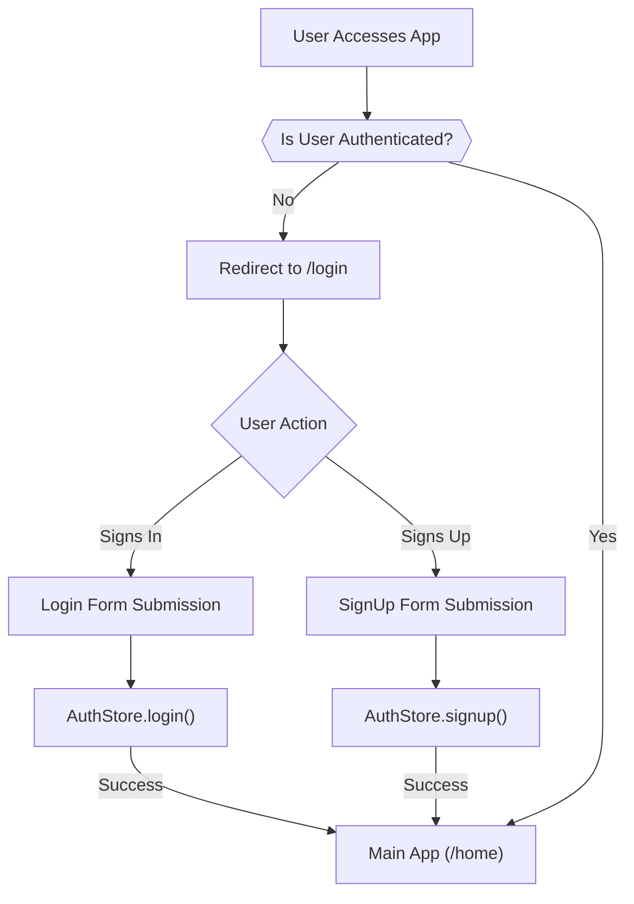
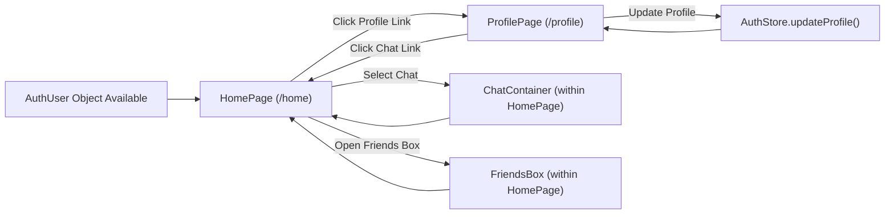

 # Pages and Navigation

This section details the primary pages of the application, their core functionalities, and how users navigate between them. The frontend application leverages React Router DOM for client-side routing, enabling a seamless single-page application experience.

## Core Application Pages

The application is structured around several key pages, each serving a distinct purpose in the user journey.

### Authentication Pages

The application includes dedicated pages for user authentication, managing sign-up and sign-in processes.

#### Sign-Up Page (`SignUpPage.jsx`)

The `SignUpPage` facilitates new user registration. It collects essential information such as username, email, and password. It also supports Google OAuth for a quicker sign-up experience.

-   **Path**: `/signup`
-   **Functionality**:
    *   User input for username, email, and password.
    *   Client-side validation using `toast` notifications.
    *   Integration with `useAuthStore` for `signup` action.
    *   Link to Google OAuth for external authentication.
    *   Navigation to `LoginPage` for existing users.

```jsx
// frontend/src/pages/SignUpPage.jsx
// Snippet: Form submission and validation
const validateForm = () => {
  if(!formData.username.trim()) return toast.error("Username is required");
  if(!formData.email.trim()) return toast.error("Email is required");
  if (!/\S+@\S+\.\S+/.test(formData.email)) return toast.error("Invalid email format");
  if (!formData.password) return toast.error("Password is required");
  if (formData.password.length < 6) return toast.error("Password must be at least 6 characters");
  return true;
};

const handleSubmit = (e) => {
  e.preventDefault();
  const success = validateForm();
  if(success===true) signup(formData);
};
```
[View on GitHub](https://github.com/shinymack/Chat-App-MERN/blob/main/frontend/src/pages/SignUpPage.jsx#L30-L42)

The `SignUpPage` is designed to be user-friendly, providing immediate feedback on input validity and a clear path for both traditional and social logins.

```jsx
// frontend/src/pages/SignUpPage.jsx
// Snippet: Google OAuth integration
const backendDomain = import.meta.env.VITE_BACKEND_URL;
const googleAuthUrl = `${backendDomain}/api/auth/google`;
// ...
<a
  href={googleAuthUrl} // Link to your backend Google auth route
  className="btn btn-primary btn-outline w-full"
>
  <FcGoogle className="size-5 mr-2" />
  Sign up with Google
</a>
```
[View on GitHub](https://github.com/shinymack/Chat-App-MERN/blob/main/frontend/src/pages/SignUpPage.jsx#L123-L131)

#### Login Page (`LoginPage.jsx`)

The `LoginPage` serves as the entry point for authenticated users. It handles user sign-in and provides an option for Google OAuth.

-   **Path**: `/login`
-   **Functionality**:
    *   User input for email and password.
    *   `useAuthStore` for `login` action.
    *   Visual toggle for password visibility.
    *   Link to Google OAuth.
    *   Navigation to `SignUpPage` for new users.

```jsx
// frontend/src/pages/LoginPage.jsx
// Snippet: Password visibility toggle
<input
  type={showPassword ? "text" : "password"}
  className={`input input-bordered w-full pl-10`}
  placeholder="••••••••"
  value={formData.password}
  onChange={(e) => setFormData({ ...formData, password: e.target.value })}
/>
<button
  type="button"
  className="absolute inset-y-0 right-0 pr-3 flex items-center"
  onClick={() => setShowPassword(!showPassword)}
>
  {showPassword ? (
    <EyeOff className="h-5 w-5 text-base-content/40" />
  ) : (
    <Eye className="h-5 w-5 text-base-content/40" />
  )}
</button>
```
[View on GitHub](https://github.com/shinymack/Chat-App-MERN/blob/main/frontend/src/pages/LoginPage.jsx#L71-L89)

### Application Flow - Authentication

The authentication process defines how users gain access to the main application features.





### Main Application Pages

Once authenticated, users can access the core functionalities of the chat application.

#### Home Page (`HomePage.jsx`)

The `HomePage` is the central hub for user interaction within the chat application. It dynamically renders different components based on the user's current activity.

-   **Path**: `/` (or `/home` post-authentication)
-   **Functionality**:
    *   Displays `Sidebar` for navigating chats and user options.
    *   Conditionally renders `ChatContainer` if a user/chat is selected.
    *   Displays `NoChatSelected` when no chat is active.
    *   Optionally displays `FriendsBox` for managing contacts.

```jsx
// frontend/src/pages/HomePage.jsx
// Snippet: Conditional rendering of chat components
<div className="flex h-full rounded-lg overflow-hidden w-full">
  <Sidebar />
  {!selectedUser ? <NoChatSelected /> : <ChatContainer />}
  {isFriendsBoxOpen && <FriendsBox />}
</div>
```
[View on GitHub](https://github.com/shinymack/Chat-App-MERN/blob/main/frontend/src/pages/HomePage.jsx#L18-L22)

The `HomePage` uses `useChatStore` to manage the state of the selected chat and the visibility of the friends list, demonstrating a reactive UI based on global application state.

#### Profile Page (`ProfilePage.jsx`)

The `ProfilePage` allows users to view and update their personal information, including their profile picture and username.

-   **Path**: `/profile`
-   **Functionality**:
    *   Displays current user's profile picture, username, and email.
    *   Allows updating profile picture via file upload.
    *   Enables editing of the username with debounced availability check.
    *   Displays account metadata (e.g., "Member Since", "Account Status").
    *   Integrates with `useAuthStore` for `updateProfile` action.

```jsx
// frontend/src/pages/ProfilePage.jsx
// Snippet: Profile picture upload and update
<label
  htmlFor="avatar-upload"
  className={`
    absolute bottom-0 right-0 
    bg-base-content hover:scale-105
    p-2 rounded-full cursor-pointer 
    transition-all duration-200
    ${isUpdatingProfile ? "animate-pulse pointer-events-none" : ""}
  `}
>
  <Camera className="w-5 h-5 text-base-200" />
  <input
    type="file"
    id="avatar-upload"
    className="hidden"
    accept="image/*"
    onChange={handleImageUpload}
    disabled={isUpdatingProfile}
  />
</label>
```
[View on GitHub](https://github.com/shinymack/Chat-App-MERN/blob/main/frontend/src/pages/ProfilePage.jsx#L90-L107)

The username editing feature showcases advanced state management and asynchronous data validation.

```jsx
// frontend/src/pages/ProfilePage.jsx
// Snippet: Debounced username check logic
useEffect(() => {
  clearTimeout(debounceTimeout.current);
  if (!newUsername.trim() || newUsername.trim().length < 3) {
    setUsernameStatus({ checking: false, available: false, message: "Must be 3+ characters." });
    return;
  }
  if (newUsername === authUser.username) {
    setUsernameStatus({ checking: false, available: true, message: "" });
    return;
  }
  setUsernameStatus((prev) => ({ ...prev, checking: true, message: "Checking..." }));
  debounceTimeout.current = setTimeout(async () => {
    try {
      const res = await axiosInstance.get(`/auth/username/check/${newUsername}`);
      setUsernameStatus({
        checking: false,
        available: res.data.available,
        message: res.data.message,
      });
    } catch (error) {
      const message = error.response?.data?.message || "Error checking username.";
      setUsernameStatus({ checking: false, available: false, message });
    }
  }, 500); // 500ms debounce delay
  return () => clearTimeout(debounceTimeout.current);
}, [newUsername, authUser.username]);
```
[View on GitHub](https://github.com/shinymack/Chat-App-MERN/blob/main/frontend/src/pages/ProfilePage.jsx#L59-L87)

## Navigation within the Application

Navigation within the application is primarily handled using `react-router-dom`. The `Sidebar` component plays a crucial role in directing users to different sections once authenticated.

### User Flow - Post Authentication

The following diagram illustrates a typical user flow after authentication.





## Key Integration Points

### State Management for Navigation

The application uses Zustand for global state management. The `useAuthStore` and `useChatStore` are particularly relevant for navigation and conditional rendering:

*   `useAuthStore`: Manages the `authUser` state. Its presence or absence determines if a user is redirected to authentication pages or the main application.
*   `useChatStore`: Manages `selectedUser` and `isFriendsBoxOpen` states, which dynamically control content display within the `HomePage`.

### Protected Routes

While not explicitly detailed in the provided files, a typical setup would involve "protected routes" using `react-router-dom` to ensure that `HomePage` and `ProfilePage` are only accessible to authenticated users, redirecting unauthenticated users to `LoginPage`. This often involves a wrapper component that checks the `authUser` state from `useAuthStore`.

### Backend API Integration

Authentication pages (`LoginPage`, `SignUpPage`) interact with backend API endpoints for user registration and login. The `ProfilePage` also interacts with the backend to update user information, such as the profile picture and username. These interactions often use a configured `axiosInstance` for making HTTP requests.

Next: [Development and Configuration](./4_development-and-configuration.mdx)