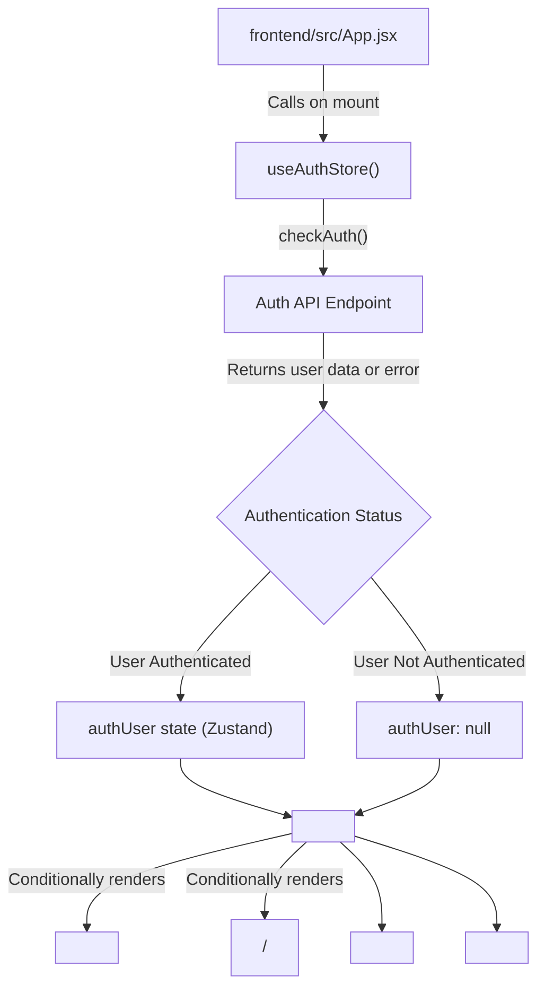

 # Frontend Implementation

This section provides a comprehensive overview of the client-side application, focusing on its core structure, development setup, and key entry points. Developed with React and Vite, the frontend application handles user authentication, real-time communication, and a dynamic user interface, leveraging a modern component-based architecture.

## Development Setup

The frontend project is configured using `Vite`, a fast build tool that significantly improves the development experience. The `package.json` file orchestrates project dependencies, scripts, and metadata.

### Project Dependencies

The application relies on a robust set of libraries for various functionalities. Key dependencies include `react` for UI, `react-router-dom` for navigation, `axios` for HTTP requests, `socket.io-client` for real-time communication, and `zustand` for state management. `daisyui` and `tailwindcss` are used for styling.

Here's a breakdown of the primary dependencies:

| Dependency            | Purpose                                     |
| :-------------------- | :------------------------------------------ |
| `react`               | Core library for building user interfaces.  |
| `react-dom`           | Entry point for DOM-specific rendering.     |
| `react-router-dom`    | Declarative routing for React applications. |
| `axios`               | Promise-based HTTP client for API requests. |
| `socket.io-client`    | Real-time bi-directional event-based communication. |
| `zustand`             | A small, fast, and scalable bearbones state-management solution. |
| `lucide-react`        | Collection of beautiful hand-crafted SVG icons. |
| `react-hot-toast`     | Lightweight and customizable toast notifications. |
| `daisyui`             | Tailwind CSS component library for theming. |
| `tailwindcss`         | A utility-first CSS framework for rapid UI development. |

### Build and Development Scripts

The `scripts` section in `package.json` defines common commands for development, building, and linting.

```json
// frontend/package.json
{
  "name": "frontend",
  "private": true,
  "version": "0.0.0",
  "type": "module",
  "scripts": {
    "dev": "vite",
    "build": "vite build",
    "lint": "eslint .",
    "preview": "vite preview",
    "mobile": "vite --host"
  },
  // ... other sections
}
```

-   `npm run dev`: Starts the Vite development server.
-   `npm run build`: Compiles the application for production deployment.
-   `npm run lint`: Runs ESLint to identify and report on patterns found in JavaScript code.
-   `npm run mobile`: Starts the Vite development server and exposes it on the local network, useful for mobile device testing.

[View `package.json` on GitHub](https://github.com/shinymack/Chat-App-MERN/blob/main/frontend/package.json)

### Vite Configuration

The `vite.config.js` file configures Vite to use the React plugin, enabling support for React Fast Refresh and JSX transformation.

```javascript
// frontend/vite.config.js
import { defineConfig } from 'vite'
import react from '@vitejs/plugin-react'

// https://vitejs.dev/config/
export default defineConfig({
  plugins: [react()],
})
```

This minimal configuration indicates that Vite is set up to specifically handle React projects. Additional configurations for proxies, environment variables, or alias paths can be added here if needed.

[View `vite.config.js` on GitHub](https://github.com/shinymack/Chat-App-MERN/blob/main/frontend/vite.config.js)

## Application Entry Point (`main.jsx`)

The `main.jsx` file is the primary entry point of the React application. It initializes the React root, wraps the main `App` component with `BrowserRouter` for client-side routing, and enforces `StrictMode` for development-time checks.

```jsx
// frontend/src/main.jsx
import { StrictMode } from 'react'
import { createRoot } from 'react-dom/client'
import './index.css'
import App from './App.jsx'
import { BrowserRouter } from 'react-router-dom'

createRoot(document.getElementById('root')).render(
  <StrictMode>
    <BrowserRouter>
      <App />
    </BrowserRouter>
  </StrictMode>,
)
```

-   **`StrictMode`**: A React tool for highlighting potential problems in an application. It activates additional checks and warnings for its descendants.
-   **`BrowserRouter`**: Part of `react-router-dom`, it uses the HTML5 history API to keep your UI in sync with the URL. This enables single-page application (SPA) navigation without full page reloads.
-   **`App`**: The root component of the application, where all other components and routing logic reside.

[View `main.jsx` on GitHub](https://github.com/shinymack/Chat-App-MERN/blob/main/frontend/src/main.jsx)

### Application Initialization Flow

The following diagram illustrates the initial loading sequence of the frontend application.


```mermaid
graph TD
    A["index.html"] --> B["<div id=\"root\"></div>"];
    B --> C["frontend/src/main.jsx"];
    C --> D["React StrictMode"];
    D --> E["React Router DOM BrowserRouter"];
    E --> F["frontend/src/App.jsx"];
    F --> G["Auth Store (Zustand)"];
    F --> H["Theme Store (Zustand)"];
```


## Core Application Component (`App.jsx`)

The `App.jsx` component serves as the central hub for the entire application. It manages global concerns such as routing, user authentication, theme management, and displays the main navigation bar. It dynamically renders different pages based on the current URL and user authentication status.

```jsx
// frontend/src/App.jsx (simplified)
import Navbar from './components/Navbar'
import { Routes, Route, Navigate } from 'react-router-dom'
import { useEffect } from 'react'
import HomePage from './pages/HomePage'
import SignUpPage from './pages/SignUpPage'
import LoginPage from './pages/LoginPage'
import SettingsPage from './pages/SettingsPage'
import ProfilePage from './pages/ProfilePage'

import { useThemeStore } from './store/useThemeStore'
import { useAuthStore } from './store/useAuthStore';
import { Loader } from 'lucide-react'
import { Toaster } from 'react-hot-toast'

const App = () => {
  const { authUser, checkAuth, isCheckingAuth, onlineUsers } = useAuthStore();
  const { theme } = useThemeStore();

  useEffect(() => {
    checkAuth(); // Checks user authentication status on mount
  }, [checkAuth]);

  if(isCheckingAuth && !authUser) return (
      <div className='flex items-center justify-center h-screen'>
        <Loader className='size-10 animate-spin' />
      </div>
  )

  return (
    <div className='' data-theme={theme}>
      <Navbar />
      <Toaster /> {/* Global toast notifications */}
      <Routes>
        <Route path='/' element={authUser ? <HomePage />: <Navigate to='/login' />} />
        <Route path='/signup' element={ !authUser ? <SignUpPage />: <Navigate to='/' />} />
        <Route path='/login' element={!authUser ? <LoginPage />: <Navigate to='/' />} />
        <Route path='/settings' element={<SettingsPage />} />
        <Route path='/profile' element={authUser ? <ProfilePage />: <Navigate to='/login' />} />
      </Routes>
    </div>
  )
}

export default App
```

-   **Authentication Check**: An `useEffect` hook calls `checkAuth()` from `useAuthStore` on component mount. This verifies if a user is currently authenticated and updates the `authUser` state. While authentication is being checked, a `Loader` component is displayed.
-   **Theme Management**: The `theme` state from `useThemeStore` is applied to the root `div` using `data-theme={theme}`, allowing dynamic theme switching provided by DaisyUI.
-   **Routing**: `react-router-dom`'s `Routes` and `Route` components define the application's navigation paths. Many routes are protected, redirecting users based on their `authUser` status (e.g., authenticated users are redirected from `/login` to `/`).
-   **Global Components**: `Navbar` is consistently displayed across all pages, and `Toaster` provides application-wide notification capabilities.

[View `App.jsx` on GitHub](https://github.com/shinymack/Chat-App-MERN/blob/main/frontend/src/App.jsx)

## Key Integration Points

The frontend's architecture, particularly within `App.jsx` and its associated stores, demonstrates crucial integration points for state management, authentication, and user experience.

### Authentication and State Management Flow

The authentication flow is a prime example of integration, leveraging Zustand for global state and React Router for conditional navigation.





This diagram illustrates how `App.jsx` initiates an authentication check, updates a global state managed by Zustand, and then uses that state to control which pages users can access, guiding them through the application flow. The `checkAuth` function is critical for maintaining session state across page loads or when a user first accesses the application.

## Next Steps

With a foundational understanding of the frontend's setup and core `App` component, the next logical step is to delve into the individual user interface components that build up the various pages.

Next: [User Interface Components](./3.1_user-interface-components.mdx)