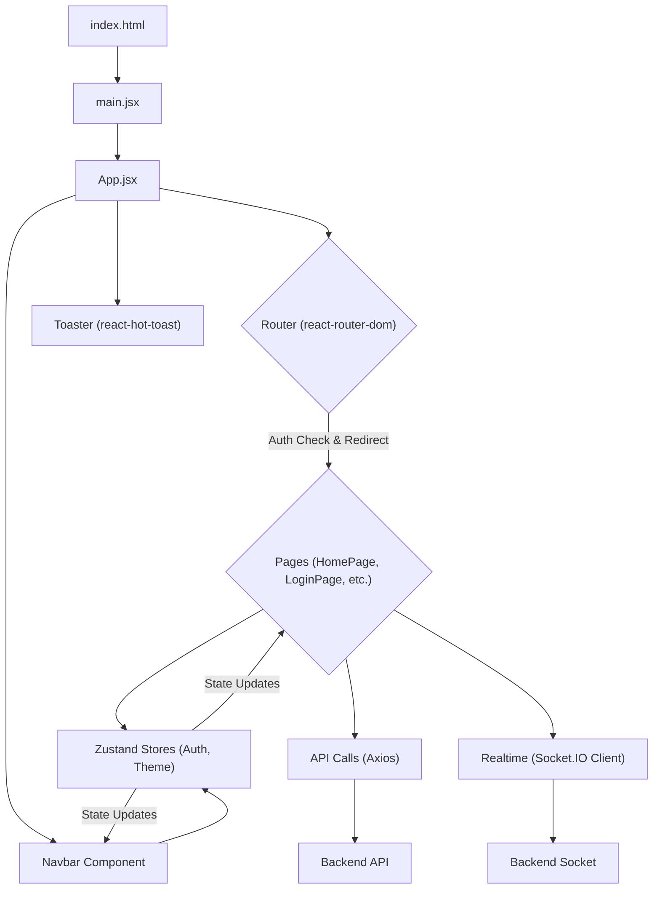

 # Frontend Implementation

The frontend of the application is a modern, single-page application (SPA) built with React. It provides the user interface and handles all client-side interactions, data presentation, and communication with the backend services through REST APIs and WebSockets. This section details the core architecture, technology stack, and key components that drive the user experience.

## Technology Stack

The frontend leverages a robust set of modern JavaScript libraries and frameworks to deliver a dynamic and responsive user interface.

### Core Technologies

The `package.json` file provides a clear overview of the project's dependencies:

```json showLineNumbers
{
  "name": "frontend",
  "private": true,
  "version": "0.0.0",
  "type": "module",
  "scripts": {
    "dev": "vite",
    "build": "vite build",
    "lint": "eslint .",
    "preview": "vite preview",
    "mobile": "vite --host"
  },
  "dependencies": {
    "axios": "^1.7.9",
    "cors": "^2.8.5",
    "lucide-react": "^0.471.1",
    "react": "^18.3.1",
    "react-dom": "^18.3.1",
    "react-hot-toast": "^2.5.1",
    "react-icons": "^5.5.0",
    "react-router-dom": "^7.1.1",
    "socket.io-client": "^4.8.1",
    "zustand": "^5.0.3"
  },
  "devDependencies": {
    "@eslint/js": "^9.17.0",
    "@types/react": "^18.3.18",
    "@types/react-dom": "^18.3.5",
    "@vitejs/plugin-react": "^4.3.4",
    "autoprefixer": "^10.4.20",
    "daisyui": "^4.12.23",
    "eslint": "^9.17.0",
    "eslint-plugin-react": "^7.37.2",
    "eslint-plugin-react-hooks": "^5.0.0",
    "eslint-plugin-react-refresh": "^0.4.16",
    "globals": "^15.14.0",
    "postcss": "^8.5.0",
    "tailwindcss": "^3.4.17",
    "vite": "^6.3.5"
  }
}
```

[View `package.json` on GitHub](https://github.com/shinymack/Chat-App-MERN/blob/main/frontend/package.json)

| Dependency          | Description                                         | Purpose                                                    |
| :------------------ | :-------------------------------------------------- | :--------------------------------------------------------- |
| `react`             | JavaScript library for building user interfaces     | Core UI framework                                          |
| `react-dom`         | React package for working with the DOM              | DOM-specific rendering                                     |
| `react-router-dom`  | Declarative routing for React                       | Client-side navigation and routing                         |
| `axios`             | Promise-based HTTP client                           | Making API requests to the backend                         |
| `socket.io-client`  | Client-side library for Socket.IO                   | Real-time bidirectional communication                      |
| `zustand`           | Small, fast, and scalable bearbones state-management | Global state management (authentication, theme, online users)|
| `daisyui`           | Tailwind CSS component library                      | UI component styling and theming                           |
| `tailwindcss`       | Utility-first CSS framework                         | Highly customizable styling                                |
| `vite`              | Next-generation frontend tooling                    | Fast development server, build tool                        |
| `lucide-react`      | Beautifully simple and consistent icon toolkit      | Scalable vector icons                                      |
| `react-hot-toast`   | The best way to display notifications               | User feedback and temporary notifications                  |

### Frontend Build and Development

The frontend development environment is powered by [Vite](https://vitejs.dev/), a modern build tool that offers an extremely fast development server and optimized build processes. The configuration for Vite is minimal, demonstrating its "out-of-the-box" capability for React projects.

```jsx showLineNumbers
// frontend/vite.config.js
import { defineConfig } from 'vite'
import react from '@vitejs/plugin-react'

// https://vite.dev/config/
export default defineConfig({
  plugins: [react()],
})
```
[View `vite.config.js` on GitHub](https://github.com/shinymack/Chat-App-MERN/blob/main/frontend/vite.config.js)

This simple configuration enables React Fast Refresh and ensures efficient development cycles.

## Application Structure and Entry Point

The application starts by rendering the root `App` component within a `BrowserRouter` context, as defined in `main.jsx`. This setup is standard for React applications utilizing client-side routing.

```jsx showLineNumbers
// frontend/src/main.jsx
import { StrictMode } from 'react'
import { createRoot } from 'react-dom/client'
import './index.css'
import App from './App.jsx'
import { BrowserRouter } from 'react-router-dom'

createRoot(document.getElementById('root')).render(
  <StrictMode>
    <BrowserRouter>
      <App />
    </BrowserRouter>
  </StrictMode>,
)
```
[View `main.jsx` on GitHub](https://github.com/shinymack/Chat-App-MERN/blob/main/frontend/src/main.jsx)

`StrictMode` helps in highlighting potential problems in an application, while `BrowserRouter` provides the necessary context for `react-router-dom` to manage navigation.

### Core Application Flow

The `App.jsx` component serves as the central hub for the application's routing, authentication management, and global state initialization.

```jsx showLineNumbers
// frontend/src/App.jsx
import Navbar from './components/Navbar'
import { Routes, Route, Navigate } from 'react-router-dom'
import { useEffect } from 'react'
import HomePage from './pages/HomePage'
import SignUpPage from './pages/SignUpPage'
import LoginPage from './pages/LoginPage'
import SettingsPage from './pages/SettingsPage'
import ProfilePage from './pages/ProfilePage'

import { useThemeStore } from './store/useThemeStore'
import { useAuthStore } from './store/useAuthStore';
import { Loader } from 'lucide-react'
import { Toaster } from 'react-hot-toast'

const App = () => {
  const { authUser, checkAuth, isCheckingAuth, onlineUsers } = useAuthStore();
  const { theme } = useThemeStore();
  useEffect(() => {
    checkAuth();
  }, [checkAuth]);

  console.log("authUser: ", {authUser});
  console.log({onlineUsers})

  if(isCheckingAuth && !authUser) return (
      <div className='flex items-center justify-center h-screen'>
        <Loader className='size-10 animate-spin' />
      </div>
  )

  return (
    <div className='' data-theme={theme}>
      <Navbar />
      <Toaster />
      <Routes>
        <Route path='/' element={authUser ? <HomePage />: <Navigate to='/login' />} />
        <Route path='/signup' element={ !authUser ? <SignUpPage />: <Navigate to='/' />} />
        <Route path='/login' element={!authUser ? <LoginPage />: <Navigate to='/' />} />
        <Route path='/settings' element={<SettingsPage />} />
        <Route path='/profile' element={authUser ? <ProfilePage />: <Navigate to='/login' />} />
      </Routes>
    </div>
  )
}

export default App
```
[View `App.jsx` on GitHub](https://github.com/shinymack/Chat-App-MERN/blob/main/frontend/src/App.jsx)

### Authentication and Routing

The `App` component integrates with `useAuthStore` (powered by Zustand) to manage user authentication status. Upon initial load, `useEffect` triggers the `checkAuth` function to verify the user's login status.

```jsx showLineNumbers
// Excerpt from frontend/src/App.jsx (lines 20-23)
  const { authUser, checkAuth, isCheckingAuth, onlineUsers } = useAuthStore();
  const { theme } = useThemeStore();
  useEffect(() => {
    checkAuth();
  }, [checkAuth]);
```

While authentication is being checked (`isCheckingAuth` is true), a loading spinner is displayed, preventing flash of unauthenticated content.

The `react-router-dom`'s `Routes` and `Route` components define the application's navigation paths. Crucially, routes like `/` (home), `/signup`, `/login`, and `/profile` are protected or redirected based on the `authUser` state. For instance, an authenticated user trying to access `/login` will be redirected to `/`, and an unauthenticated user trying to access `/` will be redirected to `/login`.

```jsx showLineNumbers
// Excerpt from frontend/src/App.jsx (lines 40-45)
      <Routes>
        <Route path='/' element={authUser ? <HomePage />: <Navigate to='/login' />} />
        <Route path='/signup' element={ !authUser ? <SignUpPage />: <Navigate to='/' />} />
        <Route path='/login' element={!authUser ? <LoginPage />: <Navigate to='/' />} />
        <Route path='/settings' element={<SettingsPage />} />
        <Route path='/profile' element={authUser ? <ProfilePage />: <Navigate to='/login' />} />
      </Routes>
```

### Global State Management

The frontend uses [Zustand](https://zustand-bear.github.io/) for global state management. This lightweight and flexible library is used for:

*   **`useAuthStore`**: Managing authentication state (`authUser`, `isCheckingAuth`, `onlineUsers`) and providing functions for login, logout, and auth checking.
*   **`useThemeStore`**: Managing the application's theme, allowing users to switch between light and dark modes (or other DaisyUI themes).

This approach centralizes critical application data, making it easily accessible across components without prop drilling.

### Styling and Theming

The application utilizes [Tailwind CSS](https://tailwindcss.com/) for utility-first styling, complemented by [DaisyUI](https://daisyui.com/), a Tailwind CSS component library. DaisyUI simplifies the creation of common UI components and provides a robust theming system. The `data-theme={theme}` attribute on the root `div` in `App.jsx` dynamically applies the selected theme based on the `useThemeStore` state.

```jsx showLineNumbers
// Excerpt from frontend/src/App.jsx (line 35)
    <div className='' data-theme={theme}>
```

## Frontend Architecture Overview

The following diagram illustrates the high-level architecture of the frontend application, showing key components and their interactions.





## Key Integration Points

### Authentication Flow
The `checkAuth` function within `useAuthStore` is crucial for maintaining session integrity. It typically makes an API call to the backend to validate the current session token or cookie. If valid, `authUser` is populated, granting access to protected routes.

### Real-time Communication with Socket.IO
The frontend integrates `socket.io-client` to establish real-time, bidirectional communication with the backend. This is essential for features like instant messaging, real-time presence (online users), and potentially live notifications. The `onlineUsers` state in `useAuthStore` is updated via Socket.IO events, reflecting the current active users.

### API Interactions with Axios
All interactions with the backend's RESTful APIs are handled using `axios`. This includes user authentication (login, signup), fetching profile data, sending messages, and any other data-centric operations. Axios's interceptors can be configured for global error handling or attaching authentication headers.

### Global State Management with Zustand
Zustand acts as the single source of truth for global application state. It manages authentication details, online user lists, and UI themes. Its simplicity allows for efficient state updates and re-renders, ensuring a smooth user experience.

### User Interface and Theming
The combination of Tailwind CSS and DaisyUI provides a highly flexible and powerful styling framework. The ability to switch themes dynamically using `data-theme` allows for a personalized user experience without complex CSS changes.

This comprehensive frontend architecture is designed for scalability, maintainability, and a performant user experience, leveraging modern React best practices and a well-chosen set of libraries.

Next: [User Interface Components](./3.1_user-interface-components.mdx)