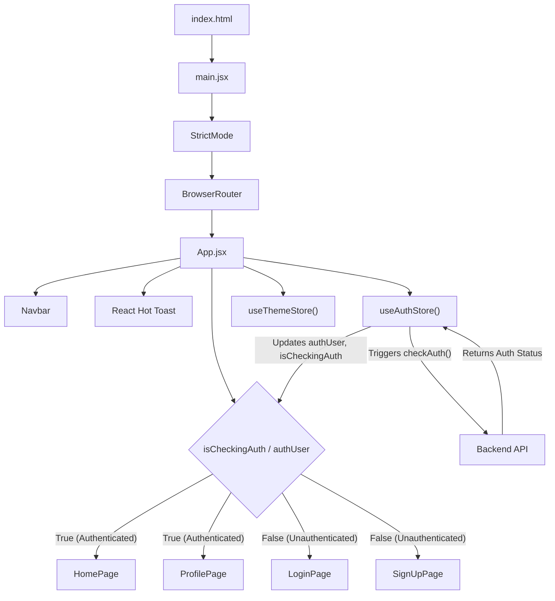
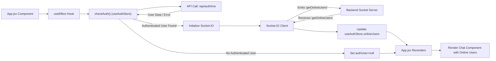

 # Frontend Implementation and UI

The frontend of the Chatty application is a React-based single-page application (SPA) built with Vite. It provides the user interface for all interactions, including user authentication, real-time chat, and profile management. This document outlines the core structure, dependencies, and initial rendering process of the client-side application.

## Core Application Structure

The application's entry point is `index.html`, which loads the main React application through `main.jsx`. Routing is managed by `react-router-dom`, while state management leverages `zustand` for a lightweight and scalable approach.

### HTML Entry Point

The `index.html` file serves as the single HTML page for the SPA. It includes basic meta-information and a `div` with `id="root"` where the React application is mounted. The `<script type="module" src="/src/main.jsx"></script>` tag indicates the modern JavaScript module-based entry point.

```html
<!doctype html>
<html lang="en">
  <head>
    <meta charset="UTF-8" />
    <link rel="icon" type="image/svg+xml+png" href="/icon.png" />
    <meta name="viewport" content="width=device-width, initial-scale=1.0" />
    <title>Chatty</title>
  </head>
  <body>
    <div id="root"></div>
    <script type="module" src="/src/main.jsx"></script>
  </body>
</html>
```
[View on GitHub](https://github.com/shinymack/Chat-App-MERN/blob/main/frontend/index.html)

### React Application Entry

The `main.jsx` file is the primary entry point for the React application. It uses `ReactDOM.createRoot` to render the main `App` component into the `div` specified in `index.html`. The `BrowserRouter` from `react-router-dom` wraps the `App` component, enabling client-side routing. `StrictMode` is used for highlighting potential problems in an application.

```jsx
import { StrictMode } from 'react'
import { createRoot } from 'react-dom/client'
import './index.css'
import App from './App.jsx'
import { BrowserRouter } from 'react-router-dom'

createRoot(document.getElementById('root')).render(
  <StrictMode>
    <BrowserRouter>
      <App />
    </BrowserRouter>
  </StrictMode>,
)
```
[View on GitHub](https://github.com/shinymack/Chat-App-MERN/blob/main/frontend/src/main.jsx)

### Main Application Component (`App.jsx`)

The `App.jsx` component orchestrates the main layout, routing, and global state management. It conditionally renders routes based on user authentication status, ensuring protected routes are accessible only to authenticated users. It also initializes global states for authentication and theme.

Key features of `App.jsx`:
- **Routing**: Defines routes for `HomePage`, `SignUpPage`, `LoginPage`, `SettingsPage`, and `ProfilePage`.
- **Authentication Check**: Uses `useAuthStore().checkAuth()` on mount to verify the user's authentication status. Displays a loader during this check.
- **Conditional Navigation**: Redirects unauthenticated users to `/login` for protected routes and authenticated users away from `/login` and `/signup`.
- **Theme Management**: Applies the `data-theme` attribute based on the `useThemeStore()`.
- **Global Toasts**: Integrates `react-hot-toast` for displaying notifications.

```jsx
// frontend/src/App.jsx (excerpt)
import { Routes, Route, Navigate } from 'react-router-dom'
import { useEffect } from 'react'
import HomePage from './pages/HomePage'
import SignUpPage from './pages/SignUpPage' 
import LoginPage from './pages/LoginPage' 
import SettingsPage from './pages/SettingsPage' 
import ProfilePage from './pages/ProfilePage'

import { useThemeStore } from './store/useThemeStore'
import { useAuthStore } from './store/useAuthStore'; 
import { Loader } from 'lucide-react'
import { Toaster } from 'react-hot-toast'

const App = () => {
  const { authUser, checkAuth, isCheckingAuth, onlineUsers } = useAuthStore();
  const { theme } = useThemeStore();
  useEffect(() => {
    checkAuth();
  }, [checkAuth]);

  // ... (Loader for authentication check)

  return (
    <div className='' data-theme={theme}>

      <Navbar />

      <Toaster />
      <Routes>
        <Route path='/' element={authUser ? <HomePage />: <Navigate to='/login' />} />
        <Route path='/signup' element={ !authUser ? <SignUpPage />: <Navigate to='/' />} />
        <Route path='/login' element={!authUser ? <LoginPage />: <Navigate to='/' />} />
        <Route path='/settings' element={<SettingsPage />} />
        <Route path='/profile' element={authUser ? <ProfilePage />: <Navigate to='/login' />} />

      </Routes>

    </div> 
  )
}

export default App
```
[View on GitHub](https://github.com/shinymack/Chat-App-MERN/blob/main/frontend/src/App.jsx)

## Frontend Dependencies

The `package.json` file lists all the dependencies and development dependencies for the frontend application. This includes libraries for UI, routing, state management, and build tools.

```json
// frontend/package.json (dependencies excerpt)
  "dependencies": {
    "axios": "^1.7.9",
    "cors": "^2.8.5",
    "lucide-react": "^0.471.1",
    "react": "^18.3.1",
    "react-dom": "^18.3.1",
    "react-hot-toast": "^2.5.1",
    "react-icons": "^5.5.0",
    "react-router-dom": "^7.1.1",
    "socket.io-client": "^4.8.1",
    "zustand": "^5.0.3"
  },
  "devDependencies": {
    "@eslint/js": "^9.17.0",
    "@types/react": "^18.3.18",
    "@types/react-dom": "^18.3.5",
    "@vitejs/plugin-react": "^4.3.4",
    "autoprefixer": "^10.4.20",
    "daisyui": "^4.12.23",
    "eslint": "^9.17.0",
    "eslint-plugin-react": "^7.37.2",
    "eslint-plugin-react-hooks": "^5.0.0",
    "eslint-plugin-react-refresh": "^0.4.16",
    "globals": "^15.14.0",
    "postcss": "^8.5.0",
    "tailwindcss": "^3.4.17",
    "vite": "^6.3.5"
  }
```
[View on GitHub](https://github.com/shinymack/Chat-App-MERN/blob/main/frontend/package.json)

**Key Dependencies:**
- `react`, `react-dom`: Core React libraries.
- `react-router-dom`: For client-side routing.
- `zustand`: A fast, scalable, and tiny state-management solution.
- `axios`: Promise-based HTTP client for making API requests.
- `socket.io-client`: For real-time communication with the backend.
- `react-hot-toast`: For easily displaying notifications.
- `lucide-react`, `react-icons`: Icon libraries.
- `daisyui`, `tailwindcss`: CSS framework and utility-first CSS framework for styling.

### Frontend Component and State Flow

The following diagram illustrates the high-level flow of components and state management within the frontend application, from initialization to authentication.





## Key Integration Points

The frontend interacts with several external and internal systems to function correctly:

-   **Backend API**: All authentication, user data, and chat message exchanges are facilitated through RESTful API calls (via `axios`) to the backend server.
-   **Socket.IO**: Real-time features like online user status and instant message delivery are handled by `socket.io-client`, connecting to the Socket.IO server running alongside the backend. The `useAuthStore` manages the `socket` instance, ensuring it's available globally once the user is authenticated.
-   **Zustand State Management**: `useAuthStore` and `useThemeStore` are central to managing global application state, including user authentication status, online users, and UI theme preferences. These stores encapsulate logic for fetching data, updating state, and making it available to any component in the application.

### State Management and Real-time Communication

The `useAuthStore` is a critical piece of the application's state management, especially for handling user authentication and integrating with Socket.IO for real-time features. It manages the `authUser` state, performs authentication checks, and holds the `socket` instance after a successful login.

```jsx
// frontend/src/store/useAuthStore.js (conceptual excerpt)
import { create } from 'zustand';
import axios from 'axios';
import { io } from 'socket.io-client';

const useAuthStore = create((set) => ({
  authUser: null,
  isCheckingAuth: true,
  onlineUsers: [],
  socket: null, // Socket.IO client instance

  checkAuth: async () => {
    // ... API call to check authentication
    if (user) {
      // Initialize socket here or based on user login
      const newSocket = io(import.meta.env.VITE_BACKEND_URL, {
        query: { userId: user._id },
      });
      set({ authUser: user, isCheckingAuth: false, socket: newSocket });

      newSocket.on('getOnlineUsers', (users) => {
        set({ onlineUsers: users });
      });

      // Cleanup on unmount/logout (important for useEffect in App.jsx)
      return () => {
        newSocket.close();
        set({ socket: null });
      };
    } else {
      set({ authUser: null, isCheckingAuth: false, socket: null });
    }
  },
  // ... login, signup, logout actions
}));
```
This conceptual snippet demonstrates how `zustand` might be used to manage the `socket.io-client` instance, making it available throughout the application and reacting to real-time events like `getOnlineUsers`. The `App.jsx` component consumes this state to render conditionally and provide context to its children.





Next: [User Interface Components](./3.1_user-interface-components.mdx)