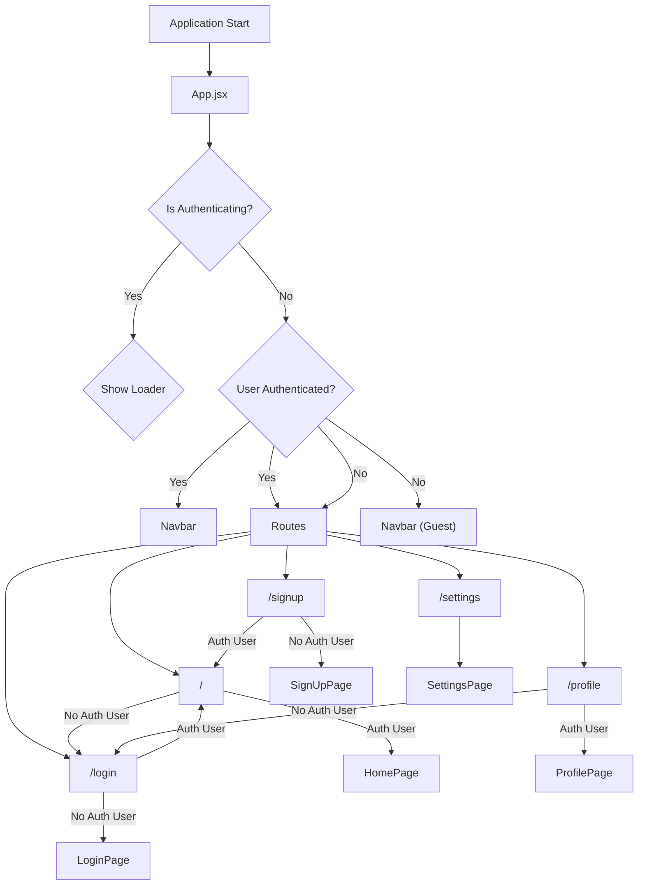
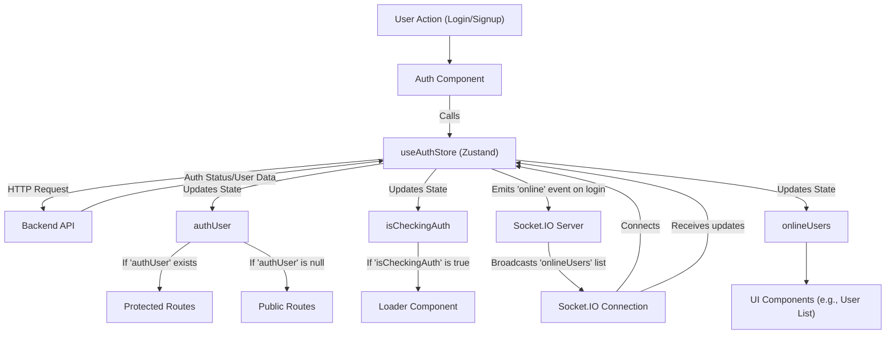

 # Frontend Application Design

This document provides a comprehensive overview of the `Chatty` application's frontend architecture, focusing on its structure, dependencies, routing, and state management. The client-side application is built using React, Vite for bundling, and leverages modern web technologies to deliver a responsive and interactive user experience.

The frontend source code is located in the `frontend/` directory, with core files like `main.jsx` serving as the application's entry point, `App.jsx` defining the main application structure and routing, and `package.json` detailing project dependencies and scripts.

## Project Setup and Dependencies

The `frontend/package.json` file outlines the project's metadata, scripts, and dependencies. It reveals that the application uses React for its UI, `vite` as a fast build tool, `tailwindcss` and `daisyui` for styling, and `zustand` for state management.

```json
{
  "name": "frontend",
  "private": true,
  "version": "0.0.0",
  "type": "module",
  "scripts": {
    "dev": "vite",
    "build": "vite build",
    "lint": "eslint .",
    "preview": "vite preview",
    "mobile": "vite --host"
  },
  "dependencies": {
    "axios": "^1.7.9",
    "cors": "^2.8.5",
    "lucide-react": "^0.471.1",
    "react": "^18.3.1",
    "react-dom": "^18.3.1",
    "react-hot-toast": "^2.5.1",
    "react-icons": "^5.5.0",
    "react-router-dom": "^7.1.1",
    "socket.io-client": "^4.8.1",
    "zustand": "^5.0.3"
  },
  "devDependencies": {
    "@eslint/js": "^9.17.0",
    "@types/react": "^18.3.18",
    "@types/react-dom": "^18.3.5",
    "@vitejs/plugin-react": "^4.3.4",
    "autoprefixer": "^10.4.20",
    "daisyui": "^4.12.23",
    "eslint": "^9.17.0",
    "eslint-plugin-react": "^7.37.2",
    "eslint-plugin-react-hooks": "^5.0.0",
    "eslint-plugin-react-refresh": "^0.4.16",
    "globals": "^15.14.0",
    "postcss": "^8.5.0",
    "tailwindcss": "^3.4.17",
    "vite": "^6.3.5"
  }
}
```
*   **Key Dependencies**:
    *   `react`, `react-dom`: Core React libraries.
    *   `vite`: Next-generation frontend tooling for development and bundling.
    *   `react-router-dom`: For declarative routing within the application.
    *   `zustand`: A fast, scalable, and tiny state management solution.
    *   `axios`: Promise-based HTTP client for making API requests.
    *   `socket.io-client`: For real-time, bidirectional event-based communication.
    *   `react-hot-toast`: A popular library for displaying notifications.
    *   `lucide-react`, `react-icons`: Icon libraries.
    *   `tailwindcss`, `daisyui`: Utility-first CSS framework and a component library built on Tailwind CSS for UI theming.

[View `package.json` on GitHub](https://github.com/shinymack/Chat-App-MERN/blob/main/frontend/package.json)

## Application Entry Point

The `frontend/index.html` file serves as the single entry point for the entire client-side application. It defines the basic HTML structure, metadata, and crucially, includes the script `src/main.jsx` which bootstraps the React application. The `<div id="root"></div>` element is where the React application mounts.

```html
<!doctype html>
<html lang="en">
  <head>
    <meta charset="UTF-8" />
    <link rel="icon" type="image/svg+xml+png" href="/icon.png" />
    <meta name="viewport" content="width=device-width, initial-scale=1.0" />
    <title>Chatty</title>
  </head>
  <body>
    <div id="root"></div>
    <script type="module" src="/src/main.jsx"></script>
  </body>
</html>
```
[View `index.html` on GitHub](https://github.com/shinymack/Chat-App-MERN/blob/main/frontend/index.html)

The `frontend/src/main.jsx` file is responsible for rendering the root React component into the DOM. It wraps the main `<App />` component with `BrowserRouter` from `react-router-dom` to enable client-side routing, and `StrictMode` for highlighting potential problems in an application.

```jsx
import { StrictMode } from 'react'
import { createRoot } from 'react-dom/client'
import './index.css'
import App from './App.jsx'
import { BrowserRouter } from 'react-router-dom'

createRoot(document.getElementById('root')).render(
  <StrictMode>
    <BrowserRouter>
      <App />
    </BrowserRouter>
  </StrictMode>,
)
```
[View `main.jsx` on GitHub](https://github.com/shinymack/Chat-App-MERN/blob/main/frontend/src/main.jsx)

## Core Application Structure and Routing

The `frontend/src/App.jsx` component defines the main layout and routing for the application. It includes a `Navbar` component, the `Toaster` for notifications, and uses `react-router-dom`'s `Routes` and `Route` components to manage navigation between different pages.

A crucial aspect of `App.jsx` is its integration with `zustand` for state management, specifically `useAuthStore` for authentication and `useThemeStore` for theme management. The `checkAuth` function is called on component mount to verify the user's authentication status, which then dictates route protection.

```jsx
import Navbar from './components/Navbar'
import { Routes, Route, Navigate } from 'react-router-dom'
import { useEffect } from 'react'
import HomePage from './pages/HomePage'
import SignUpPage from './pages/SignUpPage' 
import LoginPage from './pages/LoginPage' 
import SettingsPage from './pages/SettingsPage' 
import ProfilePage from './pages/ProfilePage'

import { useThemeStore } from './store/useThemeStore'
import { useAuthStore } from './store/useAuthStore'; 
import { Loader } from 'lucide-react'
import { Toaster } from 'react-hot-toast'

const App = () => {
  const { authUser, checkAuth, isCheckingAuth, onlineUsers } = useAuthStore();
  const { theme } = useThemeStore();
  useEffect(() => {
    checkAuth();
  }, [checkAuth]);

  if(isCheckingAuth && !authUser) return (
      <div className='flex items-center justify-center h-screen'>
        <Loader className='size-10 animate-spin' />
      </div>
  )

  return (
    <div className='' data-theme={theme}>
      <Navbar />
      <Toaster />
      <Routes>
        <Route path='/' element={authUser ? <HomePage />: <Navigate to='/login' />} />
        <Route path='/signup' element={ !authUser ? <SignUpPage />: <Navigate to='/' />} />
        <Route path='/login' element={!authUser ? <LoginPage />: <Navigate to='/' />} />
        <Route path='/settings' element={<SettingsPage />} />
        <Route path='/profile' element={authUser ? <ProfilePage />: <Navigate to='/login' />} />
      </Routes>
    </div> 
  )
}

export default App
```
[View `App.jsx` on GitHub](https://github.com/shinymack/Chat-App-MERN/blob/main/frontend/src/App.jsx)

### Application Routing Diagram

This diagram illustrates the main routing paths and authentication-based redirections within the `Chatty` frontend.





### Authentication Flow and State Management

The `useAuthStore` (powered by `zustand`) plays a central role in managing user authentication status. It provides the `authUser` state and the `checkAuth` action, which is called once when the `App` component mounts. This initial check determines whether a user is logged in, preventing access to protected routes if they are not.

```javascript
// Simplified example of useAuthStore
// (Actual file: frontend/src/store/useAuthStore.js)
import { create } from 'zustand';
import axios from 'axios';
import toast from 'react-hot-toast';

export const useAuthStore = create((set) => ({
  authUser: null,
  isCheckingAuth: true,
  onlineUsers: [],
  setOnlineUsers: (users) => set({ onlineUsers: users }),

  checkAuth: async () => {
    set({ isCheckingAuth: true });
    try {
      const res = await axios.get('/api/auth/check');
      set({ authUser: res.data.user });
    } catch (error) {
      set({ authUser: null });
    } finally {
      set({ isCheckingAuth: false });
    }
  },

  login: async (username, password) => {
    // ... login logic ...
  },
  // ... other auth actions like signup, logout
}));
```
[Hypothetical `useAuthStore` snippet - exact content not provided but inferred from `App.jsx`](https://github.com/shinymack/Chat-App-MERN/blob/main/frontend/src/store/useAuthStore.js)

The `data-theme={theme}` attribute on the root `div` in `App.jsx` demonstrates the dynamic theme management using `useThemeStore`. This allows `daisyui` to apply the selected theme dynamically across the application.

```jsx
// Simplified example of useThemeStore
// (Actual file: frontend/src/store/useThemeStore.js)
import { create } from 'zustand';

export const useThemeStore = create((set) => ({
  theme: localStorage.getItem("theme") || "dark",
  setTheme: (newTheme) => {
    localStorage.setItem("theme", newTheme);
    set({ theme: newTheme });
  },
}));
```
[Hypothetical `useThemeStore` snippet](https://github.com/shinymack/Chat-App-MERN/blob/main/frontend/src/store/useThemeStore.js)

### State Management and Real-time Communication

The `zustand` stores (`useAuthStore`, `useThemeStore`, and likely others for chat data) provide a centralized and reactive way to manage the application's state. `socket.io-client` facilitates real-time communication, for example, to track `onlineUsers` as shown in `App.jsx` through `useAuthStore`.

```jsx
// Snippet from App.jsx showing onlineUsers usage
const { authUser, checkAuth, isCheckingAuth, onlineUsers } = useAuthStore();
// ...
console.log({onlineUsers})
// ...
```
This indicates that the `onlineUsers` state is managed within `useAuthStore` and updated via `socket.io` events, making it accessible throughout the application for displaying user presence.

### Authentication Flow Diagram

This diagram illustrates the authentication flow and its interaction with `zustand` for state management and `socket.io-client` for real-time updates.





## Key Integration Points

*   **Authentication and Routing**: The `App.jsx` component is the central hub for integrating authentication status (`authUser` from `useAuthStore`) with `react-router-dom` to protect routes. This ensures that users are redirected appropriately based on their login status, providing a secure and intuitive navigation experience.
*   **State Management with Zustand**: `Zustand` provides a lightweight and flexible solution for global state. Its integration allows components like `App.jsx` to react to authentication changes, theme updates, and real-time data (`onlineUsers`) efficiently without complex boilerplate.
*   **Real-time Capabilities**: The presence of `socket.io-client` and the `onlineUsers` state in `useAuthStore` highlight the application's ability to handle real-time interactions, crucial for a chat application. This typically involves establishing a WebSocket connection upon user authentication and updating shared state based on server-sent events.
*   **Theming**: The `data-theme` attribute on the root div, controlled by `useThemeStore`, enables seamless dark/light mode switching or other theme variations using `daisyui`. This demonstrates a well-structured approach to UI customization.
*   **API Interaction**: `axios` is the go-to library for making HTTP requests to the backend API for authentication, user profiles, and potentially chat messages. Its promise-based nature simplifies asynchronous data fetching.

The frontend is designed for maintainability and scalability, leveraging modern React patterns and efficient state management. The clear separation of concerns, from routing to state and UI components, facilitates easier development and debugging.