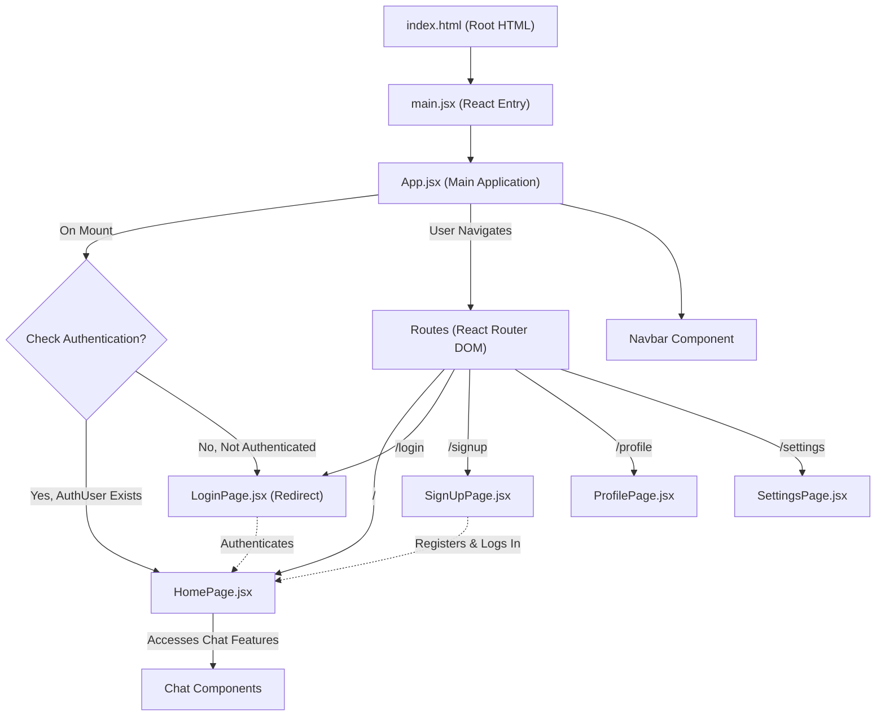
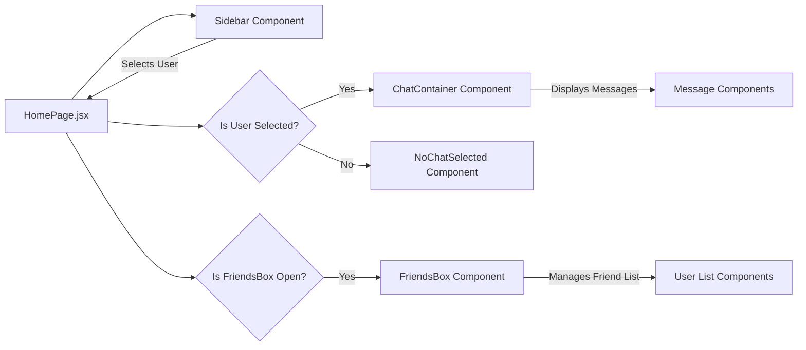

 # Frontend Application Design

The frontend application provides the user interface for the Chatty application, built using React.js. It leverages modern React patterns, React Router DOM for navigation, and Zustand for state management. This document outlines the core architecture, component structure, and key interaction points within the frontend.

## Core Application Structure

The application's entry point is the `index.html` file, which hosts the root React component. The `main.jsx` file initializes the React application, wrapping the primary `App` component with `BrowserRouter` for client-side routing. The `App.jsx` component then orchestrates global layouts, authentication checks, and route definitions.

### Entry Point (`index.html` and `main.jsx`)

The `index.html` file serves as the single page entry for the React application. It defines the `<div id="root">` element where the React application is mounted.

```html
<!doctype html>
<html lang="en">
  <head>
    <meta charset="UTF-8" />
    <link rel="icon" type="image/svg+xml+png" href="/icon.png" />
    <meta name="viewport" content="width=device-width, initial-scale=1.0" />
    <title>Chatty</title>
  </head>
  <body>
    <div id="root"></div>
    <script type="module" src="/src/main.jsx"></script>
  </body>
</html>
```
[View on GitHub](https://github.com/shinymack/Chat-App-MERN/blob/main/frontend/index.html)

The `main.jsx` file is responsible for rendering the root React component. It ensures that the application operates within `StrictMode` and integrates `BrowserRouter` from `react-router-dom` to enable declarative routing throughout the application.

```jsx
import { StrictMode } from 'react'
import { createRoot } from 'react-dom/client'
import './index.css'
import App from './App.jsx'
import { BrowserRouter } from 'react-router-dom'

createRoot(document.getElementById('root')).render(
  <StrictMode>
    <BrowserRouter>
      <App />
    </BrowserRouter>
  </StrictMode>,
)
```
[View on GitHub](https://github.com/shinymack/Chat-App-MERN/blob/main/frontend/src/main.jsx)

### Main Application Component (`App.jsx`)

`App.jsx` acts as the central hub for the application. It handles global state management for authentication (`useAuthStore`) and theme (`useThemeStore`), performs an initial authentication check, and defines all primary routes. It also conditionally renders a loading spinner during the authentication check.

```jsx
import Navbar from './components/Navbar'
import { Routes, Route, Navigate } from 'react-router-dom'
import { useEffect } from 'react'
import HomePage from './pages/HomePage'
import SignUpPage from './pages/SignUpPage' 
import LoginPage from './pages/LoginPage' 
import SettingsPage from './pages/SettingsPage' 
import ProfilePage from './pages/ProfilePage'
// ... other imports
import { useAuthStore } from './store/useAuthStore'; 

const App = () => {
  const { authUser, checkAuth, isCheckingAuth, onlineUsers } = useAuthStore();
  // ... theme state
  useEffect(() => {
    checkAuth();
  }, [checkAuth]);

  if(isCheckingAuth && !authUser) return (
      <div className='flex items-center justify-center h-screen'>
        <Loader className='size-10 animate-spin' />
      </div>
  )
  // ... rest of component
}
export default App
```
[View on GitHub](https://github.com/shinymack/Chat-App-MERN/blob/main/frontend/src/App.jsx#L8-L29)

The application flow, including initial authentication and routing, can be visualized as follows:





## Page Layouts and Routing

`App.jsx` defines the primary routing logic using `react-router-dom`. It handles conditional rendering to protect routes, redirecting users to the login page if they are not authenticated, or to the home page if they try to access authentication-related routes while already logged in.

```jsx
// Inside App.jsx render function
// ...
      <Navbar />
      <Toaster />
      <Routes>
        <Route path='/' element={authUser ? <HomePage />: <Navigate to='/login' />} />
        <Route path='/signup' element={ !authUser ? <SignUpPage />: <Navigate to='/' />} />
        <Route path='/login' element={!authUser ? <LoginPage />: <Navigate to='/' />} />
        <Route path='/settings' element={<SettingsPage />} />
        <Route path='/profile' element={authUser ? <ProfilePage />: <Navigate to='/login' />} />
      </Routes>
// ...
```
[View on GitHub](https://github.com/shinymack/Chat-App-MERN/blob/main/frontend/src/App.jsx#L36-L44)

### HomePage (`HomePage.jsx`)

The `HomePage` component is the main interface for authenticated users, displaying the core chat functionality. It orchestrates the display of various chat-related components based on user interactions and selected chat states. It utilizes `useChatStore` to manage the currently selected user and the visibility of the friends box.

```jsx
// frontend/src/pages/HomePage.jsx
import ChatContainer from "../components/ChatContainer";
import FriendsBox from "../components/FriendsBox";
import NoChatSelected from "../components/NoChatSelected";
import Sidebar from "../components/Sidebar";
import { useChatStore } from "../store/useChatStore"

const HomePage = () => {
  const { selectedUser } = useChatStore();
  const { isFriendsBoxOpen } = useChatStore();
  return (
      <div className="h-screen bg-base-200">
      <div className="flex items-center justify-center pt-20 px-4 w-full">
        <div className="bg-base-100 rounded-lg shadow-xl w-full max-w-6xl h-[calc(100vh-8rem)]">
          <div className="flex h-full rounded-lg overflow-hidden w-full">
            <Sidebar />
            {!selectedUser ? <NoChatSelected /> : <ChatContainer />}
            {isFriendsBoxOpen && <FriendsBox />}
          </div>
        </div>
      </div>
    </div>
  )
}

export default HomePage
```
[View on GitHub](https://github.com/shinymack/Chat-App-MERN/blob/main/frontend/src/pages/HomePage.jsx)

The internal layout and component interaction within the `HomePage` can be visualized as follows:





## Key Integration Points

### State Management with Zustand

The application uses Zustand for lightweight and scalable state management. Key stores include:

*   **`useAuthStore`**: Manages the authenticated user (`authUser`), authentication status (`isCheckingAuth`), and online users (`onlineUsers`). It also provides the `checkAuth` action to verify user sessions.
*   **`useThemeStore`**: Handles the application's theme, allowing users to switch between different visual themes.
*   **`useChatStore`**: Manages chat-specific state, such as the `selectedUser` for the current conversation and the `isFriendsBoxOpen` status to toggle the friends list visibility.

These stores are integrated into components like `App.jsx` for global state and `HomePage.jsx` for feature-specific state, providing a clear separation of concerns and efficient state updates.