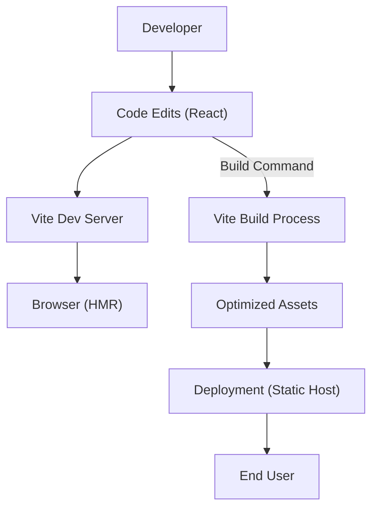
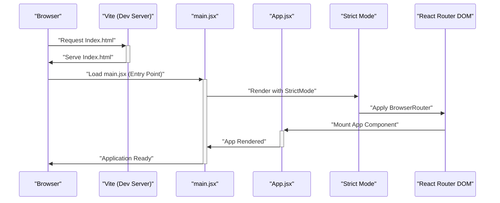

 # Frontend Application Structure

The frontend of the application is built using React and Vite, providing a fast and efficient development experience. This document outlines the core components, key configurations, and the overall structure of the client-side codebase.

## Project Overview

The project leverages modern web development tools to deliver a responsive and interactive user interface. Vite serves as the build tool, offering rapid hot module replacement (HMR) and optimized builds, while React handles the declarative UI construction.

### Core Technologies

The `frontend/README.md` file briefly introduces the stack:

```markdown
# React + Vite

This template provides a minimal setup to get React working in Vite with HMR and some ESLint rules.

Currently, two official plugins are available:

- [@vitejs/plugin-react](https://github.com/vitejs/vite-plugin-react/blob/main/packages/plugin-react/README.md) uses [Babel](https://babeljs.io/) for Fast Refresh
- [@vitejs/plugin-react-swc](https://swc.rs/) uses [SWC](https://swc.rs/) for Fast Refresh
```
[View README on GitHub](https://github.com/shinymack/Chat-App-MERN/blob/main/frontend/README.md)

This foundational setup ensures a performant and maintainable frontend.

### Frontend Application Flow

The following diagram illustrates the high-level flow from development to deployment of the frontend application.





## Dependencies and Scripts

The `frontend/package.json` file lists all project dependencies and defines essential scripts for development, building, and linting.

### Key Dependencies

The `dependencies` section includes libraries crucial for the application's functionality:

```json
  "dependencies": {
    "axios": "^1.7.9",
    "cors": "^2.8.5",
    "lucide-react": "^0.471.1",
    "react": "^18.3.1",
    "react-dom": "^18.3.1",
    "react-hot-toast": "^2.5.1",
    "react-icons": "^5.5.0",
    "react-router-dom": "^7.1.1",
    "socket.io-client": "^4.8.1",
    "zustand": "^5.0.3"
  },
```
[View package.json on GitHub](https://github.com/shinymack/Chat-App-MERN/blob/main/frontend/package.json#L13-L25)

*   **`react`**, **`react-dom`**: Core React libraries.
*   **`react-router-dom`**: For declarative routing within the single-page application.
*   **`axios`**: A promise-based HTTP client for making API requests to the backend.
*   **`socket.io-client`**: Enables real-time, bidirectional communication with the backend.
*   **`zustand`**: A lightweight state management solution.
*   **`lucide-react`**, **`react-icons`**: Icon libraries for UI elements.
*   **`react-hot-toast`**: For displaying notifications.

### Development Scripts

The `scripts` section provides commands to manage the project lifecycle:

```json
  "scripts": {
    "dev": "vite",
    "build": "vite build",
    "lint": "eslint .",
    "preview": "vite preview",
    "mobile": "vite --host"
  },
```
[View package.json on GitHub](https://github.com/shinymack/Chat-App-MERN/blob/main/frontend/package.json#L7-L12)

*   **`dev`**: Starts the Vite development server with hot module replacement.
*   **`build`**: Compiles the application for production deployment.
*   **`lint`**: Runs ESLint to check for code quality and style issues.
*   **`preview`**: Serves the production build locally for testing.
*   **`mobile`**: Starts the Vite server with host exposure, allowing access from other devices on the same network.

## Application Entry Point

The `frontend/src/main.jsx` file is the primary entry point for the React application. It sets up the root component and integrates essential providers.

```jsx
import { StrictMode } from 'react'
import { createRoot } from 'react-dom/client'
import './index.css'
import App from './App.jsx'
import { BrowserRouter } from 'react-router-dom'

createRoot(document.getElementById('root')).render(
  <StrictMode>
    <BrowserRouter>
      <App />
    </BrowserRouter>
  </StrictMode>,
)
```
[View main.jsx on GitHub](https://github.com/shinymack/Chat-App-MERN/blob/main/frontend/src/main.jsx)

*   **`StrictMode`**: A React feature that helps identify potential problems in an application by activating additional checks and warnings for its descendants.
*   **`BrowserRouter`**: From `react-router-dom`, this component enables client-side routing, allowing navigation between different views without full page reloads.
*   **`App`**: The main application component, where the core UI and logic reside.

## Build and Development Configuration

The `frontend/vite.config.js` file configures Vite's behavior for both development and production builds.

```javascript
import { defineConfig } from 'vite'
import react from '@vitejs/plugin-react'

// https://vitejs.dev/config/
export default defineConfig({
  plugins: [react()],
})
```
[View vite.config.js on GitHub](https://github.com/shinymack/Chat-App-MERN/blob/main/frontend/vite.config.js)

This minimal configuration specifies the use of `@vitejs/plugin-react`, which provides React Fast Refresh support during development, making the development loop very efficient.

## Key Integration Points

The frontend interacts with various external services and internal modules to deliver its features.

### Frontend Application Startup Sequence

This sequence diagram illustrates the initialization process of the frontend application.





This sequence highlights the journey from the browser requesting the application to the `App` component being mounted, ready for user interaction, enveloped by `StrictMode` and `BrowserRouter` for robust development and navigation.