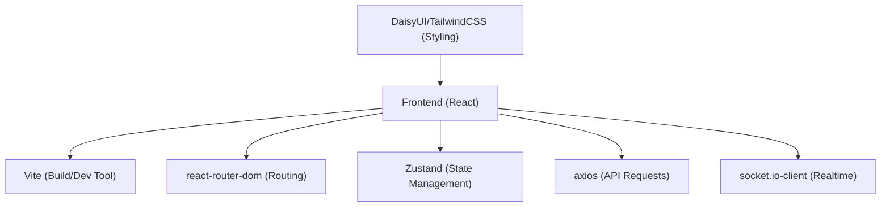
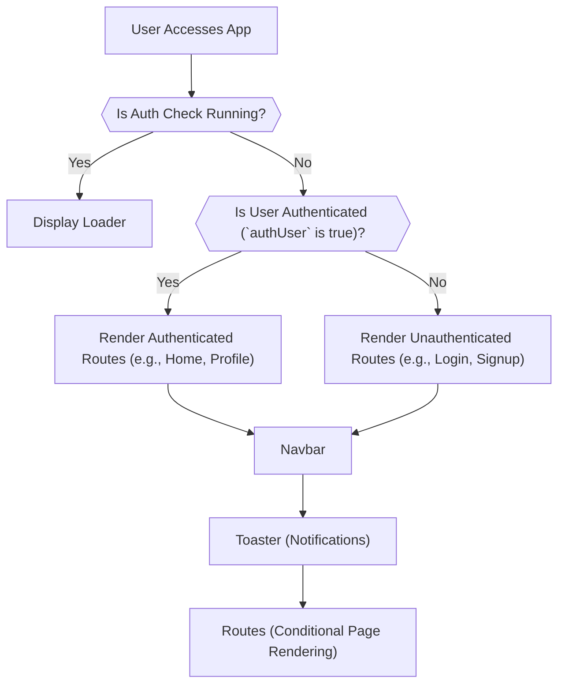

 # Frontend Application Structure

This document provides a detailed overview of the frontend application's foundational structure, covering the project's setup, main entry point, core application component, and global styling. Understanding these elements is crucial for comprehending how the React application is initialized, renders components, manages global state, and handles routing.

## Project Setup and Dependencies

The `frontend/package.json` file serves as the manifest for the frontend application, defining its metadata, scripts, and a comprehensive list of dependencies and devDependencies. It outlines the tools and libraries essential for development, building, and running the application.

### Core Technologies and Dependencies

The project leverages a modern React ecosystem, with Vite for fast development and bundling, and a suite of libraries for various functionalities:

*   **React & ReactDOM**: The core libraries for building user interfaces.
*   **Vite**: A next-generation frontend tooling that provides an extremely fast development experience.
*   **`react-router-dom`**: For declarative routing within the single-page application, enabling navigation between different views without full page reloads.
*   **`zustand`**: A small, fast, and scalable bear-bones state-management solution, used here for global state like authentication and theme.
*   **`axios`**: A promise-based HTTP client for making API requests to the backend.
*   **`socket.io-client`**: Enables real-time, bidirectional event-based communication with the backend.
*   **`daisyui` & `tailwindcss`**: A component library and a utility-first CSS framework, respectively, for styling the application.
*   **`react-hot-toast`**: For elegant and accessible notifications.

The `scripts` section defines commands for development (`dev`), building for production (`build`), linting (`lint`), and previewing the production build (`preview`). The `mobile` script is particularly useful for exposing the development server to the local network, facilitating testing on mobile devices.

```json
{
  "name": "frontend",
  "private": true,
  "version": "0.0.0",
  "type": "module",
  "scripts": {
    "dev": "vite",
    "build": "vite build",
    "lint": "eslint .",
    "preview": "vite preview",
    "mobile": "vite --host"
  },
  "dependencies": {
    "axios": "^1.7.9",
    "cors": "^2.8.5",
    "lucide-react": "^0.471.1",
    "react": "^18.3.1",
    "react-dom": "^18.3.1",
    "react-hot-toast": "^2.5.1",
    "react-icons": "^5.5.0",
    "react-router-dom": "^7.1.1",
    "socket.io-client": "^4.8.1",
    "zustand": "^5.0.3"
  },
  "devDependencies": {
    "@eslint/js": "^9.17.0",
    "@types/react": "^18.3.18",
    "@types/react-dom": "^18.3.5",
    "@vitejs/plugin-react": "^4.3.4",
    "autoprefixer": "^10.4.20",
    "daisyui": "^4.12.23",
    "eslint": "^9.17.0",
    "eslint-plugin-react": "^7.37.2",
    "eslint-plugin-react-hooks": "^5.0.0",
    "eslint-plugin-react-refresh": "^0.4.16",
    "globals": "^15.14.0",
    "postcss": "^8.5.0",
    "tailwindcss": "^3.4.17",
    "vite": "^6.3.5"
  }
}
```
[View `package.json` on GitHub](https://github.com/shinymack/Chat-App-MERN/blob/main/frontend/package.json)

The interaction of these core technologies can be visualized as a foundational stack:





## Application Entry Point: `main.jsx`

The `frontend/src/main.jsx` file is the primary entry point for the React application. It is responsible for rendering the root React component into the DOM.

### Initialization Process

1.  **`createRoot`**: The `createRoot` function from `react-dom/client` is used to create a root for the React application. This is the modern way to render React apps in React 18+.
2.  **`StrictMode`**: The `<StrictMode>` component is a development-only tool that helps identify potential problems in an application. It activates additional checks and warnings for its descendants.
3.  **`BrowserRouter`**: The `<BrowserRouter>` component from `react-router-dom` enables client-side routing. It uses the HTML5 history API to keep your UI in sync with the URL. All routing logic within the `App` component will operate under this router.
4.  **`App` Component**: The main `App` component, which encapsulates the entire application logic and UI, is rendered within the `BrowserRouter`.

```jsx
import { StrictMode } from 'react'
import { createRoot } from 'react-dom/client'
import './index.css' // Global styling
import App from './App.jsx' // Main application component
import { BrowserRouter } from 'react-router-dom' // For routing

createRoot(document.getElementById('root')).render(
  <StrictMode>
    <BrowserRouter>
      <App />
    </BrowserRouter>
  </StrictMode>,
)
```
[View `main.jsx` on GitHub](https://github.com/shinymack/Chat-App-MERN/blob/main/frontend/src/main.jsx)

This setup ensures that the entire application, starting with `App.jsx`, has access to routing capabilities and runs under strict development checks.

## Main Application Component: `App.jsx`

The `frontend/src/App.jsx` file is the heart of the frontend application. It defines the main layout, handles global state management, implements client-side routing, and manages application-wide concerns like authentication status and theme.

### Key Features and Logic

1.  **Global State Management**:
    *   `useAuthStore()`: Manages user authentication state, including `authUser` (the currently authenticated user), `isCheckingAuth` (loading state during auth check), and the `checkAuth` function.
    *   `useThemeStore()`: Manages the application's theme, which is applied to the main `div` element via `data-theme={theme}`.
2.  **Authentication Check**:
    *   An `useEffect` hook calls `checkAuth()` on component mount to verify the user's authentication status. This is crucial for maintaining session persistence across page reloads.
    *   During the `isCheckingAuth` phase, a loading spinner (`Loader`) is displayed to provide a better user experience.
3.  **Routing**:
    *   `react-router-dom`'s `Routes` and `Route` components define the application's navigation paths.
    *   **Protected Routes**: Routes like `/` (Home) and `/profile` are protected, redirecting unauthenticated users to `/login` using `<Navigate to='/login' />`.
    *   **Guest-Only Routes**: Routes like `/signup` and `/login` are accessible only to unauthenticated users, redirecting authenticated users to `/` using `<Navigate to='/' />`.
    *   The `/settings` page is accessible regardless of authentication status, which might be a design choice to allow guests to customize some app settings.
4.  **Global Components**:
    *   `Navbar`: Included at the top of the application to provide consistent navigation.
    *   `Toaster`: From `react-hot-toast`, positioned globally to display notifications across the application.

```jsx
// frontend/src/App.jsx
import Navbar from './components/Navbar'
import { Routes, Route, Navigate } from 'react-router-dom'
import { useEffect } from 'react'
import HomePage from './pages/HomePage'
import SignUpPage from './pages/SignUpPage' 
import LoginPage from './pages/LoginPage' 
import SettingsPage from './pages/SettingsPage' 
import ProfilePage from './pages/ProfilePage'

import { useThemeStore } from './store/useThemeStore'
import { useAuthStore } from './store/useAuthStore'; 
import { Loader } from 'lucide-react'
import { Toaster } from 'react-hot-toast'

const App = () => {
  const { authUser, checkAuth, isCheckingAuth, onlineUsers } = useAuthStore();
  const { theme } = useThemeStore();

  useEffect(() => {
    checkAuth();
  }, [checkAuth]); // Ensures auth check runs once on mount

  if(isCheckingAuth && !authUser) return (
      <div className='flex items-center justify-center h-screen'>
        <Loader className='size-10 animate-spin' />
      </div>
  )

  return (
    <div className='' data-theme={theme}> {/* Applies current theme */}

      <Navbar /> {/* Global navigation */}

      <Toaster /> {/* Global notifications */}
      <Routes>
        <Route path='/' element={authUser ? <HomePage />: <Navigate to='/login' />} />
        <Route path='/signup' element={ !authUser ? <SignUpPage />: <Navigate to='/' />} />
        <Route path='/login' element={!authUser ? <LoginPage />: <Navigate to='/' />} />
        <Route path='/settings' element={<SettingsPage />} />
        <Route path='/profile' element={authUser ? <ProfilePage />: <Navigate to='/login' />} />
      </Routes>
    </div> 
  )
}

export default App
```
[View `App.jsx` on GitHub](https://github.com/shinymack/Chat-App-MERN/blob/main/frontend/src/App.jsx)

The core routing and authentication flow can be illustrated as follows:





## Global Styling: `index.css`

The `frontend/src/index.css` file is responsible for importing global stylesheets and applying base styles to the application. It's the central place for custom fonts and integrating CSS frameworks.

### Styling Strategy

1.  **Font Import**: The `@import url(...)` statement imports the "Chivo" font from Google Fonts, ensuring a consistent typography throughout the application.
2.  **Tailwind CSS**: The `@tailwind base;`, `@tailwind components;`, and `@tailwind utilities;` directives inject Tailwind CSS's generated styles. This enables the use of utility-first classes for styling components.
3.  **Custom Base Layer**: The `@layer base { ... }` block allows defining custom CSS that gets injected into Tailwind's `base` layer. Here, it applies the imported `font-chivo` to the `body` element using a Tailwind utility class (`@apply font-chivo;`).

```css
@import url('https://fonts.googleapis.com/css2?family=Chivo:ital,wght@0,100..900;1,100..900&display=swap');
@tailwind base;
@tailwind components;
@tailwind utilities;

@layer base {
    body {
        @apply font-chivo;
    }
}
```
[View `index.css` on GitHub](https://github.com/shinymack/Chat-App-MERN/blob/main/frontend/src/index.css)

This approach centralizes global styling, allowing specific components to be styled using Tailwind's utility classes or DaisyUI components, while maintaining a consistent overall look and feel with a custom font.

## Key Integration Points

The structure outlined above highlights several crucial integration points that define the application's overall architecture and user experience:

*   **Routing and Authentication Flow**: The tight integration between `BrowserRouter` in `main.jsx` and the conditional rendering logic in `App.jsx` based on `useAuthStore`'s `authUser` status is fundamental. It ensures that users are directed to appropriate pages, enhancing security and user experience by preventing unauthorized access to protected routes and redundant access to login/signup pages.
*   **Global State and UI Consistency**: `useThemeStore` and `useAuthStore` provide a robust mechanism for managing application-wide states. The theme, applied directly to the root `div` in `App.jsx`, ensures that theme changes propagate instantly across the entire UI. Similarly, authentication state drives core UI elements like the Navbar and route access.
*   **Styling Consistency**: The global `index.css` file, combined with Tailwind CSS and DaisyUI, establishes a consistent visual language. By importing fonts and setting base styles here, developers can build components confident that they will adhere to the application's design system.
*   **Performance and User Experience**: The use of `StrictMode` in development aids in identifying potential performance pitfalls, while the loading spinner during the authentication check prevents a blank screen, improving the perceived performance and responsiveness of the application. `react-hot-toast` further enhances user experience by providing non-intrusive feedback.

This structured setup promotes maintainability, scalability, and a clear separation of concerns, making it easier to develop and debug complex frontend features.