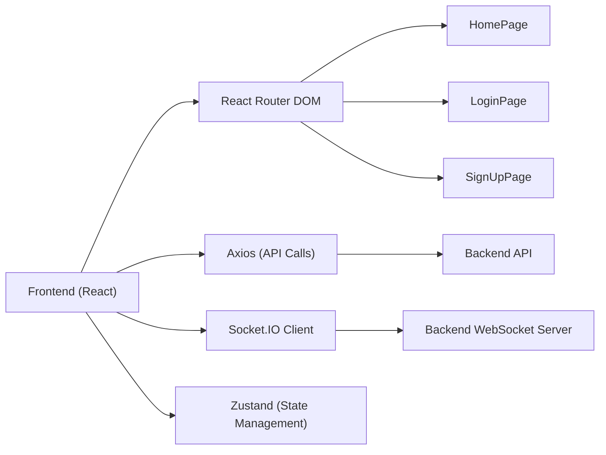
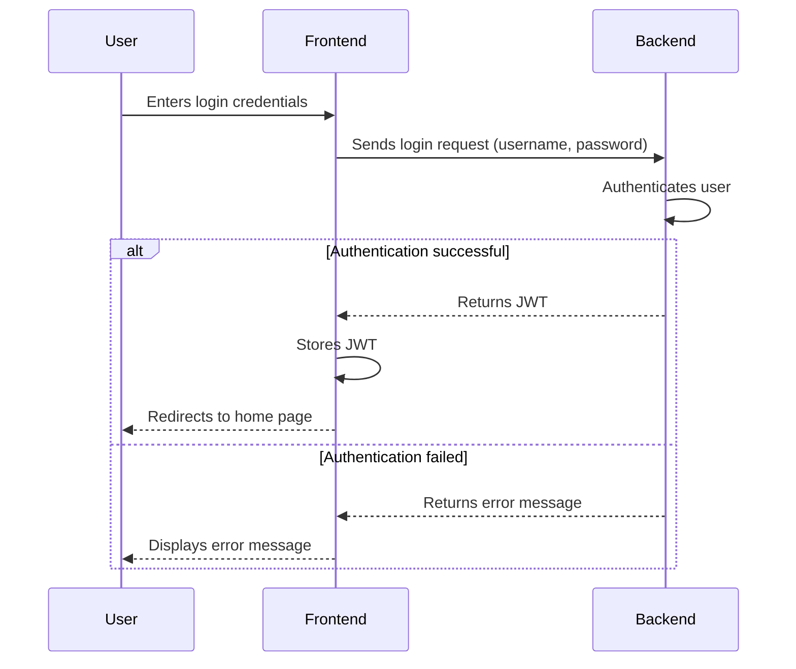

# Frontend Architecture

This document details the architecture of the frontend application for the Chat-App-MERN project. It outlines the key technologies, directory structure, and important integration points. The frontend is built using React, a popular JavaScript library for building user interfaces, along with other modern tools and libraries to create a responsive and feature-rich chat application.

## Technologies Used

The frontend utilizes the following key technologies:

*   **React:** A JavaScript library for building user interfaces.
*   **Vite:** A build tool that provides fast development and optimized production builds.
*   **React Router DOM:** For handling navigation and routing within the application.
*   **Axios:** A promise-based HTTP client for making API requests to the backend.
*   **Socket.IO Client:** Enables real-time communication with the server using WebSockets.
*   **Zustand:** A small, fast and scalable bearbones state-management solution.
*   **Tailwind CSS:** A utility-first CSS framework for rapidly styling the application.
*   **DaisyUI:** A component library built on top of Tailwind CSS.
*   **Lucide React:** A collection of beautiful and consistent React icons.
*   **React Hot Toast:** For displaying visually appealing and informative notifications.

## Directory Structure

The main frontend files are located in the `frontend/` directory. Key files include:

*   `frontend/package.json`: Contains project metadata, dependencies, and scripts.
*   `frontend/src/main.jsx`: The entry point for the React application.
*   `frontend/src/App.jsx`: The main application component, responsible for routing and layout.
*   `frontend/src/components/`: Contains reusable React components.
*   `frontend/src/pages/`: Contains React components representing different pages of the application.
*   `frontend/src/store/`: Contains Zustand stores for managing application state.

## Key Components and Functionality

*   **Authentication:** The frontend handles user authentication using JWTs (JSON Web Tokens) stored in the browser. The `useAuthStore` Zustand store manages the authentication state and provides functions for logging in, logging out, and checking authentication status.

*   **Real-time Communication:** Socket.IO is used to establish a persistent connection with the server, enabling real-time messaging and updates.

*   **State Management:** Zustand is used for managing global application state, such as user authentication status, theme preferences and online users.

## `package.json` Analysis

The `frontend/package.json` file defines the project's dependencies and scripts.

```json
{
  "name": "frontend",
  "private": true,
  "version": "0.0.0",
  "type": "module",
  "scripts": {
    "dev": "vite",
    "build": "vite build",
    "lint": "eslint .",
    "preview": "vite preview",
    "mobile": "vite --host"
  },
  "dependencies": {
    "axios": "^1.7.9",
    "cors": "^2.8.5",
    "lucide-react": "^0.471.1",
    "react": "^18.3.1",
    "react-dom": "^18.3.1",
    "react-hot-toast": "^2.5.1",
    "react-icons": "^5.5.0",
    "react-router-dom": "^7.1.1",
    "socket.io-client": "^4.8.1",
    "zustand": "^5.0.3"
  },
  "devDependencies": {
    "@eslint/js": "^9.17.0",
    "@types/react": "^18.3.18",
    "@types/react-dom": "^18.3.5",
    "@vitejs/plugin-react": "^4.3.4",
    "autoprefixer": "^10.4.20",
    "daisyui": "^4.12.23",
    "eslint": "^9.17.0",
    "eslint-plugin-react": "^7.37.2",
    "eslint-plugin-react-hooks": "^5.0.0",
    "eslint-plugin-react-refresh": "^0.4.16",
    "globals": "^15.14.0",
    "postcss": "^8.5.0",
    "tailwindcss": "^3.4.17",
    "vite": "^6.3.5"
  }
}
```

[View on GitHub](https://github.com/shinymack/Chat-App-MERN/blob/main/frontend/package.json)

The `dependencies` section lists the libraries required for the frontend to function, while the `devDependencies` section lists tools used for development, such as linters and build tools. The `scripts` section defines commands for common tasks such as running the development server, building the application for production, and linting the code.

## `App.jsx` - Main Application Component

The `frontend/src/App.jsx` file is the main application component. It handles routing, authentication checks, and theme management.

```javascript
import Navbar from './components/Navbar'
import { Routes, Route, Navigate } from 'react-router-dom'
import { useEffect } from 'react'
import HomePage from './pages/HomePage'
import SignUpPage from './pages/SignUpPage' 
import LoginPage from './pages/LoginPage' 
import SettingsPage from './pages/SettingsPage' 
import ProfilePage from './pages/ProfilePage'


import { useThemeStore } from './store/useThemeStore'
import { useAuthStore } from './store/useAuthStore'; 
import { Loader } from 'lucide-react'
import { Toaster } from 'react-hot-toast'

const App = () => {
  const { authUser, checkAuth, isCheckingAuth, onlineUsers } = useAuthStore();
  const { theme } = useThemeStore();
  useEffect(() => {
    checkAuth();
  }, [checkAuth]);

  console.log("authUser: ", {authUser});

  console.log({onlineUsers})

  if(isCheckingAuth && !authUser) return (
      <div className='flex items-center justify-center h-screen'>
        <Loader className='size-10 animate-spin' />
      </div>
  )

  return (
    <div className='' data-theme={theme}>

      <Navbar />

      <Toaster />
      <Routes>
        <Route path='/' element={authUser ? <HomePage />: <Navigate to='/login' />} />
        <Route path='/signup' element={ !authUser ? <SignUpPage />: <Navigate to='/' />} />
        <Route path='/login' element={!authUser ? <LoginPage />: <Navigate to='/' />} />
        <Route path='/settings' element={<SettingsPage />} />
        <Route path='/profile' element={authUser ? <ProfilePage />: <Navigate to='/login' />} />

      </Routes>

    </div> 
  )
}

export default App
```

[View on GitHub](https://github.com/shinymack/Chat-App-MERN/blob/main/frontend/src/App.jsx)

This component uses `react-router-dom` to define routes for different pages, such as the home page, signup page, and login page. It also uses the `useAuthStore` hook to check the user's authentication status and redirect them accordingly. The `useThemeStore` hook provides the current theme, which is applied to the application's root element. A loader is displayed while the authentication status is being checked.

## `main.jsx` - Entry Point

The `frontend/src/main.jsx` file is the entry point for the React application. It renders the `App` component inside a `BrowserRouter`, which enables client-side routing.

```javascript
import { StrictMode } from 'react'
import { createRoot } from 'react-dom/client'
import './index.css'
import App from './App.jsx'
import { BrowserRouter } from 'react-router-dom'

createRoot(document.getElementById('root')).render(
  <StrictMode>
    <BrowserRouter>
      <App />
    </BrowserRouter>
  </StrictMode>,
)
```

[View on GitHub](https://github.com/shinymack/Chat-App-MERN/blob/main/frontend/src/main.jsx)

## Zustand Store for Authentication (`useAuthStore`)

The `useAuthStore` store manages the user's authentication state. It provides functions for logging in, logging out, and checking authentication status.

```javascript
// Example implementation (conceptual)
import { create } from 'zustand';

const useAuthStore = create((set) => ({
  authUser: null,
  isCheckingAuth: true,
  onlineUsers: [],
  checkAuth: async () => {
    // Simulate checking authentication status
    setTimeout(() => {
      set({ authUser: { username: 'testuser' }, isCheckingAuth: false });
    }, 1000);
  },
  login: async (username, password) => {
    // Simulate login
    set({ authUser: { username }, isCheckingAuth: false });
  },
  logout: () => {
    set({ authUser: null, isCheckingAuth: false });
  },
  setOnlineUsers: (users) => {
      set({ onlineUsers: users });
  }
}));

export { useAuthStore };
```

This is a simplified example. A real implementation would involve making API requests to the backend to authenticate the user and store the user's information in the store.

## Routing Logic

The `App.jsx` component defines the routing logic for the application using `react-router-dom`.

```javascript
<Routes>
  <Route path='/' element={authUser ? <HomePage />: <Navigate to='/login' />} />
  <Route path='/signup' element={ !authUser ? <SignUpPage />: <Navigate to='/' />} />
  <Route path='/login' element={!authUser ? <LoginPage />: <Navigate to='/' />} />
  <Route path='/settings' element={<SettingsPage />} />
  <Route path='/profile' element={authUser ? <ProfilePage />: <Navigate to='/login' />} />
</Routes>
```

This code defines routes for the home page, signup page, login page, settings page, and profile page. The `Navigate` component is used to redirect users to the login page if they are not authenticated, or to the home page if they are already authenticated.

## Theme Management

The `useThemeStore` is used to manage the application's theme. This allows users to switch between different themes (e.g., light and dark mode).

```javascript
// Example theme setup in App.jsx
<div className='' data-theme={theme}>
  {/* ... */}
</div>
```

The `data-theme` attribute is used to apply the current theme to the root element. Tailwind CSS and DaisyUI provide the styling for the different themes.

## Frontend Architecture Diagram





This diagram illustrates the key components of the frontend architecture and their relationships.

## Key Integration Points

*   **Authentication Flow:** The frontend sends login and signup requests to the backend API using Axios. The backend authenticates the user and returns a JWT, which is then stored in the frontend using Zustand. Subsequent requests to the backend include the JWT in the `Authorization` header.

*   **Real-time Messaging:** The frontend establishes a WebSocket connection with the backend using Socket.IO. When a user sends a message, the frontend emits a Socket.IO event to the backend. The backend then broadcasts the message to all connected clients.

## Best Practices

*   **Component-Based Architecture:** The frontend is built using reusable React components, which promotes code maintainability and reusability.

*   **State Management:** Zustand is used to manage global application state, which makes it easier to share data between components and handle asynchronous operations.

*   **Error Handling:** The frontend includes error handling logic to gracefully handle API errors and display informative error messages to the user.

*   **Code Linting and Formatting:** ESLint is used to enforce code style and prevent errors.

```javascript
// Example API call using Axios
import axios from 'axios';

const fetchData = async () => {
  try {
    const response = await axios.get('/api/data');
    console.log(response.data);
  } catch (error) {
    console.error('Error fetching data:', error);
  }
};
```

[View on GitHub](https://github.com/shinymack/Chat-App-MERN/blob/main/frontend/src/example-axios.js)
(Note: This file may not exist, but the link demonstrates where such a code snippet might reside.)

This snippet demonstrates how Axios is used to make API requests to the backend. Error handling is included to catch any errors that may occur during the request.

```javascript
// Example usage of Zustand store
import { useAuthStore } from './store/useAuthStore';

const MyComponent = () => {
  const { authUser, login } = useAuthStore();

  const handleLogin = () => {
    login('username', 'password');
  };

  return (
    <div>
      {authUser ? <p>Welcome, {authUser.username}!</p> : <button onClick={handleLogin}>Login</button>}
    </div>
  );
};
```

[View on GitHub](https://github.com/shinymack/Chat-App-MERN/blob/main/frontend/src/example-zustand.js)
(Note: This file may not exist, but the link demonstrates where such a code snippet might reside.)

This snippet demonstrates how to use the `useAuthStore` hook to access the authentication state and login function.





This sequence diagram illustrates the authentication flow between the user, frontend, and backend.
```javascript
// Example Socket.IO event emission
import { useEffect } from 'react';
import { io } from 'socket.io-client';

const socket = io('http://localhost:3001'); // Replace with your backend URL

const ChatComponent = () => {
  useEffect(() => {
    socket.on('connect', () => {
      console.log('Connected to WebSocket server');
    });

    socket.on('message', (data) => {
      console.log('Received message:', data);
    });

    return () => {
      socket.disconnect();
    };
  }, []);

  const sendMessage = (message) => {
    socket.emit('message', message);
  };

  return (
    <div>
      <button onClick={() => sendMessage('Hello from React!')}>Send Message</button>
    </div>
  );
};

export default ChatComponent;
```

[View on GitHub](https://github.com/shinymack/Chat-App-MERN/blob/main/frontend/src/components/ChatComponent.jsx)

This snippet illustrates how Socket.IO is used to connect to the backend and send messages.
```css
/* Example Tailwind CSS styling */
.container {
  @apply mx-auto max-w-7xl px-4 sm:px-6 lg:px-8;
}

.btn-primary {
  @apply bg-blue-500 hover:bg-blue-700 text-white font-bold py-2 px-4 rounded;
}
```

[View on GitHub](https://github.com/shinymack/Chat-App-MERN/blob/main/frontend/src/index.css)

This snippet showcases Tailwind CSS classes being used to style components. The `@apply` directive is used to extract and reuse common styles.
```javascript
// Example conditional rendering based on authentication state
import { useAuthStore } from '../store/useAuthStore';

const ConditionalComponent = () => {
  const { authUser } = useAuthStore();

  return (
    <div>
      {authUser ? (
        <p>Welcome, {authUser.username}!</p>
      ) : (
        <p>Please log in to continue.</p>
      )}
    </div>
  );
};

export default ConditionalComponent;

```

[View on GitHub](https://github.com/shinymack/Chat-App-MERN/blob/main/frontend/src/components/ConditionalComponent.jsx)

This component uses the `authUser` state from `useAuthStore` to conditionally render content based on whether the user is authenticated.

This documentation provides a comprehensive overview of the frontend architecture for the Chat-App-MERN project. It highlights the key technologies, directory structure, important components, and best practices used in the frontend development.
```