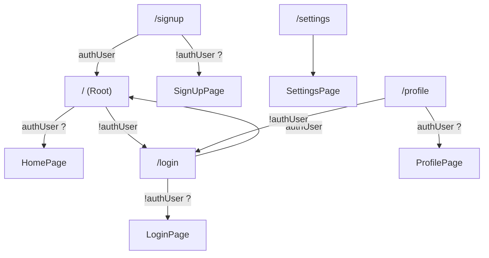
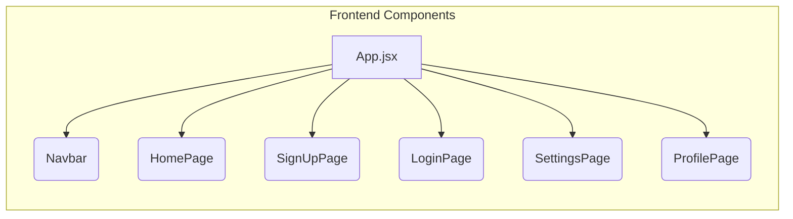

# Frontend Architecture

This document outlines the architecture of the frontend application for the Chat-App-MERN project. It details the key components, technology stack, and structure of the frontend codebase.

## Technology Stack

The frontend is built using the following technologies:

| Technology         | Version  | Purpose                               |
| ------------------ | -------- | ------------------------------------- |
| React              | ^18.3.1  | UI Library                          |
| React Router DOM   | ^7.1.1   | Routing                               |
| Vite               | ^6.3.5   | Build Tool                          |
| Zustand            | ^5.0.3   | State Management                    |
| Axios              | ^1.7.9   | HTTP Client                         |
| Socket.IO Client | ^4.8.1   | Real-time Communication            |
| Tailwind CSS       | ^3.4.17  | CSS Framework                       |
| DaisyUI            | ^4.12.23 | Tailwind CSS Component Library      |
| lucide-react       | ^0.471.1 | Icons Library                       |
| react-hot-toast    | ^2.5.1   | Toast Notifications                 |
| ESLint             | ^9.17.0  | Linter                              |
| PostCSS            | ^8.5.0   | CSS processing tool                 |

This stack provides a robust and efficient environment for building a modern web application.

## Project Structure

The core files that define the structure of the frontend application are:

-   `frontend/package.json`:  Defines project dependencies and scripts.
-   `frontend/src/App.jsx`: The main application component, responsible for routing and layout.
-   `frontend/src/main.jsx`: Entry point of the application, rendering the `App` component.

### `frontend/package.json`

This file manages the project's dependencies and build configurations.

```json
{
  "name": "frontend",
  "private": true,
  "version": "0.0.0",
  "type": "module",
  "scripts": {
    "dev": "vite",
    "build": "vite build",
    "lint": "eslint .",
    "preview": "vite preview",
    "mobile": "vite --host"
  },
  "dependencies": {
    "axios": "^1.7.9",
    "cors": "^2.8.5",
    "lucide-react": "^0.471.1",
    "react": "^18.3.1",
    "react-dom": "^18.3.1",
    "react-hot-toast": "^2.5.1",
    "react-icons": "^5.5.0",
    "react-router-dom": "^7.1.1",
    "socket.io-client": "^4.8.1",
    "zustand": "^5.0.3"
  },
  "devDependencies": {
    "@eslint/js": "^9.17.0",
    "@types/react": "^18.3.18",
    "@types/react-dom": "^18.3.5",
    "@vitejs/plugin-react": "^4.3.4",
    "autoprefixer": "^10.4.20",
    "daisyui": "^4.12.23",
    "eslint": "^9.17.0",
    "eslint-plugin-react": "^7.37.2",
    "eslint-plugin-react-hooks": "^5.0.0",
    "eslint-plugin-react-refresh": "^0.4.16",
    "globals": "^15.14.0",
    "postcss": "^8.5.0",
    "tailwindcss": "^3.4.17",
    "vite": "^6.3.5"
  }
}
```

[View on GitHub](https://github.com/shinymack/Chat-App-MERN/blob/main/frontend/package.json)

The `dependencies` section lists all the packages required for the application to run.  `devDependencies` lists tools used for development, such as linters and build tools. The `scripts` define common tasks like running the development server (`dev`), building the application (`build`), and linting the code (`lint`).

### `frontend/src/App.jsx`

This is the root component of the application. It sets up the routing, authentication checks, and theme.

```javascript
// import React from 'react'
import Navbar from './components/Navbar'
import { Routes, Route, Navigate } from 'react-router-dom'
import { useEffect } from 'react'
import HomePage from './pages/HomePage'
import SignUpPage from './pages/SignUpPage' 
import LoginPage from './pages/LoginPage' 
import SettingsPage from './pages/SettingsPage' 
import ProfilePage from './pages/ProfilePage'


import { useThemeStore } from './store/useThemeStore'
import { useAuthStore } from './store/useAuthStore'; 
import { Loader } from 'lucide-react'
import { Toaster } from 'react-hot-toast'

const App = () => {
  const { authUser, checkAuth, isCheckingAuth, onlineUsers } = useAuthStore();
  const { theme } = useThemeStore();
  useEffect(() => {
    checkAuth();
  }, [checkAuth]);

  console.log("authUser: ", {authUser});

  console.log({onlineUsers})

  if(isCheckingAuth && !authUser) return (
      <div className='flex items-center justify-center h-screen'>
        <Loader className='size-10 animate-spin' />
      </div>
  )

  return (
    <div className='' data-theme={theme}>

      <Navbar />

      <Toaster />
      <Routes>
        <Route path='/' element={authUser ? <HomePage />: <Navigate to='/login' />} />
        <Route path='/signup' element={ !authUser ? <SignUpPage />: <Navigate to='/' />} />
        <Route path='/login' element={!authUser ? <LoginPage />: <Navigate to='/' />} />
        <Route path='/settings' element={<SettingsPage />} />
        <Route path='/profile' element={authUser ? <ProfilePage />: <Navigate to='/login' />} />

      </Routes>

    </div> 
  )
}

export default App
```

[View on GitHub](https://github.com/shinymack/Chat-App-MERN/blob/main/frontend/src/App.jsx)

Key aspects of `App.jsx`:

- **Routing:**  Uses `react-router-dom` to define routes for different pages (Home, Signup, Login, Settings, Profile).  `Navigate` is used to redirect users based on their authentication status.
- **Authentication:**  Uses `useAuthStore` (from Zustand) to manage user authentication state. `checkAuth` is called on component mount to check if the user is already authenticated.
- **Theme:** Uses `useThemeStore` to manage the application's theme.
- **Loading State:** Displays a loader while checking authentication status.
- **Toaster:**  Utilizes `react-hot-toast` for displaying toast notifications.

Here is a Mermaid diagram representing the routing logic:





### `frontend/src/main.jsx`

This file serves as the entry point for the React application. It renders the `App` component within a `BrowserRouter`.

```javascript
import { StrictMode } from 'react'
import { createRoot } from 'react-dom/client'
import './index.css'
import App from './App.jsx'
import { BrowserRouter } from 'react-router-dom'

createRoot(document.getElementById('root')).render(
  <StrictMode>
    <BrowserRouter>
      <App />
    </BrowserRouter>
  </StrictMode>,
)
```

[View on GitHub](https://github.com/shinymack/Chat-App-MERN/blob/main/frontend/src/main.jsx)

The `BrowserRouter` enables client-side routing, allowing the application to navigate between different views without making full page reloads. The `StrictMode` helps identify potential problems in the application during development.

### State Management with Zustand

Zustand is used for managing global application state.  Here's an example of how the `useAuthStore` is used to manage authentication state:

```javascript
// frontend/src/store/useAuthStore.js (Example - not actual file)
import { create } from 'zustand';
import axios from 'axios';

const useAuthStore = create((set, get) => ({
  authUser: null,
  isCheckingAuth: true,
  onlineUsers: [],
  checkAuth: async () => {
    try {
      const response = await axios.get('/api/auth/me'); // Example API endpoint
      if (response.data.user) {
        set({ authUser: response.data.user });
      }
    } catch (error) {
      set({ authUser: null });
    } finally {
      set({isCheckingAuth: false})
    }
  },
  login: async (credentials) => {
    try {
      const response = await axios.post('/api/auth/login', credentials); // Example API endpoint
      set({ authUser: response.data.user });
      return true;
    } catch (error) {
      console.error("Login error:", error);
      return false;
    }
  },
  logout: () => {
    set({ authUser: null });
    // Perform logout logic (e.g., clearing tokens)
  },
  setOnlineUsers: (users) => {
    set({onlineUsers: users})
  }
}));

export { useAuthStore };

```

This example demonstrates how Zustand simplifies state management with a central store, actions to modify the state, and selectors to access the state.

### Component Structure

The frontend follows a component-based architecture.  Key components include:

-   `Navbar`: The navigation bar, present on most pages.
-   `HomePage`:  The main chat interface.
-   `SignUpPage`:  The user registration page.
-   `LoginPage`: The user login page.
-   `SettingsPage`:  The user settings page.
-   `ProfilePage`:  The user profile page.

This modular structure enhances maintainability and reusability.





### API Communication

Axios is used for making HTTP requests to the backend API. For example, the `login` function in `useAuthStore` might use Axios to send user credentials to the server for authentication.

```javascript
// Example API Call using Axios
import axios from 'axios';

const loginUser = async (credentials) => {
  try {
    const response = await axios.post('/api/auth/login', credentials);
    return response.data;
  } catch (error) {
    console.error("Login failed:", error);
    throw error;
  }
};
```

This demonstrates a common pattern for interacting with the backend API.

### Real-time Communication with Socket.IO

Socket.IO is employed for real-time communication features such as live chat updates.

```javascript
// Example of Socket.IO client setup (in a component or service)
import { useEffect } from 'react';
import { io } from 'socket.io-client';

const useSocket = () => {
  useEffect(() => {
    const socket = io('http://localhost:5000'); // Replace with your server URL

    socket.on('connect', () => {
      console.log('Connected to Socket.IO server');
    });

    socket.on('message', (data) => {
      console.log('Received message:', data);
      // Handle incoming messages
    });

    return () => {
      socket.disconnect();
    };
  }, []);

  return null;
};

export default useSocket;
```

This code snippet illustrates how to connect to a Socket.IO server and listen for events.  The `useEffect` hook ensures that the connection is established when the component mounts and that the socket is disconnected when the component unmounts.

## Key Integration Points

-   **Authentication Flow:**  The `App` component checks for authentication status using `useAuthStore` and redirects users to the login page if they are not authenticated. The `checkAuth` function is crucial for maintaining session persistence.
-   **State Management:**  Zustand provides a centralized way to manage application state, ensuring that components can easily access and update relevant data.
-   **Real-time Updates:** Socket.IO enables real-time communication between the frontend and backend, ensuring that users receive immediate updates.

These integration points contribute to a cohesive and responsive user experience. Best practices include using environment variables for API endpoints and Socket.IO server URLs, implementing robust error handling for API requests, and optimizing state updates for performance.
```