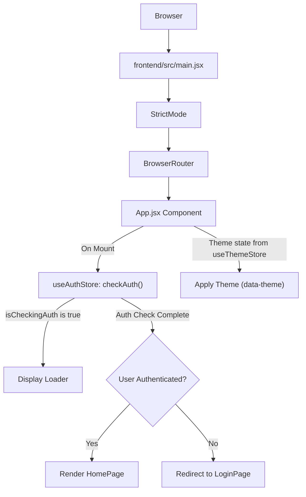
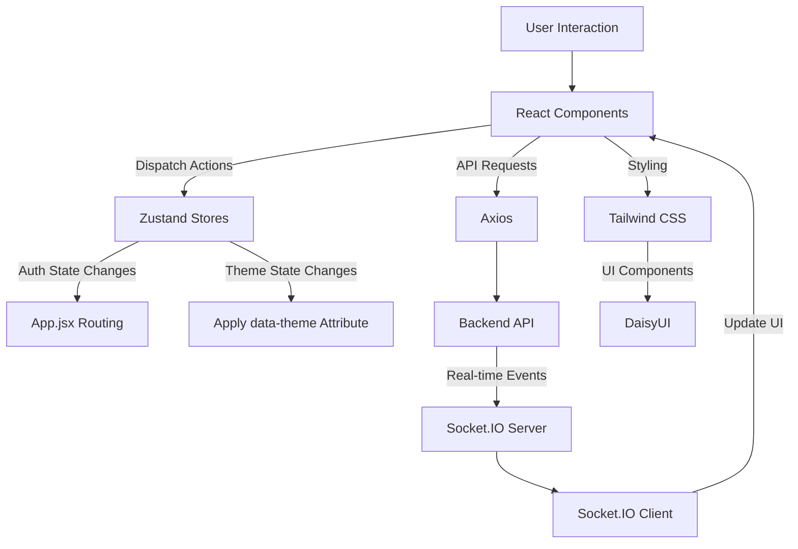

 
---
title: "Frontend Development and UI"
description: "Overview of the frontend application, its architecture, and key development tools and practices."
---

# Frontend Development and UI

This section provides a detailed overview of the client-side application, built using React, Vite, and a modern component-based architecture. It covers the core structure, essential libraries, and the development practices that facilitate a responsive and dynamic user experience. The frontend serves as the interactive interface for users to engage with the application's features, handling everything from user authentication to real-time data display.

## Core Application Structure

The frontend application leverages React for its component-based architecture and Vite for a fast development experience. The core entry point and main application logic are handled by `main.jsx` and `App.jsx`, respectively.

### Entry Point: `main.jsx`

The `main.jsx` file is the primary entry point for the React application. It sets up the root React component, `App`, within a `BrowserRouter` context, enabling client-side routing. `StrictMode` is used to highlight potential problems in the application during development.

```jsx
// frontend/src/main.jsx
import { StrictMode } from 'react'
import { createRoot } from 'react-dom/client'
import './index.css'
import App from './App.jsx'
import { BrowserRouter } from 'react-router-dom'

createRoot(document.getElementById('root')).render(
  <StrictMode>
    <BrowserRouter>
      <App />
    </BrowserRouter>
  </StrictMode>,
)
```
[View on GitHub](https://github.com/shinymack/Chat-App-MERN/blob/main/frontend/src/main.jsx#L1-L12)

### Main Application Component: `App.jsx`

`App.jsx` is the heart of the frontend, orchestrating global concerns such as routing, user authentication, and theme management. It conditionally renders different pages based on the user's authentication status and the current URL path. It also initializes global state management for authentication and theming.

```jsx
// frontend/src/App.jsx
import Navbar from './components/Navbar'
import { Routes, Route, Navigate } from 'react-router-dom'
import { useEffect } from 'react'
import HomePage from './pages/HomePage'
import SignUpPage from './pages/SignUpPage' 
import LoginPage from './pages/LoginPage' 
import SettingsPage from './pages/SettingsPage' 
import ProfilePage from './pages/ProfilePage'

import { useThemeStore } from './store/useThemeStore'
import { useAuthStore } from './store/useAuthStore'; 
import { Loader } from 'lucide-react'
import { Toaster } from 'react-hot-toast'

const App = () => {
  const { authUser, checkAuth, isCheckingAuth, onlineUsers } = useAuthStore();
  const { theme } = useThemeStore();
  
  useEffect(() => {
    checkAuth(); // Check user authentication on component mount
  }, [checkAuth]);

  if(isCheckingAuth && !authUser) return (
      <div className='flex items-center justify-center h-screen'>
        <Loader className='size-10 animate-spin' />
      </div>
  )

  return (
    <div className='' data-theme={theme}>
      <Navbar />
      <Toaster /> {/* Global toast notifications */}
      <Routes>
        <Route path='/' element={authUser ? <HomePage />: <Navigate to='/login' />} />
        <Route path='/signup' element={ !authUser ? <SignUpPage />: <Navigate to='/' />} />
        <Route path='/login' element={!authUser ? <LoginPage />: <Navigate to='/' />} />
        <Route path='/settings' element={<SettingsPage />} />
        <Route path='/profile' element={authUser ? <ProfilePage />: <Navigate to='/login' />} />
      </Routes>
    </div> 
  )
}

export default App
```
[View on GitHub](https://github.com/shinymack/Chat-App-MERN/blob/main/frontend/src/App.jsx#L1-L54)

### Authentication Flow and Routing

The application employs `react-router-dom` for navigation and a custom `useAuthStore` (powered by Zustand) for managing user authentication state. The `useEffect` hook in `App.jsx` triggers an authentication check (`checkAuth`) when the component mounts. While authentication is being checked, a loader is displayed. Routes are protected, redirecting users to the login page if they try to access authenticated routes without being logged in, or to the home page if they try to access authentication pages while already logged in.

```jsx
// frontend/src/App.jsx - Excerpt for Conditional Rendering and Routing
// ...
  const { authUser, checkAuth, isCheckingAuth, onlineUsers } = useAuthStore();
  // ...
  useEffect(() => {
    checkAuth();
  }, [checkAuth]);

  if(isCheckingAuth && !authUser) return (
      <div className='flex items-center justify-center h-screen'>
        <Loader className='size-10 animate-spin' />
      </div>
  )

  return (
    <div className='' data-theme={theme}>
      <Navbar />
      <Toaster />
      <Routes>
        <Route path='/' element={authUser ? <HomePage />: <Navigate to='/login' />} />
        <Route path='/signup' element={ !authUser ? <SignUpPage />: <Navigate to='/' />} />
        <Route path='/login' element={!authUser ? <LoginPage />: <Navigate to='/' />} />
        <Route path='/settings' element={<SettingsPage />} />
        <Route path='/profile' element={authUser ? <ProfilePage />: <Navigate to='/login' />} />
      </Routes>
    </div> 
  )
// ...
```
[View on GitHub](https://github.com/shinymack/Chat-App-MERN/blob/main/frontend/src/App.jsx#L25-L48)

### Application Initialization Flow





## Frontend Development Environment

The frontend is set up with modern tools for efficient development and build processes.

### Vite Configuration

Vite is used as the build tool, providing fast HMR (Hot Module Replacement) and optimized builds. The configuration is minimal, primarily integrating the React plugin.

```javascript
// frontend/vite.config.js
import { defineConfig } from 'vite'
import react from '@vitejs/plugin-react'

// https://vitejs.dev/config/
export default defineConfig({
  plugins: [react()],
})
```
[View on GitHub](https://github.com/shinymack/Chat-App-MERN/blob/main/frontend/vite.config.js#L1-L7)

### Package Scripts

The `package.json` defines various scripts for development, building, and linting:

*   `dev`: Starts the development server with Vite.
*   `build`: Compiles the application for production.
*   `lint`: Runs ESLint for code quality checks.
*   `preview`: Serves the production build locally for testing.
*   `mobile`: Starts the development server accessible on local network (e.g., for mobile device testing).

```json
// frontend/package.json - Excerpt for scripts
{
  "name": "frontend",
  "private": true,
  "version": "0.0.0",
  "type": "module",
  "scripts": {
    "dev": "vite",
    "build": "vite build",
    "lint": "eslint .",
    "preview": "vite preview",
    "mobile": "vite --host"
  },
  // ...
}
```
[View on GitHub](https://github.com/shinymack/Chat-App-MERN/blob/main/frontend/package.json#L4-L13)

## Key Libraries and Dependencies

The `frontend/package.json` file outlines all the necessary libraries and tools for building and running the application.

### Core Dependencies

These are essential for the application's functionality:

*   **`react`**: The core library for building user interfaces.
*   **`react-dom`**: Provides DOM-specific methods that can be used at the top level of a web app to enable efficient management of DOM elements.
*   **`react-router-dom`**: For declarative routing within the application.
*   **`zustand`**: A fast, scalable, and tiny state-management solution. Used here for global state like authentication and theme.
*   **`axios`**: A promise-based HTTP client for making API requests to the backend.
*   **`socket.io-client`**: Enables real-time, bidirectional communication between the client and server for features like chat.
*   **`react-hot-toast`**: For elegant and responsive toast notifications.
*   **`lucide-react`**: A library of open-source icons, used for UI elements like loaders.
*   **`react-icons`**: Another popular library providing a wide range of customizable icons.
*   **`cors`**: Although typically a backend dependency, its inclusion here might be for specific development setups or proxies, not standard frontend use.

### Development Dependencies

These tools enhance the development experience and ensure code quality:

*   **`vite`**: The build tool.
*   **`@vitejs/plugin-react`**: Vite plugin for React refresh.
*   **`eslint` and related plugins**: For static code analysis and maintaining code quality.
*   **`tailwindcss`**: A utility-first CSS framework for rapidly building custom designs.
*   **`postcss` & `autoprefixer`**: Tools for processing CSS with plugins, ensuring compatibility across browsers.
*   **`daisyui`**: A Tailwind CSS component library that provides pre-built UI components, simplifying development.
*   **`@types/react` & `@types/react-dom`**: Type definitions for React, enabling TypeScript support (even if the project uses JavaScript, these can be useful for IDE autocompletion).

```json
// frontend/package.json - Excerpt for dependencies and devDependencies
{
  // ...
  "dependencies": {
    "axios": "^1.7.9",
    "cors": "^2.8.5",
    "lucide-react": "^0.471.1",
    "react": "^18.3.1",
    "react-dom": "^18.3.1",
    "react-hot-toast": "^2.5.1",
    "react-icons": "^5.5.0",
    "react-router-dom": "^7.1.1",
    "socket.io-client": "^4.8.1",
    "zustand": "^5.0.3"
  },
  "devDependencies": {
    "@eslint/js": "^9.17.0",
    "@types/react": "^18.3.18",
    "@types/react-dom": "^18.3.5",
    "@vitejs/plugin-react": "^4.3.4",
    "autoprefixer": "^10.4.20",
    "daisyui": "^4.12.23",
    "eslint": "^9.17.0",
    "eslint-plugin-react": "^7.37.2",
    "eslint-plugin-react-hooks": "^5.0.0",
    "eslint-plugin-react-refresh": "^0.4.16",
    "globals": "^15.14.0",
    "postcss": "^8.5.0",
    "tailwindcss": "^3.4.17",
    "vite": "^6.3.5"
  }
}
```
[View on GitHub](https://github.com/shinymack/Chat-App-MERN/blob/main/frontend/package.json#L14-L44)

## Key Integration Points

### State Management with Zustand

Zustand is critical for managing global application state, specifically authentication and theme. `useAuthStore` centralizes user authentication logic, providing `authUser`, `isCheckingAuth`, and the `checkAuth` action. `useThemeStore` manages the current UI theme. This approach ensures a single source of truth for these states, simplifying data flow and reducing prop drilling.

### Real-time Communication

The `socket.io-client` library is integrated to handle real-time features. This typically involves connecting to a Socket.IO server (part of the backend) and listening for events (e.g., new messages, user online/offline status) to update the UI dynamically without requiring full page refreshes.

### UI Styling and Component Library

The combination of Tailwind CSS and DaisyUI provides a robust and flexible styling solution. Tailwind CSS allows for highly custom and utility-first styling, while DaisyUI offers ready-to-use, customizable components that accelerate UI development, ensuring a consistent and modern look and feel.





```