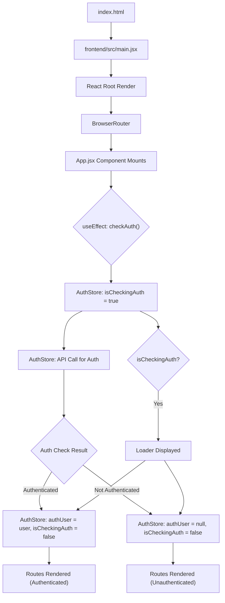

 # Frontend Development and UI

The frontend of this application is built using modern web technologies, primarily React, bundled with Vite for a fast development experience. It emphasizes a component-based architecture, efficient state management with Zustand, and a highly customizable UI powered by Tailwind CSS and DaisyUI. This section delves into the core structure, routing, styling, and key development dependencies that bring the user interface to life.

## Core Application Structure

The application's entry point and main component are crucial for understanding its flow.

### main.jsx: Application Entry Point

The `frontend/src/main.jsx` file serves as the initial entry point for the React application. It's responsible for rendering the root `App` component into the DOM. The use of `StrictMode` helps identify potential problems in an application, and `BrowserRouter` from `react-router-dom` wraps the entire application, enabling client-side routing.

```jsx title="frontend/src/main.jsx"
import { StrictMode } from 'react'
import { createRoot } from 'react-dom/client'
import './index.css'
import App from './App.jsx'
import { BrowserRouter } from 'react-router-dom'

createRoot(document.getElementById('root')).render(
  <StrictMode>
    <BrowserRouter>
      <App />
    </BrowserRouter>
  </StrictMode>,
)
```

[View on GitHub](https://github.com/shinymack/Chat-App-MERN/blob/main/frontend/src/main.jsx)

### App.jsx: The Root Component

The `frontend/src/App.jsx` component is the central hub of the application. It orchestrates routing, manages global state interactions (like authentication and theming), and conditionally renders components based on application state. It also includes global components like the `Navbar` and `Toaster` for notifications.

```jsx title="frontend/src/App.jsx" {10-14, 25-28, 33-39}
// import React from 'react'
import Navbar from './components/Navbar'
import { Routes, Route, Navigate } from 'react-router-dom'
import { useEffect } from 'react'
import HomePage from './pages/HomePage'
import SignUpPage from './pages/SignUpPage'
import LoginPage from './pages/LoginPage'
import SettingsPage from './pages/SettingsPage'
import ProfilePage from './pages/ProfilePage'

import { useThemeStore } from './store/useThemeStore'
import { useAuthStore } from './store/useAuthStore';
import { Loader } from 'lucide-react'
import { Toaster } from 'react-hot-toast'

const App = () => {
  const { authUser, checkAuth, isCheckingAuth, onlineUsers } = useAuthStore();
  const { theme } = useThemeStore();
  useEffect(() => {
    checkAuth();
  }, [checkAuth]);

  console.log("authUser: ", {authUser});

  console.log({onlineUsers})

  if(isCheckingAuth && !authUser) return (
      <div className='flex items-center justify-center h-screen'>
        <Loader className='size-10 animate-spin' />
      </div>
  )

  return (
    <div className='' data-theme={theme}>

      <Navbar />

      <Toaster />
      <Routes>
        <Route path='/' element={authUser ? <HomePage />: <Navigate to='/login' />} />
        <Route path='/signup' element={ !authUser ? <SignUpPage />: <Navigate to='/' />} />
        <Route path='/login' element={!authUser ? <LoginPage />: <Navigate to='/' />} />
        <Route path='/settings' element={<SettingsPage />} />
        <Route path='/profile' element={authUser ? <ProfilePage />: <Navigate to='/login' />} />

      </Routes>

    </div>
  )
}

export default App
```

[View on GitHub](https://github.com/shinymack/Chat-App-MERN/blob/main/frontend/src/App.jsx)

### Application Initialization Flow

The diagram below illustrates the high-level flow from the application's entry point to the main `App` component's rendering and initial authentication check.





## Routing and Authentication

The `App.jsx` component uses `react-router-dom` to define routes and implement navigation logic. A critical aspect is the handling of authenticated vs. unauthenticated users, ensuring access control for specific pages.

*   **Protected Routes**: Pages like `/` (Home) and `/profile` are protected. If `authUser` is not present, users are redirected to `/login`.
*   **Authentication Flow**: Routes like `/signup` and `/login` are only accessible to unauthenticated users. If an `authUser` is detected, they are redirected to the home page (`/`).
*   **Global State**: The `useAuthStore` (powered by Zustand) provides the `authUser` and `isCheckingAuth` state, which drives these conditional navigations. An initial check (`checkAuth()`) is performed on component mount to verify the user's session.

## Styling and Theming

The application's UI is styled using a combination of Tailwind CSS for utility-first styling and DaisyUI, a component library that integrates seamlessly with Tailwind.

### tailwind.config.js: Configuration

The `frontend/tailwind.config.js` file is the central configuration for Tailwind CSS and its plugins, most notably DaisyUI. It defines content paths for Tailwind to scan, extends the default theme, and lists all available DaisyUI themes.

```javascript title="frontend/tailwind.config.js" {10-12, 14-46}
import daisyui from "daisyui"


/** @type {import('tailwindcss').Config} */
export default {
  content: [
    "./index.html",
    "./src/**/*.{js,ts,jsx,tsx}",
  ],
  theme: {
    extend: {
      fontFamily : {
        chivo : ['Chivo', 'sans-serif'],
      }
    },
  },
  plugins: [daisyui],
  daisyui : {
 themes: [
      "light",
      "dark",
      "cupcake",
      "bumblebee",
      "emerald",
      "corporate",
      "synthwave",
      "retro",
      "cyberpunk",
      "valentine",
      "halloween",
      "garden",
      "forest",
      "aqua",
      "lofi",
      "pastel",
      "fantasy",
      "wireframe",
      "black",
      "luxury",
      "dracula",
      "cmyk",
      "autumn",
      "business",
      "acid",
      "lemonade",
      "night",
      "coffee",
      "winter",
      "dim",
      "nord",
      "sunset",
    ],
  }
}
```

[View on GitHub](https://github.com/shinymack/Chat-App-MERN/blob/main/frontend/tailwind.config.js)

### Dynamic Theming with DaisyUI

The application supports dynamic theming. The `useThemeStore` manages the currently active theme, which is then applied globally to the `div` element in `App.jsx` using the `data-theme` attribute. This attribute is recognized by DaisyUI, which dynamically switches the entire UI's styling based on the selected theme.

```jsx {30,31}
// ... (imports) ...
import { useThemeStore } from './store/useThemeStore'
import { useAuthStore } from './store/useAuthStore';
// ... (other code) ...

const App = () => {
  const { authUser, checkAuth, isCheckingAuth, onlineUsers } = useAuthStore();
  const { theme } = useThemeStore(); // Retrieves current theme
  useEffect(() => {
    checkAuth();
  }, [checkAuth]);

  // ... (loading state) ...

  return (
    <div className='' data-theme={theme}> {/* Theme applied here */}

      <Navbar />
      <Toaster />
      <Routes>
        {/* ... (routes) ... */}
      </Routes>

    </div>
  )
}
```

This approach allows for a wide range of aesthetic customizations without modifying CSS directly, leveraging DaisyUI's extensive theme collection.

## Frontend Dependencies and Tools

The `frontend/package.json` file outlines all the dependencies and development tools used in the frontend.

### package.json: Dependencies Overview

This file lists all the packages required for the frontend application, categorized into `dependencies` (for runtime) and `devDependencies` (for development and build processes).

```json title="frontend/package.json"
{
  "name": "frontend",
  "private": true,
  "version": "0.0.0",
  "type": "module",
  "scripts": {
    "dev": "vite",
    "build": "vite build",
    "lint": "eslint .",
    "preview": "vite preview",
    "mobile": "vite --host"
  },
  "dependencies": {
    "axios": "^1.7.9",
    "cors": "^2.8.5",
    "lucide-react": "^0.471.1",
    "react": "^18.3.1",
    "react-dom": "^18.3.1",
    "react-hot-toast": "^2.5.1",
    "react-icons": "^5.5.0",
    "react-router-dom": "^7.1.1",
    "socket.io-client": "^4.8.1",
    "zustand": "^5.0.3"
  },
  "devDependencies": {
    "@eslint/js": "^9.17.0",
    "@types/react": "^18.3.18",
    "@types/react-dom": "^18.3.5",
    "@vitejs/plugin-react": "^4.3.4",
    "autoprefixer": "^10.4.20",
    "daisyui": "^4.12.23",
    "eslint": "^9.17.0",
    "eslint-plugin-react": "^7.37.2",
    "eslint-plugin-react-hooks": "^5.0.0",
    "eslint-plugin-react-refresh": "^0.4.16",
    "globals": "^15.14.0",
    "postcss": "^8.5.0",
    "tailwindcss": "^3.4.17",
    "vite": "^6.3.5"
  }
}
```

[View on GitHub](https://github.com/shinymack/Chat-App-MERN/blob/main/frontend/package.json)

### Key Dependencies

*   **react & react-dom**: The core libraries for building the user interface.
*   **axios**: A promise-based HTTP client for making API requests to the backend.
*   **react-router-dom**: For declarative routing within the single-page application.
*   **socket.io-client**: Enables real-time, bidirectional communication with the backend for features like live chat updates.
*   **zustand**: A fast, scalable, and tiny state-management solution used for global state (e.g., authentication, theme).
*   **react-hot-toast**: A library for displaying beautiful, accessible, and customizable notifications.
*   **lucide-react** & **react-icons**: Icon libraries used throughout the application.

### Development Tools

*   **vite**: A modern frontend build tool that provides an extremely fast development server and optimized build processes.
*   **@vitejs/plugin-react**: The official Vite plugin for React, enabling Fast Refresh and other React-specific optimizations.
*   **tailwindcss**, **postcss**, **autoprefixer**: The CSS framework and its supporting tools for utility-first styling.
*   **daisyui**: A Tailwind CSS component library that provides pre-built components and themes.
*   **eslint**: A pluggable and configurable linter tool for identifying and reporting on patterns in JavaScript code, ensuring code quality and consistency.

## Key Integration Points

The frontend seamlessly integrates several technologies to create a dynamic and responsive user experience:

*   **State-driven UI**: The `useAuthStore` and `useThemeStore` are central to how the UI reacts to changes in user authentication status and selected themes. This ensures a consistent and personalized experience.
*   **Real-time Communication**: `socket.io-client` in conjunction with a backend Socket.IO server allows for instant updates, crucial for a chat application. This is typically managed via global state or context providers.
*   **API Interactions**: `axios` is used to communicate with the RESTful API endpoints on the backend for operations like user authentication, profile updates, and message handling. These interactions update the Zustand stores.
*   **Modular Component Design**: The application leverages React's component-based architecture by breaking down the UI into reusable components (e.g., `Navbar`, `HomePage`, `ProfilePage`), promoting maintainability and scalability.

This architecture ensures a robust, performant, and user-friendly frontend that can scale with additional features and complexities.