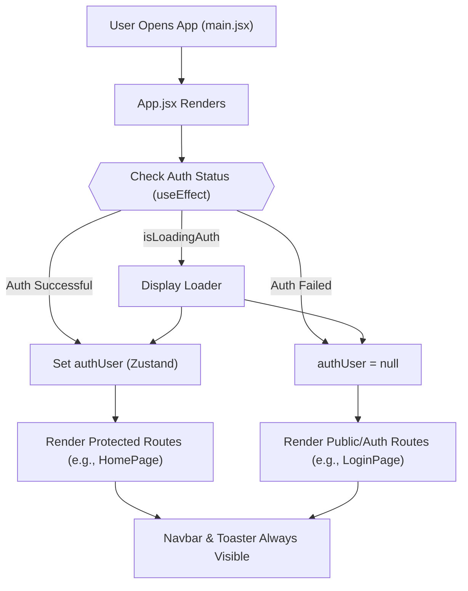

 # Frontend Development and UI

The frontend of the application is a modern, single-page application (SPA) built with **React.js** and initialized using **Vite**. It provides the user interface for interacting with the backend services, handling authentication, real-time communication, and data presentation. This section details the core structure, dependencies, and key components that constitute the client-side experience.

## Application Structure and Core Technologies

The frontend application is organized to facilitate maintainability and scalability, leveraging a component-based architecture inherent to React. It integrates various third-party libraries for routing, state management, styling, and utility functions to deliver a rich user experience.

### Project Dependencies and Configuration (`frontend/package.json`)

The `package.json` file defines the project's metadata, scripts, and dependencies. It outlines the essential libraries required for both development and production.

```json
"dependencies": {
  "axios": "^1.7.9",
  "cors": "^2.8.5",
  "lucide-react": "^0.471.1",
  "react": "^18.3.1",
  "react-dom": "^18.3.1",
  "react-hot-toast": "^2.5.1",
  "react-icons": "^5.5.0",
  "react-router-dom": "^7.1.1",
  "socket.io-client": "^4.8.1",
  "zustand": "^5.0.3"
},
"devDependencies": {
  "@eslint/js": "^9.17.0",
  "@types/react": "^18.3.18",
  "@types/react-dom": "^18.3.5",
  "@vitejs/plugin-react": "^4.3.4",
  "autoprefixer": "^10.4.20",
  "daisyui": "^4.12.23",
  "eslint": "^9.17.0",
  "eslint-plugin-react": "^7.37.2",
  "eslint-plugin-react-hooks": "^5.0.0",
  "eslint-plugin-react-refresh": "^0.4.16",
  "globals": "^15.14.0",
  "postcss": "^8.5.0",
  "tailwindcss": "^3.4.17",
  "vite": "^6.3.5"
}
```
*Dependencies* include core React libraries, `react-router-dom` for client-side routing, `zustand` for state management, `axios` for HTTP requests, and `socket.io-client` for real-time communication. UI utilities like `lucide-react`, `react-icons`, and `react-hot-toast` enhance the user experience. Notably, `cors` is present here, though it's typically a backend dependency, suggesting it might be used in a development proxy setup or a misplacement.

*DevDependencies* are primarily related to the development environment, build process, and code quality. `vite` is the build tool, `tailwindcss` and `daisyui` are for styling, `postcss` and `autoprefixer` handle CSS processing, and `eslint` ensures code consistency.

The defined scripts facilitate development workflows:
*   `dev`: Starts the development server with Vite.
*   `build`: Compiles the application for production.
*   `lint`: Runs ESLint for code quality checks.
*   `preview`: Serves the production build locally.
*   `mobile`: Starts the development server accessible via network for mobile testing.

[View `package.json` on GitHub](https://github.com/shinymack/Chat-App-MERN/blob/main/frontend/package.json)

### Application Entry Point (`frontend/src/main.jsx`)

The `main.jsx` file is the primary entry point for the React application. It initializes the React root, wraps the main `App` component with `BrowserRouter` for routing capabilities, and enables `StrictMode` for identifying potential problems in the application.

```jsx
import { StrictMode } from 'react'
import { createRoot } from 'react-dom/client'
import './index.css'
import App from './App.jsx'
import { BrowserRouter } from 'react-router-dom'

createRoot(document.getElementById('root')).render(
  <StrictMode>
    <BrowserRouter>
      <App />
    </BrowserRouter>
  </StrictMode>,
)
```
Here, `createRoot` from `react-dom/client` is used for concurrent React features. `BrowserRouter` from `react-router-dom` is essential for enabling declarative routing throughout the application, allowing different URLs to render different components. The global CSS stylesheet `index.css` is also imported here to ensure styles are applied across the application.

[View `main.jsx` on GitHub](https://github.com/shinymack/Chat-App-MERN/blob/main/frontend/src/main.jsx)

### Global Stylesheets (`frontend/src/index.css`)

The `index.css` file is responsible for importing global styles and configuring Tailwind CSS.

```css
@import url('https://fonts.googleapis.com/css2?family=Chivo:ital,wght@0,100..900;1,100..900&display=swap');
@tailwind base;
@tailwind components;
@tailwind utilities;


@layer base {
    body {
        @apply font-chivo;
    }
}
```
This file imports the 'Chivo' font from Google Fonts, and then includes Tailwind CSS's base, components, and utilities layers. The `@layer base` directive is used to apply custom styles within Tailwind's layer system, in this case, setting 'Chivo' as the default font for the entire `body` element. This setup allows for rapid UI development using Tailwind's utility-first approach combined with DaisyUI components, which build on Tailwind.

[View `index.css` on GitHub](https://github.com/shinymack/Chat-App-MERN/blob/main/frontend/src/index.css)

### Main Application Component (`frontend/src/App.jsx`)

The `App.jsx` component is the heart of the frontend application, handling global state, routing, and conditional rendering. It orchestrates the overall user interface based on authentication status and user interactions.

```jsx
// import React from 'react'
import Navbar from './components/Navbar'
import { Routes, Route, Navigate } from 'react-router-dom'
import { useEffect } from 'react'
import HomePage from './pages/HomePage'
import SignUpPage from './pages/SignUpPage'
import LoginPage from './pages/LoginPage'
import SettingsPage from './pages/SettingsPage'
import ProfilePage from './pages/ProfilePage'


import { useThemeStore } from './store/useThemeStore'
import { useAuthStore } from './store/useAuthStore';
import { Loader } from 'lucide-react'
import { Toaster } from 'react-hot-toast'

const App = () => {
  const { authUser, checkAuth, isCheckingAuth, onlineUsers } = useAuthStore();
  const { theme } = useThemeStore();
  useEffect(() => {
    checkAuth();
  }, [checkAuth]);

  // console.log("authUser: ", {authUser});

  // console.log({onlineUsers})

  if(isCheckingAuth && !authUser) return (
      <div className='flex items-center justify-center h-screen'>
        <Loader className='size-10 animate-spin' />
      </div>
  )

  return (
    <div className='' data-theme={theme}>

      <Navbar />

      <Toaster />
      <Routes>
        <Route path='/' element={authUser ? <HomePage />: <Navigate to='/login' />} />
        <Route path='/signup' element={ !authUser ? <SignUpPage />: <Navigate to='/' />} />
        <Route path='/login' element={!authUser ? <LoginPage />: <Navigate to='/' />} />
        <Route path='/settings' element={<SettingsPage />} />
        <Route path='/profile' element={authUser ? <ProfilePage />: <Navigate to='/login' />} />

      </Routes>

    </div>
  )
}

export default App
```
`App.jsx` performs several critical functions:
*   **Authentication Check**: It uses `useEffect` to call `checkAuth()` from `useAuthStore` on component mount, verifying the user's authentication status. This is crucial for protected routes.
*   **Loading State**: During the authentication check (`isCheckingAuth`), a `Loader` icon is displayed, providing a smooth user experience while data is being fetched.
*   **Theming**: The `data-theme` attribute on the root `div` is dynamically set based on the `theme` retrieved from `useThemeStore`, enabling theme switching (likely handled by DaisyUI).
*   **Navigation and Routing**: `react-router-dom`'s `Routes` and `Route` components define the application's navigation paths.
    *   **Protected Routes**: Routes like `/` (Home) and `/profile` are protected, redirecting unauthenticated users to `/login` using the `Navigate` component.
    *   **Auth-Only Routes**: Routes like `/signup` and `/login` are only accessible to unauthenticated users, redirecting authenticated users to `/`.
*   **Global Components**: A `Navbar` is rendered consistently across all pages, and `Toaster` from `react-hot-toast` provides global notification capabilities.
*   **State Management**: It integrates with `useAuthStore` and `useThemeStore` (likely Zustand stores) to manage global authentication and theme states, respectively. The `onlineUsers` state is also consumed here, suggesting real-time presence features.

[View `App.jsx` on GitHub](https://github.com/shinymack/Chat-App-MERN/blob/main/frontend/src/App.jsx)

### Frontend Architecture Flow

The following diagram illustrates the high-level flow of how the frontend application initializes and handles user authentication and routing.





## State Management with Zustand

The application utilizes **Zustand** for global state management. `useAuthStore` and `useThemeStore` are examples of custom hooks built on Zustand, providing a lightweight and performant way to manage application-wide states like the authenticated user's data, online users, and current theme.

```jsx
// Example from App.jsx, demonstrating Zustand usage
import { useThemeStore } from './store/useThemeStore'
import { useAuthStore } from './store/useAuthStore';

const App = () => {
  const { authUser, checkAuth, isCheckingAuth, onlineUsers } = useAuthStore();
  const { theme } = useThemeStore();
  // ... rest of the component
}
```
This pattern allows components to subscribe to only the parts of the state they need, triggering re-renders only when those specific parts change. This contributes to the application's performance and simplifies state logic.

## Styling and UI Components

The UI is built using **Tailwind CSS** for utility-first styling and **DaisyUI** for pre-built, themeable components. This combination allows for rapid development of a consistent and responsive user interface with minimal custom CSS.

```html
<div className='flex items-center justify-center h-screen'>
  <Loader className='size-10 animate-spin' />
</div>
```
In this snippet from `App.jsx`, `className='flex items-center justify-center h-screen'` uses Tailwind CSS utilities to center the content vertically and horizontally, while `size-10 animate-spin` styles the `Loader` component (from `lucide-react`). DaisyUI components would be used in similar fashion, leveraging Tailwind classes internally and providing component-specific classes for customization where needed.

## Key Integration Points

1.  **Authentication Flow**: The primary integration point is the authentication system. `App.jsx` ensures that users are authenticated before accessing core features. The `checkAuth` function, likely making an API call to the backend, is critical. Upon successful authentication, user data is stored in `useAuthStore`, influencing route protection and UI elements like the Navbar.

    


```mermaid
    sequenceDiagram
        participant Browser
        participant Frontend(App.jsx)
        participant AuthStore(Zustand)
        participant Backend(Auth API)

        Browser->>Frontend: Initial App Load
        Frontend->>AuthStore: call checkAuth()
        AuthStore->>Backend: GET /api/auth/check (JWT cookie)
        Backend-->>AuthStore: 200 OK, { user: userData } OR 401 Unauthorized
        AuthStore->>Frontend: Update authUser state
        alt User Authenticated
            Frontend->>Frontend: Render HomePage (Private)
        else User Unauthenticated
            Frontend->>Frontend: Navigate to LoginPage
        end
    ```


2.  **Real-time Communication**: The presence of `socket.io-client` and `onlineUsers` in `useAuthStore` indicates a strong integration with real-time features. After successful authentication, the frontend likely establishes a WebSocket connection to the backend's Socket.IO server to receive updates on user presence, messages, or other real-time events. This enhances the interactive nature of a chat application by showing who is currently online.

3.  **API Interactions**: `axios` is used for making HTTP requests to the backend for actions beyond authentication, such as fetching data for messages, user profiles, or settings. These interactions are typically managed within custom hooks or service modules that interact with the Zustand stores to update application state.

4.  **Theming**: The integration of `useThemeStore` and `data-theme` attribute allows for dynamic theme switching. This is typically achieved by having DaisyUI or a custom CSS setup respond to changes in the `data-theme` attribute on the `html` or `body` element, applying different color schemes and styles.