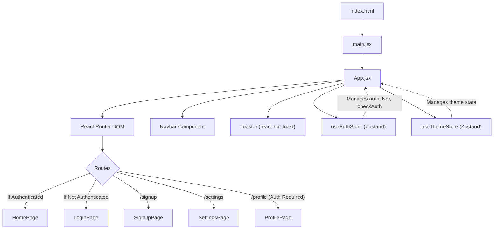

 # Frontend Development and UI

This document provides a comprehensive overview of the frontend application, detailing its structure, core components, and styling methodologies. The frontend is built using React, leveraging modern tools and libraries to create a dynamic and responsive user interface.

## Core Application Structure

The frontend application is bootstrapped by Vite and utilizes React for its component-based architecture. The main entry point is `frontend/src/main.jsx`, which renders the root `App` component within a `BrowserRouter` for client-side routing.

### Entry Point: `main.jsx`

The `main.jsx` file is responsible for initializing the React application. It wraps the primary `App` component with `StrictMode` for development-time checks and `BrowserRouter` from `react-router-dom` to enable declarative routing throughout the application.

```jsx
// frontend/src/main.jsx
import { StrictMode } from 'react'
import { createRoot } from 'react-dom/client'
import './index.css'
import App from './App.jsx'
import { BrowserRouter } from 'react-router-dom'

createRoot(document.getElementById('root')).render(
  <StrictMode>
    <BrowserRouter>
      <App />
    </BrowserRouter>
  </StrictMode>,
)
```

[View on GitHub](https://github.com/shinymack/Chat-App-MERN/blob/main/frontend/src/main.jsx)

### Main Application Component: `App.jsx`

The `App.jsx` component serves as the central hub for the application's layout, routing, and global state management. It conditionally renders routes based on user authentication status, ensuring a seamless user experience. Authentication is managed via the `useAuthStore` (Zustand) and UI theme via `useThemeStore`.

```jsx
// frontend/src/App.jsx
import Navbar from './components/Navbar'
import { Routes, Route, Navigate } from 'react-router-dom'
import { useEffect } from 'react'
import HomePage from './pages/HomePage'
import SignUpPage from './pages/SignUpPage' 
import LoginPage from './pages/LoginPage' 
import SettingsPage from './pages/SettingsPage' 
import ProfilePage from './pages/ProfilePage'

import { useThemeStore } from './store/useThemeStore'
import { useAuthStore } from './store/useAuthStore'; 
import { Loader } from 'lucide-react'
import { Toaster } from 'react-hot-toast'

const App = () => {
  const { authUser, checkAuth, isCheckingAuth, onlineUsers } = useAuthStore();
  const { theme } = useThemeStore();
  useEffect(() => {
    checkAuth();
  }, [checkAuth]);

  if(isCheckingAuth && !authUser) return (
      <div className='flex items-center justify-center h-screen'>
        <Loader className='size-10 animate-spin' />
      </div>
  )

  return (
    <div className='' data-theme={theme}>
      <Navbar />
      <Toaster />
      <Routes>
        <Route path='/' element={authUser ? <HomePage />: <Navigate to='/login' />} />
        <Route path='/signup' element={ !authUser ? <SignUpPage />: <Navigate to='/' />} />
        <Route path='/login' element={!authUser ? <LoginPage />: <Navigate to='/' />} />
        <Route path='/settings' element={<SettingsPage />} />
        <Route path='/profile' element={authUser ? <ProfilePage />: <Navigate to='/login' />} />
      </Routes>
    </div> 
  )
}

export default App
```

[View on GitHub](https://github.com/shinymack/Chat-App-MERN/blob/main/frontend/src/App.jsx)

### Frontend Application Flow

The following diagram illustrates the high-level flow of the frontend application, from its entry point to global state management and routing.





## Styling and Theming

The application's styling is built upon Tailwind CSS, a utility-first CSS framework, which is extended with DaisyUI components for rapid UI development. Custom fonts are imported via Google Fonts.

### `index.css`

The `index.css` file is the global stylesheet, importing necessary external resources and configuring Tailwind CSS directives. It includes a custom font (`Chivo`) and integrates Tailwind's `base`, `components`, and `utilities` layers.

```css
/* frontend/src/index.css */
@import url('https://fonts.googleapis.com/css2?family=Chivo:ital,wght@0,100..900;1,100..900&display=swap');
@tailwind base;
@tailwind components;
@tailwind utilities;


@layer base {
    body {
        @apply font-chivo;
    }
}
```

[View on GitHub](https://github.com/shinymack/Chat-App-MERN/blob/main/frontend/src/index.css)

The `data-theme` attribute on the root `div` in `App.jsx` allows for dynamic theming, leveraging DaisyUI's theme capabilities. This enables users to switch between different visual themes.

## Frontend Dependencies

The `package.json` file outlines all the dependencies required for the frontend application, categorized into `dependencies` and `devDependencies`.

### Key Dependencies

The following table highlights essential dependencies used in the frontend:

| Dependency            | Purpose                                        |
| :-------------------- | :--------------------------------------------- |
| `react`, `react-dom`  | Core React library for UI development.         |
| `react-router-dom`    | Declarative routing for React applications.    |
| `axios`               | Promise-based HTTP client for API requests.    |
| `zustand`             | Small, fast, and scalable bearbones state-management solution. |
| `lucide-react`        | Customizable React icons.                      |
| `react-hot-toast`     | Lightweight and customizable toast notifications. |
| `socket.io-client`    | Real-time, bidirectional event-based communication. |

### Development Dependencies

Key development tools include:

| Dev Dependency          | Purpose                                        |
| :---------------------- | :--------------------------------------------- |
| `vite`                  | Next-generation frontend tooling (build tool, dev server). |
| `@vitejs/plugin-react`  | Provides React support for Vite.               |
| `tailwindcss`           | Utility-first CSS framework.                   |
| `autoprefixer`          | Parses CSS and adds vendor prefixes.           |
| `postcss`               | Tool for transforming CSS with JavaScript.     |
| `daisyui`               | Tailwind CSS component library.                |
| `eslint`, `@eslint/js`, `eslint-plugin-react`, `eslint-plugin-react-hooks`, `eslint-plugin-react-refresh` | Linting tools for maintaining code quality. |

```json
// frontend/package.json
{
  "name": "frontend",
  "private": true,
  "version": "0.0.0",
  "type": "module",
  "scripts": {
    "dev": "vite",
    "build": "vite build",
    "lint": "eslint .",
    "preview": "vite preview",
    "mobile": "vite --host"
  },
  "dependencies": {
    "axios": "^1.7.9",
    "cors": "^2.8.5",
    "lucide-react": "^0.471.1",
    "react": "^18.3.1",
    "react-dom": "^18.3.1",
    "react-hot-toast": "^2.5.1",
    "react-icons": "^5.5.0",
    "react-router-dom": "^7.1.1",
    "socket.io-client": "^4.8.1",
    "zustand": "^5.0.3"
  },
  "devDependencies": {
    "@eslint/js": "^9.17.0",
    "@types/react": "^18.3.18",
    "@types/react-dom": "^18.3.5",
    "@vitejs/plugin-react": "^4.3.4",
    "autoprefixer": "^10.4.20",
    "daisyui": "^4.12.23",
    "eslint": "^9.17.0",
    "eslint-plugin-react": "^7.37.2",
    "eslint-plugin-react-hooks": "^5.0.0",
    "eslint-plugin-react-refresh": "^0.4.16",
    "globals": "^15.14.0",
    "postcss": "^8.5.0",
    "tailwindcss": "^3.4.17",
    "vite": "^6.3.5"
  }
}
```

[View on GitHub](https://github.com/shinymack/Chat-App-MERN/blob/main/frontend/package.json)

## Key Integration Points

The frontend seamlessly integrates several technologies and patterns to provide a robust user experience:

*   **Authentication and Authorization:** The `useAuthStore` (Zustand) is central to managing user authentication state. It performs an initial `checkAuth` on application load (via `useEffect` in `App.jsx`) and gates access to routes like `/` (HomePage) and `/profile` based on `authUser` presence. Unauthenticated users are redirected to `/login`, while authenticated users trying to access `/login` or `/signup` are redirected to `/`.
*   **Global State Management:** Zustand (`useAuthStore`, `useThemeStore`) is utilized for lightweight and efficient global state management, making authentication status, online users, and UI themes accessible across components.
*   **Routing:** `react-router-dom` handles all client-side navigation, providing a single-page application experience. The `Routes` and `Route` components, combined with `Navigate`, manage conditional rendering and redirects.
*   **Real-time Communication:** `socket.io-client` is included for potential real-time features, such as chat updates or notifications, though its specific implementation details would be in other components or hooks.
*   **Styling Consistency:** The combination of Tailwind CSS and DaisyUI, controlled by the `data-theme` attribute and `useThemeStore`, ensures a consistent and customizable look and feel across the application.
*   **API Interactions:** `axios` is the chosen HTTP client for interacting with the backend API, enabling data fetching, form submissions, and other asynchronous operations.