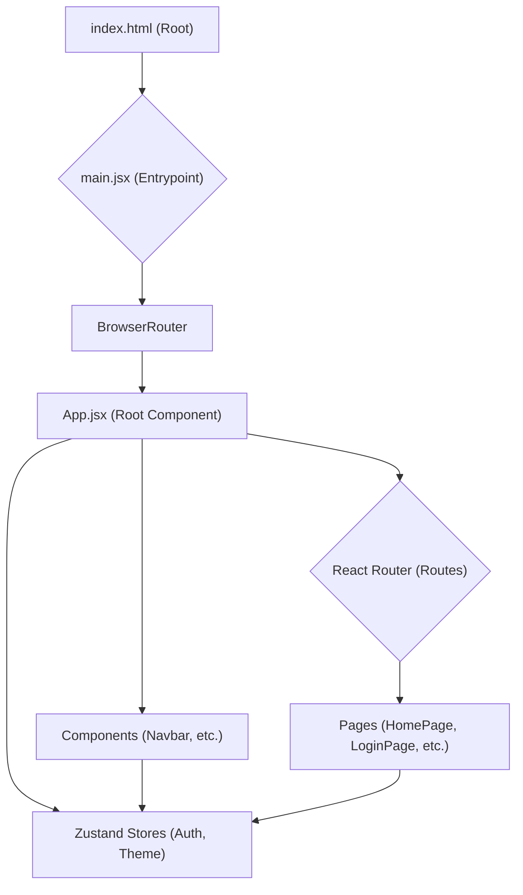
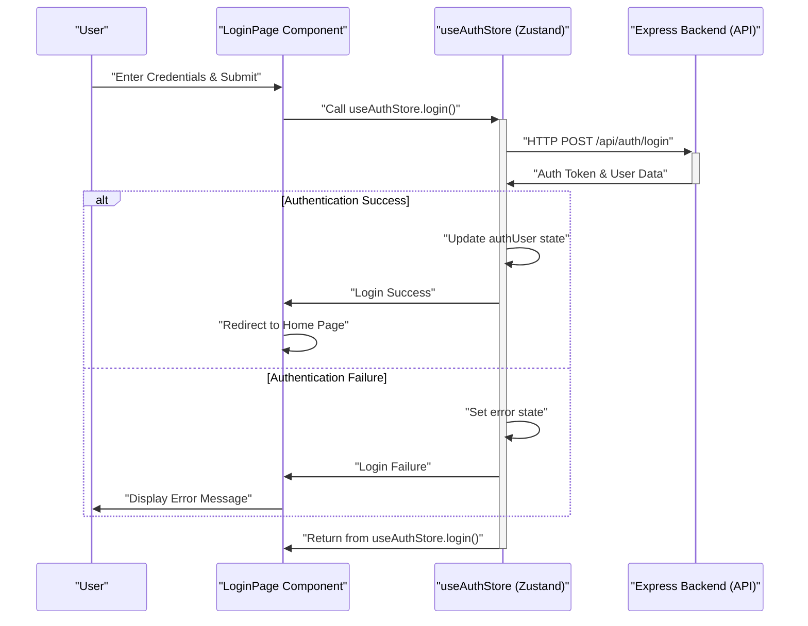

 # Frontend Development Guide

This guide provides a comprehensive overview of the frontend architecture, development setup, and core components of the application. The frontend is built using modern web technologies, designed for a responsive user experience and efficient development. It primarily leverages React for UI, Vite for rapid development, and Zustand for state management.

## Frontend Architecture Overview

The frontend application is structured to promote modularity and maintainability. At its core, it's a Single-Page Application (SPA) powered by React, utilizing `react-router-dom` for navigation. The primary entry point is `main.jsx`, which renders the root `App.jsx` component within a `BrowserRouter` context. State management is handled globally by Zustand, while `react-hot-toast` provides user feedback. Authentication and theme preferences are managed through dedicated Zustand stores.





## Development Setup and Key Files

The project uses Vite as a build tool, offering incredibly fast hot module replacement (HMR) and an optimized build process.

### `frontend/package.json`

The `package.json` file defines all project metadata, scripts, and dependencies. It's crucial for managing the project's development and production environments.

```json
{
  "name": "frontend",
  "private": true,
  "version": "0.0.0",
  "type": "module",
  "scripts": {
    "dev": "vite",
    "build": "vite build",
    "lint": "eslint .",
    "preview": "vite preview",
    "mobile": "vite --host"
  },
  "dependencies": {
    "axios": "^1.7.9",
    "cors": "^2.8.5",
    "lucide-react": "^0.471.1",
    "react": "^18.3.1",
    "react-dom": "^18.3.1",
    "react-hot-toast": "^2.5.1",
    "react-icons": "^5.5.0",
    "react-router-dom": "^7.1.1",
    "socket.io-client": "^4.8.1",
    "zustand": "^5.0.3"
  },
  "devDependencies": {
    "@eslint/js": "^9.17.0",
    "@types/react": "^18.3.18",
    "@types/react-dom": "^18.3.5",
    "@vitejs/plugin-react": "^4.3.4",
    "autoprefixer": "^10.4.20",
    "daisyui": "^4.12.23",
    "eslint": "^9.17.0",
    "eslint-plugin-react": "^7.37.2",
    "eslint-plugin-react-hooks": "^5.0.0",
    "eslint-plugin-react-refresh": "^0.4.16",
    "globals": "^15.14.0",
    "postcss": "^8.5.0",
    "tailwindcss": "^3.4.17",
    "vite": "^6.3.5"
  }
}
```

The `scripts` section defines commands like `dev` (to start the development server), `build` (to compile for production), and `mobile` (to expose the development server to other devices on the network).

Key dependencies include:
*   **`react`**, **`react-dom`**: The core React library.
*   **`react-router-dom`**: For declarative routing.
*   **`zustand`**: A lightweight state management library.
*   **`axios`**: For making HTTP requests to the backend.
*   **`socket.io-client`**: For real-time communication.
*   **`react-hot-toast`**: For elegant notifications.
*   **`daisyui`**, **`tailwindcss`**: For UI component styling and utility-first CSS.

[View `package.json` on GitHub](https://github.com/shinymack/Chat-App-MERN/blob/main/frontend/package.json)

### `frontend/vite.config.js`

This file contains the configuration for Vite. It primarily includes the `@vitejs/plugin-react` to enable React Fast Refresh.

```javascript
import { defineConfig } from 'vite'
import react from '@vitejs/plugin-react'

// https://vitejs.dev/config/
export default defineConfig({
  plugins: [react()],
})
```

[View `vite.config.js` on GitHub](https://github.com/shinymack/Chat-App-MERN/blob/main/frontend/vite.config.js)

### `frontend/src/main.jsx`

This is the main entry point of the React application. It initializes the React root, wraps the `App` component with `BrowserRouter` for routing capabilities, and renders it into the DOM.

```jsx
import { StrictMode } from 'react'
import { createRoot } from 'react-dom/client'
import './index.css'
import App from './App.jsx'
import { BrowserRouter } from 'react-router-dom'

createRoot(document.getElementById('root')).render(
  <StrictMode>
    <BrowserRouter>
      <App />
    </BrowserRouter>
  </StrictMode>,
)
```

The `StrictMode` component helps identify potential problems in an application by activating additional checks and warnings.
[View `main.jsx` on GitHub](https://github.com/shinymack/Chat-App-MERN/blob/main/frontend/src/main.jsx)

### `frontend/src/App.jsx`

The `App.jsx` component is the root of the application's component tree. It sets up global contexts, manages routing, and handles initial authentication checks.

```jsx
// import React from 'react' // No need for React import in React 17+ for JSX
import Navbar from './components/Navbar'
import { Routes, Route, Navigate } from 'react-router-dom'
import { useEffect } from 'react'
import HomePage from './pages/HomePage'
import SignUpPage from './pages/SignUpPage'
import LoginPage from './pages/LoginPage'
import SettingsPage from './pages/SettingsPage'
import ProfilePage from './pages/ProfilePage'


import { useThemeStore } from './store/useThemeStore'
import { useAuthStore } from './store/useAuthStore';
import { Loader } from 'lucide-react'
import { Toaster } from 'react-hot-toast'

const App = () => {
  const { authUser, checkAuth, isCheckingAuth, onlineUsers } = useAuthStore();
  const { theme } = useThemeStore();
  useEffect(() => {
    checkAuth(); // Checks user authentication status on component mount
  }, [checkAuth]);

  console.log("authUser: ", {authUser}); // Debugging authUser state

  console.log({onlineUsers}) // Debugging onlineUsers state

  if(isCheckingAuth && !authUser) return (
      <div className='flex items-center justify-center h-screen'>
        <Loader className='size-10 animate-spin' />
      </div>
  )

  return (
    <div className='' data-theme={theme}> {/* Sets theme globally */}

      <Navbar /> {/* Global navigation bar */}

      <Toaster /> {/* React Hot Toast for notifications */}
      <Routes> {/* Defines application routes */}
        <Route path='/' element={authUser ? <HomePage />: <Navigate to='/login' />} />
        <Route path='/signup' element={ !authUser ? <SignUpPage />: <Navigate to='/' />} />
        <Route path='/login' element={!authUser ? <LoginPage />: <Navigate to='/' />} />
        <Route path='/settings' element={<SettingsPage />} />
        <Route path='/profile' element={authUser ? <ProfilePage />: <Navigate to='/login' />} />

      </Routes>

    </div>
  )
}

export default App
```

This file is responsible for:
*   **Authentication Check**: `useEffect` hook calls `checkAuth()` from `useAuthStore` to verify the user's login status on initial load. A loading spinner is shown during this check.
*   **Theme Management**: The `data-theme` attribute on the root `div` is dynamically set based on the `theme` from `useThemeStore`, enabling global theme switching.
*   **Global Components**: The `Navbar` and `Toaster` components are rendered across all routes.
*   **Routing**: `react-router-dom`'s `Routes` and `Route` components define the application's navigation paths, using `Navigate` to redirect users based on their authentication status.
    *   Protected routes (e.g., `/`, `/profile`) redirect to `/login` if not authenticated.
    *   Authentication routes (e.g., `/signup`, `/login`) redirect to `/` if already authenticated.

[View `App.jsx` on GitHub](https://github.com/shinymack/Chat-App-MERN/blob/main/frontend/src/App.jsx)

## State Management with Zustand

Zustand is used for managing global application state, such as user authentication status and theme preferences. It's a lightweight, performant, and simple state management solution.

### Authentication Flow Example

The following sequence diagram illustrates a simplified user authentication flow, specifically how a user might log in and how the application's `useAuthStore` would handle the state updates.





## Key Integration Points

The frontend integrates with the backend primarily through HTTP requests (using `axios`) for data fetching, authentication, and general API interactions. Real-time features, such as chat messages or online status, are handled via `socket.io-client`.

*   **Authentication**: The `useAuthStore` interacts with `/api/auth/login` and `/api/auth/signup` endpoints to manage user sessions. On successful login, a JWT token (typically stored in `localStorage` or `HttpOnly` cookies) is used for subsequent authenticated requests.
*   **Data Fetching**: Components fetch data from backend APIs using `axios`, often within `useEffect` hooks, populating UI elements with dynamic content.
*   **Real-time Communication**: `socket.io-client` establishes a WebSocket connection to the backend, enabling instantaneous updates for features like chat messaging, presence (online/offline status), and notifications without constant polling.
*   **Global State Synchronization**: Zustand stores automatically re-render components that consume their state. For example, when `authUser` in `useAuthStore` changes, `App.jsx` re-evaluates its routes, potentially navigating the user. Similarly, changing the `theme` in `useThemeStore` updates the `data-theme` attribute on the root element, applying new styles.

Adhering to a clear separation of concerns between UI components, state management (Zustand stores), and API interaction ensures a maintainable and scalable frontend codebase.