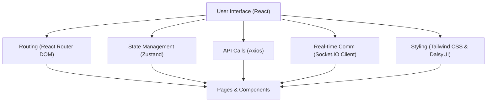
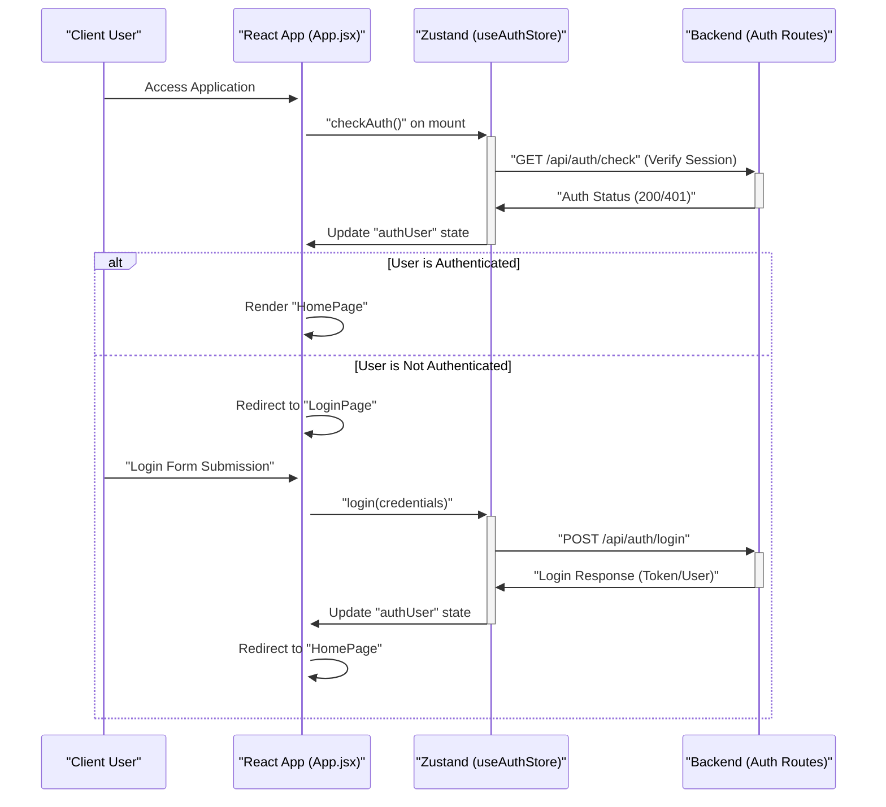

 # Frontend Development

The frontend of this application is a modern, single-page application (SPA) built with React.js, leveraging Vite for a fast development experience and efficient bundling. It serves as the user interface, handling all client-side interactions, data presentation, and routing. This section provides an in-depth look at its architecture, core libraries, and how different components contribute to the overall user experience.

## Core Technologies and Setup

The project uses a standard React setup managed by Vite, a next-generation frontend tooling. Vite offers lightning-fast hot module replacement (HMR) and optimized builds, making development both pleasant and productive. The `frontend/vite.config.js` file is minimal, primarily enabling React support through `@vitejs/plugin-react`.

```javascript
// frontend/vite.config.js
import { defineConfig } from 'vite'
import react from '@vitejs/plugin-react'

// https://vitejs.dev/config/
export default defineConfig({
  plugins: [react()],
})
```
This configuration ensures that Vite correctly processes React components and JSX syntax. [View on GitHub](https://github.com/shinymack/Chat-App-MERN/blob/main/frontend/vite.config.js)

The application's entry point is `frontend/src/main.jsx`, which initializes the React application and integrates `react-router-dom` for client-side routing.

```jsx
// frontend/src/main.jsx
import { StrictMode } from 'react'
import { createRoot } from 'react-dom/client'
import './index.css'
import App from './App.jsx'
import { BrowserRouter } from 'react-router-dom'

createRoot(document.getElementById('root')).render(
  <StrictMode>
    <BrowserRouter>
      <App />
    </BrowserRouter>
  </StrictMode>,
)
```
Here, `StrictMode` helps in highlighting potential problems in an application, and `BrowserRouter` from `react-router-dom` enables declarative routing within the single-page application. [View on GitHub](https://github.com/shinymack/Chat-App-MERN/blob/main/frontend/src/main.jsx#L1-L12)

## Application Structure and Routing

The `frontend/src/App.jsx` component is the heart of the frontend application. It manages global concerns such as user authentication status, theme settings, and defining the primary routing structure. It conditionally renders different pages based on the user's authentication state, ensuring a consistent and secure user experience.

```jsx
// frontend/src/App.jsx
import Navbar from './components/Navbar'
import { Routes, Route, Navigate } from 'react-router-dom'
import { useEffect } from 'react'
import HomePage from './pages/HomePage'
import SignUpPage from './pages/SignUpPage'
import LoginPage from './pages/LoginPage'
import SettingsPage from './pages/SettingsPage'
import ProfilePage from './pages/ProfilePage'

import { useThemeStore } from './store/useThemeStore'
import { useAuthStore } from './store/useAuthStore';
import { Loader } from 'lucide-react'
import { Toaster } from 'react-hot-toast'

const App = () => {
  const { authUser, checkAuth, isCheckingAuth, onlineUsers } = useAuthStore();
  const { theme } = useThemeStore();
  useEffect(() => {
    checkAuth();
  }, [checkAuth]);

  // ... (rest of the component)
}
```
This snippet demonstrates the import of various page components, global state management hooks (`useThemeStore`, `useAuthStore`), and UI libraries like `lucide-react` for icons and `react-hot-toast` for notifications. The `useEffect` hook ensures that the user's authentication status is checked upon component mount. [View on GitHub](https://github.com/shinymack/Chat-App-MERN/blob/main/frontend/src/App.jsx#L1-L26)

The routing logic within `App.jsx` dynamically redirects users based on their login status:

```jsx
// frontend/src/App.jsx (snippet)
// ...
  return (
    <div className='' data-theme={theme}>

      <Navbar />

      <Toaster />
      <Routes>
        <Route path='/' element={authUser ? <HomePage />: <Navigate to='/login' />} />
        <Route path='/signup' element={ !authUser ? <SignUpPage />: <Navigate to='/' />} />
        <Route path='/login' element={!authUser ? <LoginPage />: <Navigate to='/' />} />
        <Route path='/settings' element={<SettingsPage />} />
        <Route path='/profile' element={authUser ? <ProfilePage />: <Navigate to='/login' />} />

      </Routes>

    </div>
  )
}

export default App
```
This routing table ensures that unauthenticated users are directed to login or signup pages, while authenticated users can access protected routes like the homepage and profile. The `data-theme={theme}` attribute on the root `div` facilitates dynamic theme switching across the application. [View on GitHub](https://github.com/shinymack/Chat-App-MERN/blob/main/frontend/src/App.jsx#L36-L51)

## Frontend Dependencies and Ecosystem

The `frontend/package.json` file outlines all the necessary dependencies and development tools for the client-side application. It highlights the modern JavaScript ecosystem employed.

### Core Dependencies

| Dependency          | Version    | Description                                                     |
| :------------------ | :--------- | :-------------------------------------------------------------- |
| `react`             | `^18.3.1`  | Core React library for building user interfaces.                |
| `react-dom`         | `^18.3.1`  | React package for working with the DOM.                         |
| `react-router-dom`  | `^7.1.1`   | Declarative routing for React.js.                               |
| `zustand`           | `^5.0.3`   | A small, fast, and scalable bearbones state-management solution. |
| `axios`             | `^1.7.9`   | Promise-based HTTP client for the browser and Node.js.          |
| `socket.io-client`  | `^4.8.1`   | Client-side library for WebSocket communication.                |
| `lucide-react`      | `^0.471.1` | Beautifully crafted open-source icons for React.                |
| `react-hot-toast`   | `^2.5.1`   | The best React Notifications library.                           |

### Development Dependencies

| Dependency           | Version      | Description                                                       |
| :------------------- | :----------- | :---------------------------------------------------------------- |
| `vite`               | `^6.3.5`     | Next-generation frontend tooling.                                 |
| `@vitejs/plugin-react` | `^4.3.4`     | Vite plugin for React.js projects.                                |
| `tailwindcss`        | `^3.4.17`    | A utility-first CSS framework for rapidly building custom designs.|
| `postcss`            | `^8.5.0`     | A tool for transforming CSS with JavaScript.                      |
| `autoprefixer`       | `^10.4.20`   | PostCSS plugin to parse CSS and add vendor prefixes.              |
| `daisyui`            | `^4.12.23`   | Tailwind CSS component library.                                   |
| `eslint`             | `^9.17.0`    | Pluggable JavaScript linter.                                      |

This `package.json` highlights a robust frontend stack. React and its ecosystem (`react-router-dom`) handle the UI and navigation. State management is gracefully handled by `zustand`, known for its simplicity and performance. Network requests are managed by `axios`, and real-time communication is powered by `socket.io-client`. Styling is achieved through `tailwindcss` and `daisyui`, providing a component-rich, utility-first approach. [View on GitHub](https://github.com/shinymack/Chat-App-MERN/blob/main/frontend/package.json)

Here's a diagram illustrating the core frontend libraries and their roles:





## Key Integration Points

The frontend intricately integrates with the backend for data persistence and real-time features.
The `useAuthStore` and `useThemeStore` hooks, powered by Zustand, are central to managing global application state:

```javascript
// frontend/src/App.jsx (relevant logic for auth and theme)
const { authUser, checkAuth, isCheckingAuth, onlineUsers } = useAuthStore();
const { theme } = useThemeStore();
useEffect(() => {
  checkAuth();
}, [checkAuth]);
```
`checkAuth()` is crucial, as it makes an API call to the backend to verify the user's session. The `isCheckingAuth` flag provides a loading state, preventing UI flicker during the initial authentication check. The `onlineUsers` state, likely updated via Socket.IO, reflects real-time user presence.

### User Authentication Flow

The authentication process is a critical integration point, ensuring users are authenticated before accessing protected resources.





This sequence diagram illustrates the client-side authentication flow, showing how the `App.jsx` component interacts with the `useAuthStore` to manage user sessions and how API calls are made to the backend for verification and login.

### Styling and Theming

The application utilizes Tailwind CSS for utility-first styling and DaisyUI as a component library on top of Tailwind. This combination allows for rapid UI development and easy customization. The `data-theme={theme}` attribute on the root `div` in `App.jsx`, coupled with `useThemeStore`, enables dynamic theme switching, providing a personalized user experience. Themes are defined within `tailwind.config.js` or `daisyui` configuration, allowing for a consistent design language.

This structured approach to frontend development ensures maintainability, scalability, and a smooth user experience, built on a robust and modern technology stack.