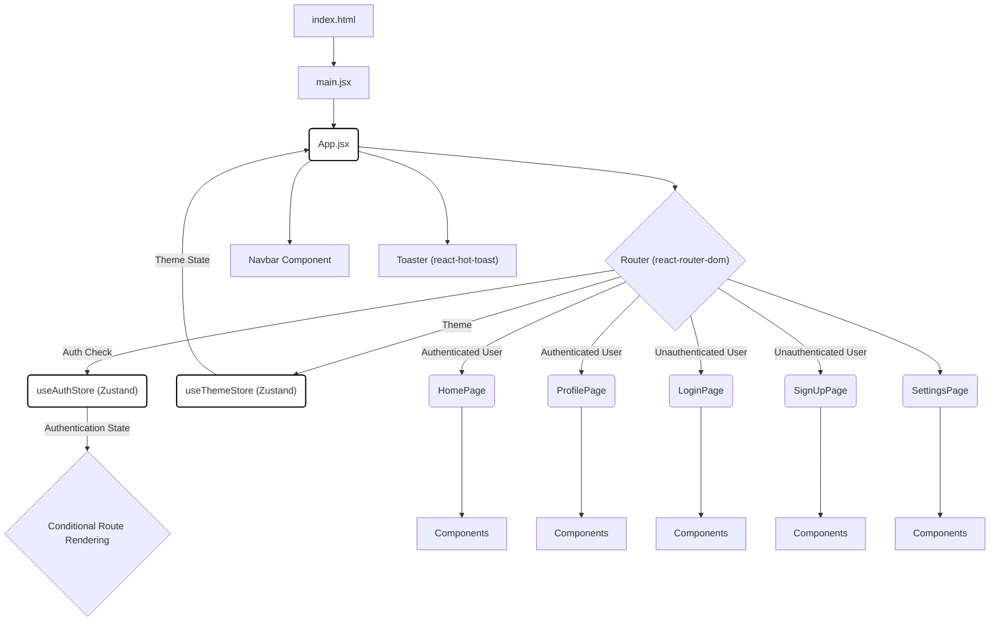
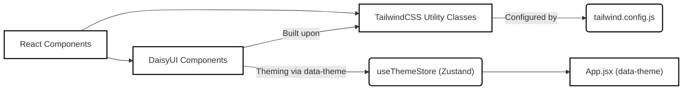

 # Frontend Implementation and UI

This section provides an in-depth look into the client-side architecture of the application, focusing on how the user interface is structured, components interact, and state is managed. Built with React, the frontend delivers a dynamic and responsive user experience, leveraging modern libraries for routing, styling, and real-time communication.

The frontend is responsible for:
*   **User Interface Rendering:** Displaying various views and interactive elements.
*   **User Authentication and Authorization:** Managing login, signup, and session persistence.
*   **Client-Side Routing:** Navigating between different application pages.
*   **State Management:** Handling global application state, including user data, theme, and real-time information.
*   **API Interaction:** Communicating with the backend API for data fetching and updates.
*   **Real-time Updates:** Interacting with the WebSocket server for instant notifications and data synchronization.

## Project Setup and Core Dependencies

The `frontend/package.json` file outlines all the essential dependencies and scripts required for developing and running the client-side application. It highlights the use of React as the core UI library, complemented by a robust set of tools for various functionalities.

Here's a look at the key `dependencies` driving the frontend:

```json
// frontend/package.json
{
  "dependencies": {
    "axios": "^1.7.9",
    "cors": "^2.8.5", // Though typically for backend, sometimes included in frontend for definition clarity
    "lucide-react": "^0.471.1",
    "react": "^18.3.1",
    "react-dom": "^18.3.1",
    "react-hot-toast": "^2.5.1",
    "react-icons": "^5.5.0",
    "react-router-dom": "^7.1.1",
    "socket.io-client": "^4.8.1",
    "zustand": "^5.0.3"
  },
  "devDependencies": {
    "@vitejs/plugin-react": "^4.3.4",
    "autoprefixer": "^10.4.20",
    "daisyui": "^4.12.23",
    "eslint": "^9.17.0",
    "postcss": "^8.5.0",
    "tailwindcss": "^3.4.17",
    "vite": "^6.3.5"
  }
}
```
[View on GitHub](https://github.com/shinymack/Chat-App-MERN/blob/main/frontend/package.json#L12-L24)

*   **`react` & `react-dom`**: The fundamental libraries for building declarative user interfaces.
*   **`axios`**: A popular promise-based HTTP client for making API requests to the backend.
*   **`react-router-dom`**: Essential for handling client-side routing, allowing navigation between different views without full page reloads.
*   **`zustand`**: A lightweight and fast state management library, used here for managing global state like authentication status and theme.
*   **`socket.io-client`**: Enables real-time, bidirectional communication with the server, crucial for chat applications.
*   **`react-hot-toast`**: A library for displaying beautiful and responsive toast notifications.
*   **`lucide-react` & `react-icons`**: Collections of customizable SVG icons to enhance the UI.
*   **`daisyui` & `tailwindcss`**: A component library and a utility-first CSS framework, respectively, used for rapid and consistent UI styling.
*   **`vite`**: A blazing fast frontend tooling for development, bundling, and building.

The `scripts` section defines various commands for development and build processes:

```json
// frontend/package.json
{
  "scripts": {
    "dev": "vite",
    "build": "vite build",
    "lint": "eslint .",
    "preview": "vite preview",
    "mobile": "vite --host"
  }
}
```
[View on GitHub](https://github.com/shinymack/Chat-App-MERN/blob/main/frontend/package.json#L7-L11)

These scripts facilitate common development tasks, from starting the development server (`dev`) to building the optimized production bundle (`build`).

## Application Entry Point and Global Styling

The `frontend/src/main.jsx` file serves as the primary entry point for the React application. It initializes the React root and wraps the main `App` component with necessary providers.

```jsx
// frontend/src/main.jsx
import { StrictMode } from 'react'
import { createRoot } from 'react-dom/client'
import './index.css'
import App from './App.jsx'
import { BrowserRouter } from 'react-router-dom'

createRoot(document.getElementById('root')).render(
  <StrictMode>
    <BrowserRouter>
      <App />
    </BrowserRouter>
  </StrictMode>,
)
```
[View on GitHub](https://github.com/shinymack/Chat-App-MERN/blob/main/frontend/src/main.jsx)

*   **`StrictMode`**: A React feature that helps identify potential problems in an application by activating additional checks and warnings during development.
*   **`BrowserRouter`**: From `react-router-dom`, this component uses the HTML5 history API (`pushState`, `replaceState`, `popstate`) to keep your UI in sync with the URL. It's essential for enabling client-side routing throughout the application.
*   **`index.css`**: The global stylesheet is imported here, ensuring that fundamental styles, including Tailwind CSS directives, are applied across the entire application.

The `frontend/src/index.css` file is responsible for importing global styles and integrating Tailwind CSS.

```css
/* frontend/src/index.css */
@import url('https://fonts.googleapis.com/css2?family=Chivo:ital,wght@0,100..900;1,100..900&display=swap');
@tailwind base;
@tailwind components;
@tailwind utilities;


@layer base {
    body {
        @apply font-chivo;
    }
}
```
[View on GitHub](https://github.com/shinymack/Chat-App-MERN/blob/main/frontend/src/index.css)

*   **Font Import**: Imports the 'Chivo' font from Google Fonts, defining the primary typography for the application.
*   **Tailwind Directives**: `@tailwind base;`, `@tailwind components;`, `@tailwind utilities;` are crucial for injecting Tailwind's preflight styles, component-specific styles, and utility classes into the CSS bundle.
*   **Custom Base Layer**: The `@layer base` block customizes the `body` tag to apply the `font-chivo` class globally, ensuring consistent typography.

## Core Application Component (`App.jsx`)

The `frontend/src/App.jsx` file is the heart of the frontend application. It manages routing, global state (authentication and theme), and sets up the main layout.

```jsx
// frontend/src/App.jsx
import Navbar from './components/Navbar'
import { Routes, Route, Navigate } from 'react-router-dom'
import { useEffect } from 'react'
import HomePage from './pages/HomePage'
import SignUpPage from './pages/SignUpPage' 
import LoginPage from './pages/LoginPage' 
import SettingsPage from './pages/SettingsPage' 
import ProfilePage from './pages/ProfilePage'

import { useThemeStore } from './store/useThemeStore'
import { useAuthStore } from './store/useAuthStore'; 
import { Loader } from 'lucide-react'
import { Toaster } from 'react-hot-toast'

const App = () => {
  const { authUser, checkAuth, isCheckingAuth, onlineUsers } = useAuthStore();
  const { theme } = useThemeStore();
  useEffect(() => {
    checkAuth();
  }, [checkAuth]);

  if(isCheckingAuth && !authUser) return (
      <div className='flex items-center justify-center h-screen'>
        <Loader className='size-10 animate-spin' />
      </div>
  )

  return (
    <div className='' data-theme={theme}>

      <Navbar />

      <Toaster />
      <Routes>
        <Route path='/' element={authUser ? <HomePage />: <Navigate to='/login' />} />
        <Route path='/signup' element={ !authUser ? <SignUpPage />: <Navigate to='/' />} />
        <Route path='/login' element={!authUser ? <LoginPage />: <Navigate to='/' />} />
        <Route path='/settings' element={<SettingsPage />} />
        <Route path='/profile' element={authUser ? <ProfilePage />: <Navigate to='/login' />} />

      </Routes>

    </div> 
  )
}

export default App
```
[View on GitHub](https://github.com/shinymack/Chat-App-MERN/blob/main/frontend/src/App.jsx)

### State Management with Zustand

The `App.jsx` component leverages Zustand for managing global application state:
*   **`useAuthStore`**: This store handles user authentication status. The `authUser` state determines if a user is logged in, and `checkAuth` is an asynchronous action that verifies the user's session with the backend. `isCheckingAuth` provides a loading state during the authentication check.
*   **`useThemeStore`**: This store manages the application's theme, allowing dynamic switching of UI aesthetics using DaisyUI's theme capabilities. The `theme` variable is directly applied to the root `div` via `data-theme={theme}`.

### Authentication Flow and Conditional Rendering

On initial load, an `useEffect` hook triggers `checkAuth()` to verify the user's authentication status. During this check, a `Loader` component is displayed to provide visual feedback, preventing premature rendering of the UI.

The routing logic is deeply intertwined with the authentication state:
*   **Protected Routes**: Pages like `/` (HomePage) and `/profile` are protected. If `authUser` is not present, users are redirected to `/login` using the `<Navigate />` component.
*   **Guest-Only Routes**: Pages like `/signup` and `/login` are accessible only to unauthenticated users. If `authUser` is present, users attempting to access these routes are redirected to the `/` (HomePage).
*   **Public Routes**: The `/settings` page is accessible regardless of authentication status, though specific functionalities within it might still be gated.

### Layout and Components

*   **`Navbar`**: A common navigation bar component is rendered at the top, providing consistent navigation across the application.
*   **`Toaster`**: From `react-hot-toast`, this component is placed globally to display notifications (e.g., success messages, error alerts) from anywhere in the application.

## Frontend Architecture Overview

The frontend follows a modular architecture, separating concerns into distinct components, pages, and state management units.





This diagram illustrates the flow from the initial HTML document to the core `App.jsx` component, which then orchestrates routing and integrates global state management. The conditional nature of routing based on authentication is a central theme.

## Key Integration Points

### State Management and UI Updates

Zustand plays a crucial role in maintaining application-wide state. For instance, `useAuthStore` manages user login/logout, while `useThemeStore` handles UI theme changes. These stores notify components of changes, ensuring the UI is always up-to-date without complex prop drilling.

The integration of `socket.io-client` (though not explicitly shown in `App.jsx`, it's a `dependency`) allows for real-time updates for features like chat messages or online user status, typically managed within the `useAuthStore` or a dedicated `useSocketStore`. This enables a highly interactive and responsive user experience.

### Routing and User Experience

The `App.jsx` component’s sophisticated routing logic, combined with `react-router-dom`’s `Navigate` component, ensures a smooth and secure user experience. It prevents unauthorized access to protected routes and guides users through appropriate authentication flows. The `isCheckingAuth` state prevents flickering during initial load by showing a loader, enhancing perceived performance.

### Styling with Tailwind CSS and DaisyUI

The combination of `tailwindcss` and `daisyui` provides a powerful and flexible styling solution. Tailwind’s utility-first approach allows for highly customizable styles directly in JSX, while DaisyUI provides pre-built, semantic components that inherit Tailwind’s configuration, ensuring a consistent design system. The `data-theme={theme}` attribute on the root `div` is a prime example of DaisyUI's theme management, enabling easy dark/light mode switching.





This flow demonstrates how `App.jsx` consumes the theme state from `useThemeStore` to dynamically apply themes via the `data-theme` attribute, which DaisyUI components then respect.

### Error and Notification Handling

The global `Toaster` component ensures that all user feedback, from successful operations to error messages, is presented consistently and non-intrusively. This centralized approach simplifies error handling and improves the overall user experience.

The frontend is designed to be robust and user-friendly, providing a solid foundation for the interactive features of the application.