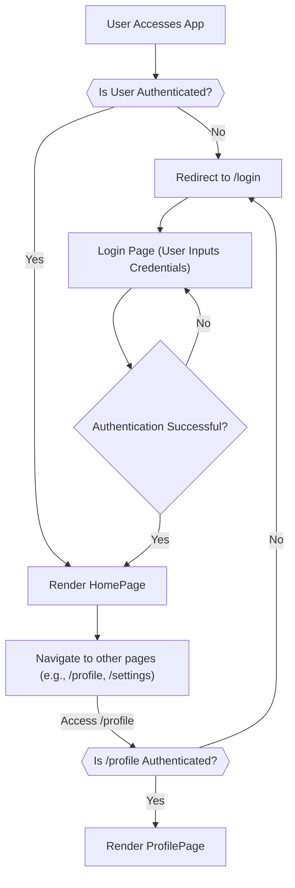

 # Frontend Implementation Details

This document provides a comprehensive overview of the client-side implementation, focusing on how the React application is structured, manages state, handles routing, and integrates global styles. We'll explore the core components, their responsibilities, and the underlying configuration that powers the frontend.

## Application Entry Points and Core Structure

The frontend application is bootstrapped using Vite, a modern build tool that offers a fast development experience. The primary entry point for the React application is `main.jsx`, which then renders the root `App.jsx` component.

### `main.jsx`: Application Bootstrap

The `main.jsx` file is responsible for rendering the root React component into the DOM. It wraps the main `App` component with `StrictMode` for identifying potential problems in an application and `BrowserRouter` from `react-router-dom` to enable client-side routing.

```jsx title="frontend/src/main.jsx"
import { StrictMode } from 'react'
import { createRoot } from 'react-dom/client'
import './index.css' // Global styles import
import App from './App.jsx'
import { BrowserRouter } from 'react-router-dom' // Enables client-side routing

createRoot(document.getElementById('root')).render(
  <StrictMode>
    <BrowserRouter>
      <App /> {/* The main application component */}
    </BrowserRouter>
  </StrictMode>,
)
```
The `createRoot` function initializes the React application, attaching it to the `div` element with the ID `root` in `index.html`.
[View on GitHub](https://github.com/shinymack/Chat-App-MERN/blob/main/frontend/src/main.jsx)

### `App.jsx`: Main Application Component

`App.jsx` serves as the central hub of the frontend application. It orchestrates the overall layout, handles global state management for authentication and theming, and defines the application's routing structure.

```jsx title="frontend/src/App.jsx - Imports and Global State"
import Navbar from './components/Navbar'
import { Routes, Route, Navigate } from 'react-router-dom'
import { useEffect } from 'react'
import HomePage from './pages/HomePage'
import SignUpPage from './pages/SignUpPage'
import LoginPage from './pages/LoginPage'
import SettingsPage from './pages/SettingsPage'
import ProfilePage from './pages/ProfilePage'

import { useThemeStore } from './store/useThemeStore' // Theme state management
import { useAuthStore } from './store/useAuthStore';   // Authentication state management
import { Loader } from 'lucide-react'
import { Toaster } from 'react-hot-toast'
```
This snippet demonstrates the key imports, including page components, the `Navbar`, and global state management hooks (`useThemeStore`, `useAuthStore`). The `Loader` component and `Toaster` for notifications are also brought in.
[View on GitHub](https://github.com/shinymack/Chat-App-MERN/blob/main/frontend/src/App.jsx#L1-L18)

#### Authentication and Theme Management

Upon component mount, an authentication check is performed using `useEffect` and the `checkAuth` function from `useAuthStore`. This ensures that the user's authentication status is verified whenever the application loads. The application also subscribes to the `theme` state from `useThemeStore` to apply the global theme.

```jsx title="frontend/src/App.jsx - Authentication Check"
const App = () => {
  const { authUser, checkAuth, isCheckingAuth, onlineUsers } = useAuthStore();
  const { theme } = useThemeStore();
  useEffect(() => {
    checkAuth(); // Verifies user authentication on component mount
  }, [checkAuth]);

  if(isCheckingAuth && !authUser) return ( // Display loader while checking authentication
      <div className='flex items-center justify-center h-screen'>
        <Loader className='size-10 animate-spin' />
      </div>
  )
  // ... rest of the component
}
```
This `useEffect` hook triggers `checkAuth` once when the component mounts. The `isCheckingAuth` state provides a loading indicator, preventing content from flashing before the authentication status is confirmed.
[View on GitHub](https://github.com/shinymack/Chat-App-MERN/blob/main/frontend/src/App.jsx#L20-L31)

#### Application Routing

The `Routes` component from `react-router-dom` defines the various paths within the application and their corresponding components. Conditional rendering with `Navigate` ensures that users are redirected based on their authentication status. For instance, authenticated users are directed to the `HomePage` on `/`, while unauthenticated users are sent to `/login`.

```jsx title="frontend/src/App.jsx - Routing Configuration"
  return (
    <div className='' data-theme={theme}> {/* Applies the current theme */}

      <Navbar /> {/* Global navigation bar */}

      <Toaster /> {/* Global notification system */}
      <Routes>
        <Route path='/' element={authUser ? <HomePage />: <Navigate to='/login' />} /> {/* Home page, requires auth */}
        <Route path='/signup' element={ !authUser ? <SignUpPage />: <Navigate to='/' />} /> {/* Signup, redirects if auth */}
        <Route path='/login' element={!authUser ? <LoginPage />: <Navigate to='/' />} /> {/* Login, redirects if auth */}
        <Route path='/settings' element={<SettingsPage />} /> {/* Settings page */}
        <Route path='/profile' element={authUser ? <ProfilePage />: <Navigate to='/login' />} /> {/* Profile page, requires auth */}
      </Routes>

    </div>
  )
}
```
This snippet illustrates how routes are defined, with conditional rendering for `HomePage`, `SignUpPage`, `LoginPage`, and `ProfilePage` to enforce authentication guards. The `Navbar` and `Toaster` are rendered globally across all routes.
[View on GitHub](https://github.com/shinymack/Chat-App-MERN/blob/main/frontend/src/App.jsx#L33-L49)

### Frontend Routing and Authentication Flow





This flowchart visualizes the authentication and routing logic within `App.jsx`. It shows how users are guided through the application based on their login status, with redirects to the login page for unauthenticated access to protected routes.

## Global Styling with Tailwind CSS

The application uses Tailwind CSS for its styling, providing a utility-first approach to building custom designs. The `index.css` file serves as the main entry point for importing Tailwind's base styles, components, and utilities, alongside custom font imports.

```css title="frontend/src/index.css"
@import url('https://fonts.googleapis.com/css2?family=Chivo:ital,wght@0,100..900;1,100..900&display=swap'); /* Custom font import */
@tailwind base;     /* Tailwind's base styles */
@tailwind components; /* Tailwind's component classes */
@tailwind utilities;  /* Tailwind's utility classes */


@layer base {
    body {
        @apply font-chivo; /* Applies Chivo font globally */
    }
}
```
This CSS file imports the Chivo font from Google Fonts and then includes the core Tailwind CSS layers. The `@layer base` directive is used to apply the `font-chivo` class to the `body` element globally, setting the default font for the entire application.
[View on GitHub](https://github.com/shinymack/Chat-App-MERN/blob/main/frontend/src/index.css)

## Vite Build Configuration

`vite.config.js` contains the configuration for Vite, the build tool used for the frontend. For a React application, the primary configuration involves including the `@vitejs/plugin-react` plugin to enable React-specific features like JSX transformation and Fast Refresh.

```javascript title="frontend/vite.config.js"
import { defineConfig } from 'vite'
import react from '@vitejs/plugin-react' // Vite plugin for React

// https://vitejs.dev/config/
export default defineConfig({
  plugins: [react()], // Enables React support
})
```
This minimalistic configuration is typical for a React project initialized with Vite, activating the necessary plugins for development and build processes.
[View on GitHub](https://github.com/shinymack/Chat-App-MERN/blob/main/frontend/vite.config.js)

## Key Integration Points

### Authentication Flow in `App.jsx`

The `App.jsx` component is critical for managing the initial authentication state. The `useEffect` hook ensures that `checkAuth` is called early in the application lifecycle. This asynchronous check is vital for protecting routes and providing a smooth user experience by displaying a loader (`Loader` component) while the authentication status is being determined. Without this, users might briefly see protected content before being redirected, or see login/signup forms when they are already authenticated.

### Global Theme and Navbar Integration

The `data-theme={theme}` attribute on the root `div` in `App.jsx` seamlessly integrates the global theme state managed by `useThemeStore`. This allows for dynamic theme switching that affects all descendant components. The `Navbar` component, rendered globally, is a prime example of a component that might use the theme state to adjust its appearance or contain controls for theme switching. This centralized theme management ensures consistency across the application.

### State Management Best Practices

The separation of concerns between `useAuthStore` and `useThemeStore` exemplifies a good pattern for global state management. Each store handles a specific domain, making the state logic more maintainable and testable. The use of custom hooks (presumably built with a library like Zustand) allows components like `App.jsx` to consume only the necessary parts of the state, reducing re-renders and improving performance.