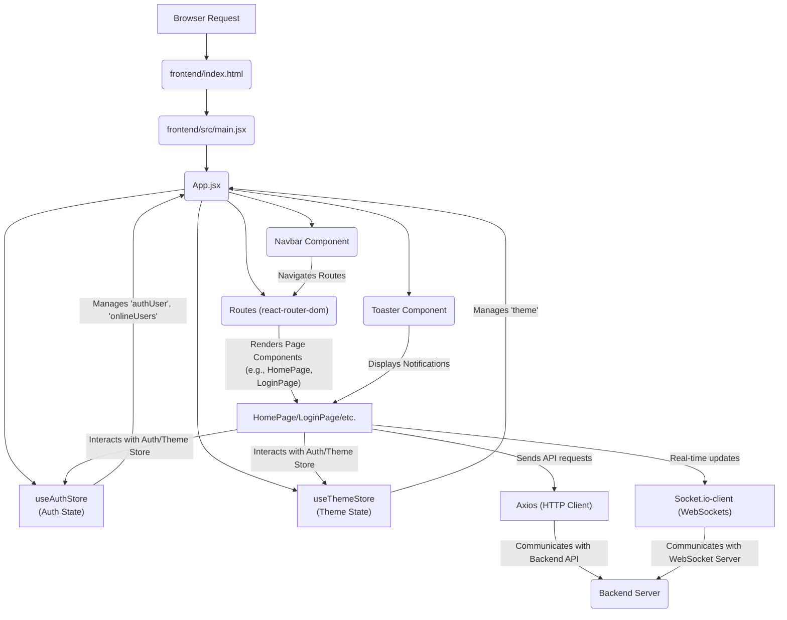

 # Frontend Implementation and UI

This document details the architecture and core components of the client-side application, focusing on its structure, UI elements, and state management strategies. The frontend is built using React, bundled with Vite, and leverages a variety of libraries for routing, UI components, state management, and real-time communication.

## Core Application Structure

The application's entry point is `index.html`, which renders the React application into a root div. The main JavaScript file, `main.jsx`, bootstraps the React application and integrates `react-router-dom` for client-side routing.

### `frontend/index.html`

The `index.html` file serves as the single page application (SPA) entry point. It defines the basic HTML structure, links the favicon, sets the viewport, and includes the main JavaScript bundle generated by Vite.

```html
<!doctype html>
<html lang="en">
  <head>
    <meta charset="UTF-8" />
    <link rel="icon" type="image/svg+xml+png" href="/icon.png" />
    <meta name="viewport" content="width=device-width, initial-scale=1.0" />
    <title>Chatty</title>
  </head>
  <body>
    <div id="root"></div>
    <script type="module" src="/src/main.jsx"></script>
  </body>
</html>
```

This file is minimal, primarily serving as a container for the React application. The `<div id="root"></div>` is where the entire React component tree is mounted.
[View on GitHub](https://github.com/shinymack/Chat-App-MERN/blob/main/frontend/index.html)

### `frontend/src/main.jsx`

This file is responsible for rendering the root `App` component into the DOM. It wraps the `App` with `StrictMode` for highlighting potential problems and `BrowserRouter` from `react-router-dom` to enable declarative routing within the application.

```jsx
import { StrictMode } from 'react'
import { createRoot } from 'react-dom/client'
import './index.css'
import App from './App.jsx'
import { BrowserRouter } from 'react-router-dom'

createRoot(document.getElementById('root')).render(
  <StrictMode>
    <BrowserRouter>
      <App />
    </BrowserRouter>
  </StrictMode>,
)
```

The `BrowserRouter` is essential for handling navigation without full page reloads, providing a smooth user experience.
[View on GitHub](https://github.com/shinymack/Chat-App-MERN/blob/main/frontend/src/main.jsx)

## Dependencies and Development Environment

The `package.json` file outlines all the project's dependencies, scripts, and development tools.

### `frontend/package.json`

This file lists all the dependencies for both development and production. Key libraries include:

*   **`react`**, **`react-dom`**: Core React libraries.
*   **`react-router-dom`**: For declarative routing.
*   **`zustand`**: A lightweight state management solution.
*   **`socket.io-client`**: For real-time communication with the backend.
*   **`axios`**: For making HTTP requests.
*   **`lucide-react`**, **`react-icons`**: Icon libraries.
*   **`react-hot-toast`**: For elegant notifications.
*   **`daisyui`**, **`tailwindcss`**, **`autoprefixer`**, **`postcss`**: For styling and UI component generation.
*   **`vite`**: The build tool and development server.

```json
{
  "name": "frontend",
  "private": true,
  "version": "0.0.0",
  "type": "module",
  "scripts": {
    "dev": "vite",
    "build": "vite build",
    "lint": "eslint .",
    "preview": "vite preview",
    "mobile": "vite --host"
  },
  "dependencies": {
    "axios": "^1.7.9",
    "cors": "^2.8.5",
    "lucide-react": "^0.471.1",
    "react": "^18.3.1",
    "react-dom": "^18.3.1",
    "react-hot-toast": "^2.5.1",
    "react-icons": "^5.5.0",
    "react-router-dom": "^7.1.1",
    "socket.io-client": "^4.8.1",
    "zustand": "^5.0.3"
  },
  "devDependencies": {
    "@eslint/js": "^9.17.0",
    "@types/react": "^18.3.18",
    "@types/react-dom": "^18.3.5",
    "@vitejs/plugin-react": "^4.3.4",
    "autoprefixer": "^10.4.20",
    "daisyui": "^4.12.23",
    "eslint": "^9.17.0",
    "eslint-plugin-react": "^7.37.2",
    "eslint-plugin-react-hooks": "^5.0.0",
    "eslint-plugin-react-refresh": "^0.4.16",
    "globals": "^15.14.0",
    "postcss": "^8.5.0",
    "tailwindcss": "^3.4.17",
    "vite": "^6.3.5"
  }
}
```

The `scripts` section defines commands for development (`dev`), building for production (`build`), linting (`lint`), previewing the build (`preview`), and running on a mobile-accessible host (`mobile`).
[View on GitHub](https://github.com/shinymack/Chat-App-MERN/blob/main/frontend/package.json)

## Application Flow and Routing

The `App.jsx` component is the main application shell. It handles global state, authentication checks, theme management, and defines the application's routes.

### `frontend/src/App.jsx`

This component integrates navigation (`Navbar`), toasts (`Toaster`), and sets up the main routes. It also manages authentication state using `useAuthStore` and theme using `useThemeStore`.

```jsx
// import React from 'react'
import Navbar from './components/Navbar'
import { Routes, Route, Navigate } from 'react-router-dom'
import { useEffect } from 'react'
import HomePage from './pages/HomePage'
import SignUpPage from './pages/SignUpPage' 
import LoginPage from './pages/LoginPage' 
import SettingsPage from './pages/SettingsPage' 
import ProfilePage from './pages/ProfilePage'


import { useThemeStore } from './store/useThemeStore'
import { useAuthStore } from './store/useAuthStore'; 
import { Loader } from 'lucide-react'
import { Toaster } from 'react-hot-toast'

const App = () => {
  const { authUser, checkAuth, isCheckingAuth, onlineUsers } = useAuthStore();
  const { theme } = useThemeStore();
  useEffect(() => {
    checkAuth();
  }, [checkAuth]);

  console.log("authUser: ", {authUser});

  console.log({onlineUsers})

  if(isCheckingAuth && !authUser) return (
      <div className='flex items-center justify-center h-screen'>
        <Loader className='size-10 animate-spin' />
      </div>
  )

  return (
    <div className='' data-theme={theme}>

      <Navbar />

      <Toaster />
      <Routes>
        <Route path='/' element={authUser ? <HomePage />: <Navigate to='/login' />} />
        <Route path='/signup' element={ !authUser ? <SignUpPage />: <Navigate to='/' />} />
        <Route path='/login' element={!authUser ? <LoginPage />: <Navigate to='/' />} />
        <Route path='/settings' element={<SettingsPage />} />
        <Route path='/profile' element={authUser ? <ProfilePage />: <Navigate to='/login' />} />

      </Routes>

    </div> 
  )
}

export default App
```

The `useEffect` hook calls `checkAuth()` on component mount to verify the user's authentication status. This ensures that protected routes are only accessible to authenticated users. A loading spinner is displayed while the authentication check is in progress. The `data-theme` attribute on the root `div` allows dynamic theme switching using DaisyUI.
[View on GitHub](https://github.com/shinymack/Chat-App-MERN/blob/main/frontend/src/App.jsx)

### Authentication and Routing Logic

The application implements protected routes using conditional rendering and the `Navigate` component from `react-router-dom`. For example, the homepage (`/`) redirects to `/login` if `authUser` is not present, while `signup` and `login` pages redirect to `/` if `authUser` is already present.

```jsx
// Excerpt from frontend/src/App.jsx
// Line 39-44
        <Route path='/' element={authUser ? <HomePage />: <Navigate to='/login' />} />
        <Route path='/signup' element={ !authUser ? <SignUpPage />: <Navigate to='/' />} />
        <Route path='/login' element={!authUser ? <LoginPage />: <Navigate to='/' />} />
        <Route path='/settings' element={<SettingsPage />} />
        <Route path='/profile' element={authUser ? <ProfilePage />: <Navigate to='/login' />} />
```

This snippet demonstrates how the `authUser` state, managed by `useAuthStore`, dictates access to different parts of the application.
[View on GitHub](https://github.com/shinymack/Chat-App-MERN/blob/main/frontend/src/App.jsx#L39-L44)

## State Management

The frontend utilizes `Zustand` for state management, as seen with `useThemeStore` and `useAuthStore`. These stores centralize application-wide states like user authentication status, online users, and the current UI theme.

### Authentication State Management with Zustand

The `useAuthStore` manages the current authenticated user (`authUser`), the online users list (`onlineUsers`), and provides functions to check authentication status (`checkAuth`).

```jsx
// Excerpt from frontend/src/App.jsx
// Line 25-27
  const { authUser, checkAuth, isCheckingAuth, onlineUsers } = useAuthStore();
  const { theme } = useThemeStore();
  useEffect(() => {
    checkAuth();
  }, [checkAuth]);
```

This ensures that the authentication status is consistently checked and updated across the application, providing a seamless user experience upon loading or refreshing the page.
[View on GitHub](https://github.com/shinymack/Chat-App-MERN/blob/main/frontend/src/App.jsx#L25-L27)

## Frontend Application Flow Diagram

The following diagram illustrates the high-level flow of the frontend application, from initial load to authenticated user interaction.


```mermaid
graph TD
    A["User Accesses App"] --> B("frontend/index.html")
    B --> C("frontend/src/main.jsx")
    C --> D{"App Component <br> (frontend/src/App.jsx)"}
    D --> E["useAuthStore <br> (Check Auth Status)"]
    D --> F["useThemeStore <br> (Load Theme)"]
    E --> G{ "isCheckingAuth?"}
    G -- "Yes" --> H["Loader Component"]
    G -- "No" --> I{"Authenticated?"}
    I -- "Yes" --> J["Render Navbar"]
    I -- "Yes" --> K["Render Toaster"]
    I -- "Yes" --> L["Route to Home Page ('/')" ]
    I -- "No" --> L["Route to Login Page ('/login')"]
    L --> M["Specific Page Components <br> (e.g., HomePage, LoginPage)"]
    J --> M
    K --> M
```


## Key Integration Points

### Authentication Flow
The application prioritizes authentication by checking the user's status immediately upon load. The `checkAuth` function, likely performing an API call to validate a session or token, determines whether the user is redirected to the home page or the login page. This design ensures that unauthenticated users cannot access protected content.

### Global State Management with Zustand
`Zustand` is critical for managing global states like `authUser` and `theme`. This allows components across the application to access and update these states efficiently without prop drilling or complex context providers, leading to cleaner and more maintainable code. The `useAuthStore` also likely holds information about `onlineUsers`, which is vital for real-time chat functionality.

### Real-time Communication
Although not explicitly detailed in the provided snippets, the presence of `socket.io-client` in `package.json` indicates that the frontend integrates with a WebSocket server for real-time features such as chat messages and online user status updates. This library enables persistent, bidirectional communication channels between the client and the server. This interaction is typically managed through the `useAuthStore` or a dedicated `useSocketStore` to ensure that socket connections are established and managed alongside user authentication.

```jsx
// Excerpt from frontend/package.json
// Line 20
    "socket.io-client": "^4.8.1",
```

This dependency is fundamental for enabling the real-time chat experience, allowing messages and user presence to be updated instantly across all connected clients.
[View on GitHub](https://github.com/shinymack/Chat-App-MERN/blob/main/frontend/package.json#L20)

### UI Styling and Components
The combination of `tailwindcss` and `daisyui` provides a robust framework for styling and building UI components. `DaisyUI` provides pre-built, themeable components that accelerate UI development, while `tailwindcss` offers granular control over styles. The `data-theme` attribute in `App.jsx` demonstrates the dynamic theme-switching capabilities provided by `daisyui`.

### Routing and Navigation
`React Router DOM` is the backbone of client-side navigation. The `Routes` and `Route` components, combined with the `Navigate` component, provide a declarative way to manage application URLs and user access based on authentication status. The `Navbar` component, imported into `App.jsx`, typically contains navigation links that utilize `react-router-dom`'s `Link` component.

### Frontend Component Interaction

The diagram below illustrates how various frontend components and stores interact to provide a dynamic user experience.


