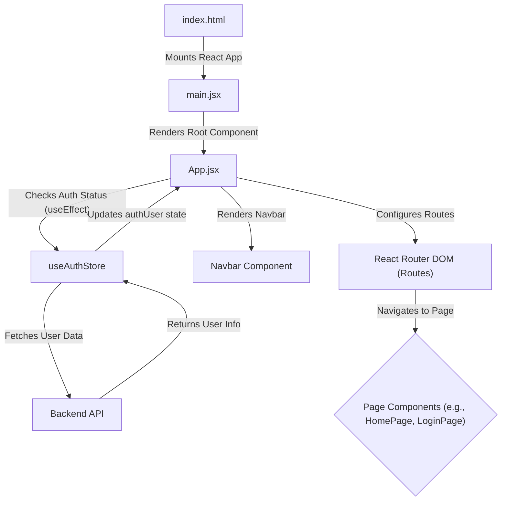
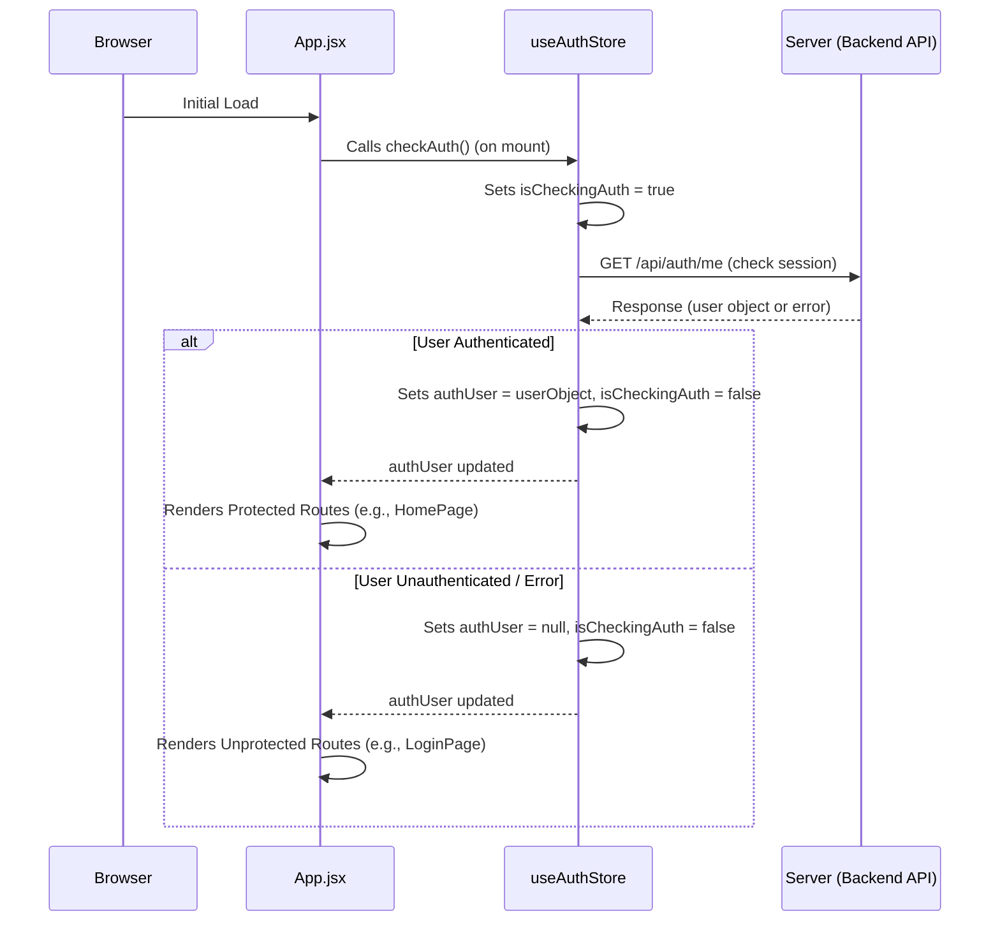

 # Frontend Implementation and User Interface

This document provides a comprehensive overview of the client-side application structure, user interface components, and state management within the DeepWiki project's frontend. Developed using React, the frontend leverages a modern ecosystem to deliver a dynamic and responsive user experience.

The client-side application is responsible for rendering the user interface, handling user interactions, communicating with the backend API, and managing client-side state. It's built with modularity and scalability in mind, separating concerns such as routing, state management, and UI presentation.

## Tech Stack Overview

The frontend application utilizes a robust set of technologies, as defined in `frontend/package.json`, to provide a performant and maintainable codebase. Key dependencies include React for UI development, Vite as a fast build tool, and Zustand for efficient state management.

```json
{
  "name": "frontend",
  "private": true,
  // ... other fields
  "dependencies": {
    "axios": "^1.7.9",
    "lucide-react": "^0.471.1",
    "react": "^18.3.1",
    "react-dom": "^18.3.1",
    "react-hot-toast": "^2.5.1",
    "react-icons": "^5.5.0",
    "react-router-dom": "^7.1.1",
    "socket.io-client": "^4.8.1",
    "zustand": "^5.0.3"
  },
  "devDependencies": {
    "autoprefixer": "^10.4.20",
    "daisyui": "^4.12.23",
    "postcss": "^8.5.0",
    "tailwindcss": "^3.4.17",
    "vite": "^6.3.5"
  }
}
```
[View `package.json` on GitHub](https://github.com/shinymack/Chat-App-MERN/blob/main/frontend/package.json)

### Core Technologies:

*   **React**: The primary JavaScript library for building user interfaces.
*   **Vite**: A next-generation frontend tooling that provides an extremely fast development experience.
*   **React Router DOM**: Declarative routing for React, enabling navigation between different pages.
*   **Zustand**: A small, fast, and scalable bearbones state-management solution. It is used here for global state management like authentication and theme.
*   **Axios**: A promise-based HTTP client for making API requests to the backend.
*   **Socket.IO Client**: Facilitates real-time, bidirectional communication with the backend, essential for features like live chat or notifications.
*   **Tailwind CSS & DaisyUI**: A utility-first CSS framework (Tailwind) combined with a component library (DaisyUI) for rapid UI development and consistent theming.
*   **React Hot Toast**: A customizable and accessible toast notification system.
*   **Lucide React & React Icons**: Icon libraries for various UI elements.

## Application Entry Point

The `frontend/src/main.jsx` file serves as the main entry point for the React application. It's responsible for rendering the root `App` component into the DOM and setting up global contexts, such as `BrowserRouter` for client-side routing.

```jsx
import { StrictMode } from 'react'
import { createRoot } from 'react-dom/client'
import './index.css'
import App from './App.jsx'
import { BrowserRouter } from 'react-router-dom' // Import BrowserRouter

createRoot(document.getElementById('root')).render(
  <StrictMode>
    <BrowserRouter> {/* Wrap App with BrowserRouter for routing */}
      <App />
    </BrowserRouter>
  </StrictMode>,
)
```
[View `main.jsx` on GitHub](https://github.com/shinymack/Chat-App-MERN/blob/main/frontend/src/main.jsx)

By wrapping the `<App />` component with `<BrowserRouter>`, all child components gain access to routing capabilities, allowing for declarative navigation and URL management throughout the application. `StrictMode` is used to highlight potential problems in an application, aiding development.

## Main Application Component: `App.jsx`

The `frontend/src/App.jsx` file is the central component of the application, orchestrating routing, global state management (authentication and theme), and layout. It conditionally renders different pages based on the current URL and the user's authentication status.

```jsx
// frontend/src/App.jsx
import Navbar from './components/Navbar'
import { Routes, Route, Navigate } from 'react-router-dom'
import { useEffect } from 'react'
import HomePage from './pages/HomePage'
import SignUpPage from './pages/SignUpPage'
import LoginPage from './pages/LoginPage'
// ... other page imports
import { useThemeStore } from './store/useThemeStore'
import { useAuthStore } from './store/useAuthStore';
import { Loader } from 'lucide-react'
import { Toaster } from 'react-hot-toast'

const App = () => {
  const { authUser, checkAuth, isCheckingAuth, onlineUsers } = useAuthStore();
  const { theme } = useThemeStore();

  useEffect(() => {
    checkAuth(); // Check authentication status on component mount
  }, [checkAuth]);

  if(isCheckingAuth && !authUser) return ( // Show loader while checking auth
      <div className='flex items-center justify-center h-screen'>
        <Loader className='size-10 animate-spin' />
      </div>
  )

  return (
    <div className='' data-theme={theme}> {/* Apply current theme from store */}
      <Navbar />
      <Toaster /> {/* Global toast notifications */}
      <Routes> {/* Define application routes */}
        <Route path='/' element={authUser ? <HomePage />: <Navigate to='/login' />} />
        <Route path='/signup' element={ !authUser ? <SignUpPage />: <Navigate to='/' />} />
        <Route path='/login' element={!authUser ? <LoginPage />: <Navigate to='/' />} />
        <Route path='/settings' element={<SettingsPage />} />
        <Route path='/profile' element={authUser ? <ProfilePage />: <Navigate to='/login' />} />
      </Routes>
    </div>
  )
}

export default App
```
[View `App.jsx` on GitHub](https://github.com/shinymack/Chat-App-MERN/blob/main/frontend/src/App.jsx)

### Application Component Flow
This diagram illustrates the initial flow and key components of the frontend application.





### Routing Logic

The `<Routes>` component from `react-router-dom` defines the application's navigation paths. It employs conditional rendering and the `<Navigate>` component to enforce access control:
*   Users are redirected to `/login` if attempting to access a protected route (e.g., `/` for `HomePage`) while unauthenticated.
*   Authenticated users are redirected from `/login` or `/signup` to `/`.

### Global State Management

`App.jsx` integrates with Zustand stores for global state management:
*   **`useAuthStore`**: Manages the `authUser` state, `isCheckingAuth` status, and the `checkAuth` function. The `useEffect` hook triggers `checkAuth` on component mount to verify the user's authentication status, preventing unauthorized access to protected routes.
*   **`useThemeStore`**: Provides access to the current `theme` (e.g., "light", "dark"), which is applied to the root `div` using `data-theme={theme}`. This integrates seamlessly with DaisyUI's theming capabilities.

```javascript
// Example snippet from useAuthStore (conceptual)
// frontend/src/store/useAuthStore.js
import { create } from 'zustand';
import axios from 'axios';

export const useAuthStore = create((set) => ({
  authUser: null,
  isCheckingAuth: true,
  checkAuth: async () => {
    set({ isCheckingAuth: true });
    try {
      const res = await axios.get('/api/auth/me'); // Checks session on backend
      set({ authUser: res.data.user });
    } catch (error) {
      set({ authUser: null });
    } finally {
      set({ isCheckingAuth: false });
    }
  },
  // ... other auth actions
}));
```
This conceptual snippet demonstrates how `checkAuth` would interact with a backend endpoint to validate the user's session and update the global `authUser` state.

### UI and Styling

The application's look and feel are managed through `frontend/src/index.css`, which imports Tailwind CSS and DaisyUI. This setup provides a powerful combination for building a responsive and customizable UI.

```css
/* frontend/src/index.css */
@import url('https://fonts.googleapis.com/css2?family=Chivo:ital,wght@0,100..900;1,100..900&display=swap');
@tailwind base;
@tailwind components;
@tailwind utilities;


@layer base {
    body {
        @apply font-chivo; /* Apply custom font globally */
    }
}
```
[View `index.css` on GitHub](https://github.com/shinymack/Chat-App-MERN/blob/main/frontend/src/index.css)

Tailwind CSS provides a set of low-level utility classes that allow for highly granular control over styling directly in the JSX. DaisyUI builds upon Tailwind, offering pre-built component classes (like `navbar`, `button`, `card`) that inherit Tailwind's utility features and are easily themeable. The `data-theme` attribute on the root `div` in `App.jsx` allows DaisyUI to swap themes dynamically.

## Key Integration Points

### Authentication Flow and State Management
The authentication process is a critical integration point, ensuring that users can securely log in and access protected resources. The `useAuthStore` plays a central role in managing the authentication state.

```jsx
// frontend/src/App.jsx (relevant snippet)
  const { authUser, checkAuth, isCheckingAuth, onlineUsers } = useAuthStore();
  // ...
  useEffect(() => {
    checkAuth();
  }, [checkAuth]);

  if(isCheckingAuth && !authUser) return (
      <div className='flex items-center justify-center h-screen'>
        <Loader className='size-10 animate-spin' />
      </div>
  )
```
The `checkAuth` function, called via `useEffect` on `App.jsx` mount, performs an asynchronous request to the backend to validate the user's session. While this check is in progress (`isCheckingAuth` is true), a loading spinner is displayed to provide feedback to the user. Once the check completes, `authUser` is updated, and the appropriate route is rendered.

### Authentication Flow Diagram
This diagram illustrates the sequence of operations during the initial authentication check.





### Real-time Communication with WebSockets

The integration of `socket.io-client` indicates the presence of real-time communication features within the application. While not explicitly detailed in `App.jsx`, the `onlineUsers` state in `useAuthStore` suggests that the client connects to a Socket.IO server to receive updates on active users or other real-time events.

### Data Fetching and Persistence

`axios` is used for making HTTP requests to the backend API for data fetching, sending forms, and managing user profiles. Data fetched via `axios` is then often used to update Zustand stores or local component state.

### User Interface and Theming

The application's visual appeal is greatly enhanced by the combination of Tailwind CSS and DaisyUI. The global `index.css` file ensures that the chosen `Chivo` font is applied across the application. The dynamic theming, controlled by `useThemeStore` and applied via the `data-theme` attribute, allows users to switch between different visual themes, improving accessibility and user preference. This modular approach ensures that the styling is consistent yet flexible.

```jsx
// frontend/src/App.jsx (relevant snippet)
import { useThemeStore } from './store/useThemeStore';
// ...
const App = () => {
  const { theme } = useThemeStore();
  // ...
  return (
    <div className='' data-theme={theme}> {/* Dynamic theme application */}
      {/* ... */}
    </div>
  )
}
```
This simple yet powerful mechanism allows the entire application's UI to adapt its appearance based on the `theme` value, providing a seamless theming experience powered by DaisyUI.