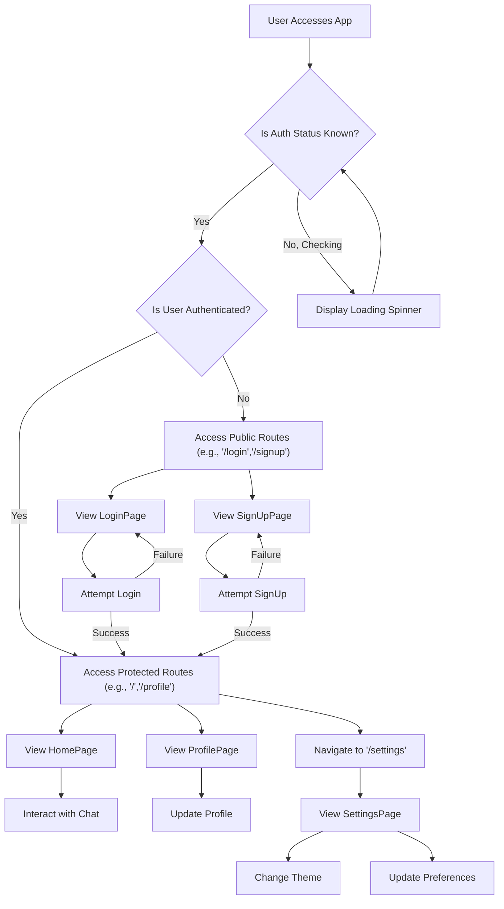
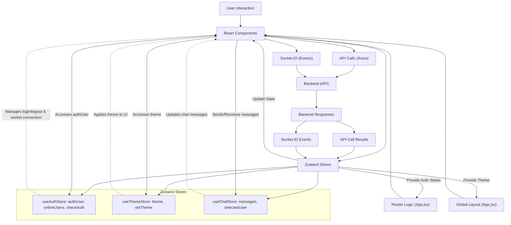

 # Frontend Implementation

The frontend of this application is a modern Single Page Application (SPA) built with React, leveraging a robust set of libraries and tools to provide a dynamic and responsive user experience. This document details the core technologies, project structure, key components, and the overall flow of the client-side application.

The frontend is responsible for user interaction, displaying data fetched from the backend, and managing client-side state. It adheres to a component-based architecture, promoting reusability and maintainability.

## Key Technologies and Dependencies

The client-side application is built upon a foundation of popular JavaScript libraries and tools, as defined in its `package.json` file. This setup ensures a performant development experience and a well-optimized production build.

```json
// frontend/package.json
{
  "name": "frontend",
  // ...
  "dependencies": {
    "axios": "^1.7.9",
    "lucide-react": "^0.471.1",
    "react": "^18.3.1",
    "react-dom": "^18.3.1",
    "react-hot-toast": "^2.5.1",
    "react-icons": "^5.5.0",
    "react-router-dom": "^7.1.1",
    "socket.io-client": "^4.8.1",
    "zustand": "^5.0.3"
  },
  "devDependencies": {
    "@vitejs/plugin-react": "^4.3.4",
    "autoprefixer": "^10.4.20",
    "daisyui": "^4.12.23",
    "postcss": "^8.5.0",
    "tailwindcss": "^3.4.17",
    "vite": "^6.3.5"
  }
}
```
[View `package.json` on GitHub](https://github.com/shinymack/Chat-App-MERN/blob/main/frontend/package.json)

Here's a breakdown of the core dependencies:

*   **React:** The primary JavaScript library for building user interfaces.
*   **React Router DOM:** Declarative routing for React applications, managing navigation between different pages.
*   **Zustand:** A fast, small, and scalable state-management solution for React.
*   **Axios:** A promise-based HTTP client for making API requests to the backend.
*   **Socket.IO Client:** Enables real-time, bidirectional, event-based communication between the browser and the server.
*   **DaisyUI & Tailwind CSS:** A component library and a utility-first CSS framework for rapid UI development and styling.
*   **Vite:** A next-generation frontend tooling that provides an extremely fast development server and optimized build process.

## Application Entry Point

The application starts its execution in `main.jsx`. This file is responsible for rendering the root React component, `App.jsx`, into the DOM, and setting up global configurations like routing.

```jsx
// frontend/src/main.jsx
import { StrictMode } from 'react'
import { createRoot } from 'react-dom/client'
import './index.css'
import App from './App.jsx'
import { BrowserRouter } from 'react-router-dom'

createRoot(document.getElementById('root')).render(
  <StrictMode>
    <BrowserRouter>
      <App />
    </BrowserRouter>
  </StrictMode>,
)
```
[View `main.jsx` on GitHub](https://github.com/shinymack/Chat-App-MERN/blob/main/frontend/src/main.jsx)

Key aspects of `main.jsx`:

*   **`StrictMode`**: React's StrictMode is a tool for highlighting potential problems in an application. It helps identify deprecated lifecycle methods, unexpected side effects, and more.
*   **`createRoot`**: This is the new root API in React 18, providing better performance and concurrent features.
*   **`BrowserRouter`**: Part of `react-router-dom`, this component enables client-side routing. It uses the HTML5 history API to keep the UI in sync with the URL.
*   **`App` Component**: The main application component where global state, routing logic, and layout are managed.

## Main Application Component (`App.jsx`)

The `App.jsx` file is the heart of the frontend application. It orchestrates global concerns such as authentication, theme management, and routing. It conditionally renders different pages based on the current URL and user's authentication status.

```jsx
// frontend/src/App.jsx
// ... imports
import Navbar from './components/Navbar'
import { Routes, Route, Navigate } from 'react-router-dom'
import { useEffect } from 'react'
import HomePage from './pages/HomePage'
import SignUpPage from './pages/SignUpPage'
import LoginPage from './pages/LoginPage'
import SettingsPage from './pages/SettingsPage'
import ProfilePage from './pages/ProfilePage'

import { useThemeStore } from './store/useThemeStore'
import { useAuthStore } from './store/useAuthStore';
import { Loader } from 'lucide-react'
import { Toaster } from 'react-hot-toast'

const App = () => {
  const { authUser, checkAuth, isCheckingAuth, onlineUsers } = useAuthStore();
  const { theme } = useThemeStore();

  useEffect(() => {
    checkAuth(); // Check authentication status on component mount
  }, [checkAuth]);

  if(isCheckingAuth && !authUser) return (
      <div className='flex items-center justify-center h-screen'>
        <Loader className='size-10 animate-spin' />
      </div>
  )

  return (
    <div className='' data-theme={theme}>
      <Navbar />
      <Toaster /> {/* Global toast notifications */}
      <Routes>
        <Route path='/' element={authUser ? <HomePage />: <Navigate to='/login' />} />
        <Route path='/signup' element={ !authUser ? <SignUpPage />: <Navigate to='/' />} />
        <Route path='/login' element={!authUser ? <LoginPage />: <Navigate to='/' />} />
        <Route path='/settings' element={<SettingsPage />} />
        <Route path='/profile' element={authUser ? <ProfilePage />: <Navigate to='/login' />} />
      </Routes>
    </div>
  )
}

export default App
```
[View `App.jsx` on GitHub](https://github.com/shinymack/Chat-App-MERN/blob/main/frontend/src/App.jsx)

### Key Features of `App.jsx`:

*   **Authentication Check**: On initial load, an `useEffect` hook calls `checkAuth()` from `useAuthStore` to verify the user's authentication status. This prevents unauthorized access to protected routes.
*   **Loading State**: While checking authentication, a loading spinner (`<Loader />`) is displayed, providing visual feedback to the user.
*   **Theme Management**: It consumes the `theme` state from `useThemeStore` and applies it to the root `div` using `data-theme`, enabling dynamic theme switching.
*   **Global Components**: The `Navbar` and `Toaster` (for notifications) are rendered globally, appearing on all pages.
*   **Routing Logic**: `react-router-dom`'s `Routes` and `Route` components define the application's navigation paths. Conditional rendering with `Navigate` ensures that users are redirected based on their authentication status (e.g., authenticated users are redirected from `/login` to `/`).

### Frontend Application Flow

The following diagram illustrates the high-level application flow, focusing on authentication and routing.





## Frontend Build Configuration

The frontend uses [Vite](https://vitejs.dev/) as its build tool, which offers a fast development experience and optimized production builds.

```jsx
// frontend/vite.config.js
import { defineConfig } from 'vite'
import react from '@vitejs/plugin-react'

// https://vitejs.dev/config/
export default defineConfig({
  plugins: [react()],
})
```
[View `vite.config.js` on GitHub](https://github.com/shinymack/Chat-App-MERN/blob/main/frontend/vite.config.js)

The `vite.config.js` file is minimal, primarily integrating `@vitejs/plugin-react` to support React applications. Vite handles most of the configuration automatically, providing features like hot module replacement (HMR), TypeScript support, and optimized asset bundling out-of-the-box.

## Key Integration Points

The frontend seamlessly integrates with the backend through several key mechanisms:

*   **RESTful APIs (Axios)**: The application uses `axios` to make HTTP requests (GET, POST, PUT, DELETE) to the backend for data operations such as user authentication, fetching chat messages, or updating user profiles.
*   **Real-time Communication (Socket.IO)**: For features like instant messaging, online user status, and real-time notifications, `socket.io-client` establishes a WebSocket connection with the backend. This enables a persistent, low-latency communication channel.
*   **State Management (Zustand)**: `Zustand` stores global application state, including user authentication status (`authUser`), theme preferences, and online user lists (`onlineUsers`). This centralized state is then consumed by various components as needed, ensuring data consistency across the application.
*   **Client-Side Routing (React Router DOM)**: Manages the navigation flow within the SPA, ensuring a smooth user experience without full page reloads. Protected routes are dynamically guarded based on the `authUser` state.

### Frontend Data Flow and Dependencies

This diagram illustrates how core frontend components and stores interact to manage data and user experience.





## Next Steps

With a solid understanding of the frontend's foundational technologies and structure, the next logical step is to dive into the specific UI components and how they are organized and styled within the application.

Next: [UI Components and Layout](./3.1_ui-components-and-layout.mdx)