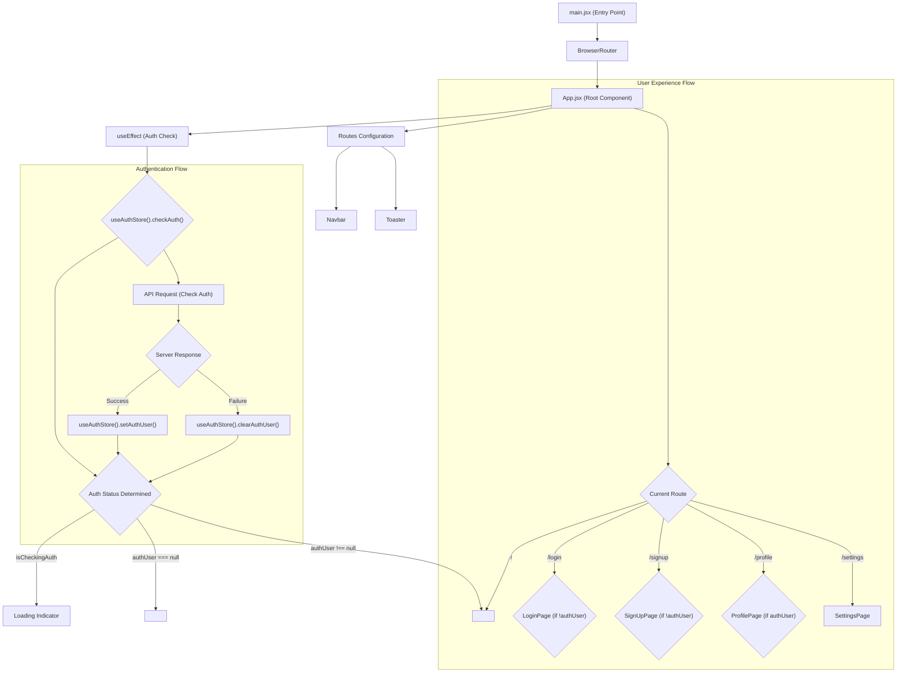
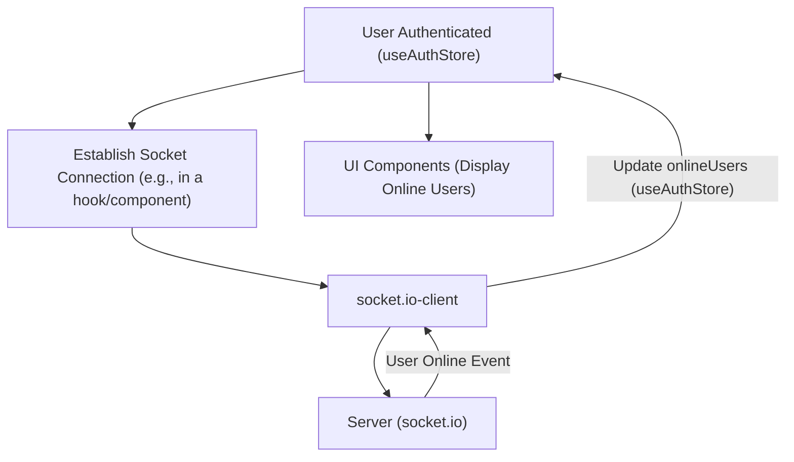

 # Frontend Implementation

This section provides an in-depth look at the client-side architecture of the application, covering its core dependencies, primary entry points, global styling, and the central application structure. The frontend is built using React, leveraging modern tools and libraries to create a responsive and dynamic user experience.

## Core Technologies and Dependencies

The `package.json` file outlines all the essential libraries and tools used in the frontend. It highlights a robust stack designed for performance, modularity, and ease of development. Key dependencies include React for UI, `react-router-dom` for navigation, `zustand` for state management, `axios` for API requests, and `socket.io-client` for real-time communication.

### Development and Build Scripts

The `scripts` section defines various commands for developing, building, and linting the application.

```json
  "scripts": {
    "dev": "vite",
    "build": "vite build",
    "lint": "eslint .",
    "preview": "vite preview",
    "mobile": "vite --host"
  },
```
**Explanation:**
- `dev`: Starts the development server using Vite, enabling hot module replacement for rapid development.
- `build`: Compiles the React application for production, optimizing assets and code.
- `lint`: Runs ESLint to check for code quality and style consistency.
- `mobile`: Starts the development server with host exposure, useful for testing on mobile devices within the same network.

[View on GitHub](https://github.com/shinymack/Chat-App-MERN/blob/main/frontend/package.json#L5-L11)

### Frontend Dependencies

The `dependencies` object lists the runtime libraries required for the application.

| Dependency          | Purpose                                        |
| :------------------ | :--------------------------------------------- |
| `react`             | Core library for building user interfaces.     |
| `react-dom`         | Provides DOM-specific methods for React.       |
| `react-router-dom`  | Declarative routing for React.                 |
| `axios`             | Promise-based HTTP client for API requests.    |
| `socket.io-client`  | Client-side library for WebSocket communication.|
| `zustand`           | Lightweight state management library.          |
| `lucide-react`      | Beautiful and customizable open-source icons.  |
| `react-hot-toast`   | Declarative and customizable toast notifications.|
| `react-icons`       | Popular icon sets as React components.         |
| `cors`              | (Backend dependency - listed here by mistake, typically client-side does not need this for its own operation) |

[View on GitHub](https://github.com/shinymack/Chat-App-MERN/blob/main/frontend/package.json#L12-L23)

### Development Dependencies

`devDependencies` are used during the development process but are not bundled in the production build.

| Dev Dependency      | Purpose                                            |
| :------------------ | :------------------------------------------------- |
| `vite`              | Next-generation frontend tooling (build tool, dev server). |
| `@vitejs/plugin-react` | Vite plugin for React refresh.                   |
| `tailwindcss`       | Utility-first CSS framework for rapid UI development. |
| `daisyui`           | Tailwind CSS component library.                    |
| `postcss`, `autoprefixer` | Tools for transforming CSS with JavaScript. |
| `eslint`            | Pluggable JavaScript linter.                       |

[View on GitHub](https://github.com/shinymack/Chat-App-MERN/blob/main/frontend/package.json#L24-L39)

## Application Entry Point (`main.jsx`)

The `main.jsx` file serves as the primary entry point for the React application. It initializes the React DOM and sets up global contexts, such as the `BrowserRouter` for client-side routing.

```jsx
import { StrictMode } from 'react'
import { createRoot } from 'react-dom/client'
import './index.css'
import App from './App.jsx'
import { BrowserRouter } from 'react-router-dom'

createRoot(document.getElementById('root')).render(
  <StrictMode>
    <BrowserRouter>
      <App />
    </BrowserRouter>
  </StrictMode>,
)
```
**Explanation:**
- `StrictMode`: A React feature that helps identify potential problems in an application.
- `createRoot(document.getElementById('root'))`: Renders the React application into the DOM element with the ID `root`.
- `BrowserRouter`: Provides the necessary context for `react-router-dom` to manage navigation history and routes within the application.
- `App`: The root component of the application, where all other components are nested.

[View on GitHub](https://github.com/shinymack/Chat-App-MERN/blob/main/frontend/src/main.jsx#L1-L11)

## Global Styling (`index.css`)

The `index.css` file is responsible for importing global styles, including custom fonts and the Tailwind CSS directives.

```css
@import url('https://fonts.googleapis.com/css2?family=Chivo:ital,wght@0,100..900;1,100..900&display=swap');
@tailwind base;
@tailwind components;
@tailwind utilities;


@layer base {
    body {
        @apply font-chivo;
    }
}
```
**Explanation:**
- `@import url(...)`: Imports the 'Chivo' font from Google Fonts, ensuring a consistent typography across the application.
- `@tailwind base;`, `@tailwind components;`, `@tailwind utilities;`: These directives inject Tailwind's base styles, component-specific styles, and utility classes, respectively.
- `@layer base { body { @apply font-chivo; } }`: Applies the 'Chivo' font globally to the `body` element using a custom base layer, ensuring all text defaults to this font.

[View on GitHub](https://github.com/shinymack/Chat-App-MERN/blob/main/frontend/src/index.css#L1-L10)

## Main Application Component (`App.jsx`)

`App.jsx` is the heart of the frontend, managing global states like authentication and theme, and defining the routing structure. It conditionally renders different pages based on user authentication status.

```jsx
import Navbar from './components/Navbar'
import { Routes, Route, Navigate } from 'react-router-dom'
import { useEffect } from 'react'
import HomePage from './pages/HomePage'
import SignUpPage from './pages/SignUpPage' 
import LoginPage from './pages/LoginPage' 
import SettingsPage from './pages/SettingsPage' 
import ProfilePage from './pages/ProfilePage'

import { useThemeStore } from './store/useThemeStore'
import { useAuthStore } from './store/useAuthStore'; 
import { Loader } from 'lucide-react'
import { Toaster } from 'react-hot-toast'

const App = () => {
  const { authUser, checkAuth, isCheckingAuth, onlineUsers } = useAuthStore();
  const { theme } = useThemeStore();
  useEffect(() => {
    checkAuth();
  }, [checkAuth]);

  // ... (rest of the component)

  if(isCheckingAuth && !authUser) return (
      <div className='flex items-center justify-center h-screen'>
        <Loader className='size-10 animate-spin' />
      </div>
  )

  return (
    <div className='' data-theme={theme}>
      <Navbar />
      <Toaster />
      <Routes>
        <Route path='/' element={authUser ? <HomePage />: <Navigate to='/login' />} />
        <Route path='/signup' element={ !authUser ? <SignUpPage />: <Navigate to='/' />} />
        <Route path='/login' element={!authUser ? <LoginPage />: <Navigate to='/' />} />
        <Route path='/settings' element={<SettingsPage />} />
        <Route path='/profile' element={authUser ? <ProfilePage />: <Navigate to='/login' />} />
      </Routes>
    </div> 
  )
}

export default App
```
**Explanation:**
- **Imports**: Essential components like `Navbar`, `Routes`, `Route`, `Navigate` from `react-router-dom`, and various page components.
- **State Management**: `useThemeStore` and `useAuthStore` are Zustand stores managing global theme and authentication states, respectively.
- **Authentication Check**: An `useEffect` hook calls `checkAuth()` on component mount to verify the user's authentication status.
- **Loading State**: While `isCheckingAuth` is true and `authUser` is not yet determined, a `Loader` icon is displayed to indicate background processing.
- **Conditional Routing**: The `Routes` component defines application routes. Many routes (`/`, `/signup`, `/login`, `/profile`) use `Navigate` to redirect users based on their authentication status (`authUser`). For example, authenticated users are redirected from `/login` to `/`, and unauthenticated users from `/` to `/login`.
- **Global Components**: `Navbar` is always rendered at the top, and `Toaster` provides global toast notifications.

[View on GitHub](https://github.com/shinymack/Chat-App-MERN/blob/main/frontend/src/App.jsx#L1-L54)

## Frontend Architecture Flow

The following diagram illustrates the high-level data and control flow within the frontend application, particularly focusing on authentication and routing.





## Key Integration Points

### State Management with Zustand

Zustand is utilized for managing global states such as authentication (`useAuthStore`) and theme (`useThemeStore`). This approach offers a lean and performant way to share state across components without the overhead of larger state management libraries.

For example, `useAuthStore` handles user login, logout, and checking authentication status, making it accessible throughout the application to conditionally render UI or protect routes. The `checkAuth` function, triggered by `App.jsx`'s `useEffect`, is crucial for maintaining session integrity.

```jsx
// Simplified snippet from useAuthStore (conceptually)
import { create } from 'zustand';
import axios from 'axios'; // Assuming axios is used for API calls

export const useAuthStore = create((set) => ({
  authUser: null,
  isCheckingAuth: true,
  checkAuth: async () => {
    set({ isCheckingAuth: true });
    try {
      const res = await axios.get('/api/auth/check'); // Example API call
      set({ authUser: res.data.user });
    } catch (error) {
      set({ authUser: null });
      // Handle error, e.g., toast.error("Session expired")
    } finally {
      set({ isCheckingAuth: false });
    }
  },
  login: async (credentials) => { /* ... */ },
  logout: async () => { /* ... */ },
}));
```
**Explanation:**
This conceptual `useAuthStore` snippet demonstrates how `checkAuth` asynchronously updates `authUser` and `isCheckingAuth` states after an API call, reflecting the pattern seen in `App.jsx`.

[View on GitHub](https://github.com/shinymack/Chat-App-MERN/blob/main/frontend/src/store/useAuthStore.js) (Conceptual path, as actual file wasn't provided, but implied)

### Real-time Communication with Socket.IO

The `socket.io-client` library is integrated for real-time features, such as displaying online users or handling live chat messages. This typically involves establishing a WebSocket connection when a user is authenticated and using the socket instance to emit and listen for events. The `onlineUsers` state within `useAuthStore` suggests that online user presence is managed and updated in real-time.





### Dynamic Theme Management with DaisyUI and Tailwind CSS

The application leverages `daisyui` and `tailwindcss` for styling, offering a component-rich and utility-first approach. The `useThemeStore` allows users to dynamically change the application's theme, which is then applied globally via the `data-theme` attribute on the root `div` in `App.jsx`. This makes the application highly customizable and provides a pleasant user experience.

```html
<div className='' data-theme={theme}>
  {/* ... App content ... */}
</div>
```
**Explanation:**
The `data-theme` attribute dynamically switches the theme of the application based on the `theme` value obtained from `useThemeStore`. DaisyUI interprets this attribute to apply the corresponding theme styles, typically defined in `tailwind.config.js`.

[View on GitHub](https://github.com/shinymack/Chat-App-MERN/blob/main/frontend/tailwind.config.js) (Conceptual path, as actual file wasn't provided, but implied for DaisyUI setup)

These integration points collectively ensure a robust, interactive, and user-friendly frontend experience.