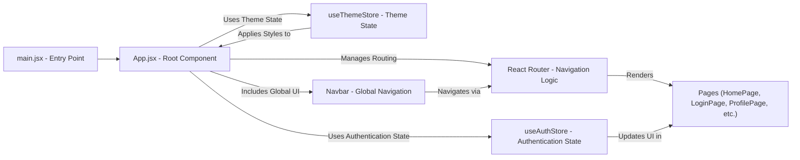
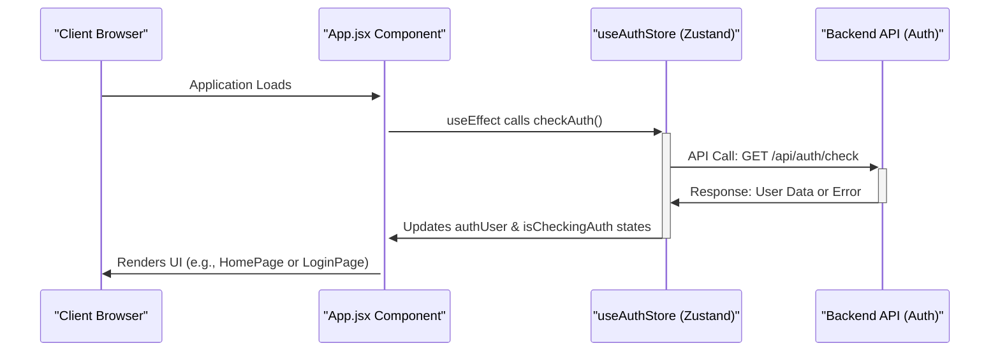

 # Frontend Implementation

The frontend of this application is a modern single-page application (SPA) built with React, leveraging Vite for a fast development experience. It provides the user interface, handles client-side routing, manages local state, and communicates with the backend API to deliver a dynamic and interactive user experience.

## Core Technologies

The `package.json` file outlines the key dependencies and scripts used in the frontend. This setup highlights a robust ecosystem for modern web development, focusing on performance, state management, and user interface design.

### Key Dependencies

| Category         | Package(s)                                                | Description                                                  |
| :--------------- | :-------------------------------------------------------- | :----------------------------------------------------------- |
| **Framework**    | `react`, `react-dom`                                      | Core libraries for building user interfaces.                 |
| **Routing**      | `react-router-dom`                                        | Declarative routing for React applications.                  |
| **State Mgmt.**  | `zustand`                                                 | A small, fast, and scalable bearbones state-management solution. |
| **Styling**      | `tailwindcss`, `postcss`, `autoprefixer`, `daisyui`     | Utility-first CSS framework with a component library on top of Tailwind. |
| **HTTP Client**  | `axios`                                                   | Promise-based HTTP client for the browser and Node.js.       |
| **Real-time**    | `socket.io-client`                                        | Client-side library for Socket.IO real-time communication.   |
| **Icons/UI**     | `lucide-react`, `react-icons`, `react-hot-toast`          | Icon libraries and a lightweight toast notification system.  |

```json
// frontend/package.json
{
  "name": "frontend",
  // ... other fields
  "scripts": {
    "dev": "vite",
    "build": "vite build",
    "lint": "eslint .",
    "preview": "vite preview",
    "mobile": "vite --host"
  },
  "dependencies": {
    "axios": "^1.7.9",
    "cors": "^2.8.5",
    "lucide-react": "^0.471.1",
    "react": "^18.3.1",
    "react-dom": "^18.3.1",
    "react-hot-toast": "^2.5.1",
    "react-icons": "^5.5.0",
    "react-router-dom": "^7.1.1",
    "socket.io-client": "^4.8.1",
    "zustand": "^5.0.3"
  },
  "devDependencies": {
    "@vitejs/plugin-react": "^4.3.4",
    "autoprefixer": "^10.4.20",
    "daisyui": "^4.12.23",
    "postcss": "^8.5.0",
    "tailwindcss": "^3.4.17",
    "vite": "^6.3.5"
  }
}
```
[View on GitHub](https://github.com/shinymack/Chat-App-MERN/blob/main/frontend/package.json)

## Application Entry Point (`main.jsx`)

The `main.jsx` file is the primary entry point for the React application. It initializes the React DOM, wraps the main `App` component with `BrowserRouter` for client-side routing, and ensures strict mode for identifying potential problems.

```jsx
// frontend/src/main.jsx
import { StrictMode } from 'react'
import { createRoot } from 'react-dom/client'
import './index.css'
import App from './App.jsx'
import { BrowserRouter } from 'react-router-dom'

createRoot(document.getElementById('root')).render(
  <StrictMode>
    <BrowserRouter>
      <App />
    </BrowserRouter>
  </StrictMode>,
)
```
[View on GitHub](https://github.com/shinymack/Chat-App-MERN/blob/main/frontend/src/main.jsx)

This setup ensures that all components within `App` have access to the routing context provided by `react-router-dom`.

## Main Application Component (`App.jsx`)

The `App.jsx` component serves as the root of the application's UI and logic. It handles global concerns such as routing, user authentication status, and theme management.

### Routing and Authentication

The `App` component dynamically renders different pages based on the current URL and the user's authentication status. It utilizes `react-router-dom` for defining routes and `zustand` for managing `authUser` and `isCheckingAuth` states. Unauthenticated users are redirected to the login or signup pages, while authenticated users access the main application features.

```jsx
// frontend/src/App.jsx
// ... imports
import { useAuthStore } from './store/useAuthStore'; 
import { Loader } from 'lucide-react'

const App = () => {
  const { authUser, checkAuth, isCheckingAuth, onlineUsers } = useAuthStore();
  const { theme } = useThemeStore();
  
  useEffect(() => {
    checkAuth();
  }, [checkAuth]);

  if(isCheckingAuth && !authUser) return (
      <div className='flex items-center justify-center h-screen'>
        <Loader className='size-10 animate-spin' />
      </div>
  )

  return (
    <div className='' data-theme={theme}>
      <Navbar />
      <Toaster />
      <Routes>
        <Route path='/' element={authUser ? <HomePage />: <Navigate to='/login' />} />
        <Route path='/signup' element={ !authUser ? <SignUpPage />: <Navigate to='/' />} />
        <Route path='/login' element={!authUser ? <LoginPage />: <Navigate to='/' />} />
        <Route path='/settings' element={<SettingsPage />} />
        <Route path='/profile' element={authUser ? <ProfilePage />: <Navigate to='/login' />} />
      </Routes>
    </div> 
  )
}
export default App
```
[View on GitHub](https://github.com/shinymack/Chat-App-MERN/blob/main/frontend/src/App.jsx#L18-L49)

### Initial Authentication Check

Upon application load, a `useEffect` hook in `App.jsx` triggers the `checkAuth` action from the `useAuthStore`. This action verifies the user's session with the backend, preventing immediate redirection for returning users. A `Loader` component is displayed during this check to provide visual feedback.

```jsx
// frontend/src/App.jsx
// ... imports
const App = () => {
  const { authUser, checkAuth, isCheckingAuth, onlineUsers } = useAuthStore();
  const { theme } = useThemeStore();
  useEffect(() => {
    checkAuth();
  }, [checkAuth]);

  if(isCheckingAuth && !authUser) return (
      <div className='flex items-center justify-center h-screen'>
        <Loader className='size-10 animate-spin' />
      </div>
  )
  // ... rest of the component
}
```
[View on GitHub](https://github.com/shinymack/Chat-App-MERN/blob/main/frontend/src/App.jsx#L18-L29)

### Theme Management

The `App` component also integrates theme management using `useThemeStore` and applies the selected theme to the root `div` element via the `data-theme` attribute, compatible with libraries like DaisyUI.

## Frontend Application Flow

This diagram illustrates the high-level flow and interaction between the main components of the frontend application.





## User Authentication Check Sequence

This sequence diagram details the process of checking a user's authentication status when the frontend application initially loads.





## Vite Configuration (`vite.config.js`)

Vite is used as the build tool for its speed and developer experience. The `vite.config.js` file is minimal, primarily enabling the React plugin.

```javascript
// frontend/vite.config.js
import { defineConfig } from 'vite'
import react from '@vitejs/plugin-react'

// https://vitejs.dev/config/
export default defineConfig({
  plugins: [react()],
})
```
[View on GitHub](https://github.com/shinymack/Chat-App-MERN/blob/main/frontend/vite.config.js)

This configuration enables fast refresh for React components and optimizes the build process for production.

## Key Integration Points

### Centralized State Management

The frontend uses `zustand` for managing global application state, specifically for authentication (`useAuthStore`) and theme settings (`useThemeStore`). This pattern ensures a single source of truth for critical application data, making it easier to manage and debug. Components across the application can subscribe to these stores and reactively update when the state changes. For instance, `App.jsx` uses `useAuthStore` to determine which routes to render, and `Navbar` or `SettingsPage` might use `useThemeStore` to apply UI changes.

### Declarative Routing with React Router DOM

`react-router-dom` is fundamental for navigating between different views without full page reloads. The `App.jsx` defines a clear set of routes, with conditional `Navigate` components that enforce authentication requirements. This approach creates a smooth user experience and separates the concerns of URL management from component rendering. The flexible nature of `react-router-dom` allows for nested routes and dynamic path parameters, though this application primarily uses simple, top-level routes.

### Real-time Communication via Socket.IO

While not explicitly detailed in the provided `App.jsx` snippets, the presence of `socket.io-client` in `package.json` indicates that the frontend is designed for real-time interactions. This typically involves establishing a persistent connection to the backend, enabling features like instant messaging, live updates, or online user presence. The `onlineUsers` state in `useAuthStore` suggests that `socket.io-client` would be used to keep track of currently active users, enhancing the chat application's interactivity.

### UI/UX Enhancements

The combination of `tailwindcss` and `daisyui` provides a powerful utility-first CSS framework alongside a set of pre-built, customizable UI components. This accelerates development and ensures a consistent design language. `react-hot-toast` is integrated for unobtrusive notifications, providing immediate feedback to users for actions like login success or error messages, contributing to a polished user experience.