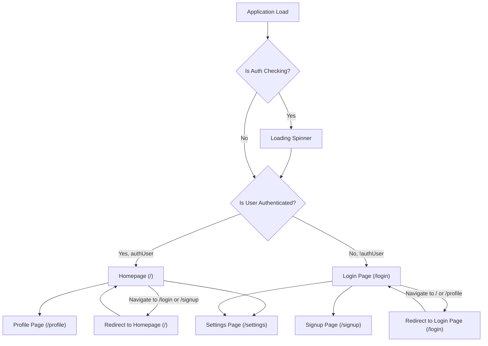
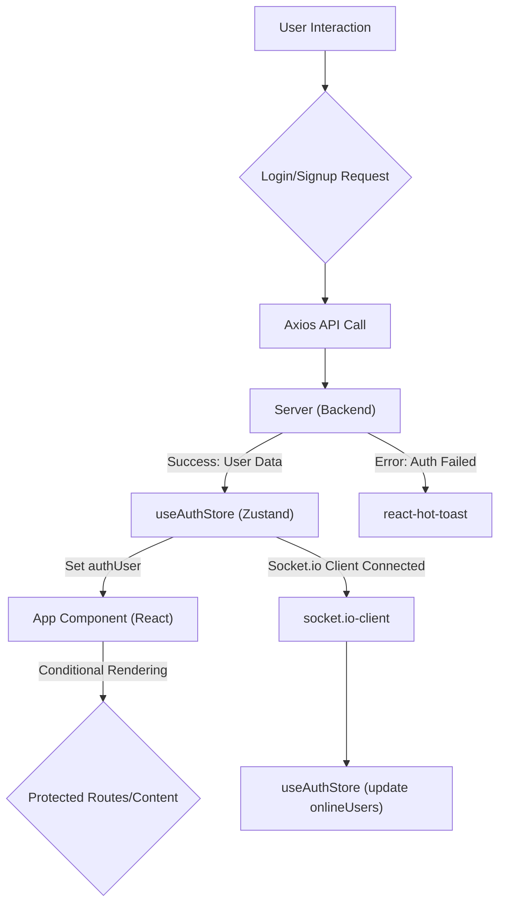

 # Frontend Implementation

The frontend of this application is built using React, leveraging modern web development practices to deliver a responsive and interactive user experience. It encompasses a well-defined architecture for routing, state management, and component organization, ensuring maintainability and scalability.

This document details the core components, dependencies, and architectural decisions that underpin the client-side functionality.

## Core Technologies and Dependencies

The `package.json` file provides a comprehensive overview of the technologies used in the frontend. Key dependencies include React for UI, `react-router-dom` for navigation, `zustand` for state management, and `axios` for API interactions.

```json
// frontend/package.json
{
  "name": "frontend",
  "private": true,
  "version": "0.0.0",
  "type": "module",
  "scripts": {
    "dev": "vite",
    "build": "vite build",
    "lint": "eslint .",
    "preview": "vite preview",
    "mobile": "vite --host"
  },
  "dependencies": {
    "axios": "^1.7.9",
    "cors": "^2.8.5",
    "lucide-react": "^0.471.1",
    "react": "^18.3.1",
    "react-dom": "^18.3.1",
    "react-hot-toast": "^2.5.1",
    "react-icons": "^5.5.0",
    "react-router-dom": "^7.1.1",
    "socket.io-client": "^4.8.1",
    "zustand": "^5.0.3"
  },
  "devDependencies": {
    "@eslint/js": "^9.17.0",
    "@types/react": "^18.3.18",
    "@types/react-dom": "^18.3.5",
    "@vitejs/plugin-react": "^4.3.4",
    "autoprefixer": "^10.4.20",
    "daisyui": "^4.12.23",
    "eslint": "^9.17.0",
    "eslint-plugin-react": "^7.37.2",
    "eslint-plugin-react-hooks": "^5.0.0",
    "eslint-plugin-react-refresh": "^0.4.16",
    "globals": "^15.14.0",
    "postcss": "^8.5.0",
    "tailwindcss": "^3.4.17",
    "vite": "^6.3.5"
  }
}
```
[View on GitHub](https://github.com/shinymack/Chat-App-MERN/blob/main/frontend/package.json)

The `dependencies` section highlights crucial libraries:
*   **`react` and `react-dom`**: The core libraries for building user interfaces.
*   **`react-router-dom`**: Essential for declarative routing within the single-page application.
*   **`zustand`**: A lightweight, fast, and scalable state management solution.
*   **`axios`**: A promise-based HTTP client for making API requests.
*   **`socket.io-client`**: Enables real-time, bidirectional event-based communication.
*   **`lucide-react` and `react-icons`**: Icon libraries for consistent UI elements.
*   **`react-hot-toast`**: A library for displaying elegant and accessible notifications.
*   **`daisyui` and `tailwindcss`**: UI component library and a utility-first CSS framework for styling.

The `devDependencies` section lists tools used during development, such as `vite` for fast build and development, `eslint` for code linting, and `autoprefixer`/`postcss` for CSS processing.

## Application Entry Point and Root Setup

The application's entry point is `frontend/src/main.jsx`, which is responsible for rendering the root React component (`App`) into the DOM. It wraps the `App` component within `BrowserRouter` from `react-router-dom` to enable client-side routing and `StrictMode` for highlighting potential problems in an application.

```jsx
// frontend/src/main.jsx
import { StrictMode } from 'react'
import { createRoot } from 'react-dom/client'
import './index.css'
import App from './App.jsx'
import { BrowserRouter } from 'react-router-dom'

createRoot(document.getElementById('root')).render(
  <StrictMode>
    <BrowserRouter>
      <App />
    </BrowserRouter>
  </StrictMode>,
)
```
[View on GitHub](https://github.com/shinymack/Chat-App-MERN/blob/main/frontend/src/main.jsx)

This setup ensures that all components within `App` and its children have access to the routing context.

## Main Application Component (`App.jsx`)

The `App.jsx` component serves as the central hub for the frontend application. It orchestrates global elements like the `Navbar`, `Toaster` notifications, and defines the primary routing logic. It also integrates global state management from Zustand for authentication and theme settings.

```jsx
// frontend/src/App.jsx
// import React from 'react' // Not needed in newer React versions for JSX
import Navbar from './components/Navbar'
import { Routes, Route, Navigate } from 'react-router-dom'
import { useEffect } from 'react'
import HomePage from './pages/HomePage'
import SignUpPage from './pages/SignUpPage'
import LoginPage from './pages/LoginPage'
import SettingsPage from './pages/SettingsPage'
import ProfilePage from './pages/ProfilePage'

import { useThemeStore } from './store/useThemeStore'
import { useAuthStore } from './store/useAuthStore';
import { Loader } from 'lucide-react'
import { Toaster } from 'react-hot-toast'

const App = () => {
  const { authUser, checkAuth, isCheckingAuth, onlineUsers } = useAuthStore();
  const { theme } = useThemeStore();
  useEffect(() => {
    checkAuth();
  }, [checkAuth]);

  console.log("authUser: ", {authUser});

  console.log({onlineUsers})

  if(isCheckingAuth && !authUser) return (
      <div className='flex items-center justify-center h-screen'>
        <Loader className='size-10 animate-spin' />
      </div>
  )

  return (
    <div className='' data-theme={theme}>

      <Navbar />

      <Toaster />
      <Routes>
        <Route path='/' element={authUser ? <HomePage />: <Navigate to='/login' />} />
        <Route path='/signup' element={ !authUser ? <SignUpPage />: <Navigate to='/' />} />
        <Route path='/login' element={!authUser ? <LoginPage />: <Navigate to='/' />} />
        <Route path='/settings' element={<SettingsPage />} />
        <Route path='/profile' element={authUser ? <ProfilePage />: <Navigate to='/login' />} />

      </Routes>

    </div>
  )
}

export default App
```
[View on GitHub](https://github.com/shinymack/Chat-App-MERN/blob/main/frontend/src/App.jsx)

### Authentication Flow and Routing

The `App` component plays a critical role in managing user authentication and redirecting users based on their login status.

```jsx
// frontend/src/App.jsx - Excerpt for authentication logic
const App = () => {
  const { authUser, checkAuth, isCheckingAuth, onlineUsers } = useAuthStore();
  const { theme } = useThemeStore();
  useEffect(() => {
    checkAuth();
  }, [checkAuth]);

  if(isCheckingAuth && !authUser) return (
      <div className='flex items-center justify-center h-screen'>
        <Loader className='size-10 animate-spin' />
      </div>
  )

  return (
    <div className='' data-theme={theme}>
      {/* ... other components ... */}
      <Routes>
        <Route path='/' element={authUser ? <HomePage />: <Navigate to='/login' />} />
        <Route path='/signup' element={ !authUser ? <SignUpPage />: <Navigate to='/' />} />
        <Route path='/login' element={!authUser ? <LoginPage />: <Navigate to='/' />} />
        <Route path='/settings' element={<SettingsPage />} />
        <Route path='/profile' element={authUser ? <ProfilePage />: <Navigate to='/login' />} />
      </Routes>
    </div>
  )
}
```

The `useEffect` hook calls `checkAuth()` from the `useAuthStore` to verify the user's authentication status upon component mount. While authentication is being checked (`isCheckingAuth` is true), a loading spinner is displayed. Once the status is determined, the `Routes` component conditionally renders pages:
*   Authenticated users are directed to `HomePage` from `/` and `ProfilePage` from `/profile`. If they try to access `/login` or `/signup`, they are redirected to `/`.
*   Unauthenticated users are directed to `LoginPage` from `/` and `ProfilePage`, and can access `SignUpPage` and `LoginPage`. Trying to access `/` or `/profile` redirects them to `/login`.
*   The `/settings` page is accessible regardless of authentication status, though its content might be restricted internally.

### Frontend Routing Diagram

This diagram illustrates the primary routing flow within the application, showing how users navigate between authenticated and unauthenticated states.





## State Management with Zustand

Zustand is employed for efficient and scalable state management. The `useAuthStore` and `useThemeStore` hooks, for instance, centralize authentication and theme-related states, making them easily accessible across the component tree without prop-drilling.

```jsx
// frontend/src/App.jsx - Excerpt for Zustand integration
import { useThemeStore } from './store/useThemeStore'
import { useAuthStore } from './store/useAuthStore';

const App = () => {
  const { authUser, checkAuth, isCheckingAuth, onlineUsers } = useAuthStore();
  const { theme } = useThemeStore();
  // ...
}
```
[View on GitHub](https://github.com/shinymack/Chat-App-MERN/blob/main/frontend/src/App.jsx#L19-L20)

`useAuthStore` manages the `authUser` object, `isCheckingAuth` status, and `onlineUsers` list, which is crucial for real-time features. `useThemeStore` manages the `theme` preference, allowing dynamic theme changes across the application.

## Vite Configuration

The `vite.config.js` file is minimal, indicating a standard React project setup with Vite. The `vitejs/plugin-react` provides Fast Refresh and other React-specific optimizations.

```javascript
// frontend/vite.config.js
import { defineConfig } from 'vite'
import react from '@vitejs/plugin-react'

// https://vitejs.dev/config/
export default defineConfig({
  plugins: [react()],
})
```
[View on GitHub](https://github.com/shinymack/Chat-App-MERN/blob/main/frontend/vite.config.js)

## Key Integration Points

### User Authentication and Global State

The frontend heavily relies on `useAuthStore` to manage the user's authentication state. This store is initialized early in the `App.jsx` lifecycle using `useEffect` to call `checkAuth()`. The `authUser` object determines access to protected routes and content, while `isCheckingAuth` ensures a smooth loading experience.





### Real-time Features with Socket.io-client

While not explicitly shown in `App.jsx`, `socket.io-client` is listed as a dependency, indicating that the frontend integrates with a WebSocket server for real-time functionalities. This would typically involve:
1.  **Connecting to the socket server**: Establishing a connection, often tied to authentication status.
2.  **Listening for events**: Receiving real-time updates for messages, user status, notifications, etc.
3.  **Emitting events**: Sending data to the server, e.g., sending a new message.

This real-time communication often integrates with `useAuthStore` to update `onlineUsers` or other chat-related states, providing an interactive and live experience.