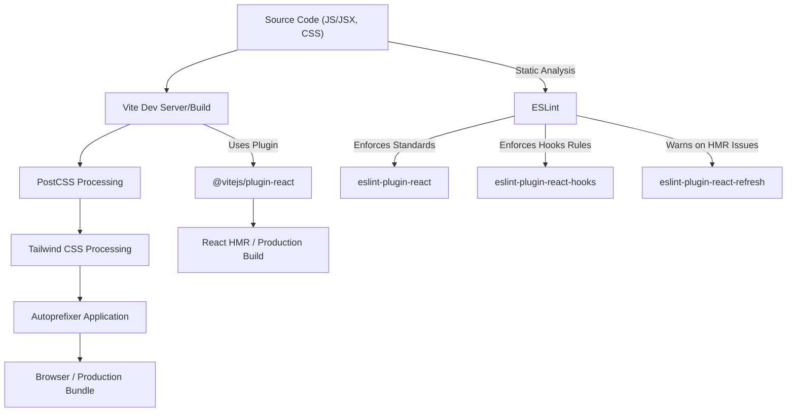
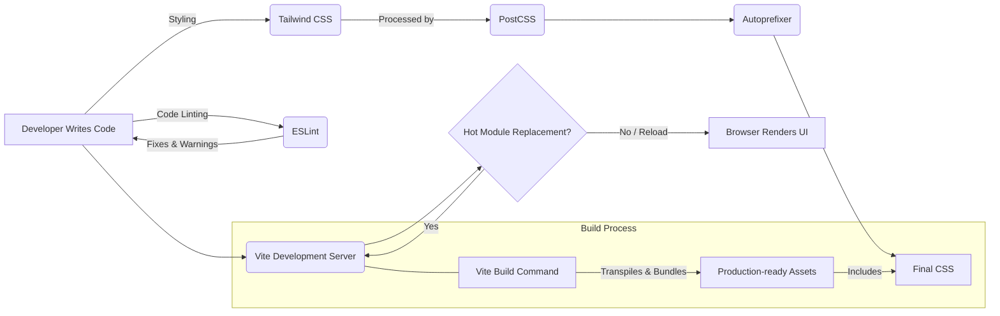

 ```md
---
title: "Development and Configuration"
description: "Provides information on environment setup, build tools, and project configuration for both backend and frontend."
---

# Development and Configuration

This document outlines the essential development and configuration aspects for the project, focusing on the frontend environment setup, build processes, and code quality tools. Understanding these configurations is crucial for maintaining, extending, and developing new features efficiently. We cover key files responsible for compiling, styling, and enforcing coding standards within the `frontend` directory.

## Frontend Environment Setup

The frontend ecosystem leverages modern tools to ensure a robust and efficient development workflow. This section delves into the core configuration files that define how the frontend application is built, styled, and maintained.

### Vite Configuration (`frontend/vite.config.js`)

Vite is a next-generation frontend tooling that provides an extremely fast development server and bundles your code for production. Its configuration is minimal yet powerful, primarily focusing on enabling React support through a dedicated plugin.

The `vite.config.js` file is the heart of the frontend build process, defining how source files are processed and bundled.

```javascript
// frontend/vite.config.js
import { defineConfig } from 'vite'
import react from '@vitejs/plugin-react'

// https://vitejs.dev/config/
export default defineConfig({
  plugins: [react()],
})
```
[View on GitHub](https://github.com/shinymack/Chat-App-MERN/blob/main/frontend/vite.config.js)

**Explanation:**

*   `defineConfig`: A helper function from Vite that provides type intelisense for the configuration object.
*   `plugins: [react()]`: This line is critical. It includes `@vitejs/plugin-react`, which provides fast refresh support for React components, enabling hot module replacement (HMR) during development without losing component state. This significantly speeds up the development feedback loop.

### PostCSS Configuration (`frontend/postcss.config.js`)

PostCSS is a tool for transforming CSS with JavaScript. In this project, it's used to integrate Tailwind CSS and Autoprefixer seamlessly into the build process.

```javascript
// frontend/postcss.config.js
export default {
  plugins: {
    tailwindcss: {},
    autoprefixer: {},
  },
}
```
[View on GitHub](https://github.com/shinymack/Chat-App-MERN/blob/main/frontend/postcss.config.js)

**Explanation:**

*   `tailwindcss: {}`: This plugin processes your CSS to convert Tailwind directives and classes into actual CSS rules based on your `tailwind.config.js`. It's essential for Tailwind to function correctly.
*   `autoprefixer: {}`: Automatically adds vendor prefixes to CSS rules, ensuring cross-browser compatibility for modern CSS features without manual intervention.

### Tailwind CSS Configuration (`frontend/tailwind.config.js`)

Tailwind CSS is a utility-first CSS framework for rapidly building custom user interfaces. The `tailwind.config.js` file allows for extensive customization of Tailwind's default utility classes and integration of additional plugins.

```javascript
// frontend/tailwind.config.js
import daisyui from "daisyui"

/** @type {import('tailwindcss').Config} */
export default {
  content: [
    "./index.html",
    "./src/**/*.{js,ts,jsx,tsx}",
  ],
  theme: {
    extend: {
      fontFamily : {
        chivo : ['Chivo', 'sans-serif'],
      }
    },
  },
  plugins: [daisyui],
  daisyui : {
 themes: [
      "light",
      "dark",
      "cupcake",
      "bumblebee",
      "emerald",
      "corporate",
      "synthwave",
      "retro",
      "cyberpunk",
      "valentine",
      "halloween",
      "garden",
      "forest",
      "aqua",
      "lofi",
      "pastel",
      "fantasy",
      "wireframe",
      "black",
      "luxury",
      "dracula",
      "cmyk",
      "autumn",
      "business",
      "acid",
      "lemonade",
      "night",
      "coffee",
      "winter",
      "dim",
      "nord",
      "sunset",
    ],
  }
}
```
[View on GitHub](https://github.com/shinymack/Chat-App-MERN/blob/main/frontend/tailwind.config.js)

**Explanation:**

*   `content`: Specifies the files that Tailwind should scan for utility classes. This is crucial for Tailwind's tree-shaking feature, which only includes used classes in the final CSS bundle, leading to smaller file sizes.
*   `theme.extend`: Allows extending Tailwind's default theme. Here, a custom font family "chivo" is added, making it available as `font-chivo`.
*   `plugins: [daisyui]`: Integrates `daisyUI`, a Tailwind CSS component library. DaisyUI provides pre-built UI components and themes, significantly accelerating UI development.
*   `daisyui.themes`: Lists all the themes available through `daisyUI`. This project enables a wide array of themes, allowing for easy switching between different visual styles for the application. Themes like "light", "dark", "corporate", "halloween", and many more are included, offering flexibility for different user preferences or brand identities.

### ESLint Configuration (`frontend/eslint.config.js`)

ESLint is a static code analysis tool used to identify problematic patterns found in JavaScript code. The `eslint.config.js` file defines the rules and plugins that ensure code quality, consistency, and adherence to best practices, especially for React applications.

```javascript
// frontend/eslint.config.js
import js from '@eslint/js'
import globals from 'globals'
import react from 'eslint-plugin-react'
import reactHooks from 'eslint-plugin-react-hooks'
import reactRefresh from 'eslint-plugin-react-refresh'

export default [
  { ignores: ['dist'] },
  {
    files: ['**/*.{js,jsx}'],
    languageOptions: {
      ecmaVersion: 2020,
      globals: globals.browser,
      parserOptions: {
        ecmaVersion: 'latest',
        ecmaFeatures: { jsx: true },
        sourceType: 'module',
      },
    },
    settings: { react: { version: '18.3' } },
    plugins: {
      react,
      'react-hooks': reactHooks,
      'react-refresh': reactRefresh,
    },
    rules: {
      ...js.configs.recommended.rules,
      ...react.configs.recommended.rules,
      ...react.configs['jsx-runtime'].rules,
      ...reactHooks.configs.recommended.rules,
      'react/jsx-no-target-blank': 'off',
      'react-refresh/only-export-components': [
        'warn',
        { allowConstantExport: true },
      ],
      "react/prop-types" : "off",
    },
  },
]
```
[View on GitHub](https://github.com/shinymack/Chat-App-MERN/blob/main/frontend/eslint.config.js)

**Explanation:**

*   **`ignores: ['dist']`**: Prevents ESLint from linting files within the `dist` directory, which typically contains build outputs and should not be manually edited or linted.
*   **`files: ['**/*.{js,jsx}']`**: Specifies that these ESLint configurations apply to all `.js` and `.jsx` files within the project.
*   **`languageOptions`**:
    *   `ecmaVersion: 2020`: Configures ESLint to support ECMAScript 2020 syntax.
    *   `globals: globals.browser`: Defines browser global variables (e.g., `window`, `document`) as available, preventing ESLint from flagging them as undefined.
    *   `parserOptions`:
        *   `ecmaVersion: 'latest'`: Enables the latest ECMAScript features for parsing.
        *   `ecmaFeatures: { jsx: true }`: Enables JSX parsing.
        *   `sourceType: 'module'`: Indicates that the code uses ECMAScript modules (import/export syntax).
*   **`settings: { react: { version: '18.3' } }`**: Informs ESLint about the installed React version, allowing React-specific plugins to function correctly.
*   **`plugins`**:
    *   `react`: Provides rules for React best practices and common pitfalls.
    *   `react-hooks`: Enforces rules of hooks, ensuring they are used correctly (e.g., `useState`, `useEffect`).
    *   `react-refresh`: Works in conjunction with Vite's React plugin to ensure proper hot module reloading behavior.
*   **`rules`**:
    *   `...js.configs.recommended.rules`: Includes recommended rules from `@eslint/js` for general JavaScript best practices.
    *   `...react.configs.recommended.rules`: Includes recommended rules for React components.
    *   `...react.configs['jsx-runtime'].rules`: Adds rules specific to the new JSX runtime introduced in React 17.
    *   `...reactHooks.configs.recommended.rules`: Adds recommended rules for React Hooks.
    *   `'react/jsx-no-target-blank': 'off'`: Disables the rule that flags `target="_blank"` without `rel="noopener noreferrer"`. This might be turned off for specific use cases or handled differently.
    *   `'react-refresh/only-export-components'`: Configures a warning for components that are not exported, which can affect hot module reloading. `allowConstantExport: true` permits constant exports.
    *   `"react/prop-types" : "off"`: Disables prop-types validation, common in projects using TypeScript or relying on other forms of component validation.

## Build and Linting Flow

The following diagram illustrates the general flow of how frontend files are processed from development to linting and building.





## Key Integration Points

### Frontend Tooling Pipeline

The frontend development and build process are tightly integrated, ensuring a smooth workflow from writing code to deploying the application.





### Configuration Synergies

*   **Vite and ESLint**: While Vite handles the build and dev server, ESLint focuses on code quality. The `eslint-plugin-react-refresh` ensures that ESLint's checks are compatible with Vite's Hot Module Replacement (HMR) for React.
*   **Tailwind CSS and PostCSS**: `tailwind.config.js` defines the styling rules and themes, which are then processed by `postcss.config.js` using the Tailwind CSS plugin. Autoprefixer ensures broad browser compatibility for the generated CSS.
*   **React Plugins**: The `react()` plugin in `vite.config.js` and the `eslint-plugin-react` and `eslint-plugin-react-hooks` in `eslint.config.js` work together to provide a robust environment for React development, covering both performance (HMR) and code quality.

These configurations together establish a modern, efficient, and maintainable frontend development environment. Understanding each file's role is key to effective development and troubleshooting.
```