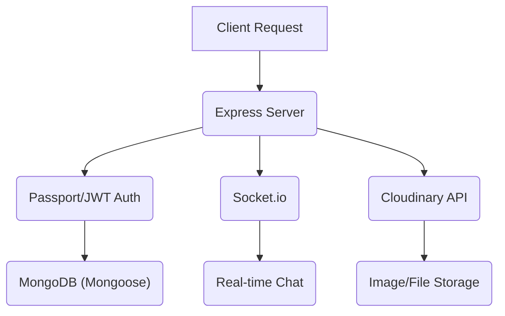
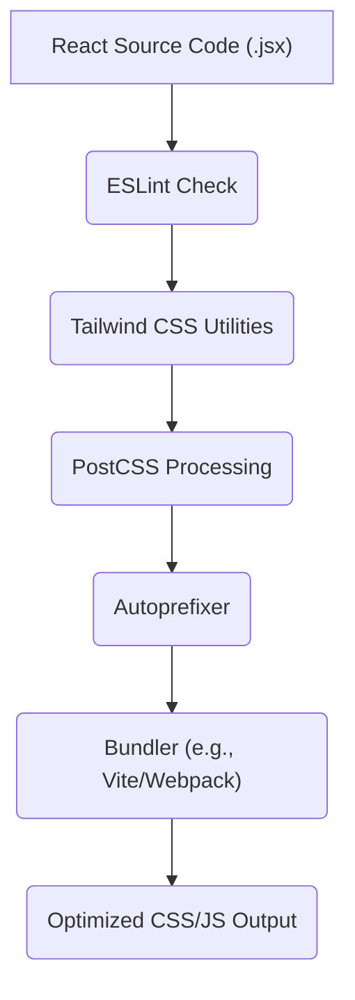

 
---
title: "Development and Configuration"
description: "Information regarding development setup, tooling, and configuration files for both frontend and backend."
---

# Development and Configuration

This document provides a comprehensive guide to setting up and understanding the development environment for both the frontend and backend components of the application. It covers essential configuration files, tooling, and scripts necessary for local development, deployment, and maintaining code quality.

Understanding these configurations is crucial for new contributors to quickly get started, troubleshoot issues, and ensure consistency across the development lifecycle. We'll explore the core dependencies, build processes, and styling conventions adopted by the project.

## Backend Development and Dependencies

The backend is built using Node.js and Express, leveraging a variety of powerful libraries to handle different aspects of the application, including database interaction, authentication, real-time communication, and media management. The `backend/package.json` file serves as the central manifest for project metadata, scripts, and dependencies.

### Key Backend Dependencies

The `dependencies` section within `package.json` outlines all third-party libraries required for the application to run in production.

*   **`express`**: A fast, unopinionated, minimalist web framework for Node.js, forming the backbone of the API.
*   **`mongoose`**: An elegant MongoDB object modeling tool designed to work in an asynchronous environment, used for database interactions.
*   **`socket.io`**: A library that enables real-time, bidirectional, event-based communication between the client and server, essential for chat functionality.
*   **`jsonwebtoken`**: An implementation of JSON Web Tokens for authentication, enabling secure transmission of information between parties.
*   **`bcryptjs`**: A library for hashing passwords, providing strong security against unauthorized access.
*   **`cloudinary`**: Used for cloud-based image and video management, allowing for storage, transformation, and delivery of user-uploaded content.
*   **`cookie-parser`**: Parses Cookie header and populates `req.cookies` with an object keyed by the cookie names.
*   **`dotenv`**: Loads environment variables from a `.env` file, keeping sensitive configurations out of the codebase.
*   **`express-session`**: A middleware for handling sessions in Express, often used with authentication strategies.
*   **`passport` & `passport-google-oauth20`**: Authentication middleware for Node.js. `passport-google-oauth20` specifically enables authentication via Google.

The `devDependencies` section lists packages required only during development, such as `nodemon`, which automatically restarts the Node.js application when file changes are detected.

### Backend Scripts

The `scripts` section defines commands that can be executed using `npm run <script-name>`.

*   **`dev`**: `nodemon src/index.js`
    This script starts the backend server in development mode using `nodemon`. `nodemon` monitors for any changes in your source files and automatically restarts the server, significantly speeding up the development feedback loop.
*   **`start`**: `node src/index.js`
    This script is used to start the backend server in a production environment. It simply executes the main `index.js` file using Node.js.

```json
// backend/package.json
{
  "name": "backend",
  "version": "1.0.0",
  "main": "src/index.js",
  "scripts": {
    "dev": "nodemon src/index.js",
    "start": "node src/index.js"
  },
  "dependencies": {
    "bcryptjs": "^2.4.3",
    "cloudinary": "^2.5.1",
    "cookie-parser": "^1.4.7",
    "dotenv": "^16.4.7",
    "express": "^4.21.2",
    "express-session": "^1.18.1",
    "jsonwebtoken": "^9.0.2",
    "mongoose": "^8.9.5",
    "passport": "^0.7.0",
    "passport-google-oauth20": "^2.0.0",
    "socket.io": "^4.8.1"
  },
  "devDependencies": {
    "nodemon": "^3.1.9"
  }
}
```
[View `package.json` on GitHub](https://github.com/shinymack/Chat-App-MERN/blob/main/backend/package.json)

Here's a diagram illustrating the backend's core components and their interactions:





## Frontend Development and Tooling

The frontend of the application is built with React, utilizing a modern development setup that prioritizes code quality, maintainability, and a responsive user experience. Key configurations for linting, styling, and bundling are detailed below.

### ESLint Configuration

The `frontend/eslint.config.js` file configures ESLint, a popular linter, to enforce coding standards and identify potential issues in JavaScript and JSX files. This ensures code consistency and helps prevent common errors.

*   **`ignores: ['dist']`**: Specifies files or directories that ESLint should ignore during linting, typically build output.
*   **`files: ['**/*.{js,jsx}']`**: Defines which files this configuration applies to.
*   **`languageOptions`**: Configures JavaScript parsing options, including `ecmaVersion`, `globals` (e.g., `browser` environment), and `parserOptions` for JSX and module support.
*   **`settings: { react: { version: '18.3' } }`**: Informs ESLint of the React version being used for plugin compatibility.
*   **`plugins`**: Integrates specific ESLint plugins for React, React Hooks, and React Refresh.
*   **`rules`**: Overrides or extends default ESLint rules.
    *   `...js.configs.recommended.rules`: Includes recommended rules from the core ESLint configuration.
    *   `...react.configs.recommended.rules`: Integrates recommended rules from `eslint-plugin-react`.
    *   `...react.configs['jsx-runtime'].rules`: Specific rules for React's new JSX transform.
    *   `...reactHooks.configs.recommended.rules`: Rules for ensuring correct usage of React Hooks.
    *   `'react/jsx-no-target-blank': 'off'`: Disables a rule that warns about `target="_blank"` without `rel="noopener noreferrer"`.
    *   `'react-refresh/only-export-components'`: Warns if components are not exported directly, with an allowance for constant exports.
    *   `"react/prop-types" : "off"`: Disables the `prop-types` validation rule, often done when using TypeScript or preferring other validation methods.

```javascript
// frontend/eslint.config.js
import js from '@eslint/js'
import globals from 'globals'
import react from 'eslint-plugin-react'
import reactHooks from 'eslint-plugin-react-hooks'
import reactRefresh from 'eslint-plugin-react-refresh'

export default [
  { ignores: ['dist'] },
  {
    files: ['**/*.{js,jsx}'],
    languageOptions: {
      ecmaVersion: 2020,
      globals: globals.browser,
      parserOptions: {
        ecmaVersion: 'latest',
        ecmaFeatures: { jsx: true },
        sourceType: 'module',
      },
    },
    settings: { react: { version: '18.3' } },
    plugins: {
      react,
      'react-hooks': reactHooks,
      'react-refresh': reactRefresh,
    },
    rules: {
      ...js.configs.recommended.rules,
      ...react.configs.recommended.rules,
      ...react.configs['jsx-runtime'].rules,
      ...reactHooks.configs.recommended.rules,
      'react/jsx-no-target-blank': 'off',
      'react-refresh/only-export-components': [
        'warn',
        { allowConstantExport: true },
      ],
      "react/prop-types" : "off",
    },
  },
]
```
[View `eslint.config.js` on GitHub](https://github.com/shinymack/Chat-App-MERN/blob/main/frontend/eslint.config.js)

### PostCSS Configuration

`frontend/postcss.config.js` is a simple configuration file for PostCSS, a tool for transforming CSS with JavaScript. It's primarily used here to integrate Tailwind CSS and Autoprefixer.

*   **`tailwindcss: {}`**: Integrates Tailwind CSS, allowing the use of utility-first CSS classes directly in markup.
*   **`autoprefixer: {}`**: Automatically adds vendor prefixes to CSS rules, ensuring cross-browser compatibility.

```javascript
// frontend/postcss.config.js
export default {
  plugins: {
    tailwindcss: {},
    autoprefixer: {},
  },
}
```
[View `postcss.config.js` on GitHub](https://github.com/shinymack/Chat-App-MERN/blob/main/frontend/postcss.config.js)

### Tailwind CSS Configuration

The `frontend/tailwind.config.js` file is the heart of the frontend's styling system. It customizes Tailwind CSS and integrates DaisyUI, a component library built on Tailwind.

*   **`content`**: An array of file paths where Tailwind should look for class names. This is crucial for tree-shaking and ensuring that only used CSS is included in the final bundle.
    *   `"./index.html"`
    *   `"./src/**/*.{js,ts,jsx,tsx}"`
*   **`theme.extend`**: Allows extending Tailwind's default theme with custom values. Here, a custom font family named `chivo` is defined.
*   **`plugins: [daisyui]`**: Includes the DaisyUI plugin, which provides ready-to-use component classes and themes.
*   **`daisyui.themes`**: Specifies the list of DaisyUI themes available for the application. This extensive list allows for dynamic theme switching and a wide range of aesthetic options, from `light` and `dark` to more specific themes like `synthwave` and `halloween`.

```javascript
// frontend/tailwind.config.js
import daisyui from "daisyui"

/** @type {import('tailwindcss').Config} */
export default {
  content: [
    "./index.html",
    "./src/**/*.{js,ts,jsx,tsx}",
  ],
  theme: {
    extend: {
      fontFamily : {
        chivo : ['Chivo', 'sans-serif'],
      }
    },
  },
  plugins: [daisyui],
  daisyui : {
 themes: [
      "light", "dark", "cupcake", "bumblebee", "emerald", "corporate",
      "synthwave", "retro", "cyberpunk", "valentine", "halloween", "garden",
      "forest", "aqua", "lofi", "pastel", "fantasy", "wireframe", "black",
      "luxury", "dracula", "cmyk", "autumn", "business", "acid", "lemonade",
      "night", "coffee", "winter", "dim", "nord", "sunset",
    ],
  }
}
```
[View `tailwind.config.js` on GitHub](https://github.com/shinymack/Chat-App-MERN/blob/main/frontend/tailwind.config.js)

### Frontend Tooling Workflow





## Key Integration Points

The development and configuration aspects highlight several crucial integration points that ensure the application's functionality and maintainability:

*   **Client-Server Communication**: The frontend (React) communicates with the backend (Express) via REST APIs for initial data fetching and management. For real-time updates, `socket.io` provides a persistent, low-latency connection.
*   **Authentication Flow**: User authentication typically involves the frontend sending credentials to the backend, which then issues JWTs. These tokens are stored on the client and sent with subsequent requests to access protected resources, often managed by `passport` on the server.
*   **Styling Consistency**: The combination of Tailwind CSS and DaisyUI ensures a consistent and responsive UI across the application. Tailwind's utility-first approach provides granular control, while DaisyUI offers pre-built, themeable components that accelerate development. PostCSS and Autoprefixer ensure these styles are correctly processed and compatible across browsers.
*   **Code Quality and DX**: ESLint plays a vital role in maintaining code quality, especially in a collaborative environment. By enforcing consistent coding styles and catching potential bugs early, it significantly improves developer experience and reduces technical debt. `nodemon` further enhances DX by providing instant feedback during backend development.
*   **Environment Management**: The use of `dotenv` for backend environment variables ensures that sensitive information like database credentials and API keys are kept secure and separate from the main codebase, facilitating easy configuration for different environments (development, staging, production).

These configurations and tools together form a robust development ecosystem that supports the creation of a scalable, maintainable, and user-friendly MERN stack application.
```